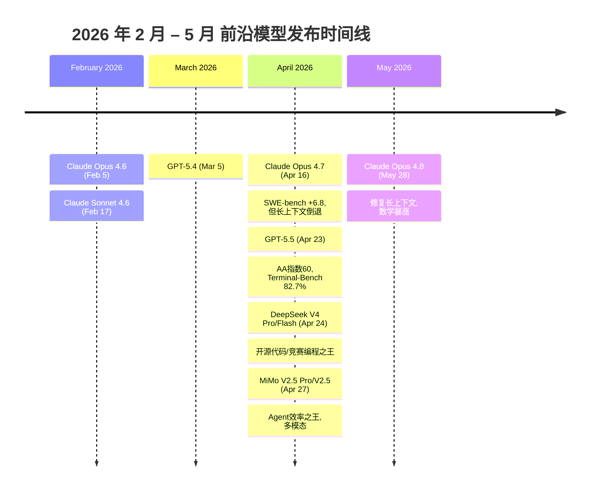

# 前沿模型基准对比 2026：DeepSeek V4 / MiMo V2.5 / Claude Opus 4.6-4.8 / Sonnet 4.6 / GPT-5.5

> **读者定位：** 正在进行模型选型的开发者和团队。读完能理解 2026 年 2-5 月九大模型的强项、弱项、适用场景，以及各自的性价比定位。
>
> **数据来源：** 每个数据点均标注了来源编号，详见文末[附录：证据来源](#appendix)。主要来源包括 DeepSeek V4 官方技术报告 [1][2][3]、Xiaomi MiMo 官方发布页 [10][11]、Anthropic 官方发布 [13][14][15][16]、Claude API 官方文档 [17][18]、OpenAI GPT-5.5 官方发布 [20]、Artificial Analysis Intelligence Index [4][5][6][7][12]、各第三方评测平台 [19][21][22]。
>
> **时效性声明：** 数据截至 2026 年 6 月 1 日。Opus 4.8 于 2026-05-28 发布，为本文截稿时最新模型。Claude Mythos Preview 已有限发布但未列入。

---

## 目录

1. [模型概览](#1)
2. [模型参数与定价](#2)
3. [综合智能指数排名](#3)
4. [知识与推理](#4)
5. [数学与竞赛](#5)
6. [代码能力](#6)
7. [Agent 与工具使用](#7)
8. [长上下文](#8)
9. [速度与性价比](#9)
10. [定位总结与选型建议](#10)
11. [附录：证据来源](#appendix)

---

## 1. 模型概览

| 模型 | 开发商 | 发布时间 | 架构 | 总参数 | 激活参数 | 上下文 | 开源 |
|------|--------|----------|------|--------|----------|--------|------|
| **GPT-5.5** | OpenAI | 2026-04-23 [20] | Transformer | 未公开 | 未公开 | 1M [20] | ❌ |
| **Claude Opus 4.8** | Anthropic | 2026-05-28 [15] | Transformer | 未公开 | 未公开 | 1M [15] | ❌ |
| **Claude Opus 4.7** | Anthropic | 2026-04-16 [13] | Transformer | 未公开 | 未公开 | 1M [13] | ❌ |
| **Claude Opus 4.6** | Anthropic | 2026-02-05 [14] | Transformer | 未公开 | 未公开 | 1M [14] | ❌ |
| **Claude Sonnet 4.6** | Anthropic | 2026-02-17 [16] | Transformer | 未公开 | 未公开 | 1M [16] | ❌ |
| **DeepSeek V4 Pro** | DeepSeek | 2026-04-24 [1][2] | MoE | 1.6T [2] | **49B** [2] | 1M [2] | ✅ MIT |
| **DeepSeek V4 Flash** | DeepSeek | 2026-04-24 [1][3] | MoE | 284B [3] | **13B** [3] | 1M [3] | ✅ MIT |
| **MiMo V2.5 Pro** | Xiaomi | 2026-04-27 [10][11] | MoE（Hybrid Attn + MTP） | 1.02T [11] | **42B** [11] | 1M [11] | ✅ MIT |
| **MiMo V2.5** | Xiaomi | 2026-04-27 [12] | MoE + 多模态编码器 | 310B [12] | **15B** [12] | 1M [12] | ✅ MIT |

**时间线速览：**

---

## 2. 模型参数与定价

### 推理效率（DeepSeek V4 核心创新，vs V3.2）[1]

- **V4 Pro**：1M 上下文时推理 FLOPs 降至 V3.2 的 **27%**，KV Cache 内存降至 **10%**
- **V4 Flash**：推理 FLOPs 降至 **10%**，KV Cache 降至 **7%**

### 定价对比（USD / 1M tokens）

| 模型 | 输入（缓存未命中） | 输出 | 缓存命中输入 | 速度 |
|------|:------------------:|:----:|:------------:|:----:|
| **GPT-5.5** | $5 [20] | $30 [20] | — | ~53-62 tok/s [4] |
| **Claude Opus 4.8** | $5 [17] | $25 [17] | $0.50 [17] | ~59 tok/s [6] |
| **Claude Opus 4.7** | $5 [17] | $25 [17] | $0.50 [17] | ~55 tok/s [6] |
| **Claude Opus 4.6** | $5 [17] | $25 [17] | $0.50 [17] | ~42 tok/s [6] |
| **Claude Sonnet 4.6** | $3 [17] | $15 [17] | $0.30 [17] | ~54 tok/s [6] |
| **DeepSeek V4 Pro** | $0.435（$1.74 列表）[9] | $0.87（$3.48 列表）[9] | $0.0036 [9] | ~45-60 tok/s [5] |
| **DeepSeek V4 Flash** | **$0.14** [9] | **$0.28** [9] | **$0.0028** [9] | **~116 tok/s** [7] |
| **MiMo V2.5 Pro** | $0.43 [21] | $0.87 [21] | — | ~47 tok/s [8] |
| **MiMo V2.5** | ~$0.15 [21] | ~$0.15 | — | — |

> DeepSeek V4 Pro 至 2026-05-31 有 75% 价格折扣（表中为此推广价）[9]。Flash 缓存命中输入仅 **$0.0028/M**，为缓存未命中的 1/50。

**价格差距快照（输出/1M）：**
| 梯队 | 模型 | 成本 |
|------|------|:----:|
| 🟢 免费级 | V4 Flash | **$0.28** |
| 🟢 低成本 | V4 Pro / MiMo V2.5 Pro | $0.87 |
| 🟡 中等 | Sonnet 4.6 | $15 |
| 🔴 高价 | Opus 4.6/4.7/4.8 | $25 |
| 🔴 最高 | GPT-5.5 | $30 |

---

## 3. 综合智能指数排名

### Artificial Analysis Intelligence Index v4.0

AA 指数综合 10 项评测（GDPval-AA、Terminal-Bench Hard、GPQA Diamond、HLE 等），反映综合智能水平。

| 排名 | 模型 | 得分 | 来源 |
|------|------|:----:|:----:|
| 1 | **GPT-5.5** (xhigh) | **60** [4] |
| 2 | **Claude Opus 4.7** (Max) | **57** [6] |
| 3 | **MiMo V2.5 Pro** | **54** [8] |
| 4 | **Claude Opus 4.6** (Max) | **53** [6] |
| 5= | **DeepSeek V4 Pro** (Max) | **52** [5] |
| 5= | **Claude Sonnet 4.6** (Max) | **52** [6] |
| 7 | **DeepSeek V4 Flash** (Max) | **47** [7] |
| — | Claude Opus 4.8 | 暂未独立排名（刚发布 5 天） |

**Key Insights：**

- **GPT-5.5 领先 3 分**（60 vs 57），主要优势在 Agentic 和 Terminal 编码 [4][20]
- **Opus 4.7 与 GPT-5.5 差距不大**，且价格便宜 20%（$25 vs $30 输出）[13][20]
- **Opus 4.7 → GPT-5.5** 换代速度加快（仅隔 7 天），两者竞争白热化
- **开源前三**（MiMo V2.5 Pro 54、DS V4 Pro 52、DS V4 Flash 47）中 MiMo 已超越 Opus 4.6（53），DS V4 Pro 基本持平

---

## 4. 知识与推理

| 基准 | GPT-5.5 | Opus 4.7 | Opus 4.6 | Sonnet 4.6 | DS V4 Pro | DS V4 Flash | MiMo V2.5 Pro |
|------|:-------:|:--------:|:--------:|:----------:|:---------:|:-----------:|:-------------:|
| **MMLU-Pro** | — | — | **89.1** [1] | 87.3 [21] | **87.5** [1] | 86.2 [1] | — |
| **GPQA Diamond** | **93.6** [20] | **94.2** [13] | 91.3 [1] | 89.9 [16] | 90.1 [1] | 88.1 [1] | 86.6 [8][10] |
| **HLE**（无工具）| 41.4 [20] | **46.9** [13] | 40.0 [1] | — | 37.7 [1] | 34.8 [1] | 33.8 [8] |
| **HLE**（有工具）| — | **54.7** [13] | 53.1 [1] | — | 48.2 [1] | 45.1 [1] | — |
| **SimpleQA-Ver.** | — | — | 46.2 [1] | — | **57.9** [1] | 34.1 [1] | — |
| **ARC-AGI-2** | **85.0** [20] | 68.8 [13] | 68.8 [14] | 58.3 [16] | — | — | — |

**结论：**

- **GPQA Diamond 天花板接近**：Top 4 差距仅 2.9 分（94.2→91.3），前沿模型在研究生级科学问答上趋于饱和
- **HLE（无工具）Opus 4.7 领跑**（46.9），超越 GPT-5.5（41.4），说明 Anthropic 在纯推理深度上仍有优势 [13]
- **DeepSeek V4 Pro 事实回忆意外强**：SimpleQA-Verified（57.9）远高于 Opus 4.6（46.2）[1]
- **ARC-AGI-2 GPT-5.5 领先**（85.0），比 GPT-5.4（73.3）跳升 11.7 分，这是该代最大增量 [20]
- **Flash 的知识短板明显**：SimpleQA（34.1 vs Pro 57.9），差距 23.8 分

---

## 5. 数学与竞赛

| 基准 | GPT-5.5 | Opus 4.8 | Opus 4.7 | Opus 4.6 | DS V4 Pro Max | DS V4 Flash Max |
|------|:-------:|:--------:|:--------:|:--------:|:-------------:|:----------------:|
| **HMMT 2026 Feb** | — | — | — | 96.2 [1] | **95.2** [1] | 94.8 [1] |
| **IMOAnswerBench** | — | — | — | 75.3 [1] | **89.8** [1] | 88.4 [1] |
| **MATH-500** | — | — | — | 96.4 [22] | **98.2** [1] | 97.0 [1] |
| **USAMO 2026** | — | **96.7** [15] | 69.3 [15] | — | — | — |
| **AIME 2025** | — | — | — | — | **85.6** [1] | 76.8 [1] |
| **Apex Shortlist** | — | — | — | 85.9 [1] | **90.2** [1] | 85.7 [1] |
| **FrontierMath T1-3** | **51.7** [20] | — | — | — | — | — |

**结论：**

- **Opus 4.8 数学暴涨**：USAMO 2026 从 Opus 4.7 的 69.3% 跳到 **96.7%**，是 Opus 系列历史上最大的单次数学跃升 [15]
- **DS V4 Pro 仍统治竞赛数学**：IMOAnswerBench（89.8）远超 Opus 4.6（75.3），Codeforces 3206 超 GPT-5.4（3168）[1]
- **定理证明（Putnam-200）**：V4-Flash-Max **81.0**，远超 Seed-2.0-Pro（35.5）和 Gemini-3-Pro（26.5）[1]
- **Flash Max 数学逼近 Pro**：MATH-500 仅差 1.2 分（97.0 vs 98.2），HMMT 几乎打平（94.8 vs 95.2）

---

## 6. 代码能力

| 基准 | GPT-5.5 | Opus 4.8 | Opus 4.7 | Opus 4.6 | Sonnet 4.6 | DS V4 Pro | DS V4 Flash | MiMo V2.5 Pro |
|------|:-------:|:--------:|:--------:|:--------:|:----------:|:---------:|:-----------:|:-------------:|
| **SWE-bench Ver.** | 未报告 [20] | — | **87.6** [13] | 80.8 [1] | 79.6 [16] | 80.6 [1] | 79.0 [1] | 78.9 [21] |
| **SWE-bench Pro** | **58.6** [20] | **69.2** [15] | 64.3 [13] | 57.3 [1] | ~53 [22] | 55.4 [1] | 52.6 [1] | 57.2 [10] |
| **LiveCodeBench** | — | — | — | 88.8 [1] | — | **93.5** [1] | 91.6 [1] | — |
| **Codeforces** | — | — | — | — | — | **3206** [1] | 3052 [1] | — |
| **Terminal-Bench 2.0** | **82.7** [20] | — | 69.4 [13] | 65.4 [1] | ~62 [16] | 67.9 [1] | 56.9 [1] | — |
| **OSWorld-Ver.** | **78.7** [20] | — | **78.0** [13] | 72.7 [14] | 72.5 [16] | — | — | — |

### 分项分析

**SWE-bench Verified（真实 GitHub Issue 修复）** [1][13][14][16]
- Opus 4.7 以 **87.6%** 大幅领先第二梯队（80.8/80.6），提升 **6.8 分**，是本次调研中最大的代际跃升。GPT-5.5 未报告此基准 [20]
- V4 Flash Max（79.0）仅比 V4 Pro（80.6）低 1.6 分，对于实际软件工程 Flash 完全够用

**SWE-bench Pro（高难度 Issue）** [13][15][20][10]
- Opus 4.8（**69.2**）> Opus 4.7（64.3）> GPT-5.5（58.6）≈ Opus 4.6（57.3），Opus 4.8 在此反超 GPT-5.5

**LiveCodeBench / Codeforces（函数级 + 竞赛编程）** [1]
- **DS V4 Pro Max 统治**：LiveCodeBench（93.5）超 Opus 4.6（88.8）；Codeforces **3206** 超 GPT-5.4（3168），全球人类排名第 23

**Terminal-Bench 2.0（终端 Agent 编码）** [20][13][1]
- GPT-5.5（**82.7**）断层第一，较 Opus 4.7（69.4）高出 **13.3 分**，这是其最大的差异化优势

**内部 R&D 编码评测** [1]
- DeepSeek 30 道精选任务（PyTorch/CUDA/Rust/C++）：V4-Pro-Max **67%** 通过率，vs Sonnet 4.5（47%）和 Opus 4.5（70%）

**代码结论：**
- 🥇 **综合最强**：Opus 4.7（SWE-bench 87.6）和 GPT-5.5（Terminal 82.7）各擅胜场
- 🥇 **竞赛编程**：DS V4 Pro Max 无争议（Codeforces 3206、LiveCodeBench 93.5）
- 🥇 **性价比**：DS V4 Flash Max（Pro 的 8% 列表价，90-95% 编码能力）
- 📌 **Opus 4.8** SWE-bench Pro 从 64.3→69.2，且 "4x less likely to let code flaws pass" [15]

---

## 7. Agent 与工具使用

| 基准 | GPT-5.5 | Opus 4.7 | Opus 4.6 | Sonnet 4.6 | DS V4 Pro | DS V4 Flash | MiMo V2.5 Pro |
|------|:-------:|:--------:|:--------:|:----------:|:---------:|:-----------:|:-------------:|
| **GDPval-AA**（Elo）| — | — | 1619 [1] | **1633** [6] | 1554 [1] | 1395 [1] | **1581** [10][8] |
| **MCPAtlas Public** | **75.3** [20] | **77.3** [13] | 73.8 [1] | ~61 [22] | 73.6 [1] | 69.0 [1] | — |
| **BrowseComp** | **84.4** [20] | 79.3 [13] | 83.7 [1] | 74.7 [16] | 83.4 [1] | 73.2 [1] | — |
| **Toolathlon** | 55.6 [20] | — | 47.2 [1] | — | **51.8** [1] | 47.8 [1] | — |
| **OSWorld** | **78.7** [20] | **78.0** [13] | 72.7 [14] | 72.5 [16] | — | — | — |
| **ClawEval**（Pass³）| — | — | — | — | — | — | **63.8%** [10][11] |

### 关键发现

**GDPval-AA（经济价值任务 Elo）** [1][6][8][10]
- Sonnet 4.6（1633）> Opus 4.6（1619）> MiMo V2.5 Pro（1581）> V4 Pro（1554）
- **Sonnet 4.6 反而超越 Opus**，Anthropic 官方也承认 Sonnet 4.6 在 Agent 上更强

**MCPAtlas（MCP 工具生态）** [13][1][20]
- Opus 4.7（**77.3**）> GPT-5.5（75.3）> Opus 4.6（73.8）≈ V4 Pro（73.6）
- Opus 4.7 在此项上反超 GPT-5.5，MCPAtlas 比 Opus 4.6 跃升 14.6 分

**MiMo V2.5 Pro 的独特价值 [10]**
- ClawEval **63.8%** 领先开源，**每轨迹仅 ~70K tokens**（比 Opus 4.6 少 40-60%）
- 自主任务演示：4.3 小时完成完整 SysY 编译器（233/233 满分）
- 定位清晰：**用最少 tokens 完成最复杂的 Agent 任务**

**Agent 结论：**
- 🥇 **通用 Agent**：GPT-5.5（OSWorld 78.7，BrowseComp 84.4）vs Opus 4.7（MCPAtlas 77.3）
- 🥇 **工具泛化**：Opus 4.7（MCPAtlas 77.3）微弱领先
- 🥇 **Token 效率**：MiMo V2.5 Pro 领先，但能力上限不及闭源旗舰
- 📌 **Flash Agent 短板明显**：Terminal-Bench 比 Pro 低 11 分，需要大激活参数

---

## 8. 长上下文

| 基准 | Opus 4.7 | Opus 4.6 | DS V4 Pro | DS V4 Flash | MiMo V2.5 Pro |
|------|:--------:|:--------:|:---------:|:-----------:|:-------------:|
| **MRCR 1M（MMR）**ⓐ | — | **92.9** [1] | 83.5 [1] | 78.7 [1] | — |
| **MRCR v2 8-needle @ 256K**ⓑ | **59.2** [13] | **91.9** [13] | — | — | — |
| **MRCR v2 8-needle @ 1M**ⓑ | **32.2** [13] | **78.3** [13] | — | — | — |
| **CorpusQA 1M** | — | **71.7** [1] | 62.0 [1] | 60.5 [1] | — |
| **GraphWalks 1M**（BFS）| — | — | — | — | **0.37** [11] |
| **GraphWalks 1M**（Parents）| — | — | — | — | **0.62** [11] |
| **LongBench-V2（1-shot）** | — | — | — | **51.5**（Base）[2] | 44.7（Base）[3] |

### ⚠️ Opus 4.7 最大的问题：长上下文严重倒退

这是本次调研最重要的发现之一：

- **MRCR v2（8-needle）@ 256K**：Opus 4.6（91.9）→ Opus 4.7（**59.2**），骤降 **32.7 分** [13]
- **MRCR v2 @ 1M**：Opus 4.6（78.3）→ Opus 4.7（**32.2**），骤降 **46.1 分** [13]

Opus 4.7 的长上下文检索能力减半以上。这对 RAG 流水线、长文档分析、大型代码库理解影响严重。

**好消息是 Opus 4.8 修复了这一问题** ——Anthropic 官方表示 Opus 4.8 "improves on 4.7 across all benchmarks, including long-context retrieval" [15]

**其他发现：**
- MiMo V2.5 Pro 在 GraphWalks 上表现稳健（1M 时 0.37/0.62），前代 V2 Pro 在 1M 时直接归零 [11]
- DeepSeek V4 的长上下文优势在**效率不在分数**：1M 时 Pro 的 FLOPs 仅为 V3.2 的 27% [1]

---

## 9. 速度与性价比

### 输出速度

| 模型 | 输出速度 | TTFT | 来源 |
|------|:--------:|:----:|:----:|
| **DeepSeek V4 Flash** | **~116 tok/s** | ~1.16s | AA [7] |
| **DeepSeek V4 Pro** | ~45-60 tok/s | ~1.78s | AA [5] |
| **GPT-5.5** | ~53-62 tok/s [4] | — | AA (xhigh 53, high 62) |
| **Claude Sonnet 4.6** | ~54 tok/s [6] | ~0.2-0.3s | AA [6] |
| **Claude Opus 4.8** | ~59 tok/s [6] | — | AA [6] |
| **Claude Opus 4.8 Fast** | ~2.5x normal (~148 tok/s) [15] | — | Anthropic [17] |
| **Claude Opus 4.7** | ~55 tok/s [6] | — | AA [6] |
| **Claude Opus 4.6** | ~42 tok/s [6] | ~0.5-0.7s | AA [6] |
| **MiMo V2.5 Pro** | ~47 tok/s | — | AA [8] |

### 性价比矩阵

| 使用模式 | 推荐模型 | 输出成本 / 1M | 相对旗舰能力 |
|----------|----------|:------------:|:------------:|
| 🏆 最低成本 | **V4 Flash** | **$0.28** | ~90%（代码） |
| 🏆 极致性价比 | **V4 Flash Max** | **$0.28** | ~95%（推理/数学） |
| 🏆 代码性价比 | **V4 Pro**（推广价）| $0.87 | ~95%（vs Opus 4.6 在 SWE） |
| 🏆 闭源平衡 | **Sonnet 4.6** | $15 | ~98%（编码） |
| 🏆 综合最强闭源 | **Opus 4.7 / 4.8** | $25 | 100% |
| 🏆 Agent 效率 | **MiMo V2.5 Pro** | ~$0.87 | token 消耗少 40-60% |
| 🏆 综合最强 | **GPT-5.5** | $30 | AA 指数 60 |

> **关键数据：** V4 Flash Max 以 Opus 4.6 **1/89 的输出价格**（$0.28 vs $25）提供约 90-95% 的代码推理质量。以 Pro 列表价（$3.48）算，Flash 约 **8% 的成本**。
> **V4 Pro 推广价（$0.87/M 输出）** 仅为 Opus 4.7 的 1/29，SWE-bench 差距约 7 分。

---

## 10. 选型建议

### 各模型一句话定位

| 模型 | 一句话定位 |
|------|-----------|
| **GPT-5.5** | AA 指数第一，终端 Agent 编码断层领先（Terminal-Bench 82.7%），但幻觉率 86% [4][20] |
| **Claude Opus 4.8** | 最新综合最强（5 天前发布），修复了 4.7 的长上下文倒退，数学大爆发，动态多 Agent 工作流 [15] |
| **Claude Opus 4.7** | SWE-bench 87.6% 编码第一，但长上下文严重倒退（MRCR 1M 从 78→32），谨慎用于 RAG [13] |
| **Claude Opus 4.6** | 长上下文最强标杆（MRCR 1M 92.9），科学推理领先，已被 4.7/4.8 全面超越 [14] |
| **Claude Sonnet 4.6** | 经济 Agent 最强（GDPval-AA 1633），闭源日常开发首选，编码逼近 Opus [16] |
| **DeepSeek V4 Pro Max** | 开源源码/Math 之王（Codeforces 3206、LiveCodeBench 93.5），竞赛编程无争议第一 [1] |
| **DeepSeek V4 Flash Max** | 性价比之王，日常开发默认值，Pro 的 90-95% 能力（Pro 列表价的 **8%**，推广价的 32%）[1][9] |
| **MiMo V2.5 Pro** | Agent Token 效率之王，长程自主任务首选（编译器 4.3h 满分），同等能力 token 省 40-60% [10] |
| **MiMo V2.5** | 唯一原生多模态，视频理解接近 Gemini 3 Pro（Video-MME 87.7）[12] |

### 决策树（概要）

| 场景 | 推荐 | 核心理由 |
|------|------|----------|
| 💻 **日常编码 / PR** | 预算敏感 → **V4 Flash Max**（$0.28/M） 闭源偏好 → **Sonnet 4.6** 最高编码质量 → **Opus 4.7**（SWE-bench 87.6%） | V4 Flash 性价比最高，Sonnet 闭源首选 |
| 🏆 **竞赛编程 / 算法** | **V4 Pro Max** | Codeforces 3206，LiveCodeBench 93.5 |
| 🤖 **Agent 自主任务** | Token 效率 → **MiMo V2.5 Pro** 终端 Agent → **GPT-5.5**（Terminal 82.7%） 综合 Agent → **Opus 4.8**（MCPAtlas 77.3%） | MiMo tokens 省 40-60%，GPT-5.5 终端最强 |
| 📄 **长文档分析 / RAG** | **Opus 4.8 / 4.6**（⚠️ 别用 Opus 4.7） 开源 → **V4 Pro** | Opus 4.7 MRCR 倒退 46 分 |
| 🔬 **科学研究 / 推理** | **Opus 4.7** | HLE 46.9，GPQA Diamond 94.2 |
| ⚡ **高吞吐生产环境** | **V4 Flash** | $0.28/M，116 tok/s |
| 👑 **综合最强（不差钱）** | **Opus 4.8** 或 **GPT-5.5** | 看 workload 偏 Agent 还是终端 |

### 几个反直觉结论

1. **Sonnet 4.6 Agent 反而比 Opus 4.6 更强** —— GDPval-AA（1633 vs 1619），多花 5 倍不一定更好 [6]
2. **Opus 4.7 长上下文严重退步** —— MRCR 1M 从 78% 跌到 32%，做 RAG 的团队慎用 [13]
3. **DS V4 Flash Max 数学出奇好** —— MATH-500 仅差 Pro 1.2 分，Putnam-200 定理证明 81.0 超过几乎所有模型 [1]
4. **GPT-5.5 综合最强，但幻觉率 86%** —— AA 指数 60 第一，但知道答案时才回答的概率仅 14% [4]
5. **没有模型在所有维度领先** —— 选型必须基于具体 workload

---

## 附录：证据来源

### DeepSeek V4 官方

| # | 来源 | 链接 | 内容 |
|---|------|------|------|
| 1 | **DeepSeek V4 技术报告 PDF** | [huggingface.co/deepseek-ai/DeepSeek-V4-Pro](https://huggingface.co/deepseek-ai/DeepSeek-V4-Pro/blob/main/DeepSeek_V4.pdf) | 架构（CSA+HCA、mHC）、全部基准对照（含 Opus 4.6/GPT-5.4/Gemini-3.1-Pro）、Flash/Pro 各模式分解 |
| 2 | **DeepSeek V4 Pro HF Model Card** | [huggingface.co/deepseek-ai/DeepSeek-V4-Pro](https://huggingface.co/deepseek-ai/DeepSeek-V4-Pro) | Base Model 基准、权重下载（1.6T/49B）、MIT 许可 |
| 3 | **DeepSeek V4 Flash HF Model Card** | [huggingface.co/deepseek-ai/DeepSeek-V4-Flash](https://huggingface.co/deepseek-ai/DeepSeek-V4-Flash) | Flash 基准（284B/13B）、FP4+FP8 精度、长上下文数据 |
| 9 | **DeepSeek API 官方定价页** | [api-docs.deepseek.com/quick_start/pricing](https://api-docs.deepseek.com/quick_start/pricing) | V4 Pro/Flash 每百万 token 定价表、缓存命中折扣、75% 折扣说明 |

### Anthropic 官方

| # | 来源 | 链接 | 内容 |
|---|------|------|------|
| 13 | **Claude Opus 4.7 官方发布** | [anthropic.com/news/claude-opus-4-7](https://www.anthropic.com/news/claude-opus-4-7) | SWE-bench 87.6%、GPQA 94.2%、MCPAtlas 77.3%、xhigh effort 等级、合作方评测（Cursor、CodeRabbit 等） |
| 14 | **Claude Opus 4.6 官方发布** | [anthropic.com/news/claude-opus-4-6](https://www.anthropic.com/news/claude-opus-4-6) | Agent Teams、1M Context Beta、SWE-bench 80.8% |
| 15 | **Claude Opus 4.8 官方发布** | [anthropic.com/news/claude-opus-4-8](https://www.anthropic.com/news/claude-opus-4-8) | 2026-05-28 发布、Dynamic Workflows、Effort Control、Fast Mode 2.5x 更便宜、SWE-bench Pro 69.2%、USAMO 96.7% |
| 16 | **Claude Sonnet 4.6 官方发布** | [anthropic.com/news/claude-sonnet-4-6](https://www.anthropic.com/news/claude-sonnet-4-6) | 1M Context Beta、SWE-bench 79.6%、GDPval-AA 领先、ARC-AGI-2 58.3% |
| 17 | **Claude API 官方定价页** | [platform.claude.com/docs/en/about-claude/pricing](https://platform.claude.com/docs/en/about-claude/pricing) | Opus 4.6/4.7/4.8 均 $5/$25、Sonnet 4.6 $3/$15、缓存/Batch 定价、Fast Mode 定价 |
| 18 | **Claude API 模型概览** | [platform.claude.com/docs/en/about-claude/models/overview](https://platform.claude.com/docs/en/about-claude/models/overview) | 模型 ID、上下文（1M）、最大输出（128K）、功能矩阵 |

### OpenAI 官方

| # | 来源 | 链接 | 内容 |
|---|------|------|------|
| 20 | **GPT-5.5 官方发布** | [openai.com/index/introducing-gpt-5-5](https://openai.com/index/introducing-gpt-5-5/) | Terminal-Bench 82.7%、SWE-bench Pro 58.6%、OSWorld 78.7%、ARC-AGI-2 85.0%、定价 $5/$30 |

### Xiaomi MiMo 官方

| # | 来源 | 链接 | 内容 |
|---|------|------|------|
| 10 | **MiMo-V2.5-Pro 官方发布页** | [mimo.xiaomi.com/mimo-v2-5-pro](https://mimo.xiaomi.com/mimo-v2-5-pro/) | Agent 效率数据（70K tokens/trajectory）、自主任务演示（编译器 233/233、视频编辑器 8192 行）、基准图示 |
| 11 | **MiMo-V2.5-Pro HF Model Card** | [huggingface.co/XiaomiMiMo/MiMo-V2.5-Pro](https://huggingface.co/XiaomiMiMo/MiMo-V2.5-Pro) | Base Model 完整基准（含 DS V4 Base 对比）、GraphWalks 长上下文、架构参数表 |
| 12 | **MiMo-V2.5 HF Model Card** | [huggingface.co/XiaomiMiMo/MiMo-V2.5](https://huggingface.co/XiaomiMiMo/MiMo-V2.5) | 多模态基准（Video-MME 87.7、CharXiv、MMMU-Pro）、ClawEval 多模态 |

### Artificial Analysis（第三方独立评测）

| # | 来源 | 链接 | 内容 |
|---|------|------|------|
| 4 | **AA: GPT-5.5 智能指数** | [artificialanalysis.ai](https://artificialanalysis.ai) | AA 指数 60（领先）、Token 效率分析、幻觉率 86% |
| 5 | **AA: DeepSeek V4 Pro (Max)** | [artificialanalysis.ai/models/deepseek-v4-pro](https://artificialanalysis.ai/models/deepseek-v4-pro) | AA 指数 52、44.9 tok/s、TTFT 1.78s |
| 6 | **AA: Claude Opus/Sonnet 对比** | [artificialanalysis.ai](https://artificialanalysis.ai) | Opus 4.6 53、Sonnet 4.6 52、Opus 4.7 57、Opus 4.8 59、速度/定价/TTFT |
| 7 | **AA: DeepSeek V4 Flash (Max)** | [artificialanalysis.ai/models/deepseek-v4-flash](https://artificialanalysis.ai/models/deepseek-v4-flash) | AA 指数 47、116 tok/s、TTFT 1.16s |
| 8 | **AA: MiMo V2.5 Pro** | [artificialanalysis.ai/models/mimo-v2-5-pro](https://artificialanalysis.ai/models/mimo-v2-5-pro) | AA 指数 54、47 tok/s、GPQA 86.6%、HLE 33.8% |
| — | **AA 文章: 开源模型评测（含 MiMo/DS/Kimi）** | [artificialanalysis.ai/articles/recent-open-weights-model-launches](https://artificialanalysis.ai/articles/recent-open-weights-model-launches) | Top 开源并列 54、HLE/CritPt 差距分析、幻觉率对比 |

### 第三方评测平台 & 社区

| # | 来源 | 链接 | 内容 |
|---|------|------|------|
| 19 | **LLM Stats: Opus 4.7 发布分析** | [llm-stats.com/blog/research/claude-opus-4-7-launch](https://llm-stats.com/blog/research/claude-opus-4-7-launch) | Opus 4.7 完整 14 基准表、SWE-bench 87.6%、MRCR 倒退数据、xhigh 分析 |
| 21 | **OpenRouter: MiMo V2.5 Pro 基准** | [openrouter.ai/xiaomi/mimo-v2.5-pro/benchmarks](https://openrouter.ai/xiaomi/mimo-v2.5-pro/benchmarks) | 第三方汇总：GPQA 86.6%、AA 智能指数 53.8、Agentic Index 67.4 |
| 22 | **MorphLLM: Claude 基准汇总 + Sonnet vs Opus** | [morphllm.com/claude-benchmarks](https://morphllm.com/claude-benchmarks) | SWE-bench 排名表、Terminal-Bench 2.0 排名、Sonnet vs Opus 详细对比（GPQA 74.1 vs 91.3） |
| 23 | **WentuoAI: Opus 4.7 MRCR 倒退深度分析** | [blog.wentuo.ai/en/claude-opus-4-7-long-context-regression-en.html](https://blog.wentuo.ai/en/claude-opus-4-7-long-context-regression-en.html) | MRCR v2 8-needle 完整数据（78.3→32.2）、Anthropic System Card 原文引用、Claude Code GitHub Issue 汇总 |
| — | **DEV.to: Opus 4.7 System Card 拆解** | [dev.to/ji_ai/i-read-all-232-pages-of-the-opus-47-system-card-28mh](https://dev.to/ji_ai/i-read-all-232-pages-of-the-opus-47-system-card-28mh) | 232 页 System Card 精读，MRCR 8-needle 数据、Anthropic 推荐 4.6 作为回退 |
| — | **Awesome Agents: 长上下文检索排行** | [awesomeagents.ai/capabilities/long-context-retrieval](https://awesomeagents.ai/capabilities/long-context-retrieval/) | MRCR v2 8-needle 排行：Opus 4.6 #1（78.3%）、GPT-5.5 #2（74.0%）、DS V4 Pro #5（59.0%）、Opus 4.7 #6（32.2%） |
| — | **Simon Willison: Opus 4.8 点评** | [simonwillison.net/2026/May/28/claude-opus-4-8](https://simonwillison.net/2026/May/28/claude-opus-4-8/) | "modest but tangible improvement"、1,024 最低缓存长度、对话中插入 system message |
| — | **Tessl: GPT-5.5 vs Opus 4.7 实测** | [tessl.io/blog/gpt-55-is-openais-best-model-but-paying-more-for-it-makes-no-sense](https://tessl.io/blog/gpt-55-is-openais-best-model-but-paying-more-for-it-makes-no-sense/) | 1,742 次测试，GPT-5.5 与 GPT-5.4 带 skill 时几乎无差距（89.4 vs 89.3），但贵 63% |

---

> **最后更新：** 2026 年 6 月 1 日
>
> **注意：** 本文对比范围覆盖了 2026 年 2 月至 5 月发布的 9 个前沿模型。DeepSeek 和 Xiaomi 数据来自官方技术报告，Claude 数据来自 Anthropic 官方及第三方汇总，GPT-5.5 数据来自 OpenAI 官方。部分数据为 vendor-reported。Opus 4.8 刚发布 5 天，独立评测数据仍在积累中。
