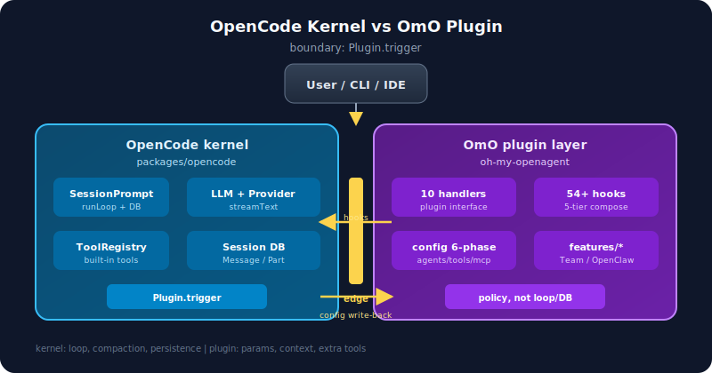
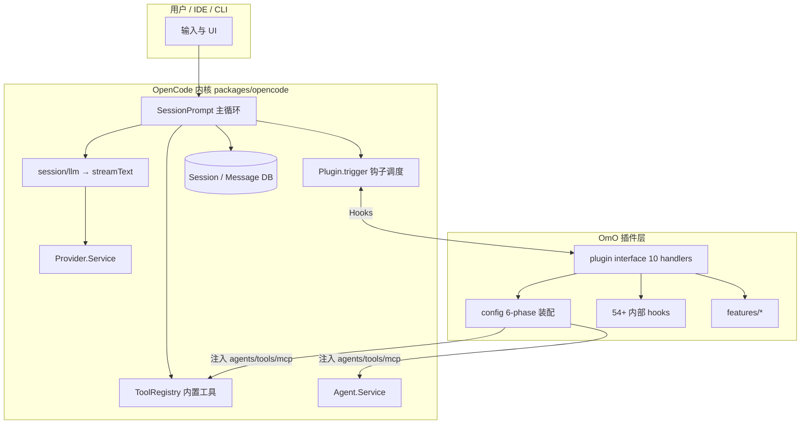
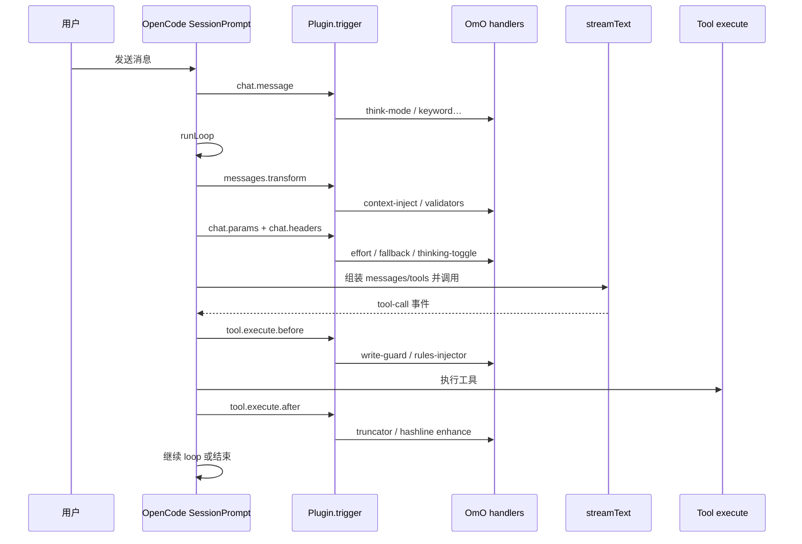

# OpenCode ↔ OmO 边界对照

> **OpenCode 基准：** [`7fe7b9f2`](https://github.com/anomalyco/opencode/commit/7fe7b9f258e36ad9f9acded20c5a9df201da19d5)（upstream，2026-05-24）  
> **OmO 基准：** [`20d67be4`](https://github.com/code-yeongyu/oh-my-openagent/commit/20d67be496155473f49aef3207bfe9d3737cbfa8)（upstream，2026-05-23）

---

## 1. 一句话

**OpenCode 构造并运行 agent runtime（会话、LLM、工具、权限、持久化）；OmO 作为插件挂在这个 runtime 上，注入多 agent 编排、扩展工具、hook 策略与运维能力，但不拥有 session 数据库与主循环。**

内核（蓝）与插件层（紫）· 边界：<code>Plugin.trigger</code>

---

## 2. 分层图

**边界线：** `Plugin.trigger(...)` 是 OpenCode 调 OmO 的唯一标准入口；OmO 通过 `config` hook **回写** agent/tool/mcp 定义，而不是替换 OpenCode 的 `SessionPrompt`。

---

## 3. 职责边界表

| 能力 | OpenCode 拥有 | OmO 拥有 | 说明 |
|------|:-------------:|:--------:|------|
| Session 持久化（消息/Part） | ✅ | ❌ | [`session/session.ts`](https://github.com/anomalyco/opencode/blob/7fe7b9f258e36ad9f9acded20c5a9df201da19d5/packages/opencode/src/session/session.ts) |
| 主循环（prompt → loop → tool → 再 loop） | ✅ | ❌ | [`session/prompt.ts`](https://github.com/anomalyco/opencode/blob/7fe7b9f258e36ad9f9acded20c5a9df201da19d5/packages/opencode/src/session/prompt.ts) |
| LLM 调用（AI SDK streamText） | ✅ | ❌ | [`session/llm.ts`](https://github.com/anomalyco/opencode/blob/7fe7b9f258e36ad9f9acded20c5a9df201da19d5/packages/opencode/src/session/llm.ts) |
| Provider 解析与 transform | ✅ | 部分 | OmO 在 `chat.params` 改参数，不改 Provider 注册表 |
| 内置工具（read/edit/bash/grep…） | ✅ | ❌ | OpenCode [`tool/registry.ts`](https://github.com/anomalyco/opencode/blob/7fe7b9f258e36ad9f9acded20c5a9df201da19d5/packages/opencode/src/tool/registry.ts) |
| 插件工具注册 | 机制 ✅ | 内容 ✅ | OmO `tool` handler 返回 20–39 个工具 |
| Agent 定义机制 | ✅ | ❌ | OpenCode `Agent.Info` schema |
| 11 个 OmO agent 内容与策略 | ❌ | ✅ | OmO `config` Phase 3 [`applyAgentConfig`](https://github.com/code-yeongyu/oh-my-openagent/blob/20d67be496155473f49aef3207bfe9d3737cbfa8/src/plugin-handlers/agent-config-handler.ts) |
| MCP 客户端运行时 | ✅ | 扩展 | OpenCode 加载 `.mcp.json`；OmO 加 built-in + skill-embedded 三层 |
| 权限系统 | ✅ | 可扩展 | SDK 有 `permission.ask`，内核当前未 `Plugin.trigger` |
| 插件 Hook 调度 | ✅ | 实现 | [`plugin/index.ts`](https://github.com/anomalyco/opencode/blob/7fe7b9f258e36ad9f9acded20c5a9df201da19d5/packages/opencode/src/plugin/index.ts) `Plugin.trigger` |
| 54+ 细粒度 hook 逻辑 | ❌ | ✅ | OmO 5-tier 组合，映射到 OpenCode 切面 |
| Team Mode / Background / OpenClaw | ❌ | ✅ | OmO `features/*` |
| CLI install/doctor/run | 基础 ✅ | 增强 ✅ | OmO 独立 CLI 包 |

---

## 4. Hook 对照：OpenCode 触发点 ↔ OmO 挂载

OpenCode SDK 定义见 [`packages/plugin/src/index.ts`](https://github.com/anomalyco/opencode/blob/7fe7b9f258e36ad9f9acded20c5a9df201da19d5/packages/plugin/src/index.ts)。  
OmO 对外暴露 10 个 handler，见 [`src/plugin-interface.ts`](https://github.com/code-yeongyu/oh-my-openagent/blob/20d67be496155473f49aef3207bfe9d3737cbfa8/src/plugin-interface.ts)。

| OpenCode Hook | 内核调用位置（摘要） | OmO 是否实现 | OmO 典型用途 |
|---------------|---------------------|:------------:|--------------|
| `config` | 插件 init 后 | ✅ | 6-phase：agents / tools / MCP / commands |
| `tool` | registry 合并 | ✅ | LSP、grep、task、team_*… |
| `event` | bus 订阅 | ✅ | session 生命周期、openclaw、runtime-fallback |
| `chat.message` | prompt 入库前 | ✅ | think-mode、keyword、session 设置 |
| `chat.params` | llm 调用前 | ✅ | effort、fallback、compat clamp |
| `chat.headers` | llm 请求头 | ✅ | Copilot x-initiator |
| `tool.execute.before/after` | 工具执行前后 | ✅ | write-guard、truncator、hashline… |
| `experimental.chat.messages.transform` | 发 LLM 前 | ✅ | context-inject、keyword、validators |
| `experimental.session.compacting` | 压缩时 | ✅ | todo/context 保留 |
| `experimental.chat.system.transform` | system 变换 | 部分/间接 | OmO 多通过 messages transform |
| `tool.definition` | 工具 schema 发出前 | ❌ | OpenCode 独有扩展点 |
| `shell.env` | shell/pty | ❌ | OpenCode 独有 |
| `command.execute.before` | slash command | ❌ | OpenCode 独有 |
| `permission.ask` | — | ❌（SDK 有，内核未 trigger） | 权限仍在 OpenCode 内核 |

**结论：** OmO 覆盖的是「agent 产品化」需要的 hook 子集；OpenCode 还有若干 OmO 未用的扩展点（`tool.definition`、`shell.env` 等），写插件时可以优先用这些空位，避免与 OmO 内部 hook 重叠。

---

## 5. 一次用户请求的边界（时序）

**属于 OpenCode 的：** loop 控制、消息持久化、stream 解析、tool 调度。  
**属于 OmO 的：** 每个 `Plugin.trigger` 切面上的策略与增强；**不属于 OmO 的：** 何时 compaction、何时 idle（OpenCode bus + session 状态机）。

---

## 6. Agent / Tool / MCP 边界

### Agent

| | OpenCode | OmO |
|---|----------|-----|
| 数据结构 | `Agent.Info`（name, mode, model, permission…） | 同 schema，通过 `config` 注入 |
| 列表与排序 | `Agent.list()` + 按 name 排序 | `installAgentSortShim` 补丁排序 |
| 11 个角色与 prompt | 无 | sisyphus / oracle / … + dynamic prompt builder |

→ **OpenCode 提供「agent 槽位」；OmO 填充「agent 编制与编排策略」。**

### Tool

| | OpenCode | OmO |
|---|----------|-----|
| 内置 | read, edit, bash, grep, task… | 不替换，可 disabled_tools |
| 插件注册 | 合并各插件 `hook.tool` | 20–39 个，含 LSP、delegate、team_* |
| 执行 | `Tool.Def.execute` + before/after hook | guard/enhancer 在 hook 层 |

### MCP

| 层级 | OpenCode | OmO |
|------|----------|-----|
| `.mcp.json` 加载 | ✅ | Tier-2 兼容层 |
| 运行时 MCP 工具 | ✅ | 与内置 tool 一样走 execute 链 |
| Built-in remote MCP | ❌ | Tier-1（websearch 等） |
| Skill 内嵌 MCP | ❌ | Tier-3 SkillMcpManager |

---

## 7. 设计取舍（好 / 坏）

### 好的分界

1. **Kernel 稳定、Product 可迭代** — OpenCode 升级 session/Provider 时，OmO 只要跟 hook 契约
2. **插件不碰 DB** — 避免 OmO 与会话存储耦合，降低数据损坏风险
3. **config 一次性装配** — agents/tools 在 init 阶段注入，runtime 路径清晰
4. **Hook 切面扩展** — 独立插件（如 thinking-toggle）与 OmO 可并存

### 需要警惕

1. **双重 hook 栈** — OpenCode 14+ 触发点 × OmO 54+ 内部 hook，排障要两层看
2. **Agent 排序 shim** — OmO 用 `Array.prototype.sort` 补丁弥补 OpenCode 忽略 `order` 字段（[#19127](https://github.com/sst/opencode/issues/19127)），属于跨边界 hack
3. **权限未统一** — `permission.ask` 在 SDK 有、内核未 trigger，OmO 用 tool 白名单等方式补位
4. **Provider transform 与 chat.params 双通道** — 改 LLM 行为需知参数在哪一层被改写

---

## 8. 写能力时改哪边？

| 你想做 | 改 OpenCode | 改 OmO | 独立插件 |
|--------|:-----------:|:------:|:--------:|
| 新 Provider 适配 | ✅ | | |
| 改 session 存储 / loop | ✅ | | |
| 控制 thinking / effort | | | ✅ `chat.params` |
| 新 subagent 角色 + prompt | | ✅ | |
| 新 tool 给 LLM 用 | | ✅ 或 | ✅ |
| 工具执行 guard | | ✅ hook | ✅ hook |
| Team 并行协作 | | ✅ feature | |
| 外部 Discord 回注 | | ✅ openclaw | |

**经验法则：** 动「循环与存储」找 OpenCode；动「agent 产品与策略」找 OmO；动「单一横切关注点」写独立插件。

---

## 9. 读完后应能回答

- [ ] OpenCode 与 OmO 的分界线在哪一层 API？
- [ ] `SessionPrompt.loop` 里 OmO 能介入几次、分别是什么 hook？
- [ ] 为什么 OmO 不自己实现 session DB？
- [ ] OmO 的 `config` hook 向 OpenCode 回写了什么？
- [ ] 写 thinking-toggle 类插件应挂在哪、不应碰哪？

---

## 10. 下一步

- OpenCode 内核逐文件阅读：[`projects/opencode/README.md`](../projects/opencode/README.md)
- OmO 消息 Hook 链叙事：[`projects/oh-my-openagent/17-message-hook-journey.md`](../projects/oh-my-openagent/17-message-hook-journey.md)
- OmO 插件机制复习：[`projects/oh-my-openagent/01-opencode-plugin-protocol.md`](../projects/oh-my-openagent/01-opencode-plugin-protocol.md)
- 模式沉淀：[`patterns/`](../patterns/)（待写 hook 组合、config 门控模式）
