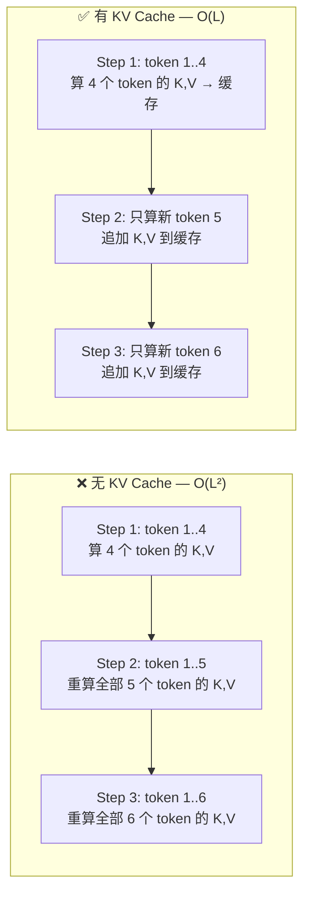
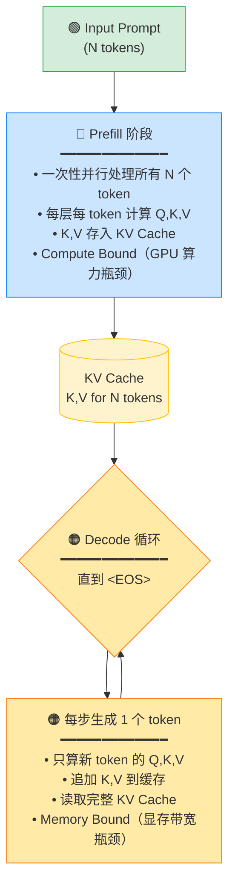
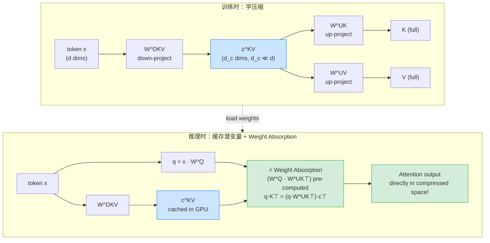
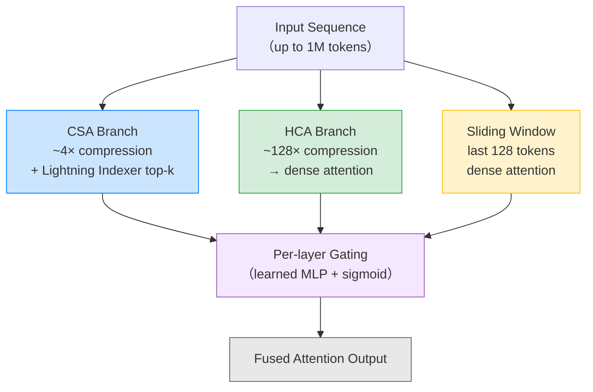
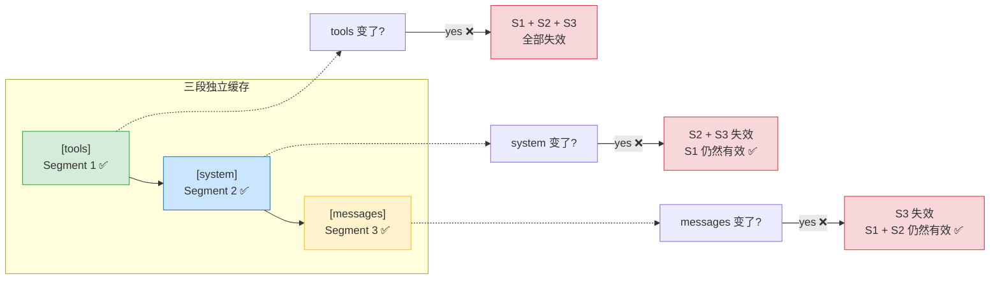

# KV Cache 原理全解

> **摘要：** KV Cache 是决定 LLM 推理成本的核心机制。本文从 Self-Attention 的计算冗余出发，推演 KV Cache 工作原理、Prefill/Decode 双阶段模型、Attention Sink 现象，并追踪 MQA → GQA → MLA → DSA → CSA+HCA 的压缩技术演进。以 DeepSeek V4 为贯穿案例，解释其 Flash 版 $0.14/M token 定价背后的技术栈。

---

## 0. 从一个定价数字说起

2026 年 4 月 24 日，DeepSeek 发布 V4 系列模型。其中 **V4-Flash** 的 API 定价为：每百万 token 输入 **$`0.14（¥1）**，输出 **`$0.28（¥2）**。更值得关注的是它的缓存命中价——**$0.0028（¥0.02）/M token**，仅为正常输入的 2%。

换句话说，如果你的请求命中了缓存，**处理 100 万 token 的成本是 ¥0.02**——两分钱。

作为参照，同期 GPT-5.5 的定价是 $`5/`$30（约 ¥36/¥216）。V4-Flash 的正常价格约为其 1/100，缓存命中价约为其 1/2000。

V4-Pro 的定价也经历了类似的压缩：首发时标价 $`1.74/`$3.48（¥12/¥24），发布三天后宣布 75% 折扣促销（¥3/¥6），一个月后的 5 月 22 日，直接宣布 **75% 折扣永久化**——最终定价 $`0.435/`$0.87（¥3/¥6），缓存命中价 $0.0036（¥0.025）/M。一个 1.6 万亿参数的前沿模型，输出价格不到 GPT-5.5 的 3%。

这不是烧钱补贴。DeepSeek 披露的生产数据显示，即使按 R1 时代的低价收费，其推理系统理论利润率仍超过 500%。定价低的根本原因是**成本低**——而这背后的技术基础，是三代模型迭代积累的 **KV Cache 优化栈**：

```
V2 (2024.05):  MLA — KV 缓存压缩 93.3%，吞吐量 5.76×
V3 (2024.12):  + MTP 推测解码 + FP8 全栈量化 + PD 分离 + 跨节点 EP
V3.2 (2025.12): + DSA 稀疏注意力 — 注意力复杂度 O(L²)→O(Lk)
V4 (2026.04):  + CSA (4×) + HCA (128×) — 序列维度 KV 压缩 + FP8/FP4 混合精度
```

这些技术演进的共同目标只有一个：**在有限的 GPU 显存和带宽下，把每个 token 的推理成本压到最低。** 答案藏在 KV Cache 的优化里——下面从最基础的 Self-Attention 计算冗余开始。

> **数据来源：** V4 定价来自 [DeepSeek 官方定价页](https://api-docs.deepseek.com/zh-cn/quick_start/pricing)（[英文版](https://api-docs.deepseek.com/quick_start/pricing)）；GPT-5.5 定价来自 [OpenAI 定价页](https://developers.openai.com/api/docs/pricing)（$`5/`$30）；V4-Pro 永久降价参见 [Bloomberg](https://www.bloomberg.com/news/articles/2026-05-23/deepseek-to-make-permanent-75-discount-on-flagship-ai-model)；V2 技术指标来自 [DeepSeek-V2 论文](https://arxiv.org/abs/2405.04434)；V3 部署架构来自 [DeepSeek-V3 技术报告](https://arxiv.org/pdf/2412.19437v2)；V3.2 稀疏注意力来自 [V3.2 技术报告](https://arxiv.org/html/2512.02556)；V4 技术指标来自 [DeepSeek-V4 技术报告](https://huggingface.co/deepseek-ai/DeepSeek-V4-Pro/blob/main/DeepSeek_V4.pdf)；利润率来自 [DeepSeek 推理系统概述](https://github.com/deepseek-ai/open-infra-index/blob/main/202502OpenSourceWeek/day_6_one_more_thing_deepseekV3R1_inference_system_overview.md)。

---

## 1. 前置：Self-Attention 的计算冗余

Decoder-only Transformer（GPT、Claude、LLaMA 等）自回归生成——每产生一个新 token，模型要让它「看到」前面所有 token 的语义。这个过程是 Self-Attention：

$$
Attention(Q, K, V) = softmax(\frac{QK^T}{\sqrt{d_k}}) \cdot V
$$

- **Q（Query）**：当前 token 发出的「查询」
- **K（Key）**：每个 token 的「索引标签」，用于和 Q 匹配
- **V（Value）**：每个 token 的「实际内容」，匹配后加权求和

**冗余在哪里？** 生成第 100 个 token 时，如果不做缓存，模型要给前 99 个 token 全部重算 K 和 V。第 200 步时，前 199 个又要重算。总计算量 **O(L²)**（L 为序列长度）。



> **证据：** [HuggingFace KV Cache 文档](https://huggingface.co/docs/transformers/kv_cache) 明确描述此冗余；[EngineersOfAI](https://engineersofai.com/docs/llms/llm-inference/KV-Cache) 推算了 O(L²) → O(L) 的转换过程。

---

## 2. KV Cache 核心机制

### 2.1 为什么历史 token 的 K、V 不会变

$$
K_i = x_i \cdot W_K, \quad V_i = x_i \cdot W_V
$$

> 其中 $`x_i`$ 是第 $`i`$ 个 token 的向量表示（embedding），$`W_K`$ 和 $`W_V`$ 是模型训练后固定的权重矩阵。对于非 ML 背景的读者，可以把它们理解为「token $`i`$ 通过固定的线性变换得到 K 和 V」。

- token embedding $`x_i`$ 由 token 本身决定，生成后不变
- $`W_K`$、$`W_V`$ 是**模型参数**，推理时不更新

→ K 和 V **永恒不变**——算一次、存下来、永远复用。

> **边界条件：** 如果模型边推理边更新参数（如在线学习），KV Cache 会失效。标准推理不更新参数，所以安全。

### 2.2 为什么只缓存 K 和 V，不缓存 Q

| | Q | K | V |
|---|---|---|---|
| **角色** | 查询发起者 | 被查询的索引 | 被查询的内容 |
| **生命周期** | 只在本步有效 | 持续被后续 token 查询 | 持续被后续 token 查询 |
| **是否需要缓存** | ❌ 每步都是新的 | ✅ 积累复用 | ✅ 积累复用 |

Q 是「当前 token 的提问」，K 和 V 是「历史 token 的记忆」——前者一次性，后者需要持续存在。

### 2.3 工作流程

每生成一个 token：

1. **只算新 token 的 Q、K、V**（O(1) 投影计算）
2. **把新 K、V 追加到缓存**：$`K_{cache} ← [K_{past};\, k_{new}]`$
3. **用完整缓存做 Attention**（仍需读取全部 KV，Memory Bound）

计算量从 $`O(L^2)`$ 降到 $`O(L)`$。

### 2.4 KV Cache 内存

$$
KV_{size} \approx 2 \times L_{layers} \times H_{kv\_heads} \times d_h \times seq\_len \times bytes
$$

**实例**：LLaMA-3 70B（80 层，64 Q heads，8 KV heads（GQA），每头 128 维），FP16，8K 上下文（[LLaMA-3 论文 Table 3](https://arxiv.org/abs/2407.21783)）：

$$
2 \times 80 \times 8 \times 128 \times 8192 \times 2 \text{ bytes} \approx 2.5 \text{ GB}
$$

128K 上下文 → 约 40 GB（单卡 H100 80 GB 的一半）。

> **结论：** KV Cache 把计算瓶颈换成了**显存带宽瓶颈**（详见 Prefill/Decode）。

---

## 3. Prefill 与 Decode：推理的两个阶段

理解 KV Cache 后，LLM 推理天然分成两个计算特性**截然不同**的阶段。



| | Prefill（预填充） | Decode（解码） |
|---|---|---|
| **操作** | 一次性并行处理所有输入 token | 逐 token 生成 |
| **KV Cache** | 构建初始缓存 | 每步追加 1 个 token 的 K、V |
| **瓶颈** | **Compute Bound**（大量 GEMM） | **Memory Bound**（每步读取完整 KV Cache） |
| **GPU 利用率** | 高（tensor core 满负荷） | 远低于 Prefill（每步计算量小，显存带宽成为瓶颈） |

### 3.1 Prefill 为什么必须算所有 token 的 Q

直觉上 decode 只需要最后一个 token 的 Q。但不行——因为 Transformer 有几十层，**层间有依赖**：

```
第 1 层：token embedding → 要得到所有位置的 K、V 存入 cache，必须知道所有位置的输入
第 2 层：输入 = 第 1 层的完整输出 → 要得到第 1 层完整输出，必须有所有位置的 Q
第 3 层：输入 = 第 2 层的完整输出 → 同理
...
```

**每一层的 K、V 计算依赖上一层所有位置的完整输出，上一层完整输出需要所有位置的 Q 参与。** 所以 Prefill 必须全算。

> **证据：** [CuiLiang.ai](https://cuiliang.ai/posts/prompt-caching-kv-cache-fundamentals/) 用伪代码推演了层间依赖链。

### 3.2 Decode 为什么是 Memory Bound

每生成一个 token，GPU 需要：
- 读取全部模型权重（70B 模型 ≈ 140 GB）
- 读取完整的 KV Cache（随序列增长）
- 做极少量新 token 的矩阵乘法

带宽需求远大于计算需求 → GPU 大部分时间在等数据搬运。

### 3.3 Attention Sink：为什么前几个 token 的 KV 至关重要

一个反直觉的现象：无论 prompt 内容是什么，**前几个 token（尤其是序列开头的 BOS token）几乎总是获得最高的注意力分数**，即使它们在语义上与当前生成无关。

这个现象被称为 **Attention Sink**（注意力汇），由 Xiao et al. (2023) 在 StreamingLLM 工作中系统揭示。其根本原因在于 **SoftMax 函数的数学性质**：SoftMax 将任意向量转换为所有元素之和为 1 的概率分布，因此不允许所有被注意的 token 都得到零权重——即使当前 token 只需要看最近的几个 token，模型也必须把「多余的」注意力分配给某些 token。而序列开头的初始 token（因为它们被所有后续 token 看到，且通常信息密度低）自然成为注意力的「倾倒场」。

> **关键数据：** Xiao et al. 的实验表明，仅保留前 4 个初始 token + 最近 1020 个 token（共计 1024），困惑度从纯窗口注意力的 5158 骤降至 5.40（Llama-2-13B，PG19 测试集），几乎恢复到全量 KV Cache 水平。甚至将前 4 个 token 替换为无意义的换行符 `\n`，困惑度也仅为 5.60——说明这些初始 token 的作用**几乎完全是数学性的（满足 SoftMax 的归一化约束），而非语义性的**。

**实践意义：**
- StreamingLLM 等缓存淘汰策略利用此现象：**始终保留前 4 个 token 的 KV + 滑动窗口内的最近 token**，丢弃中间 token，模型表现几乎不降，同时 KV Cache 大小恒定（O(1) 而非 O(L)）
- 这解释了为什么简单的「只保留最近 N 个 token」的窗口注意力会崩溃——不是因为丢失了重要的语义信息，而是因为 **SoftMax 的分母被人为截断**，导致注意力分布发生剧烈偏移

> **证据：** Xiao et al., "Efficient Streaming Language Models with Attention Sinks", ICLR 2024. [arXiv:2309.17453](https://arxiv.org/abs/2309.17453). 该论文同时发现，在预训练时加入一个专门的 attention sink placeholder token，可进一步提升流式部署的稳定性。

---

## 4. KV Cache 压缩技术谱系

### 4.1 架构级：减少 KV heads 数量

#### MHA → MQA → GQA 演进


<p align="center"><sub>Q heads（上排）到 KV heads（下排）的映射关系。颜色表示共享关系。</sub></p>

| 技术 | 年份 | 论文 | 原理 | KV Cache 缩减 | 代表模型 |
|---|---|---|---|---|---|
| **MHA** | 2017 | Attention Is All You Need | 每个 Q head 独立 K、V | 基准（最大） | 原始 Transformer |
| **MQA** | 2019 | Shazeer | 所有 Q heads 共享一组 K、V | 缩减 $`H`$ 倍 | PaLM, Falcon |
| **GQA** | 2023 | Ainslie et al. | Q heads 分组，每组共享 K、V | 缩减至 $`1/G`$ | LLaMA-2/3, Mistral |

**GQA 是当前主流平衡点**：LLaMA-3 70B 用 $`H_{q}=64`$ 个 Q heads + $`H_{kv}=8`$ 个 KV heads（G=8），KV Cache 比 MHA 缩小 8×，质量损失远小于 MQA。可从 MHA checkpoint 通过 mean-pooling 后训练（upcycling）得到。

> **证据：** [GQA 论文 (EMNLP 2023)](https://arxiv.org/abs/2305.13245) 详述了从 MHA checkpoint 上采样训练的流程。

#### MLA — Multi-Head Latent Attention（2024）

DeepSeek-V2/V3 的核心创新，在架构级 KV heads 压缩中效果最显著。

**核心思想：** 对 K 和 V 做**低秩联合压缩**，缓存压缩后的潜变量 $`c_t^{KV}`$ 而非完整的多头 K/V。



| 项目 | 说明 |
|---|---|
| **提出** | DeepSeek-V2 (2024.05) |
| **缓存内容** | 每 token 仅缓存 $`d_c=512`$ 维潜变量 + 64 维 RoPE key |
| **压缩比** | 相比 MHA 约 **57×**（DeepSeek-V2 Table 1: $`n_h=128`$, $`d_h=128`$, $`d_c=512`$, $`d_h^R=64`$ → $`32768/576 ≈ 56.9×`$）；论文称其 KV Cache 等价于仅 2.25 组的 GQA，但能力「stronger than MHA」 |
| **关键技巧** | **Weight Absorption**——推理时无需解压 |

**Weight Absorption 原理（MLA 区分于普通 low-rank 的关键）：**

训练时：$`x`$ → $`c^{KV}`$（通过 $`W^{DKV}`$ 压缩），$`c^{KV}`$ → $`K`$（通过 $`W^{UK}`$ 解压缩）。

推理时 Attention 需要 $`q_t K_i^T`$，展开成：

$$
q_t (c_i^{KV} W^{UK})^\top = (q_t W^{UK\top}) c_i^{KV\top}
$$

$`(W^Q W^{UK T})`$ **是常数矩阵，可在模型加载时预计算合并**——推理时根本不需要解压缩出完整 K。$`W^{UV}`$ 同理可吸收进 $`W^O`$。

所以 MLA 的 Attention 是**直接在压缩空间做的**，不是「先解压再计算」，而是「永远不解压」。

**Decoupled RoPE（位置编码的处理）：**
- RoPE 的旋转矩阵与位置绑定，无法预合并 → Weight Absorption 要求 K 不做 RoPE
- 解决：把 head 维度拆成**内容部分**（NoPE，走压缩 + absorption）和**位置部分**（单独 MQA 做 RoPE，独立缓存）
- 缓存内容变为 $`(c_t^{KV}, k_t^R)`$ 二元组

> **证据：** [DeepSeek-V2 论文 (arXiv)](https://arxiv.org/abs/2405.04434)、[McCormick MLA 详解](https://mccormickml.com/2025/06/10/deepseek-v3-mla/) 对 Weight Absorption 和 Decoupled RoPE 有逐步推演。

### 4.2 系统级：内存管理优化

#### PagedAttention / vLLM（2023）

| 项目 | 说明 |
|---|---|
| **论文** | Kwon et al., SOSP 2023 |
| **核心** | 将 KV Cache 分页管理——逻辑连续、物理可分散（类比 OS 虚拟内存） |
| **关键概念** | KV Blocks（定长块）、Block Table（页表）、Copy-on-Write |
| **效果** | 内存利用率从 20.4%-38.2% 提升到近 100%（消除碎片），吞吐提升 2-4× |

**解决的问题：**
- **内部碎片**：旧系统（FasterTransformer、Orca）预分配请求最大长度（如 2048 token），实际使用率仅 20.4%-38.2%（Kwon et al. Fig.2），剩余 60-80% 被浪费
- **外部碎片**：不同请求 KV Cache 大小不一，连续分配产生碎片
- **无法共享**：beam search 时无法复用公共前缀的 KV Cache

**Copy-on-Write：** 多路输出（如 n=5 的采样）共享 prompt 部分的物理块，只在分叉时分配新块。

> **证据：** [PagedAttention 论文](https://arxiv.org/abs/2309.06180)、[vLLM 源码](https://github.com/vllm-project/vllm)

#### Prefill-Decode 分离（PD Disaggregation）

PD 分离将 Prefill 和 Decode 部署到**不同的 GPU 池**，各自使用最优并行策略——因为两个阶段的瓶颈截然不同（§3）：

| | Prefill 集群 | Decode 集群 |
|---|---|---|
| **瓶颈** | Compute Bound | Memory Bound |
| **优化目标** | 大批量并行 → 高吞吐 | 小批量低延迟 + 高并发 |
| **并行策略** | 小规模 EP（Expert Parallelism），大 DP | 大规模 EP（每 GPU 仅 1-2 个 expert），大 DP |

DeepSeek-V3 的生产部署直接体现了这一设计（[技术报告 §3.4](https://arxiv.org/pdf/2412.19437v2)）：

| 参数 | Prefill | Decode |
|---|---|---|
| 最小部署单元 | 4 节点 × 8 H800 = **32 GPU** | 40 节点 × 8 H800 = **320 GPU** |
| 注意力并行 | TP4 + SP + DP8 | TP4 + SP + DP80 |
| MoE 并行 | EP32，每 GPU 9 个路由 expert | EP320，每 GPU 1 个路由 expert |
| 冗余专家 | 32 个（复制高负载 expert） | 64 个 |
| 关键优化 | 双微批次计算-通信重叠 | 5 阶段流水线重叠 |
| 实际吞吐 | ~73.7k tok/s/节点（含缓存命中） | ~14.8k tok/s/节点 |

PD 分离的另一个关键优势是 **动态 P/D 比例调整**：根据在线负载自动增减 Prefill 或 Decode 节点数，峰值时 DeepSeek 曾扩展至 **278 节点（2,224 H800）**。

> **证据：** [DeepSeek 推理系统概述](https://github.com/deepseek-ai/open-infra-index/blob/main/202502OpenSourceWeek/day_6_one_more_thing_deepseekV3R1_inference_system_overview.md) — 含完整的 Prefill/Decode 架构图、负载均衡器设计、以及 545% 利润率的详细推算。

**PD 分离的新瓶颈：KV Cache 存储 I/O。** 在 Agent 多轮对话场景中，每轮都需要从外部存储加载庞大的 KV Cache 到 Prefill 节点——Prefill 端的存储网卡（NIC）被打满，而 Decode 端的 NIC 却闲置。Wu et al. (2026) 提出的 **DualPath** 通过双路 KV Cache 加载解决这一问题：除了传统的「存储→Prefill」路径，新增「存储→Decode→RDMA→Prefill」路径，利用 Decode 端闲置的 NIC 带宽，配合全局调度器动态平衡负载。在三种模型的 Agent 生产负载上，离线吞吐提升最高 1.87×，在线服务吞吐平均提升 1.96×。

> **证据：** Wu et al., "DualPath: Breaking the Storage Bandwidth Bottleneck in Agentic LLM Inference", 2026. [arXiv:2602.21548](https://arxiv.org/abs/2602.21548).

#### 其他引擎层优化

| 技术 | 说明 | 代表项目 |
|---|---|---|
| **RadixAttention** | KV Cache 组织为 Radix Tree，节点间共享公共前缀 | SGLang |
| **分布式 KV** | 按 head/layer/sequence 维度分片到多 GPU | DeepSpeed, vLLM |
| **推测解码** | 用小模型或 MTP 模块快速生成 draft token，主模型验证 | DeepSeek MTP, Medusa |

### 4.3 Token 级：缓存淘汰与压缩

| 类别 | 代表方法 | 核心思路 |
|---|---|---|
| **缓存淘汰** | H2O, SnapKV, StreamingLLM | 按累积注意力分数判断 token 重要性，淘汰不重要的 KV pairs |
| **KV 量化** | KIVI (INT4), KVQuant (INT2-4) | per-channel key + per-token value 量化，近无损 |
| **KV 合并** | MiniCache, DMC | 中深层 KV cache 角度相似度高，可合并去重 |

> **边界条件：** 缓存淘汰会丢失信息，不适合需要精确 recall 长上下文中具体细节的场景（如 legal review）。

### 4.4 注意力稀疏化与序列压缩（DSA → CSA+HCA）

除了压缩 KV heads 数量（MQA/GQA/MLA）和淘汰不重要的 token（H2O/SnapKV），还有第三条路：**让 Attention 本身只计算真正重要的 token 对**。

#### DSA：DeepSeek Sparse Attention（V3.2，2025.12）

深度注意力稀疏化的核心挑战是「选谁」——必须在计算完整注意力之前就知道哪些 token 重要，但这本身就需要注意力计算。

DSA 的解法是引入一个轻量级的 **Lightning Indexer**：

```
完整输入: N 个 past tokens
         │
Lightning Indexer（低精度 FP8, MQA 共享, 仅 128 维）:
  对 N 个 tokens 快速评分 → 选出 top-k 最重要的
         │
稀疏 MLA（高精度 BF16, 多头）:
  仅在选出的 k 个 token 上计算完整注意力
```

- 复杂度从 $`O(L^2)`$ 降至 $`O(Lk)`$，其中 k ≪ L（V3.2 中 $`k=2048`$）
- 128K 上下文下，每 token GPU 成本约降低 **2×**（[V3.2 技术报告](https://arxiv.org/html/2512.02556)）

> **证据：** [DeepSeek-V3.2 技术报告](https://arxiv.org/html/2512.02556)

#### CSA + HCA：DeepSeek-V4 混合注意力（2026.04）

V4 将稀疏化向前推进了一步——不只是选择重要的 token，而是在**序列维度上压缩 KV**。

| 分支 | 压缩比 | 方式 | 用途 |
|---|---|---|---|
| **CSA**（Compressed Sparse Attention） | ~4× | 压缩后做稀疏 top-k 选择（Lightning Indexer） | 需要精确定位的层 |
| **HCA**（Heavily Compressed Attention） | ~**128×** | 压缩到足够短后直接做密集注意力 | 需要全局概览的层 |
| **Sliding Window** | 最近 128 token | 固定窗口 | 局部连贯性 |

CSA 和 HCA 不是二选一，而是同时存在——模型不同层使用不同的注意力模式，通过门控融合输出。



**结果**（1M token 上下文）：

| 指标 | V3.2 | V4-Pro | V4-Flash |
|---|---|---|---|
| 单 token FLOPs | 基准 | **27%** | **10%** |
| KV Cache 占用 | 基准 | **10%** | **7%** |

V4-Flash 在 1M 上下文下的 KV Cache 仅为 V3.2 的 7%，而推理 FLOPs 仅为 10%。这是其 $`0.14/`$0.28（¥1/¥2）定价的底层支撑。

> **证据：** [DeepSeek-V4 技术报告](https://huggingface.co/deepseek-ai/DeepSeek-V4-Pro/blob/main/DeepSeek_V4.pdf)；[V4 Preview Release](https://api-docs.deepseek.com/news/news260424)；[The Register 技术分析](https://www.theregister.com/software/2026/04/24/deepseeks-new-models-offer-big-inference-cost-savings/)

---

## 5. Prompt Caching：KV Cache 的跨请求扩展

### 5.1 与 KV Cache 的关系

| | KV Cache | Prompt Caching |
|---|---|---|
| **作用域** | 单次请求内 | 跨请求 |
| **优化目标** | 避免 Decode 重复计算 K、V | 跳过 Prefill 重复计算 |
| **主要收益** | 降低每 token 生成时间 | 降低 TTFT（首 token 延迟） |
| **匹配方式** | 自动（同一条序列） | **前缀精确匹配** |

### 5.2 核心约束

- **必须从第一个 token 开始完全一致**（前缀匹配，不是子串匹配）
- 一个 token 的差异 → 该位置之后 cache 全部失效
- TTL：Anthropic 5 分钟（Pro 1h），OpenAI 约 5-10 分钟

### 5.3 Anthropic 的三段独立缓存

Anthropic 的 Prompt Cache 不是一整块，而是按请求结构分成**三段**：

```
[tools] → [system] → [messages]
```



- 三段各自独立，失效传播「从前往后」
- tools 变了 → system 和 messages 缓存全废
- system 变了 → messages 缓存废，但 tools 缓存还在
- messages 变化 → 不影响 tools 和 system

> **设计启示：** 公共部分放前面，每段末尾打 `cache_control: {"type": "ephemeral"}` 标记。OpenAI 自动缓存 1024+ token 前缀。

> **证据：** [niuzj 的实战分析](https://niuzj.org/posts/llm-kv-cache-save-tokens/) 用工作流场景实测验证了三段缓存的独立性和失效传播规律。

### 5.4 设计策略

1. **公共内容往前放**：共享的 system prompt、项目背景放最前面，用户特定内容放后面
2. **Anthropic 显式标记** `cache_control`，OpenAI 自动处理
3. **同模型请求集中调度**：工作流中同模型的节点排在一起执行
4. **长对话复用**：多轮对话中缓存历史轮次的 KV，避免每轮重新 Prefill

---

## 6. 开源实现速览

| 项目 | 核心优化 | 地址 |
|---|---|---|
| **vLLM** | PagedAttention, Continuous Batching | [vllm-project/vllm](https://github.com/vllm-project/vllm) |
| **SGLang** | RadixAttention, Prefix Caching | [sgl-project/sglang](https://github.com/sgl-project/sglang) |
| **llama.cpp** | KV 量化, CPU/GPU 混合 | [ggerganov/llama.cpp](https://github.com/ggerganov/llama.cpp) |
| **FlashMLA** | DeepSeek 官方 MLA 高性能 kernel | [deepseek-ai/FlashMLA](https://github.com/deepseek-ai/FlashMLA) |
| **FlexGen** | KV cache offloading（GPU→CPU→NVMe） | [FMInference/FlexGen](https://github.com/FMInference/FlexGen) |

---

## 7. 关键结论

1. **KV Cache 是 LLM 推理最重要的单项优化**——把自回归生成的 O(L²) 计算降到 O(L)
2. **K、V 不变性是 KV Cache 成立的数学基础**：模型参数固定 + token embedding 固定
3. **Prefill（Compute Bound）vs Decode（Memory Bound）**——两个阶段的瓶颈完全不同，决定了优化策略的差异
4. **Prefill 必须算所有 token 的 Q** 不是因为最终预测需要，而是多层 Transformer 的层间依赖
5. **GQA 是当前主流平衡点**：比 MHA 省 8× 内存（LLaMA-3 70B: 64 Q heads, 8 KV heads），质量损失极小
6. **MLA + Weight Absorption 是最优雅的架构级压缩**：缓存压缩空间直接做 Attention，永远不解压
7. **注意力稀疏化（DSA）和序列压缩（CSA+HCA）是下一代方向**：从「减少每 token 存多少」进化到「只算真正重要的 token 对」，V4 已在 1M 上下文中验证
8. **PD 分离是部署层的必要补充**：将 Prefill 和 Decode 分到不同 GPU 池各自优化，DeepSeek-V3 的生产数据证明了两阶段独立扩展的价值
9. **Prompt Caching 把 KV Cache 从「请求内」扩展到「请求间」**——前缀精确匹配是核心约束
10. **极低定价来自多技术栈叠加而非单一 trick**：DeepSeek V4 的成本优势来自 MLA + DSA + CSA+HCA + FP8/FP4 量化 + PD 分离 + 跨节点 EP + 推测解码的协同效应

---

## 8. 限制与取舍

> 任何优化都有代价。以下是 KV Cache 及其压缩技术的关键限制，帮助判断何时适用、何时需要另寻方案。

### 8.1 KV Cache 本身的代价

| 代价 | 说明 |
|---|---|
| **显存线性增长** | 长上下文场景下 KV Cache 可超过模型权重本身（128K 上下文的 70B 模型：权重 140 GB，KV Cache ~40 GB） |
| **Decode 延迟随上下文增长** | 每步必须读取完整缓存——100K token 的对话比 1K token 慢一个数量级 |
| **不跨请求共享** | 原生 KV Cache 仅限单次请求内，不同用户的对话即使 system prompt 完全相同也无法复用（Prompt Caching 部分解决） |
| **Prefill 延迟不可忽略** | 首次处理长 prompt 仍需 O(L²) 完整注意力计算，即使有 FlashAttention 优化 |

### 8.2 压缩的代价

| 技术 | 代价 | 不适合的场景 |
|---|---|---|
| **MQA** | 表达能力下降最明显，长文本生成质量可感知下降 | 需要细粒度注意力的任务（代码生成、精确引用） |
| **GQA** | 从 MHA checkpoint 迁移需后训练（~5% 原训练量的 upcycling），无法直接转换 | 已有 MHA 模型且不愿意重新训练 |
| **MLA** | 实现复杂度最高，需要 custom kernel（FlashMLA）；Decoupled RoPE 增加实现细节 | 对推理引擎改动成本敏感的场景 |
| **缓存淘汰（H2O/SnapKV）** | 信息丢失——被淘汰的 token 永远无法被后续生成引用 | 需要精确 recall 长文档细节（legal review、代码库分析） |
| **KV 量化（INT4 以下）** | 精度损失可测量，尤其在需要精确数值注意力的任务 | 对输出质量要求极高的场景 |

### 8.3 Prompt Caching 的边界

- **前缀必须精确匹配**——动态 prompt 模板中变量名不同、格式微调都会导致 miss。这对 Agent 系统（system prompt 常动态拼接）是天然限制
- **TTL 限制**（Anthropic 5 min / OpenAI 5-10 min）——低频请求大概率 miss，缓存对批量处理最有效
- **跨模型不共享**——换模型 = 缓存从零开始。多模型路由的 Agent 系统收益有限
- **非对称收益**：主要优化 TTFT（首 token 延迟），对 TPOT（每 token 生成时间）无直接影响

### 8.4 已知的开放问题

- **Attention Sink 的根本原因**：已知是 SoftMax 的数学约束所致，但为何模型选择「前几个 token」而非其他位置作为 sink，尚无完全令人信服的解释（Xiao et al. 2023 §4 讨论了初步假设）
- **MLA 的实际加速比非线性的**：57× 的缓存压缩并不直接转化为 57× 的吞吐提升——attention 计算仍需处理 up-projection（或 weight-absorbed 等价操作），且 MoE routing 和网络带宽在高并发下成为新瓶颈（XuQuant 分析指出）
- **最优淘汰策略不存在**：不同任务对「哪些 token 重要」的定义不同，目前没有通用的 token 重要性度量（H2O 用累积注意力分数，SnapKV 用 observation window 聚类，各有侧重）

---

## 参考资料

- [Attention Is All You Need](https://arxiv.org/abs/1706.03762) — Vaswani et al., 2017
- [Fast Transformer Decoding: One Write-Head is All You Need](https://arxiv.org/abs/1911.02150) — Shazeer, 2019（MQA）
- [GQA: Training Generalized Multi-Query Transformer Models](https://arxiv.org/abs/2305.13245) — Ainslie et al., EMNLP 2023
- [The Llama 3 Herd of Models](https://arxiv.org/abs/2407.21783) — Meta, 2024（LLaMA-3 架构参数：Table 3）
- [Efficient Streaming Language Models with Attention Sinks](https://arxiv.org/abs/2309.17453) — Xiao et al., ICLR 2024（Attention Sink 现象 + StreamingLLM）
- [Efficient Memory Management for LLM Serving with PagedAttention](https://arxiv.org/abs/2309.06180) — Kwon et al., SOSP 2023
- [DeepSeek-V2: A Strong, Economical, and Efficient Mixture-of-Experts Language Model](https://arxiv.org/abs/2405.04434) — DeepSeek, 2024（MLA）
- [HuggingFace KV Cache Guide](https://huggingface.co/docs/transformers/kv_cache)
- [KV Cache Fundamentals - EngineersOfAI](https://engineersofai.com/docs/llms/llm-inference/KV-Cache)
- [从 Prefill 到 Decode - Machine Learning Mastery](https://machinelearningmastery.com/from-prompt-to-prediction-understanding-prefill-decode-and-the-kv-cache-in-llms/)
- [LLM Infra 101: KV Cache - ifuryst](https://www.ifuryst.com/en/blog/2026/llm-infra-101-v0-2-kv-cache-decode/)
- [DualPath: Breaking the Storage Bandwidth Bottleneck in Agentic LLM Inference](https://arxiv.org/abs/2602.21548) — Wu et al., 2026（PD 分离架构中 KV Cache 存储 I/O 瓶颈的解决方案）
- [Anthropic 三段缓存实战 - niuzj](https://niuzj.org/posts/llm-kv-cache-save-tokens/)
