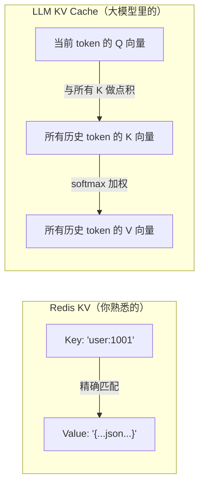
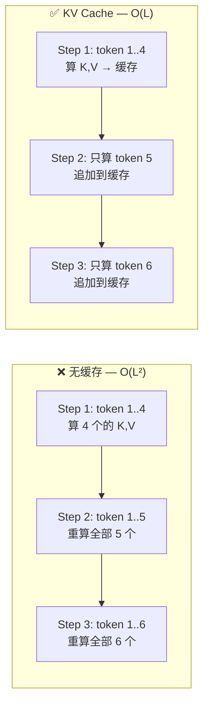
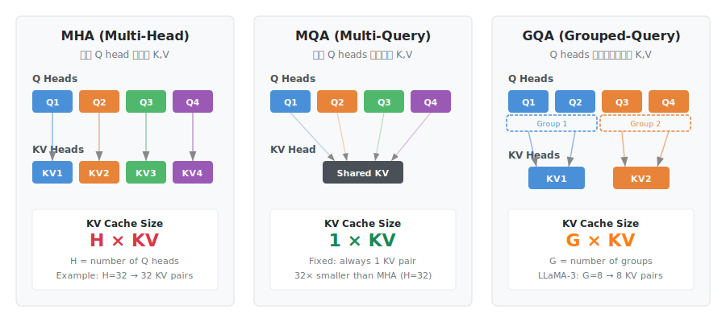
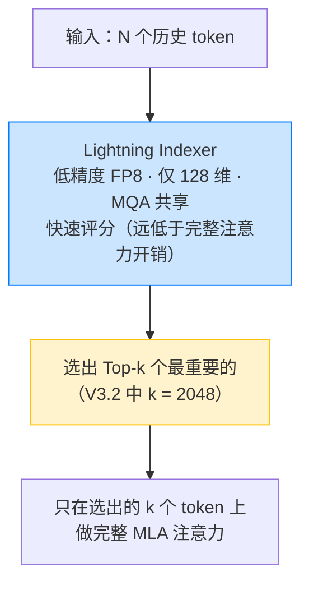
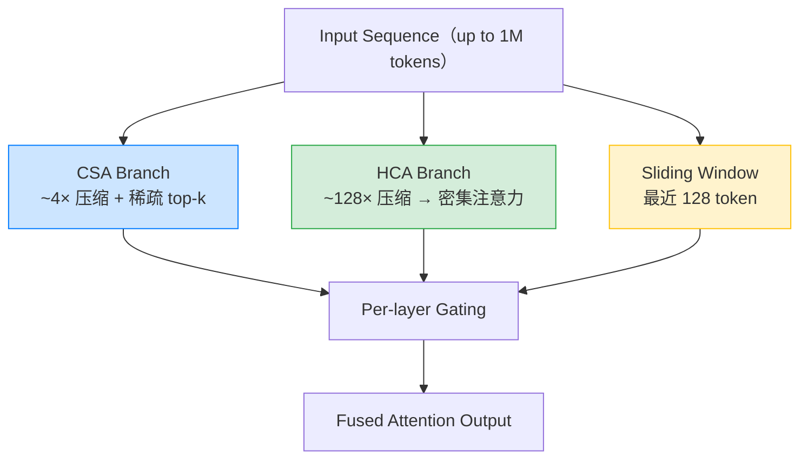

# 为什么 DeepSeek V4 能做到 ¥1/百万 token——程序员的 KV Cache 入门

> **读者定位：** 有编程经验、没用过大模型 API、没读过 ML 论文。读完你能理解：(1) KV Cache 为什么不是 Redis；(2) DeepSeek V4 和 GPT/Claude/Qwen 的底层差异；(3) 怎么利用缓存省钱。

---

## §0 先消除最大的误解——「Key」不是用来检索的

你第一次看到「KV Cache」，大概率想到的是 Redis：

```text
redis> SET user:1001 '{"name": "Alice"}'
redis> GET user:1001           ← 用精确的 key 查 value
```

在这个模型里，Key 是一个查找索引——你知道 `user:1001`，就能直接拿到对应的 value。缓存命中靠精确匹配。

**大模型里的 KV Cache 完全不是这回事。** 这里的 K 和 V 来自 Transformer 论文中 Attention 机制的三个矩阵——**Q**uery、**K**ey、**V**alue。名字是论文作者起的，和程序员的 key-value store 纯属巧合。



两者的区别一句话：**Redis 用 Key 做精确查找，LLM 用 K 做相似度匹配。** 缓存操作也不是「查询命中」，而是「追加」——每生成一个新 token，它的 K 和 V 就追加到缓存末尾。注意力计算时，用当前 token 的 Q 与缓存里**所有** K 做点积（相似度），按加权结果取 V。

为什么叫「缓存」？因为如果不存这些 K 和 V，每生成一个新 token 都要把前面所有 token 的 K、V **重新算一遍**——这才是 KV Cache 要解决的核心问题。

> 一个更精确的叫法应该是「Compute Cache」（计算缓存）而非「KV Cache」——它存的是中间计算结果，目的是避免重复计算。这和 Redis 那种存最终数据、加速读取的缓存，解决的是性质不同的问题。相关讨论见阿里云开发者的[这篇分析](https://www.53ai.com/news/LargeLanguageModel/2026021137482.html)。

---

## §1 为什么需要缓存

模型生成文本是逐 token 的——每输出一个字，都要让它「回顾」前面所有的字来决定下一个字是什么。

没有缓存时，生成第 100 个 token 需要把前 99 个 token 的 K、V 全部重算一遍。生成第 200 个 token 时，前 199 个又要重算。总计算量随着输出长度**平方级增长**——O(L²)，L 是序列长度。

KV Cache 做的事：前 99 个 token 算出来的 K、V 存起来。生成第 100 个时直接用缓存里的，只算第 100 个自己的 K、V。O(L²) → O(L)。



**Prefill 和 Decode。** 推理过程对应两个阶段：

- **Prefill（预填充）**：第一次看到 prompt（system prompt + 你的问题）时，一次性并行处理所有 token，算出它们的 K、V 存好。这一步是**算力密集型**——GPU 的矩阵乘法单元满负荷运转。
- **Decode（解码）**：逐 token 生成回答。每步只算一个新 token，用它的 Q 去查缓存里的全部 K、V。这一步是**内存带宽密集型**——每步都要把不断增长的缓存从显存搬进计算单元。

**为什么 Decode 慢：** H100 显存带宽约 3 TB/s。一个 70B 模型权重 ~140 GB，KV Cache 随对话增长。每生成一个 token，GPU 需要搬数百 GB 数据，但只做一点点乘加运算——大部分时间在等数据，不在算数据。

---

## §2 缓存到底占多少显存

用 [kvcache.ai](https://kvcache.ai/tools/kv-cache-calculator/) 算几个真实数字（单条请求，FP16 精度）：

| 模型 | 架构 | 8K 上下文 | 128K 上下文 | 1M 上下文 |
|---|---|---|---|---|
| LLaMA-3 70B | GQA（8 组） | 2.5 GB | 40 GB | — |
| DeepSeek-V3/R1 | MHA（旧架构） | 53 GB | 214 GB | — |
| **DeepSeek V4 Flash** | **MLA + CSA/HCA** | — | — | **2.89 GB** |

同一张 H100 有 80 GB 显存。传统 MHA 模型跑 128K 上下文，KV Cache 就要 214 GB——两张 H100 都不够。而 DeepSeek V4 Flash 跑 **1M 上下文只需 2.89 GB**。

差距的来源就是本文要讲的核心——**KV Cache 优化**。

> **工具链接：** [kvcache.ai 计算器](https://kvcache.ai/tools/kv-cache-calculator/) 支持 MHA/GQA/MLA/Sliding Window 四种架构，可自行验证。

---

## §3 DeepSeek 和别家到底有什么不一样

DeepSeek 的低价来自**四层 KV Cache 压缩技术的叠加**。GPT、Claude、Qwen、Kimi 各自只用了一两层。这不是一代模型的差距，是三年四代模型持续积累的结果。



<p align="center"><sub>第一层：Q heads（上排）到 KV heads（下排）的映射。颜色表示共享关系。</sub></p>

### 3.1 第一层：减少「每个 token 存多少」——从 MHA 到 MLA

Transformer 的 Attention 有多个「注意力头」（heads）。每个头独立计算 Q、K、V。传统设计（MHA）每个 Q 头有自己独立的 K、V 头——有多少个 Q 头就要存多少份 K、V。

| 架构 | 谁在用 | Q 头数 | KV 头数 | KV Cache 相对大小 |
|---|---|---|---|---|
| **MHA** | GPT-3/4（早期）、DeepSeek V3 | 64-128 | 64-128（1:1） | 基准 = 100% |
| **GQA**（[论文](https://arxiv.org/abs/2305.13245)） | LLaMA-3、Qwen、Mistral、Kimi | 64 | 8（8:1 共享） | ~12.5% |
| **MLA**（[DeepSeek-V2 论文](https://arxiv.org/abs/2405.04434)） | **DeepSeek V2/V3/V4** | 128 | 不存完整 KV | **~1.8%** |

GQA 的思路很直接：让多个 Q 头共享同一组 K、V，从源头减少需要缓存的数据量。LLaMA-3 70B 用 8 组共享，KV Cache 就比 MHA 小了 8 倍。

MLA（DeepSeek 2024 年引入）更进一步——不存完整的 K、V，而是存压缩后的「摘要」向量。每个 token 只存 576 个数值，而 MHA 要存 32768 个。压缩了 57 倍。

**MLA 的巧妙之处：** 通常压缩意味着使用时要先解压——但 MLA 不需要。它把解压用的矩阵在模型加载时预计算合并进其他矩阵里，推理时直接在压缩空间做计算。用程序员的类比：就像编译时做了常量折叠和内联，运行时没有额外开销。

### 3.2 第二层：只算真正重要的 token——DSA

MLA 解决了「每个 token 存多少」。但还有一个问题：100 万 token 的上下文，每个新 token 都要和全部 100 万个历史 token 做注意力计算——还是太贵。

DSA（[DeepSeek Sparse Attention](https://arxiv.org/abs/2512.02556)，V3.2 引入）的解法：加一个轻量级「预筛选器」。



复杂度从 O(L²) 降到 O(Lk)。在 128K 上下文下，每 token GPU 成本降低约一半。

### 3.3 第三层：把序列本身压缩——CSA + HCA

DSA 是筛选重要 token。更激进的思路是：把 token 序列本身做**物理压缩**。

DeepSeek V4 的[混合注意力架构](https://huggingface.co/deepseek-ai/DeepSeek-V4-Pro/blob/main/DeepSeek_V4.pdf)用了三支路并行：



- **CSA**：先 4× 压缩序列，再用 DSA 的 Lightning Indexer 选 top-k——既省存储又省计算
- **HCA**：128× 压缩后序列已经足够短，直接做密集注意力——用于需要全局概览的层
- **Sliding Window**：最近 128 个 token 不做压缩，保证局部连贯性

最终效果：V4 Flash 在 1M 上下文下，KV Cache 仅为 V3.2 的 7%。

### 3.4 第四层：超出显存的放到 SSD 上

前面三层都在压缩「需要存多少」。但如果缓存还是太大，GPU 显存放不下怎么办？

DeepSeek 的做法：把 KV Cache 分级存储——热数据留 GPU 显存，温数据放到 NVMe SSD 上，通过自研的 **[3FS](https://github.com/deepseek-ai/3FS)** 文件系统高速读写。

```
┌─────────────────────────────────────────────────┐
│ GPU 显存（HBM）                                   │
│ 当前的、频繁访问的 KV Cache blocks                │
│ ↓ 不常用的块换出                                  │
├─────────────────────────────────────────────────┤
│ NVMe SSD（通过 3FS 文件系统，6.6 TiB/s 聚合读取）  │
│ 历史对话的、低频访问的 KV Cache blocks             │
│ ↓ 需要时通过 RDMA 高速读回 GPU                     │
└─────────────────────────────────────────────────┘
```

这和 CPU 的多级缓存（L1 → L2 → L3 → 内存）一个思路。DeepSeek 官方数据：生产环境中磁盘 KV Cache 命中率 **56.3%**——超过一半的请求，需要的上下文已经在 SSD 上，不需要重新 Prefill。

这和 Prompt Caching（§4）不同：Prompt Caching 是**跨请求**复用相同前缀的缓存，磁盘 KV Cache 是**单次请求内**历史上下文的分级存储。

---

## §4 Prompt Caching：跨请求复用

KV Cache 优化的是**单次请求内**的重复计算。Prompt Caching 是把复用范围扩展到**跨请求**。

如果两个用户请求的 system prompt 相同（比如都用「你是一个代码助手」），第二个用户可以直接复用第一个用户 Prefill 阶段算好的 KV Cache，跳过重复计算。

**约束：** 必须从第一个 token 开始**完全一致**。一个 token 的差异，该位置之后全部失效。

DeepSeek 的磁盘缓存在简单前缀匹配之上还有额外机制（[官方文档](https://api-docs.deepseek.com/guides/kv_cache)）：
- 请求边界自动持久化——每次请求的用户输入末尾 + 模型输出末尾各产生一个缓存单元
- 公共前缀检测——系统主动发现多个请求的共同前缀，单独持久化
- 固定间隔切分——长文本按固定步长切出缓存单元，避免长序列永远无法被缓存

**缓存能活多久？** 这直接决定了命中率上限。各家的差异很大：

| | DeepSeek | Anthropic | OpenAI |
|---|---|---|---|
| **默认 TTL** | **数小时到数天** | 5 分钟 | 5-10 分钟 |
| **最长 TTL** | 同上 | 1 小时（2× 写入费） | 最长 1 小时，GPT-5.x 可到 24 小时 |
| **存储介质** | **磁盘**（SSD） | GPU 内存 | GPU 内存 |
| **写入额外收费** | **无** | 有（1.25×~2×） | 无 |
| **启用方式** | 自动 | 手动 `cache_control` | 自动 |
| **官方文档** | [DeepSeek](https://api-docs.deepseek.com/guides/kv_cache) | [Anthropic](https://docs.anthropic.com/en/docs/build-with-claude/prompt-caching) | [OpenAI](https://platform.openai.com/docs/guides/prompt-caching) |

差距的根因还是 MLA：2.89 GB 的 KV Cache 可以写到便宜的 SSD 上，空间几乎无限，所以缓存能活数天。Anthropic 的 MHA 架构下，同样的上下文需要上百 GB，只能挤在昂贵的 GPU 显存里，5 分钟不用就必须回收——新请求还等着用这片显存。

这意味着即使 DeepSeek 和 Anthropic 的缓存命中折扣相同（都是 ~90%），**DeepSeek 的命中机会远大于 Anthropic**——因为缓存活几百倍的时间。

**实践意义（可以直接用的三个技巧）：**

1. **system prompt 放前面，用户消息放后面。** 缓存匹配是从头开始的前缀匹配。`system + user1` 和 `system + user2` 能共享 system 部分的缓存。
2. **多轮对话复用 session。** 不要每轮新建 session——历史轮次的 KV Cache 已经算好了，新轮次只需处理新增 token，不需要重新 Prefill。
3. **Anthropic API 需要显式标记缓存点。** 在 system prompt 末尾加 `cache_control: {"type": "ephemeral"}`，告诉 API「到此为止的内容可以跨请求缓存」。DeepSeek 和 OpenAI 自动处理，不需要手动标记。

---

## §5 这对账单意味着什么

回到 DeepSeek V4 的定价（[官方定价页](https://api-docs.deepseek.com/zh-cn/quick_start/pricing)）：

| 场景 | V4-Flash 价格 | GPT-5.5 价格 | 差距 |
|---|---|---|---|
| 正常输入（缓存未命中） | ¥1 / M token | ~¥36 / M token | 36× |
| 缓存命中输入 | ¥0.02 / M token | ~¥3.6 / M token | 180× |
| 输出 | ¥2 / M token | ~¥216 / M token | 108× |

缓存的威力在 Agent 场景特别明显——多轮对话中每轮的 system prompt 和前面轮次的上下文都能命中缓存，实际输入成本接近缓存命中价而非正常价。

> **如何验证缓存命中：** DeepSeek API 的 response 中有 `prompt_cache_hit_tokens` 和 `prompt_cache_miss_tokens` 两个字段。前者是本次请求中命中缓存的 token 数，后者是未命中的。在生产环境监测这两个字段的变化，是判断缓存策略是否有效的直接手段。

---

## §6 进一步阅读

- **[KV Cache 原理全解](./kv-cache-principles.md)**（同目录）——有完整公式推导、论文引用和 MQA/GQA/MLA/DSA 的技术细节，适合想深入理解的读者
- **[kvcache.ai 计算器](https://kvcache.ai/tools/kv-cache-calculator/)**——选模型、输参数量，直接看 KV Cache 占用
- **[DeepSeek 官方 API 定价](https://api-docs.deepseek.com/zh-cn/quick_start/pricing)**——实时价格

> **数据来源：** DeepSeek V4 定价和架构参数来自 DeepSeek 官方文档和 [V4 技术报告](https://huggingface.co/deepseek-ai/DeepSeek-V4-Pro/blob/main/DeepSeek_V4.pdf)；GPT-5.5 定价来自 [OpenAI 定价页](https://developers.openai.com/api/docs/pricing)；kvcache.ai 计算器数据来自其公开的模型 config 和标准 KV Cache 公式。
