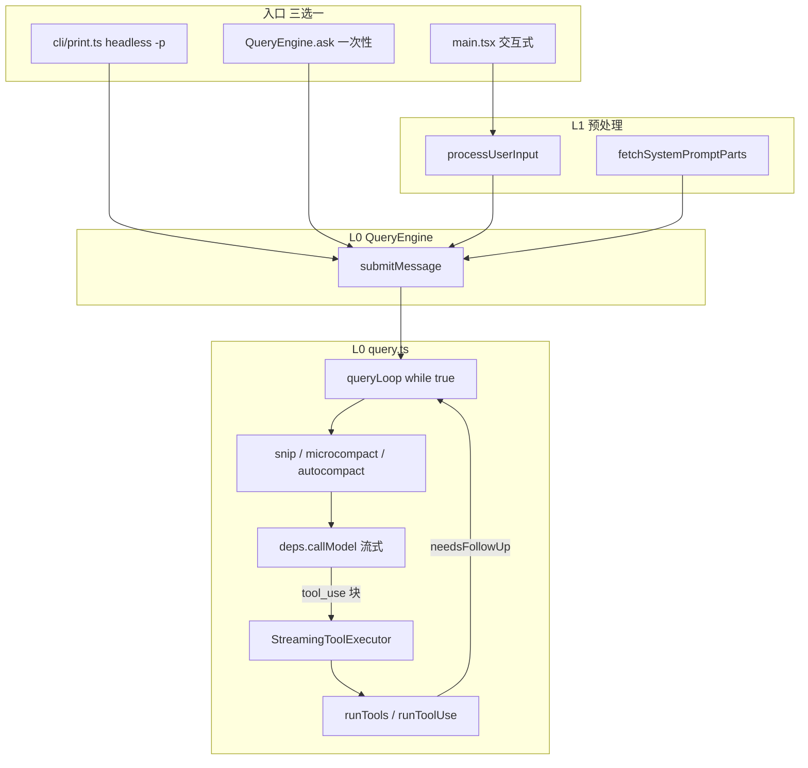

# Claude Code 架构总览

> **基准：** v2.1.88 TS 快照 · pin [`936e6c8`](https://github.com/zhumengzhu/claude-code/commit/936e6c8e8d7258dd1b2bc127d704f02cc23076d5)  
> **规模：** ~1900 文件 · ~512k LOC · Bun + React/Ink 终端 UI

本文只分析 Claude Code 自身：**分层、主次、主链路**。对照其他系统留到后期专题。

---

## 1. 一句话

Claude Code 是一个 **以 `query.ts` agent loop 为内核** 的终端 Agent：用户输入经 **预处理** 进入 **QueryEngine**，内核循环里完成 **上下文压缩 → 调 API → 流式执行工具 → 写回消息**，外层再包 **CLI / REPL / SDK** 三种入口。

---

## 2. 四层架构（由核心到外）

```text
┌─────────────────────────────────────────────────────────────┐
│ L3  可选能力：multi-agent、bridge、remote、voice、vim…      │
├─────────────────────────────────────────────────────────────┤
│ L2  产品壳层：main.tsx、print.ts、REPL、components (~389)   │
├─────────────────────────────────────────────────────────────┤
│ L1  Agent 基础设施：tools、compact、MCP、skills、permission │
├─────────────────────────────────────────────────────────────┤
│ L0  运行时内核：query.ts · QueryEngine · services/tools/api │
└─────────────────────────────────────────────────────────────┘
```

| 层级 | 角色 | 读源码优先级 |
|------|------|--------------|
| **L0 内核** | Agent 循环、LLM 调用、工具执行 | **必读** |
| **L1 基础设施** | 工具定义、上下文、权限、扩展 | **第二遍** |
| **L2 产品壳** | 交互式 TUI、headless/SDK、命令行 | 需要时读 |
| **L3 可选** | IDE 桥、团队 Agent、语音等 | 按需 |

**重要现实：** 512k LOC 里 **~389 个文件在 `components/`**，属于 L2。先读 L0 不会「漏掉产品」，反而避免在 UI 里迷路。

---

## 3. 运行时脊柱（L0）

这是整个系统 **不可绕开** 的主路径：



### 3.1 三个入口，一个内核

| 入口 | 文件 | 场景 |
|------|------|------|
| 交互式 REPL | `main.tsx` → `replLauncher` → `screens/REPL` | 默认 `claude` |
| Headless / SDK | `cli/print.ts` → `runHeadless` → `QueryEngine.ask` | `-p` / `--print` / stream-json |
| 便捷 API | `QueryEngine.ask()` | 单次 prompt，内部 `new QueryEngine` |

无论哪条路径，**真正跑 Agent 的都是 `QueryEngine.submitMessage` → `query()`**。

### 3.2 `QueryEngine`：会话级引擎

```180:183:/Users/zmz/Github/claude-code/src/QueryEngine.ts
 * One QueryEngine per conversation. Each submitMessage() call starts a new
 * turn within the same conversation. State (messages, file cache, usage, etc.)
 * persists across turns.
```

职责（按重要性）：

1. **组装一次 turn 的上下文**：system prompt、user context、tools、MCP、model、thinking
2. **调用 `query()`** 并消费 async generator 产出（Message / StreamEvent）
3. **跨 turn 持久状态**：`mutableMessages`、`readFileState`、usage、permission denials
4. **SDK 形态适配**：把内部 Message 映射为 `SDKMessage`

**读法：** 先找 `submitMessage` 里 `for await (const message of query({...}))`（约 675 行），再往回看 prompt 组装。

### 3.3 `query.ts`：Agent Loop

```219:239:/Users/zmz/Github/claude-code/src/query.ts
export async function* query(
  params: QueryParams,
): AsyncGenerator<...> {
  const terminal = yield* queryLoop(params, consumedCommandUuids)
  ...
  return terminal
}
```

`queryLoop` 是 **while (true)** 循环，每一轮迭代大致顺序：

| 阶段 | 做什么 | 关键依赖 |
|------|--------|----------|
| 1. 上下文准备 | snip → microcompact → context collapse → **autocompact** | `services/compact/*`, `query/deps.ts` |
| 2. 调模型 | `deps.callModel` 流式返回 assistant 块 | `services/api/*` |
| 3. 工具执行 | `StreamingToolExecutor` 边流边跑；或 batch `runTools` | `services/tools/*` |
| 4. 写回状态 | assistant + tool_result 追加到 messages | `types/message.ts` |
| 5. 是否继续 | `needsFollowUp` / stop hooks / 413 恢复 / maxTurns | `query/stopHooks.ts` |

**Loop 退出信号：** 流式过程中出现 `tool_use` 则 `needsFollowUp = true`；否则本轮结束（注释写明 `stop_reason === 'tool_use'` 不可靠）。

**设计特点：**

- **Async generator 贯穿**：UI / SDK 通过 `yield` 逐条消费事件，不必等整轮结束
- **依赖注入**：`query/deps.ts` 的 `productionDeps()` 把 API、compact、feature gate 抽离，便于测试
- **状态机式 continue**：`State` + `transition.reason` 记录恢复路径（compact retry、collapse drain 等）

---

## 4. L1：Agent 基础设施（第二优先级）

### 4.1 工具系统（三件套）

| 模块 | 路径 | 职责 |
|------|------|------|
| 类型与上下文 | `Tool.ts` (~792 行) | `Tool` 接口、`ToolUseContext`、`CanUseToolFn` |
| 注册表 | `tools.ts` (~389 行) | 组装 ~42 个内置 tool，feature flag 条件加载 |
| 实现 | `tools/*/` | 每个 tool 独立目录：schema + execute + permission |
| 执行层 | `services/tools/` | **4 个文件，极核心** |

`services/tools/` 四文件分工：

| 文件 | 职责 |
|------|------|
| `StreamingToolExecutor.ts` | 流式到达的 tool_use **边收边跑**，并发安全工具可并行 |
| `toolOrchestration.ts` | `runTools`：按并发安全性 partition，串/并行批次 |
| `toolExecution.ts` | `runToolUse`：单工具执行、进度消息、结果格式化 |
| `toolHooks.ts` | 工具级 hook 注入点 |

**读序：** `Tool.ts`（类型）→ 任选一个简单 tool（如 `FileReadTool`）→ `toolExecution.ts` → `StreamingToolExecutor.ts` → `tools.ts`（看注册）。

### 4.2 命令系统（与 Agent 循环的关系）

| 模块 | 路径 | 职责 |
|------|------|------|
| 注册 | `commands.ts` | slash 命令表 |
| 实现 | `commands/*` (~50) | `/compact`、`/mcp`、`/commit` 等 |
| 预处理 | `utils/processUserInput/` | 解析 `/`、附件、是否 `shouldQuery` |

**关键分叉：** 本地 slash 命令可能 **`shouldQuery: false`**，QueryEngine 直接 yield 命令输出而不进 `query()`。Agent 循环只服务「需要 LLM 的 turn」。

### 4.3 上下文与压缩

| 模块 | 路径 | 职责 |
|------|------|------|
| Prompt 片段 | `context.ts`, `context/*` | user/system context 收集 |
| 压缩 | `services/compact/*` (~11 文件) | microcompact、autocompact、reactive compact |
| 记忆 | `memdir/*`, `services/SessionMemory` | 跨 session 持久记忆 |
| 历史 | `history.ts` | 引用、粘贴展开 |

压缩在 **每轮 loop 开头** 运行（见 `query.ts` 369–543 行），优先级高于 API 调用：先尽量缩小 context，再 `callModel`。

### 4.4 权限与 Hooks

| 模块 | 路径 | 职责 |
|------|------|------|
| 运行时许可 | `hooks/useCanUseTool.ts` | `canUseTool` 回调链 |
| 用户 hooks | `utils/hooks/*` | PreToolUse、SessionStart 等 |
| 策略 | `types/permissions.ts`, policy 服务 | permission mode、deny rules |

工具执行前 **`canUseTool` 必过**；拒绝会记入 `permissionDenials` 并可能触发 UI 提示（交互模式）。

### 4.5 扩展：MCP · Skills · Plugins

| 模块 | 文件规模 | 职责 |
|------|----------|------|
| `services/mcp/*` | ~23 | MCP 客户端、channel、OAuth |
| `skills/*` | ~20 | Skill 发现与加载 |
| `plugins/*` | ~2 + 服务 | 插件同步与 hook 扩展 |
| `tools/MCPTool`, `SkillTool`, `AgentTool` | — | 扩展能力进 loop 的桥梁 |

这三块 **不改变 loop 形状**，而是往 `ToolUseContext.options.tools` 和 system prompt 里 **加能力**。

### 4.6 状态

| 模块 | 职责 |
|------|------|
| `state/AppStateStore.ts` | 全局 React 态：settings、MCP、permission context |
| `types/message.ts` | 会话消息代数类型 |
| JSONL / session 持久化 | 散落在 `utils/`、`QueryEngine`（`recordTranscript` 等） |

---

## 5. L2：产品壳（知道即可，后读）

| 模块 | 规模 | 说明 |
|------|------|------|
| `main.tsx` | ~4683 行 | Commander CLI、flag 解析、init、分支到 REPL / print |
| `cli/print.ts` | ~5500 行 | Headless 主控：MCP 安装、权限、stream-json、调 `ask` |
| `components/*` | ~389 文件 | Ink UI：消息列表、输入框、Spinner、权限对话框 |
| `screens/*` | 3 | REPL、Doctor、Resume |
| `ink/*` | — | 终端渲染封装 |

**学习建议：** 交互式体验出问题查 L2；**Agent 行为问题查 L0/L1**。

---

## 6. L3：可选子系统（按需）

| 目录 | 用途 | 何时读 |
|------|------|--------|
| `tasks/*`, `coordinator/` | LocalAgent / Remote / Teammate | 读 Team* / AgentTool 时 |
| `bridge/*` (~31) | IDE 集成 | 读 IDE 选区、diagnostics 注入时 |
| `remote/*`, `server/*` | 远程 session | 读 CCR / 远程模式时 |
| `voice/*`, `vim/*`, `buddy/*` | 语音、Vim 模式、.sprite | 产品特性，与内核无关 |
| `services/analytics/*` | 埋点 | 可忽略首遍 |

---

## 7. 核心组件一张表

| 优先级 | 组件 | 路径 | 一句话 |
|--------|------|------|--------|
| ★★★ | Agent Loop | `query.ts` | while-loop：compact → API → tools → continue |
| ★★★ | Query Engine | `QueryEngine.ts` | 会话引擎，submitMessage 调 query |
| ★★★ | Tool 执行 | `services/tools/*` | 流式/批量执行 tool_use |
| ★★★ | API 层 | `services/api/*` | callModel、streaming、fallback |
| ★★☆ | Tool 抽象 | `Tool.ts` | 类型 + ToolUseContext |
| ★★☆ | Tool 注册 | `tools.ts`, `tools/*` | 42 个内置工具 |
| ★★☆ | 压缩 | `services/compact/*` | 上下文生命周期 |
| ★★☆ | 输入预处理 | `utils/processUserInput/*` | slash、附件、shouldQuery |
| ★★☆ | 权限 | `hooks/useCanUseTool`, `utils/hooks/*` | 工具许可 |
| ★☆☆ | 命令 | `commands.ts`, `commands/*` | 本地 slash，不一定进 loop |
| ★☆☆ | MCP / Skills | `services/mcp/*`, `skills/*` | 扩展工具与 prompt |
| ★☆☆ | Headless | `cli/print.ts` | SDK/-p 入口 |
| ☆☆☆ | TUI | `main.tsx`, `components/*` | 终端 UI |

---

## 8. `query/` 子目录（loop 的卫星模块）

| 文件 | 职责 |
|------|------|
| `query/deps.ts` | 注入 `callModel`、`microcompact`、`autocompact` 等 |
| `query/config.ts` | 一次性 snapshot 配置（feature gate 除外） |
| `query/stopHooks.ts` | 停止前 hook，可能触发 retry |
| `query/tokenBudget.ts` | TOKEN_BUDGET feature 预算追踪 |
| `query/transitions.ts` | `Continue` / `Terminal` 类型 |

读 `query.ts` 时 **并行扫这 4 个文件**，避免在 1700 行里迷失。

---

## 9. 推荐阅读顺序（仅 Claude Code）

### 第一遍：抓住脊柱（1–2 天）

```
01 本文 §3
  → query.ts（queryLoop while 体：compact 段 + API 段 + tool 段）
  → QueryEngine.submitMessage（如何调用 query）
  → services/tools/toolExecution.ts + StreamingToolExecutor.ts
  → 选一个工具：tools/FileReadTool/
```

### 第二遍：补基础设施（2–3 天）

```
Tool.ts → tools.ts（浏览注册表）
  → services/compact/（任选一两个入口文件）
  → utils/processUserInput/processUserInput.ts
  → hooks/useCanUseTool.ts
  → services/mcp/（若关心 MCP）
```

### 第三遍：入口与产品（按需）

```
cli/print.ts 的 runHeadless（扫结构，不深读 5500 行）
  → main.tsx 的 REPL 分支
  → screens/REPL.tsx + utils/handlePromptSubmit.ts
```

### 第四遍：高级主题

```
AgentTool / tasks/*（子 Agent）
  → Team* tools + coordinator
  → bridge/*（IDE）
  → skills/* + plugins/*
```

---

## 10. 读完后自测

1. 画出自上而下的调用链：**用户回车 → 哪几个函数 → `queryLoop`**
2. **`shouldQuery: false`** 时，代码走哪条分支？还会进 `query()` 吗？
3. 一轮 loop 里，**compact 和 callModel 谁先谁后**？
4. **`StreamingToolExecutor` 与 `runTools` 分别在什么条件下使用**？
5. 工具从 **`tools.ts` 注册** 到 **实际 execute**，经过哪几层？
6. 512k LOC 里，为什么建议 **先不读 `components/`**？

---

## 关联

- [26 主链路总图](./26-main-chain-atlas.md)
- [learning-paths.md](./learning-paths.md)
- [社区资源](./external-resources.md)
