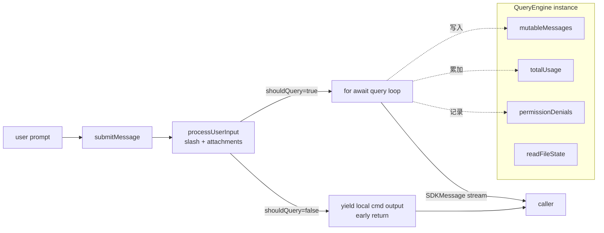
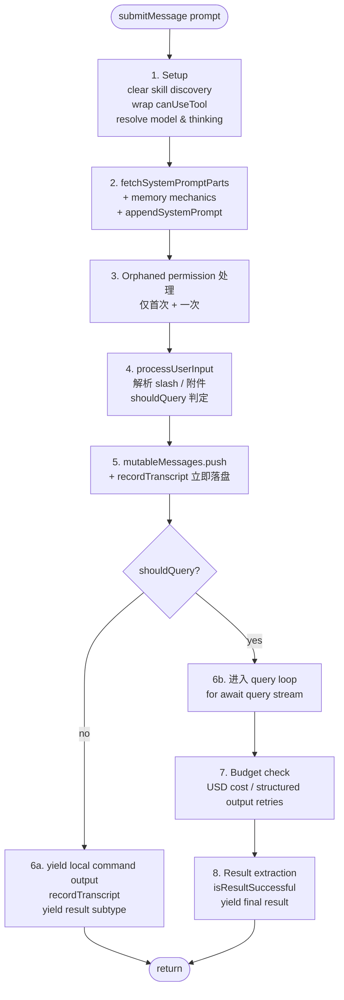

# 05 · QueryEngine：会话引擎

> **锚点：** `QueryEngine.ts`（~1295 行）· `QueryEngine.submitMessage` · `ask()` 包装  
> **下游：** [06 query loop](./06-query-agent-loop.md) · **上游：** [12 输入预处理](./12-commands-and-input-preprocessing.md)

---

## 1. 职责边界

`QueryEngine` 是 **「一个 conversation 一个实例」** 的会话引擎：

```176:182:/Users/zmz/Github/claude-code/src/QueryEngine.ts
 * QueryEngine owns the query lifecycle and session state for a conversation.
 * It extracts the core logic from ask() into a standalone class that can be
 * used by both the headless/SDK path and (in a future phase) the REPL.
 *
 * One QueryEngine per conversation. Each submitMessage() call starts a new
 * turn within the same conversation. State (messages, file cache, usage, etc.)
 * persists across turns.
```

| 做 | 不做 |
|----|------|
| 组装 system prompt / `ToolUseContext` | 不实现 agent loop 本体（交给 `query()`） |
| 调用 `query()` 并消费 generator | 不渲染 Ink UI（REPL 层） |
| 跨 turn 持久 `mutableMessages`、usage、denial | 不直接调 Anthropic HTTP（经 `query/deps`） |
| SDK 形态映射 `SDKMessage` | 不注册 slash 命令 |
| `wrappedCanUseTool` 记录 denial | 不解析 user input（交给 `processUserInput`） |



---

## 2. `QueryEngineConfig` 完整类型（22 字段）

```130:173:/Users/zmz/Github/claude-code/src/QueryEngine.ts
export type QueryEngineConfig = {
  cwd: string
  tools: Tools
  commands: Command[]
  mcpClients: MCPServerConnection[]
  agents: AgentDefinition[]
  canUseTool: CanUseToolFn
  getAppState: () => AppState
  setAppState: (f: (prev: AppState) => AppState) => void
  initialMessages?: Message[]
  readFileCache: FileStateCache
  customSystemPrompt?: string
  appendSystemPrompt?: string
  userSpecifiedModel?: string
  fallbackModel?: string
  thinkingConfig?: ThinkingConfig
  maxTurns?: number
  maxBudgetUsd?: number
  taskBudget?: { total: number }
  jsonSchema?: Record<string, unknown>
  verbose?: boolean
  replayUserMessages?: boolean
  handleElicitation?: ToolUseContext['handleElicitation']
  includePartialMessages?: boolean
  setSDKStatus?: (status: SDKStatus) => void
  abortController?: AbortController
  orphanedPermission?: OrphanedPermission
  snipReplay?: (...)
}
```

### 2.1 字段分组

| 组 | 字段 | 说明 |
|----|------|------|
| **会话边界** | `cwd`, `initialMessages`, `readFileCache`, `abortController` | engine 跨 turn 持有 |
| **能力面** | `tools`, `commands`, `mcpClients`, `agents` | 当前 turn 可用 tool / 命令 / MCP / 子 Agent 集 |
| **权限** | `canUseTool` | 包装后变 `wrappedCanUseTool` 记录 denial |
| **state 访问** | `getAppState`, `setAppState` | Zustand-style，QueryEngine 不持有 AppState 副本 |
| **prompt 注入** | `customSystemPrompt`, `appendSystemPrompt` | replace / append 两种语义 |
| **model** | `userSpecifiedModel`, `fallbackModel`, `thinkingConfig` | model 选择优先级，详见 [07 §4](./07-api-and-model-stream.md#4-model-选择优先级) |
| **预算** | `maxTurns`, `maxBudgetUsd`, `taskBudget` | 三种独立 budget |
| **SDK** | `jsonSchema`, `replayUserMessages`, `includePartialMessages`, `setSDKStatus`, `handleElicitation` | 详见 [19](./19-sdk-headless-and-print-mode.md) |
| **特殊场景** | `orphanedPermission`, `snipReplay`, `verbose` | crash recovery + feature-gated 注入 + debug |

### 2.2 设计动机：为什么 `snipReplay` 由调用方注入？

源码注释（`QueryEngineConfig.snipReplay`）：

```158:172:/Users/zmz/Github/claude-code/src/QueryEngine.ts
 * Snip-boundary handler: receives each yielded system message plus the
 * current mutableMessages store. Returns undefined if the message is not a
 * snip boundary; otherwise returns the replayed snip result. Injected by
 * ask() when HISTORY_SNIP is enabled so feature-gated strings stay inside
 * the gated module (keeps QueryEngine free of excluded strings and testable
 * despite feature() returning false under bun test). SDK-only: the REPL
 * keeps full history for UI scrollback and projects on demand via
 * projectSnippedView; QueryEngine truncates here to bound memory in long
 * headless sessions (no UI to preserve).
```

→ feature-gated **字符串**（如 `[snip boundary]`）通过依赖注入留在 gated 模块外，让 QueryEngine 自身保持 feature-agnostic + 可测。这是「**让 feature flag 不污染核心模块**」的典型手法。

---

## 3. 实例状态（持久跨 turn）

```184:207:/Users/zmz/Github/claude-code/src/QueryEngine.ts
export class QueryEngine {
  private config: QueryEngineConfig
  private mutableMessages: Message[]
  private abortController: AbortController
  private permissionDenials: SDKPermissionDenial[]
  private totalUsage: NonNullableUsage
  private hasHandledOrphanedPermission = false
  private readFileState: FileStateCache
  private discoveredSkillNames = new Set<string>()
  private loadedNestedMemoryPaths = new Set<string>()
}
```

| 字段 | 用途 | 跨 turn 行为 |
|------|------|-------------|
| `mutableMessages` | 完整对话历史 | 每 turn 增量 push |
| `readFileState` | Read 工具的 hash / 文件缓存 | 持久，避免重读 |
| `abortController` | 当前 turn 取消 | 一次 abort 波及所有 in-flight tool |
| `permissionDenials` | denial 记录 | 在 SDK `result` 消息里上报 |
| `totalUsage` | 跨 turn token 累计 | 每 turn 末更新 |
| `hasHandledOrphanedPermission` | 边缘情况一次性标记 | 只在第一次 submitMessage 时使用 |
| `discoveredSkillNames` | turn 内 skill 发现（telemetry） | **每 turn 开头 clear**（避免无限增长） |
| `loadedNestedMemoryPaths` | CLAUDE.md dedup | 跨 turn 累积，防止重复注入 |

注意 `discoveredSkillNames.clear()` 在每个 `submitMessage` 开头执行：

```197:198:/Users/zmz/Github/claude-code/src/QueryEngine.ts
  // Must persist across the two processUserInputContext rebuilds inside
  // submitMessage, but is cleared at the start of each submitMessage to avoid
  // unbounded growth across many turns in SDK mode.
```

---

## 4. `submitMessage` 八阶段生命周期



### 4.1 阶段 1：Setup

```238:282:/Users/zmz/Github/claude-code/src/QueryEngine.ts
this.discoveredSkillNames.clear()
setCwd(cwd)
const persistSession = !isSessionPersistenceDisabled()
const startTime = Date.now()

const wrappedCanUseTool: CanUseToolFn = async (...) => {
  const result = await canUseTool(...)
  if (result.behavior !== 'allow') {
    this.permissionDenials.push({...})
  }
  return result
}

const initialMainLoopModel = userSpecifiedModel
  ? parseUserSpecifiedModel(userSpecifiedModel)
  : getMainLoopModel()

const initialThinkingConfig: ThinkingConfig = thinkingConfig
  ? thinkingConfig
  : shouldEnableThinkingByDefault() !== false
    ? { type: 'adaptive' }
    : { type: 'disabled' }
```

**`wrappedCanUseTool` 设计：** 包装 user 提供的 `canUseTool`，把 `behavior !== 'allow'` 的全记到 `this.permissionDenials`——最终 SDK `result` 消息会把这个数组报给消费者（如 desktop app），让它知道用户拒绝了什么。

### 4.2 阶段 2：System prompt 组装

```292:325:/Users/zmz/Github/claude-code/src/QueryEngine.ts
const { defaultSystemPrompt, userContext: baseUserContext, systemContext } =
  await fetchSystemPromptParts({ tools, mainLoopModel, ..., mcpClients, customSystemPrompt })

const userContext = {
  ...baseUserContext,
  ...getCoordinatorUserContext(mcpClients, ...scratchpadDir),
}

const memoryMechanicsPrompt =
  customPrompt !== undefined && hasAutoMemPathOverride()
    ? await loadMemoryPrompt() : null

const systemPrompt = asSystemPrompt([
  ...(customPrompt !== undefined ? [customPrompt] : defaultSystemPrompt),
  ...(memoryMechanicsPrompt ? [memoryMechanicsPrompt] : []),
  ...(appendSystemPrompt ? [appendSystemPrompt] : []),
])
```

**关键：** custom **取代** default；append **追加** 在末尾；memory mechanics 在 SDK + 自定义 prompt + `CLAUDE_COWORK_MEMORY_PATH_OVERRIDE` 三件全齐时才注入。

详见 [13 system prompt](./13-system-prompt-and-context.md)。

### 4.3 阶段 3：Orphaned permission（仅一次）

```397:408:/Users/zmz/Github/claude-code/src/QueryEngine.ts
if (orphanedPermission && !this.hasHandledOrphanedPermission) {
  this.hasHandledOrphanedPermission = true
  for await (const message of handleOrphanedPermission(
    orphanedPermission, tools, this.mutableMessages, processUserInputContext,
  )) {
    yield message
  }
}
```

**触发场景：** 上一个 session 刚授权「永远允许 Bash」，crash 后授权未落盘；新 session 启动时把这个授权 replay 回去。一个 engine 生命周期内 **只跑一次**。

### 4.4 阶段 4：processUserInput

```410:428:/Users/zmz/Github/claude-code/src/QueryEngine.ts
const { messages: messagesFromUserInput, shouldQuery, allowedTools, model: modelFromUserInput, resultText } =
  await processUserInput({
    input: prompt, mode: 'prompt', setToolJSX: () => {},
    context: { ...processUserInputContext, messages: this.mutableMessages },
    messages: this.mutableMessages,
    uuid: options?.uuid, isMeta: options?.isMeta, querySource: 'sdk',
  })
```

`processUserInput` 负责：

1. 解析 slash 命令（`/compact` / `/memory` / `/clear` 等）
2. 处理附件（image / pdf / file ref）
3. 决定 `shouldQuery`（是否要调用 API）
4. 返回 `resultText`（local command 输出文本）+ `allowedTools`（slash 改变的权限）+ `modelFromUserInput`（slash 改变的 model）

详见 [12 commands](./12-commands-and-input-preprocessing.md)。

### 4.5 阶段 5：写入 mutableMessages + **立刻** recordTranscript

```430:463:/Users/zmz/Github/claude-code/src/QueryEngine.ts
this.mutableMessages.push(...messagesFromUserInput)
const messages = [...this.mutableMessages]

// Persist the user's message(s) to transcript BEFORE entering the query loop.
// The for-await below only calls recordTranscript when ask() yields an
// assistant/user/compact_boundary message — which doesn't happen until the
// API responds. If the process is killed before that (e.g. user clicks
// Stop in cowork seconds after send), the transcript is left with only
// queue-operation entries; getLastSessionLog filters those out, returns
// null, and --resume fails with "No conversation found".
if (persistSession && messagesFromUserInput.length > 0) {
  const transcriptPromise = recordTranscript(messages)
  if (isBareMode()) {
    void transcriptPromise
  } else {
    await transcriptPromise
    ...
  }
}
```

**关键设计：** transcript **在进 loop 前** 立刻持久化用户消息——如果 process 被杀（用户点 Stop），至少 `--resume` 能找到这条对话。`--bare` 模式才 fire-and-forget。

### 4.6 阶段 6a：`shouldQuery === false`（local command）

```560:639:/Users/zmz/Github/claude-code/src/QueryEngine.ts
// 把 local command stdout/stderr 包成 SDKUserMessageReplay 或 SDKAssistantMessage
for (const msg of messagesFromUserInput) {
  if (msg.type === 'user' && ...) yield SDKUserMessageReplay
  if (msg.type === 'system' && msg.subtype === 'local_command' && ...) yield SDKAssistantMessage
  if (msg.type === 'system' && msg.subtype === 'compact_boundary') yield SDKCompactBoundaryMessage
}

if (persistSession) await recordTranscript(messages)

yield {
  type: 'result', subtype: 'success',
  duration_ms, num_turns, result: resultText, stop_reason: null,
  total_cost_usd, usage: this.totalUsage, modelUsage,
  permission_denials: this.permissionDenials, ...
}
return
```

**早退路径：** `/config` `/clear` 这种本地 slash **完全不调 API**，直接 yield 命令输出 + result subtype 后 return。

### 4.7 阶段 6b：进 query loop

```675:686:/Users/zmz/Github/claude-code/src/QueryEngine.ts
for await (const message of query({
  messages,
  systemPrompt,
  userContext,
  systemContext,
  canUseTool: wrappedCanUseTool,
  toolUseContext: processUserInputContext,
  fallbackModel,
  querySource: 'sdk',
  maxTurns,
  taskBudget,
})) {
  // 映射为 SDKMessage yield；更新 mutableMessages
}
```

**注意：** 这里 `processUserInputContext` 是 **重建过的版本**（[QueryEngine.ts:492-527](file:///Users/zmz/Github/claude-code/src/QueryEngine.ts#L492)）——slash 命令可能改了 model / tools / mode，需要重组 context 再进 loop。这是 **两次 rebuild** 的原因。

### 4.8 阶段 7 + 8：Budget + Result

- USD 预算：`getTotalCost() > maxBudgetUsd` → 中止 + error subtype
- structured output 重试：`countToolCalls(SYNTHETIC_OUTPUT_TOOL_NAME) - initial ≥ 5` → 中止
- 正常：累积 turnCount / lastStopReason / structuredOutputFromTool / errorLogWatermark
- 末尾 yield `result` subtype，包含 usage / cost / num_turns / stop_reason / permission_denials / fast_mode_state

---

## 5. `ask()` 便捷包装

```1186:1188:/Users/zmz/Github/claude-code/src/QueryEngine.ts
 * Convenience wrapper around QueryEngine for one-shot usage.
```

`cli/print.ts` 的 headless 路径调用 `ask({ prompt, tools, canUseTool, getAppState, ... })`，内部：

```text
ask(params)
  ├─ new QueryEngine({ initialMessages, ..., snipReplay })  // 一次性
  ├─ yield* engine.submitMessage(prompt)
  └─ 结束即丢弃 engine
```

**REPL vs ask 差异：**

| 维度 | REPL | ask（headless） |
|------|------|------------------|
| Engine 生命周期 | 长——整个 session | 短——一次 prompt 一个 |
| `mutableMessages` | 跨多次 user turn 累积 | 仅一个 prompt（可有 initialMessages 接续） |
| UI | Ink + canUseTool 走交互对话框 | structuredIO + canUseTool 走 MCP elicitation 或 allow/deny 列表 |
| Snip replay | 不需要（UI 保留完整历史） | 需要（防止 SDK mem 无界增长） |

详见 [19 SDK / headless](./19-sdk-headless-and-print-mode.md)。

---

## 6. 与 query loop 的边界

| 层 | 持有 messages | 何时调 |
|----|---------------|--------|
| **QueryEngine** | `mutableMessages`（跨 turn） | 每 user turn 一次 `query()` |
| **queryLoop** | `state.messages`（单 turn 多 iteration） | `while (true)` 内 |

Turn 内 loop 多次 `recordTranscript`（assistant message → 流式增量；user message / compact_boundary → 同步）：详见 [08](./08-message-and-session-persistence.md)。

`fileHistoryMakeSnapshot` 在 user message 入库 **后**、loop **前** 调用，给可能的「撤回到此时」存档：

```641:655:/Users/zmz/Github/claude-code/src/QueryEngine.ts
if (fileHistoryEnabled() && persistSession) {
  messagesFromUserInput.filter(selectableUserMessagesFilter).forEach(m => {
    void fileHistoryMakeSnapshot(setFileHistoryUpdater, m.uuid)
  })
}
```

---

## 7. 常见误解 / Gotchas

### 7.1 「QueryEngine 跑 agent loop」是错的

QueryEngine **不跑** agent loop——它只 wrap `query()`。`query()` 才是 `while (true)` 本体（[06](./06-query-agent-loop.md)）。

### 7.2 `processUserInputContext` 为什么 rebuild 两次

第一次（[L335](file:///Users/zmz/Github/claude-code/src/QueryEngine.ts#L335)）：给 `processUserInput` 自己用，因为 slash 命令可能要读 messages / setMessages / handleElicitation。  
第二次（[L492](file:///Users/zmz/Github/claude-code/src/QueryEngine.ts#L492)）：进 loop 前重建，反映 slash 改过的 model / messages / permission。

源码注释明确说这第二次的 `setMessages: () => {}` 已 no-op，因为「后续没有什么会 call setMessages」。

### 7.3 `permissionDenials` 在哪里写

不是工具执行处，是 **`wrappedCanUseTool`**——QueryEngine 在 submitMessage 入口 wrap 一层，让 SDK 消费者拿到「哪些工具被拒绝了」。

### 7.4 `recordTranscript` **在** 进 loop 前已经跑

不是「等到第一条 assistant message yield 才落盘」。否则进 loop 后被 kill 就 `--resume` 不到。`--bare` 例外，fire-and-forget。

### 7.5 `shouldQuery === false` 不进 loop

`/clear` `/config` 这类本地命令完全不调 API。QueryEngine 直接 yield 命令输出 + result subtype 就 return——观察 `processUserInput` 的返回值是关键。

### 7.6 `discoveredSkillNames` 是 turn-scoped 不是 conversation-scoped

每个 `submitMessage` 开头 clear。设计原因：SDK 模式下若不清，集合会无界增长。

---

## 8. 关联文件

| 文件 | 作用 |
|------|------|
| `QueryEngine.ts` | 主体 |
| `cli/print.ts` `ask()` | headless 入口 + snipReplay 注入 |
| `utils/processUserInput/` | slash / 附件解析（[12](./12-commands-and-input-preprocessing.md)） |
| `utils/sessionStorage.ts` `recordTranscript` | 持久化（[08](./08-message-and-session-persistence.md)） |
| `services/api/sessionIngress.ts` | 远程 session 入口（[22](./22-remote-and-server-mode.md)） |

---

## 9. 自测

- [ ] QueryEngine 与 `query()` 各管哪一段？谁跑 agent loop？
- [ ] `shouldQuery === false` 时还会进 loop 吗？怎么拼 result？
- [ ] `permissionDenials` 在哪一层写入？为何要 wrap canUseTool？
- [ ] `recordTranscript` 第一次调用是在 loop 前还是 loop 中？为何？
- [ ] `processUserInputContext` 为何 rebuild 两次？
- [ ] `discoveredSkillNames.clear()` 为何放在每个 submitMessage 开头而不是 constructor？
- [ ] REPL 与 `ask()` 的 engine 生命周期差异？
- [ ] `snipReplay` 为何由 ask() 注入而不是 QueryEngine 自己实现？
- [ ] memory mechanics prompt 在什么条件下注入？

**关联：** [06](./06-query-agent-loop.md) · [12](./12-commands-and-input-preprocessing.md) · [13](./13-system-prompt-and-context.md) · [19](./19-sdk-headless-and-print-mode.md) · [26 总图](./26-main-chain-atlas.md)
