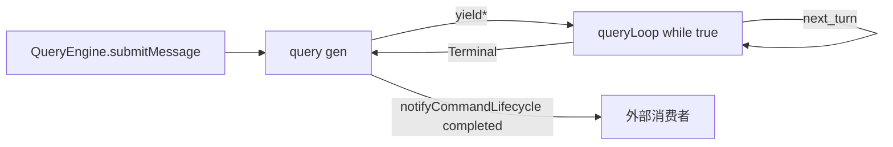
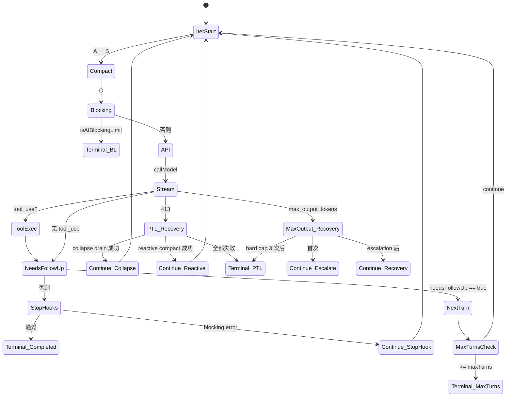

# 06 · query.ts：Agent Loop 深读

> **锚点：** `query.ts`（~1729 行）· `query/deps.ts` · `query/config.ts` · `query/stopHooks.ts` · `query/tokenBudget.ts`  
> **前置：** [05 QueryEngine](./05-query-engine.md) · [10 压缩管道](./10-compaction-and-context.md)  
> **附录：** [A2 transitions](./appendix/A2-query-loop-transitions.md) — 全 transition 一览

---

## 1. 为什么单独讲一章

`query.ts` 是 Claude Code **最复杂的单文件**（~1729 行）。它把以下事情全装进了一个 `async function*` 的 `while (true)` 里：

1. 每轮 iteration 开头跑 **6 层压缩管道**（[10](./10-compaction-and-context.md)）
2. 调 `deps.callModel` 流式收 assistant + tool_use（[07](./07-api-and-model-stream.md)）
3. 经 `StreamingToolExecutor` 边收边跑 tool（[09](./09-tools-system.md)）
4. 处理 **3 类硬错误**（PTL / image / max_output_tokens）的多级 recovery
5. Stop hooks、token budget continuation、max turns、user abort 各自分支
6. **`State`** 在每轮迭代之间 **整体重写**（而非字段级 mutate）以让 transition 可追踪

读懂 `query.ts` ≈ 读懂 Claude Code 的内核。

---

## 2. 双层 generator：`query` 与 `queryLoop`

```219:239:/Users/zmz/Github/claude-code/src/query.ts
export async function* query(
  params: QueryParams,
): AsyncGenerator<...> {
  const consumedCommandUuids: string[] = []
  const terminal = yield* queryLoop(params, consumedCommandUuids)
  // Only reached if queryLoop returned normally. Skipped on throw (error
  // propagates through yield*) and on .return() (Return completion closes
  // both generators). This gives the same asymmetric started-without-completed
  // signal as print.ts's drainCommandQueue when the turn fails.
  for (const uuid of consumedCommandUuids) {
    notifyCommandLifecycle(uuid, 'completed')
  }
  return terminal
}
```

| 层 | 职责 | 一句话 |
|----|------|--------|
| `query()` | 外壳 / command queue lifecycle | 只在 `queryLoop` **正常 return** 时调 `notifyCommandLifecycle('completed')`；throw / abort 不调，形成「started without completed」信号 |
| `queryLoop()` | `while (true)` 本体 | 真正的 agent loop；通过 `yield*` 把所有事件透传给 `query()` 调用方 |

**设计目的：** 把 **「命令队列生命周期」** 这层 lifecycle 单独剥离出 loop 本体，让 `queryLoop` 只关心一件事——**「这一轮 iteration 该 continue 还是 return」**。



---

## 3. `State` 类型逐字段拆解

源码原文：

```204:217:/Users/zmz/Github/claude-code/src/query.ts
type State = {
  messages: Message[]
  toolUseContext: ToolUseContext
  autoCompactTracking: AutoCompactTrackingState | undefined
  maxOutputTokensRecoveryCount: number
  hasAttemptedReactiveCompact: boolean
  maxOutputTokensOverride: number | undefined
  pendingToolUseSummary: Promise<ToolUseSummaryMessage | null> | undefined
  stopHookActive: boolean | undefined
  turnCount: number
  // Why the previous iteration continued. Undefined on first iteration.
  // Lets tests assert recovery paths fired without inspecting message contents.
  transition: Continue | undefined
}
```

| 字段 | 跨 iteration 用途 | 注意 |
|------|--------------------|------|
| `messages` | 当前 turn 的完整历史 | compact 成功后会被 `postCompactMessages` 替换 |
| `toolUseContext` | 工具运行时上下文 | **唯一在 iteration 内会被重写** 的字段（`queryTracking` 累加） |
| `autoCompactTracking` | 跨 iteration 计算 autocompact 阈值 | undefined = 还没触发过 |
| `maxOutputTokensRecoveryCount` | meta-recovery 计数（hard cap = 3） | 见 `MAX_OUTPUT_TOKENS_RECOVERY_LIMIT` |
| `hasAttemptedReactiveCompact` | reactive compact 单次 shot 标记 | 失败后 yield 错误 return，不再重试 |
| `maxOutputTokensOverride` | 8k→64k 单次 escalation 后传递 | 见 transition `max_output_tokens_escalate` |
| `pendingToolUseSummary` | tool use summary 异步生成 | `Promise` 跨 iteration awaited |
| `stopHookActive` | stop hook injection 标记 | 见 transition `stop_hook_blocking` |
| `turnCount` | 当前是第几轮 | maxTurns 检查时用 |
| `transition` | **上一轮**为何 continue | undefined = 首轮；测试可不读 messages 就断言 recovery 路径 |

**关键设计：** queryLoop 内 **不直接 mutate state.xxx**，而是在 7 个 continue 点写 `state = { ... messages, ... transition: { reason: ... } }`。注释明确解释这是「state 改动更显式、可追踪」：

```265:267:/Users/zmz/Github/claude-code/src/query.ts
  // Mutable cross-iteration state. The loop body destructures this at the top
  // of each iteration so reads stay bare-name (`messages`, `toolUseContext`).
  // Continue sites write `state = { ... }` instead of 9 separate assignments.
```

而 `params` 是 **immutable**（loop 中永不重赋）——`systemPrompt`, `userContext`, `systemContext`, `canUseTool`, `fallbackModel`, `querySource`, `maxTurns`, `skipCacheWrite` 都从 params 解构后整段 loop 不变。

---

## 4. 单轮 iteration 时间线（精细版）

```text
┌─ Iteration N 开始
│
├─ A. 准备
│   ├─ destructure state → bare-name (messages, toolUseContext, ...)
│   ├─ skill prefetch start（feature gated）
│   ├─ yield { type: 'stream_request_start' }
│   ├─ queryTracking 更新 chainId/depth
│   └─ messagesForQuery = getMessagesAfterCompactBoundary(messages)
│
├─ B. 压缩管道（见 10 篇 §3 六层漏斗）
│   ├─ 1. applyToolResultBudget（L0）
│   ├─ 2. snipCompactIfNeeded（L1，feature HISTORY_SNIP）
│   ├─ 3. deps.microcompact（L2: time-based / cached MC）
│   ├─ 4. contextCollapse.applyCollapsesIfNeeded（L3，feature CONTEXT_COLLAPSE）
│   └─ 5. deps.autocompact（L4，可 yield postCompactMessages）
│
├─ C. Blocking token check（autocompact 关时兜底）
│   └─ → return { reason: 'blocking_limit' }
│
├─ D. API 调用
│   ├─ deps.callModel({ ... }) 流式
│   ├─ for await message of callModel
│   │   ├─ tool_use 块 → needsFollowUp = true
│   │   ├─ StreamingToolExecutor.addTool（feature streamingToolExecution）
│   │   ├─ stream_event 透传给 yield*
│   │   └─ assistant message append 到 state.messages
│   └─ getRemainingResults / batch runTools 收尾
│
├─ E. 错误恢复（如发生）
│   ├─ 413 prompt_too_long → contextCollapse.recoverFromOverflow → reactiveCompact → 否则 return
│   ├─ max_output_tokens → withhold → escalation 8k→64k 或 recovery message
│   └─ image_error → return { reason: 'image_error' }
│
└─ F. 终止 / 继续判定
    ├─ needsFollowUp === true → state = { ... transition: { reason: 'next_turn' } } → continue
    ├─ 无 follow-up → handleStopHooks
    │   ├─ stopHookResult.preventContinuation → return { reason: 'stop_hook_prevented' }
    │   ├─ blocking errors → continue with stop_hook_blocking
    │   └─ token budget continuation → continue
    └─ maxTurns reached → return { reason: 'max_turns', turnCount }
```

注：A→F **不是函数调用层级**，是 iteration 内逻辑阶段。源码里这些阶段交错在 ~1400 行 `while (true)` 内。

---

## 5. 完整 transition 表（13 个 reason）

下表覆盖 `query.ts` 全部 `return { reason }` 与 `transition: { reason }`，每行带源码锚点：

### Terminal（return → loop 退出）

| reason | 触发条件 | 源码 | 关键副作用 |
|--------|----------|------|-----------|
| `blocking_limit` | autocompact 关且 token 超 blocking 阈值 | `query.ts:646` | 合成 PTL 错误 yield 出去 |
| `image_error` | image 解析 / 大小验证失败 | `query.ts:977` | `ImageSizeError` / `ImageResizeError` |
| `model_error` | API 不可恢复错误（非 PTL / max_output） | `query.ts:996` | `logAntError` |
| `aborted_streaming` | 流式中 AbortSignal | `query.ts:1051` | — |
| `prompt_too_long` | reactive compact 失败 / 不可用 | `query.ts:1182` | **故意不跑 stop hooks**（[stopHooks 注释](file:///Users/zmz/Github/claude-code/src/query.ts#L1168)） |
| `completed` | 无 follow-up + stop hooks 通过 | `query.ts:1264,1357` | 正常结束 |
| `stop_hook_prevented` | stop hook 显式禁止继续 | `query.ts:1279` | — |
| `aborted_tools` | tool 执行中 AbortSignal | `query.ts:1515` | — |
| `max_turns` | turnCount >= maxTurns | `query.ts:1711` | 携带 `turnCount` |

### Continue（state.transition → 同 turn 下一 iteration）

| reason | 触发条件 | 源码 | 备注 |
|--------|----------|------|------|
| `collapse_drain_retry` | 413 后 context collapse 成功 drain | `query.ts:1110` | 携带 `committed` |
| `reactive_compact_retry` | reactive compact 摘要成功 | `query.ts:1162` | 单次 shot；`hasAttemptedReactiveCompact = true` |
| `max_output_tokens_escalate` | max_output_tokens 错误 → 8k→64k | `query.ts:1217` | 单次升级 |
| `max_output_tokens_recovery` | escalation 后仍失败 → meta recovery message | `query.ts:1246` | hard cap 3 次 |
| `stop_hook_blocking` | stop hook 注入 blocking message | `query.ts:1302` | `stopHookActive = true` |
| `token_budget_continuation` | TOKEN_BUDGET feature 自动续 | `query.ts:1338` | 见 [27](./27-multi-model-thinking-and-fallback.md) |
| `next_turn` | 正常 tool follow-up | `query.ts:1725` | 最常见 |

**完整表带源码引用在 [A2 附录](./appendix/A2-query-loop-transitions.md)。**

---

## 6. Loop 继续 vs 结束的判断逻辑



**关键：** `needsFollowUp` 由 **「流中是否出现 tool_use block」** 决定，**不依赖** `stop_reason === 'tool_use'`：

```text
注释（多处）：stop_reason 在 streaming 下不可靠；
以 StreamingToolExecutor.hasToolUses() 为准。
```

---

## 7. Deps 注入：可测试性设计

```21:31:/Users/zmz/Github/claude-code/src/query/deps.ts
export type QueryDeps = {
  // -- model
  callModel: typeof queryModelWithStreaming

  // -- compaction
  microcompact: typeof microcompactMessages
  autocompact: typeof autoCompactIfNeeded

  // -- platform
  uuid: () => string
}
```

设计动机（源码原注释）：

```7:20:/Users/zmz/Github/claude-code/src/query/deps.ts
// I/O dependencies for query(). Passing a `deps` override into QueryParams
// lets tests inject fakes directly instead of spyOn-per-module — the most
// common mocks (callModel, autocompact) are each spied in 6-8 test files
// today with module-import-and-spy boilerplate.
//
// Using `typeof fn` keeps signatures in sync with the real implementations
// automatically.
//
// Scope is intentionally narrow (4 deps) to prove the pattern. Followup
// PRs can add runTools, handleStopHooks, logEvent, queue ops, etc.
```

**关键点：**

1. **只注入 4 个 dep**（callModel + microcompact + autocompact + uuid），不是全 IO 抽象——「prove the pattern」
2. `typeof fn` 保签名同步——重构原函数时 dep 类型自动跟
3. 测试可不 mock 整个 1700 行模块；spy 个别 dep 即可
4. **未来扩展点**：注释明确列出可能再加的 deps（runTools / handleStopHooks / logEvent / queue ops）

**测试模式：**

```typescript
yield* query({
  ...params,
  deps: {
    ...productionDeps(),
    callModel: mockCallModel,
  },
})
```

---

## 8. QueryConfig：每 turn 快照

```typescript
// query/config.ts:15
export type QueryConfig = {
  sessionId: SessionId
  // Runtime gates (env/statsig). NOT feature() gates — those gates are
  // checked inline (require()) and not snapshot.
  gates: { ... }
}
```

`buildQueryConfig()` 在 `queryLoop` 进入时调一次，把 env / statsig / session 等 **immutable 运行时状态** 快照下来。

**为什么 feature() gates 不进 snapshot？** 因为它们是 bundle-time 决定的——`feature('REACTIVE_COMPACT')` 在 `require('./services/compact/reactiveCompact.js')` 之外不需要再判，已经 DCE 掉了。

---

## 9. 与 QueryEngine 的边界

| 层 | 持有 messages | 调用关系 |
|----|---------------|----------|
| **QueryEngine** | `mutableMessages`（跨 turn 持久） | 每 user turn 一次 `query()` |
| **queryLoop** | `state.messages`（单 turn 多 iteration） | `while (true)` 内 multi-iteration |

Compact 成功后 `state.messages = postCompactMessages`，**同一 turn 内** 继续 API 调用（不退出 loop）；turn 结束时 queryLoop return，QueryEngine 把 `state.messages` 同步回 `mutableMessages`。

详见 [05 §5](./05-query-engine.md#5-与-message-持久化) 与 [08](./08-message-and-session-persistence.md)。

---

## 10. 常见误解 / Gotchas

### 10.1 `stop_reason` 不可信

❌ **错：** 看 API 返回的 `stop_reason === 'tool_use'` 来决定是否继续 loop  
✅ **对：** 看 `needsFollowUp`，由 **流中实际出现的 tool_use blocks** 决定  
**为何：** streaming 模式下 stop_reason 在 stream 末尾才到，且部分 model 路径会给出非预期值。源码多处注释强调这一点。

### 10.2 PTL 不跑 stop hooks

```1168:1175:/Users/zmz/Github/claude-code/src/query.ts
        // No recovery — surface the withheld error and exit. Do NOT fall
        // through to stop hooks: the model never produced a valid response,
        // so hooks have nothing meaningful to evaluate.
```

**为什么：** stop hook 可能 inject blocking message 让 loop continue。如果 PTL 本来就是因为 token 太多，hook 再加 token 会形成 **death spiral**。直接 yield 错误 return。

### 10.3 reactive compact 是单次 shot

`hasAttemptedReactiveCompact` 跨 iteration 累积；一次 turn 内只尝试 **一次**。设计假设：摘要后仍 PTL 大概率是更深层问题，重试无意义。

### 10.4 「proactive」和「reactive」compact 不冲突

- **proactive**（autocompact / collapse / snip）：API 调用 **前**，按 token 估算
- **reactive**（reactiveCompact）：API 调用 **后** 因 413 等错误触发

它们 **互补**——proactive 看估算（可能错），reactive 看真实 API 拒绝（地面真相）。详见 [10 §9](./10-compaction-and-context.md#9-l5-reactive-compact)。

### 10.5 cached MC 不影响 messages 本地视图

L2b（cached microcompact）改的是 API KV cache，**不动 `state.messages`**。所以即使 cached MC 触发，REPL UI 显示的历史 **不变**。boundary message 在 API 返回后才 yield，由 `usage.cache_deleted_input_tokens` 触发。详见 [10 §6.4](./10-compaction-and-context.md#64-cached-microcompactcached_microcompact)。

---

## 11. 关联文件清单

| 文件 | 作用 |
|------|------|
| `query.ts` | 主 loop |
| `query/deps.ts` | callModel/microcompact/autocompact 注入 |
| `query/config.ts` | turn 启动时的 immutable 快照 |
| `query/stopHooks.ts` | `handleStopHooks` + `saveCacheSafeParams` |
| `query/tokenBudget.ts` | TOKEN_BUDGET 自动续轮 |
| `query/transitions.ts`（pin 本地未见） | Continue / Terminal 类型；行为可从 `query.ts:reason` 反推 |

---

## 12. 自测

- [ ] 画出 iteration A→F 全流程
- [ ] 列举 ≥3 个 Terminal reason 与 ≥3 个 Continue reason，说明触发条件
- [ ] 为何 PTL 错误后 **不能** fall through 到 stop hooks？
- [ ] `params` 与 `state` 分离的设计动机是什么？
- [ ] `deps` 为何单独一个文件，且只暴露 4 个？
- [ ] cached MC 触发后 `state.messages` 会变吗？API 视图呢？
- [ ] `stop_reason === 'tool_use'` 为何不可靠？
- [ ] `hasAttemptedReactiveCompact` 为何要跨 iteration？

**关联：** [A2](./appendix/A2-query-loop-transitions.md) · [28 Loop 续跑与人机门控](./28-agent-loop-continuation-and-human-gates.md) · [07](./07-api-and-model-stream.md) · [09](./09-tools-system.md) · [10](./10-compaction-and-context.md) · [26 总图](./26-main-chain-atlas.md)
