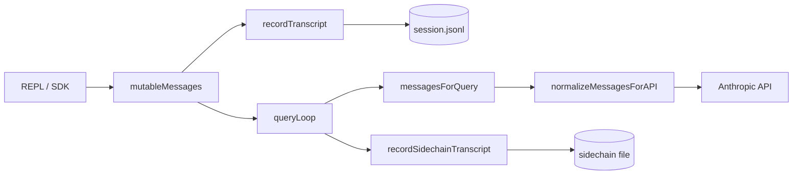

# 08 · Message 模型与 Session 持久化

> **锚点：** `types/message.js` · `utils/sessionStorage.ts` · `utils/conversationRecovery.ts` · `services/api/messageNormalization.ts`

---

## 1. 为什么单独一篇

Message 与存储 **不能** 埋在 query 笔记里：

- Loop 操作 **内存 `Message[]`**
- 磁盘是 **JSONL / insertMessageChain** 增量链
- 送 API 的是 **normalize 后** 的视图
- Resume / compact boundary / sidechain 规则 **各不相同**

---

## 2. Message 类型族

源码 `types/message.js`（`Tool.ts`、`query.ts` 广泛 import）：

| type | 用途 | 进 API？ | 持久化？ |
|------|------|---------|---------|
| `user` | 用户输入、tool_result | ✅ | ✅ |
| `assistant` | 模型输出 text/tool_use | ✅ | ✅ |
| `system` | compact_boundary、local_command | 部分 | ✅ |
| `attachment` | skill 发现、元数据 | 视规则 | ✅ |
| `progress` | 工具进度 | ❌ | 可选 |
| `tombstone` | 孤儿消息删除标记 | ❌ | ✅ |

**SDK 映射：** `QueryEngine.submitMessage` → 内部 Message → `SDKMessage`（stream-json）[19]。

---

## 3. 三层 Message 视图

```text
QueryEngine.mutableMessages     ← 会话级，UI/REPL 完整历史
queryLoop state.messages        ← 单 turn loop 迭代（含 compact 替换）
messagesForQuery                ← 送 API 前视图（prepend userContext 等）
normalizeMessagesForAPI(...)    ← API  wire format（tool pairing 等）
```

**原则：**

- REPL 可保留 compact **前** 细粒度（collapse/snip feature）
- API 只见 compact **后** 摘要 + 边界
- 三层可能 **长度不一致** — debug 时勿混用

---

## 4. API 归一化

`services/api/messageNormalization.ts` `normalizeMessagesForAPI`：

- 过滤非 API 类型（progress 等）
- **tool_use / tool_result 配对** —  orphan 块修复或剔除
- Tool search 相关：与 `isToolSearchEnabled` 协作处理 deferred tool references
- assistant 块格式统一（thinking blocks 等）

`claude.ts` 在 normalize 之后还可能：

- 注入 tool search 过滤
- `addCacheBreakpoints` — cache_control + cache_edits [07][10]

---

## 5. `recordTranscript`：增量写入

```1408:1448:/Users/zmz/Github/claude-code/src/utils/sessionStorage.ts
export async function recordTranscript(
  messages: Message[],
  teamInfo?: TeamInfo,
  startingParentUuidHint?: UUID,
  allMessages?: readonly Message[],
): Promise<UUID | null> {
  const cleanedMessages = cleanMessagesForLogging(messages, allMessages)
  ...
  for (const m of cleanedMessages) {
    if (messageSet.has(m.uuid as UUID)) {
      // prefix 追踪 parent，compact 后非 prefix 则跳过
    } else {
      newMessages.push(m)
    }
  }
  if (newMessages.length > 0) {
    await getProject().insertMessageChain(newMessages, false, ...)
  }
}
```

**关键点：**

- **去重：** 已写入 uuid 跳过
- **Parent 链：** compact 时新 summary 在前 → 旧消息非 prefix → **截断 --continue 链**（注释 1400–1407）
- **Chain participant：** progress 等不参与 chaining
- **TeamInfo：** swarm session 附加元数据 [21]

QueryEngine 在 turn 中 **多次** `recordTranscript`（流式增量、turn 结束、错误路径）。

---

## 6. Sidechain（子 Agent）

```typescript
recordSidechainTranscript(messages, agentId?, startingParentUuid?)
```

| 维度 | 主 thread | sidechain |
|------|-----------|-----------|
| 文件 | session JSONL | agent 专用 sidechain 文件 |
| Resume | `--continue` | `restoreAgentFromSession` [20] |
| UI | 主消息列表 | 可选折叠/不展示 |

`AgentTool` fork 完成后 tool_result 回 **父 messages**，sidechain 仅审计/恢复用。

---

## 7. Resume 与恢复

| API | 场景 |
|-----|------|
| `loadConversationForResume` | `--continue`、resume picker、`--from-pr` |
| `loadInitialMessages` | print headless 启动 |
| `useLogMessages` | REPL 增量 sync |

**Session 文件：** `~/.claude/projects/<sanitized-cwd>/<sessionId>.jsonl`（路径逻辑见 `sessionStorage.ts`）。

**Turn 中断：** print 维护 `TurnInterruptionState` + orphan permission [19]。

**Coordinator mode resume：** `matchSessionMode` 翻转 env [21]。

---

## 8. Compact 与 Message 边界

Compact 成功 yield：

- `compact_boundary` system message（含 metadata）
- summary user/assistant
- hook 结果 attachment

`messagesForQuery` → `postCompactMessages`；`taskBudgetRemaining` 跨 compact 累积 [07]。

`cleanMessagesForLogging` — 写盘前脱敏/裁剪（PII、过大 attachment）。

---

## 9. File history 与 rewind

启用 file history 时，QueryEngine 对 selectable user messages 调用 `fileHistoryMakeSnapshot`。

`--rewind-files <user-message-uuid>`（print）按 snapshot 恢复工作区并 exit。

与 Message uuid **绑定** — 需 stable user message id。

---

## 10. Remote / CCR 差异

- Transcript 路径可能 redirect 到 remote 挂载
- Memory 无 `CLAUDE_CODE_REMOTE_MEMORY_DIR` 时不写 auto-memory [22][29]
- stream-json 消费者需处理 **partial** vs **complete** message 事件 [19]

---

## 11. 数据流总图



---

## 12. 自测

- [ ] 三层 Message 视图各是什么？为何长度可不同？
- [ ] compact 后 parent 链为何「截断」？
- [ ] normalize 解决哪些 tool pairing 问题？
- [ ] 主 thread 与 sidechain 如何区分与 resume？
- [ ] SDK stream-json 在哪一层从 Message 变成 SDKMessage？

**关联：** [05 QueryEngine](./05-query-engine.md) · [07 API 归一化](./07-api-and-model-stream.md) · [19 SDK/print](./19-sdk-headless-and-print-mode.md) · [10 Compact](./10-compaction-and-context.md)
