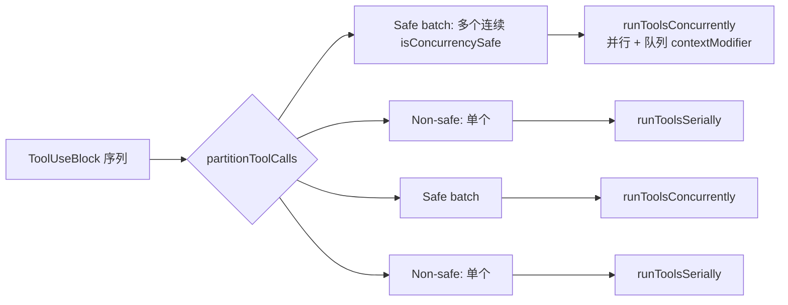
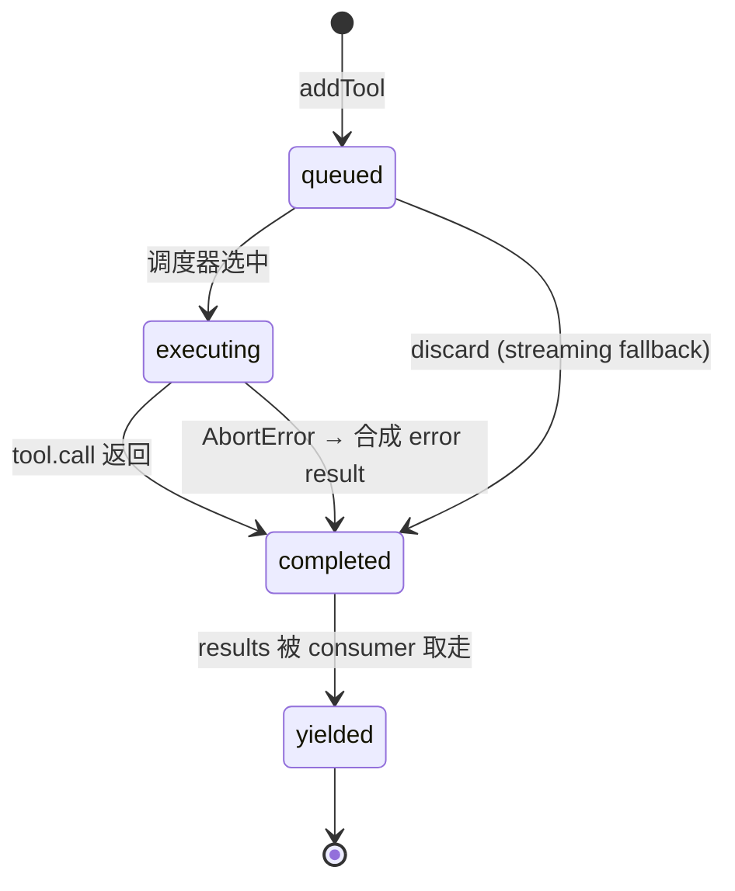
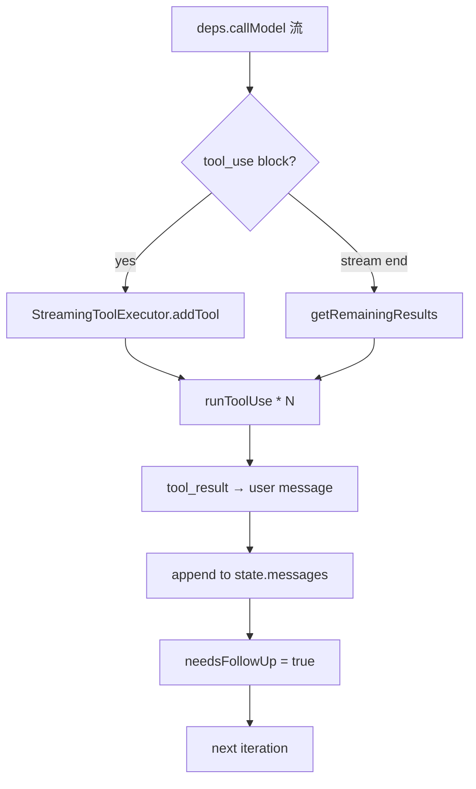

# 09 · Tool 系统与执行

> **锚点：** `Tool.ts`（~693 行）· `tools.ts` · `tools/*` · `services/tools/*`（4 文件）  
> **前置：** [06 query loop](./06-query-agent-loop.md) · [11 permission/hooks](./11-permission-and-hooks.md)

---

## 1. 四层结构

```text
src/
├── Tool.ts                         — 类型 + ToolUseContext + buildTool / TOOL_DEFAULTS
├── tools.ts                        — 注册表：getTools / assembleToolPool / filterToolsByDenyRules
├── tools/                          — ~42 个工具实现（每个一目录：ToolName/）
└── services/tools/                 — 执行引擎（4 文件）
    ├── StreamingToolExecutor.ts    — 边收边跑（streaming）
    ├── toolOrchestration.ts        — runTools / partitionToolCalls（batch）
    ├── toolExecution.ts            — runToolUse 单工具执行（~1700 行）
    └── toolHooks.ts                — 工具级 hook 注入
```

| 层 | 回答的问题 | 文件数 |
|----|------------|--------|
| **类型** | 一个 tool 长什么样？context 是什么？ | 1 |
| **注册** | 哪些 tool 在这个 turn 可用？怎么排序？ | 1 (`tools.ts`) |
| **实现** | 具体每个 tool 怎么读 / 写 / 跑？ | ~42 目录 |
| **执行** | 流来时怎么调 tool、怎么并发、怎么收结果？ | 4 |

---

## 2. `Tool` 接口（`Tool.ts:362`）

源码片段（节选关键字段）：

```362:446:/Users/zmz/Github/claude-code/src/Tool.ts
export type Tool<
  Input extends AnyObject = AnyObject,
  Output = unknown,
  P extends ToolProgressData = ToolProgressData,
> = {
  aliases?: string[]
  searchHint?: string                            // ToolSearch 用的一句话能力描述
  call(args, context, canUseTool, parentMessage, onProgress?): Promise<ToolResult<Output>>
  description(input, options): Promise<string>   // 给模型看的（动态）
  readonly inputSchema: Input                    // Zod schema
  readonly inputJSONSchema?: ToolInputJSONSchema // MCP 用 JSON Schema
  outputSchema?: z.ZodType<unknown>
  inputsEquivalent?(a, b): boolean
  isConcurrencySafe(input): boolean
  isEnabled(): boolean
  isReadOnly(input): boolean
  isDestructive?(input): boolean
  interruptBehavior?(): 'cancel' | 'block'       // user 新输入到来时
  isSearchOrReadCommand?(input): { isSearch, isRead, isList? }
  isOpenWorld?(input): boolean
  requiresUserInteraction?(): boolean
  isMcp?: boolean
  isLsp?: boolean
  readonly shouldDefer?: boolean                 // 配合 ToolSearch 延迟加载
}
```

### 2.1 字段分组

| 组 | 字段 | 用途 |
|----|------|------|
| **身份** | `name`, `description`, `aliases`, `searchHint` | 模型识别、向后兼容、ToolSearch 关键字匹配 |
| **schema** | `inputSchema`, `inputJSONSchema`, `outputSchema` | Zod / MCP 双轨；模型见到的 schema |
| **行为元数据** | `isConcurrencySafe`, `isReadOnly`, `isDestructive`, `isOpenWorld`, `isEnabled` | 调度器读这些字段决定并发 / 权限策略 |
| **UX** | `interruptBehavior`, `isSearchOrReadCommand`, `requiresUserInteraction` | UI 折叠、用户打断处理 |
| **延迟** | `shouldDefer` | `defer_loading: true` + ToolSearch 才能调用 |
| **协议** | `isMcp`, `isLsp` | 调度器分流（MCP 独立 client；LSP 有 `shouldDeferLspTool`）|
| **执行** | `call(args, context, canUseTool, parentMessage, onProgress)` | 真正的入口 |

### 2.2 `buildTool` 与 fail-closed 默认值

```757:768:/Users/zmz/Github/claude-code/src/Tool.ts
const TOOL_DEFAULTS = {
  isEnabled: () => true,
  isConcurrencySafe: (_input?: unknown) => false,    // 假设不安全
  isReadOnly: (_input?: unknown) => false,           // 假设有写
  isDestructive: (_input?: unknown) => false,
  checkPermissions: ... { behavior: 'allow', updatedInput },
  toAutoClassifierInput: (_input?: unknown) => '',
  userFacingName: (_input?: unknown) => '',
}
```

**关键设计：** 默认值 **fail-closed where it matters**——`isConcurrencySafe` / `isReadOnly` 都默认 false（即视作「会写、不安全」）。这意味着：

- 新加 tool 忘了实现 `isConcurrencySafe` → 自动按 **串行执行** 处理
- 忘了实现 `isReadOnly` → 自动按 **可能写** 处理
- 永远不会因「漏配置」让一个写工具被错误并发

只有 `checkPermissions` 默认 allow（因为是「defer 到 general permission system」），不是「绕过权限」。

---

## 3. `ToolUseContext`：所有工具共享的运行时

```158:300:/Users/zmz/Github/claude-code/src/Tool.ts
export type ToolUseContext = {
  options: {
    commands, debug, mainLoopModel, tools, verbose,
    thinkingConfig, mcpClients, mcpResources,
    isNonInteractiveSession, agentDefinitions,
    maxBudgetUsd?, customSystemPrompt?, appendSystemPrompt?,
    querySource?, refreshTools?
  }
  abortController: AbortController
  readFileState: FileStateCache
  getAppState(): AppState
  setAppState(f: (prev: AppState) => AppState): void
  setAppStateForTasks?  // session-scoped, even for async subagents
  handleElicitation?    // print/SDK 模式下 MCP elicitation
  setToolJSX?, addNotification?, appendSystemMessage?
  sendOSNotification?
  loadedNestedMemoryPaths?    // dedup CLAUDE.md 注入
  dynamicSkillDirTriggers?    // skill watch
  discoveredSkillNames?       // telemetry
  setInProgressToolUseIDs, setHasInterruptibleToolInProgress?
  agentId?, agentType?
  messages: Message[]
  fileReadingLimits?, globLimits?
  toolDecisions?              // 权限决策追踪
  queryTracking?              // chainId + depth
  contentReplacementState?    // L0 tool result budget 跨 turn 累积
  renderedSystemPrompt?       // fork 共享 parent cache
  ...
}
```

**核心要点：** 所有 tool 共享 **同一个 `ToolUseContext` 实例**。这让多个 tool 能够：

1. **共享 file cache**（`readFileState`）——Read 工具读过的 hash，Edit 工具 verify 时复用
2. **传递 AppState 变更**（`setAppState`）——某个 tool 改了 mode（如 EnterPlanMode），后续 tool 立即看见
3. **共享 abort signal**（`abortController`）——一次取消波及所有正在跑的 tool
4. **追踪 skill / memory injection** dedup state

每轮 iteration 开头 `query.ts` 会 **重写** `toolUseContext.queryTracking`，但其它字段保持。

---

## 4. 注册与合并（`tools.ts`）

```text
getTools(permissionContext)
  ├─ 内置 tools (~42)
  │   └─ 按 feature flag 条件加载（Sleep / Cron / Team / Boulder…）
  ├─ filterToolsByDenyRules → 剔除被 deny 的（registry 级，模型看不到）
  └─ MCP tools 从 AppState.mcp.tools 注入

assembleToolPool(permissionContext, mcpTools)
  ├─ getTools(...)
  └─ uniqBy([...builtIn.sort(byName), ...mcp.sort(byName)], 'name')
       ^^^^^^^^^^^^^^^^^^^^^^^^^^^^^^^^^^^^^^^^^^^^^^^^^^^^
       built-in 与 MCP 分区排序，保证 built-in 始终前缀
```

### 4.1 工具池排序：prompt cache 稳定性

```354:365:/Users/zmz/Github/claude-code/src/tools.ts
  // Sort each partition for prompt-cache stability, keeping built-ins as a
  // contiguous prefix. The server's claude_code_system_cache_policy places a
  // global cache breakpoint after the last prefix-matched built-in tool; a flat
  // sort would interleave MCP tools into built-ins and invalidate all downstream
  // cache keys whenever an MCP tool sorts between existing built-ins.
```

→ **built-in 与 MCP 分区排序，built-in 始终是前缀**——MCP 晚连接时 **只追加后缀**，避免中间插入导致 50k+ token 的 system+tools prefix 全部 cache miss。这是 [10 §10.4](./10-compaction-and-context.md#104-tool-池排序cache-稳定性) 讲过的关键 invariant。

### 4.2 deferred tools

`shouldDefer: true` 的 tool（如 ToolSearch 自身 + 部分 LSP / 服务端 tool）会带 `defer_loading: true` 发给 API；模型需先调 `ToolSearch` 才能调用它们。详见 [16 LSP](./16-lsp-and-code-intelligence.md)、[30 Tool Search 深读](./30-advanced-features-and-experiments.md#2-tool-search-与-defer_loading)。

---

## 5. 执行引擎：streaming vs batch 双轨

### 5.1 选型

```text
if (config.gates.streamingToolExecution) {
  → new StreamingToolExecutor(tools, canUseTool, ctx)
  → for await message of callModel:
      if (tool_use) executor.addTool(block, assistantMsg)
  → executor.getRemainingResults()
} else {
  → 流结束后 batch runTools(toolUseBlocks, assistantMessages, canUseTool, ctx)
}
```

**streaming 路径**：tool 在流过程中边到达边启动，能与剩余流式 token 重叠；典型场景是模型 yield 一组并发安全的 Read，无需等模型说完才开始。

**batch 路径**：流完整接完，然后一把 `runTools`；逻辑更直观但有时延。

### 5.2 `runTools` / `partitionToolCalls`

```86:90:/Users/zmz/Github/claude-code/src/services/tools/toolOrchestration.ts
/**
 * Partition tool calls into batches where each batch is either:
 * 1. A single non-read-only tool, or
 * 2. Multiple consecutive read-only tools
 */
```



**并发上限：** `CLAUDE_CODE_MAX_TOOL_USE_CONCURRENCY` 环境变量，默认 **10**。

**context modifier 队列化：** concurrent-safe batch 内若 tool 想改 context，会先入队、batch 跑完后串行应用——避免并发 mutation。

---

## 6. `StreamingToolExecutor` 状态机

```19:32:/Users/zmz/Github/claude-code/src/services/tools/StreamingToolExecutor.ts
type ToolStatus = 'queued' | 'executing' | 'completed' | 'yielded'

type TrackedTool = {
  id: string
  block: ToolUseBlock
  assistantMessage: AssistantMessage
  status: ToolStatus
  isConcurrencySafe: boolean
  promise?: Promise<void>
  results?: Message[]
  pendingProgress: Message[]
  contextModifiers?: Array<(context: ToolUseContext) => ToolUseContext>
}
```



**关键不变量：**

1. **结果有序**：tool 按 `addTool` 顺序累积；只有「按到达顺序」的结果才被 yield，缓冲乱序完成的
2. **non-safe 独占**：non-concurrency-safe 一旦 executing，新 queued tool 一律等待
3. **safe 可并发**：多个 safe tool 可同时 executing，受 `MAX_TOOL_USE_CONCURRENCY` 限制
4. **sibling abort**：Bash 等失败时通过 `siblingAbortController` 杀掉同批次其它子进程；**不**触发 parent abort（query.ts 不会中止 turn）
5. **discard**：streaming fallback 时整个 executor 作废，in-flight tool 收到合成 error result

---

## 7. `runToolUse` 单工具路径

`services/tools/toolExecution.ts` 约 1700 行，处理 **一个** tool_use_id 的完整生命周期。概念顺序：

```text
runToolUse(toolUse, assistantMessage, ctx, canUseTool)
  │
  ├─ 1. findToolByName(tools, toolUse.name)
  │     └─ 未找到 → 合成 "No such tool available" error
  │
  ├─ 2. Zod parse input
  │     └─ 失败 → 合成 validation error；feed back 给模型
  │
  ├─ 3. canUseTool(tool, input, ctx, ...)
  │     └─ deny → 合成 deny error
  │     └─ ask → 交互式提示（REPL）或 MCP elicitation（headless）
  │     └─ allow → 继续
  │
  ├─ 4. PreToolUse hooks（utils/hooks/）
  │     └─ blocking error → 中止，合成 error
  │
  ├─ 5. Bash 特例：startSpeculativeClassifierCheck（提前跑分类器）
  │
  ├─ 6. tool.call(input, ctx, canUseTool, parentMessage, onProgress)
  │     ├─ async generator: 可 yield ProgressMessage 给 UI
  │     ├─ 受 ctx.abortController 控制
  │     └─ 返回 ToolResult<Output>
  │
  ├─ 7. 结果规范化 → UserMessage with tool_result block
  │     └─ 大体积结果走 L0 tool result budget（见 10 §4）
  │
  ├─ 8. PostToolUse / PermissionDenied hooks
  │
  └─ 9. Telemetry（OTel span、analytics event、code edit attribution、git commit tracking）
```

**特例：**

- **Bash**：`bashPermissions.ts` 命令级 allowlist + speculative classifier；`SHELL_TOOL_NAMES` 等同对待 PowerShell
- **FileEdit / FileWrite**：`prometheus-md-only` 等 hook 可能限制路径
- **AgentTool**：spawn 子 loop（fork）；详见 [20](./20-agents-and-subagents.md)
- **MCPTool**：调 `mcp.tools` 里对应 server；包装 `cache_reference`（[14](./14-mcp-and-external-protocols.md)）

详见 [11 permission](./11-permission-and-hooks.md) 与 `services/tools/toolExecution.ts`。

---

## 8. 工具目录概览（~42 个）

| 类别 | 工具 |
|------|------|
| **文件** | FileRead, FileWrite, FileEdit, NotebookEdit |
| **搜索** | Grep, Glob, ToolSearch（deferred） |
| **执行** | Bash, PowerShell, InteractiveBash |
| **网络** | WebFetch, WebSearch |
| **Agent** | AgentTool, Task*, Team*, SendMessage |
| **模式** | EnterPlanMode, ExitPlanMode, EnterWorktree |
| **扩展** | MCPTool, SkillTool, LSPTool, ToolSearchTool |
| **元** | AskUserQuestion, TodoWrite, Config, Sleep, Cron, McpAuth |

每个工具独立目录：

```text
tools/FileReadTool/
├── FileReadTool.ts          # 主体
├── constants.ts
├── prompt.ts                # description 模板
└── (utils/components 子目录)
```

工具发现策略：`tools.ts` 静态 import + feature gate 决定哪些进入 pool。

---

## 9. 与 query loop 的衔接



详见 [06 §4](./06-query-agent-loop.md#4-单轮-iteration-时间线精细版)。

**Tool result 体积治理：** [10 §4 L0 tool result budget](./10-compaction-and-context.md#4-l0tool-result-budgetapplytoolresultbudget)。

---

## 10. 常见误解 / Gotchas

### 10.1 `isConcurrencySafe` 不是 read-only

`isReadOnly` 和 `isConcurrencySafe` 是 **两个独立判断**——某些只读 tool 也可能不安全并发（如它内部维护全局缓存）。源码默认值 **都是 false**（fail-closed）。

### 10.2 streaming 与 batch 不能混用

`config.gates.streamingToolExecution` 是 per-turn 决策。**同一 turn 内不会切换路径**，因此 mixed 状态不会出现。

### 10.3 MCP tool 进入 tool 池的时机

MCP 不是 `tools/MCPTool/` 静态注册的——它从 `AppState.mcp.tools` 动态注入。新 MCP server 连上后 **`refreshTools()`** 才会反映到下一个 turn 的 tool 池。这就是为什么 `claude.ts` 要传 `hasPendingMcpServers` 给 API 层。详见 [14 §3](./14-mcp-and-external-protocols.md#3-与-appstate-的集成)。

### 10.4 deferred tool 不会出现在初始 schema

`shouldDefer: true` 的 tool 在 API 请求里带 `defer_loading: true` 标记，模型 **必须先调 ToolSearch** 才能调用。原因：reducing tool schema 体积、保 system+tools prefix cache 稳定。

### 10.5 sibling abort 不等于 turn abort

Bash 出错时只是杀 **同 batch** 其它子进程，不会让 `query.ts` 退出 turn。这跟用户主动 `Esc` / `ctrl-C` 触发的 `toolUseContext.abortController` 是 **两个独立的 controller**。

---

## 11. 自测

- [ ] 四层结构各回答什么问题？
- [ ] streaming vs batch 的选型 gate 是哪个？为何不能混用？
- [ ] MCP tool 从哪进入 tool 池？late connect 怎么处理？
- [ ] `isConcurrencySafe` 默认值为什么是 false？
- [ ] `partitionToolCalls` 把 tool 分成几类批次？concurrent-safe 怎么并发？
- [ ] `TrackedTool` 四种 status 的转换？yielded 阶段做什么？
- [ ] sibling abort 杀谁？user abort 杀谁？
- [ ] deferred tool 怎么被模型「发现」？
- [ ] built-in vs MCP 排序为何分区？

**关联：** [11 Permission](./11-permission-and-hooks.md) · [14 MCP](./14-mcp-and-external-protocols.md) · [10 §10.4 tool 池排序](./10-compaction-and-context.md#104-tool-池排序cache-稳定性) · [16 LSP](./16-lsp-and-code-intelligence.md) · [flow/tool 执行](./flow/README.md#tool-执行)
