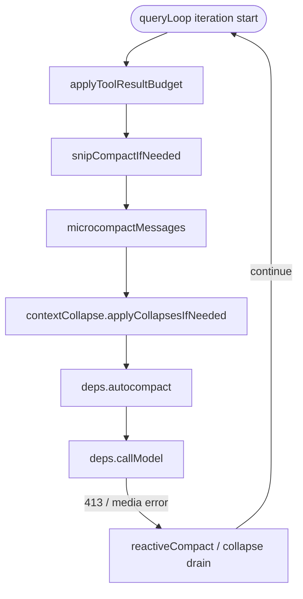

# 10 · 渐进式压缩与 Prompt Cache

> **锚点：** `query.ts`（queryLoop 开头）· `services/compact/*` · `services/api/claude.ts` · `utils/forkedAgent.ts`  
> **基准：** v2.1.88 · pin `936e6c8`  
> **前置：** [26 主链路总图](./26-main-chain-atlas.md) · [08 Message/session](./08-message-and-session-persistence.md)

---

## 1. 为什么要单独讲这一章

Claude Code 的上下文管理 **不是** 一个 `/compact` 命令那么简单。它在 **每一轮 `queryLoop` 迭代的最前面**，按固定顺序跑一条 **渐进式压缩管道（progressive compaction pipeline）**：

- **目标 A：** 把即将发给 API 的 `messagesForQuery` 压进 model context window  
- **目标 B：** 在 Anthropic **prefix prompt cache（KV cache）** 约束下做上述压缩——前缀必须 byte-identical 才能 hit cache；很多「看起来过度工程化」的设计，实际上是在 **省 cache 重写成本**

这两目标 **经常冲突**：删掉 tool result 能省 token，但改 message 内容也可能让 cache 失效；因此才有 **cached microcompact（cache_edits）**、**CacheSafeParams**、**tool 排序稳定性** 等机制。

本章基于源码把 **管道每一层** 与 **cache 如何配合** 讲透。未 pin 的 feature 分支在暴露快照里可能以 `require()` / `feature()` 形式存在，但发行包可能 DCE 掉——读代码时注意 `bun:bundle` 门控。

---

## 2. 在 queryLoop 中的位置

压缩 **只作用于** 即将进入 `deps.callModel` 的视图 `messagesForQuery`，不等于 REPL 里用户看到的完整历史（见 §9）。



对应 `query.ts` 大致行号：

| 顺序 | 步骤 | 行号（约） |
|------|------|------------|
| 0 | `getMessagesAfterCompactBoundary` | 365 |
| 1 | `applyToolResultBudget` | 379–394 |
| 2 | `snipCompactIfNeeded` | 401–409 |
| 3 | `deps.microcompact` | 412–426 |
| 4 | `contextCollapse.applyCollapsesIfNeeded` | 440–447 |
| 5 | `deps.autocompact` | 453–543 |
| 6 | token blocking check | 628–647 |
| 7 | `deps.callModel` | 652+ |
| 8 | API 失败后 reactive / collapse drain | 1062–1183 |

**关键 invariant：** `callModel` **永远在** 上述压缩链（除 reactive 恢复外）**之后**。注释多处强调：proactive compact 与 reactive compact 分工不同——前者在请求前减体积，后者在 API 返回 413 等错误后补救。

---

## 3. 渐进式压缩：六层模型

可以把管道理解为 **从轻到重、从「不动前缀」到「重写历史」** 的六级漏斗：

| 层级 | 名称 | 典型手段 | 是否改本地 message 正文 | 与 prompt cache 关系 |
|------|------|----------|-------------------------|----------------------|
| L0 | Tool result budget | 超大 result 替换为占位 / 落盘 | 是（或 transcript 记录 replacement） | 替换须 **deterministic**；resume 用 record 重建 state |
| L1 | Snip | 删掉极旧 message 段 | 是 | 改变 messages 前缀 → 通常 **bust cache** |
| L2a | Time-based microcompact | 空闲超时后清空旧 tool result 文本 | 是 | cache 已冷，主动 shrink 再发请求 |
| L2b | Cached microcompact | API `cache_edits` 删除 cache 内 tool result | **否**（本地 messages 不变） | **核心：** 删 KV 内内容而不改 prefix hash |
| L3 | Context collapse | 读时投影 + commit collapse | 投影视图；summary 在 collapse store | 413 前可先 drain staged collapses |
| L4 | Autocompact | LLM 摘要 + boundary + 保留 tail | 用 `postCompactMessages` **替换** API 视图 | compact agent 可 **共享** CacheSafeParams |
| L5 | Reactive compact | API 413 / media 错误后摘要 | 同 L4 | 单次 shot；与 withhold 机制配合 |

下面逐层展开。

---

## 4. L0：Tool result budget（`applyToolResultBudget`）

**文件：** `utils/toolResultStorage.ts`  
**调用：** `query.ts` 在 snip **之前**

```369:394:/Users/zmz/Github/claude-code/src/query.ts
    messagesForQuery = await applyToolResultBudget(
      messagesForQuery,
      toolUseContext.contentReplacementState,
      persistReplacements ? records => void recordContentReplacement(...) : undefined,
      new Set(
        toolUseContext.options.tools
          .filter(t => !Number.isFinite(t.maxResultSizeChars))
          .map(t => t.name),
      ),
    )
```

**做什么：**

- 对 **单条 message 内** 聚合 tool result 体积设预算（与 microcompact 正交：microcompact 按 tool_use_id 操作，budget 按 **内容大小** 操作）
- 超出则替换为短占位（如 `[Old tool result content cleared]`）或 **persist 到 session 目录**（`tool-results/`），模型可通过 Read 再取
- `ContentReplacementState` 跨 turn 累积；resume 时 `reconstructContentReplacementState` **按 transcript 记录复现相同替换**，注释写明是为了 **prompt cache stability**

**为何在 microcompact 前：**

```369:372:/Users/zmz/Github/claude-code/src/query.ts
    // Enforce per-message budget on aggregate tool result size. Runs BEFORE
    // microcompact — cached MC operates purely by tool_use_id (never inspects
    // content), so content replacement is invisible to it and the two compose
    // cleanly.
```

---

## 5. L1：Snip（`HISTORY_SNIP`）

**入口：** `query.ts` 动态 `require('./services/compact/snipCompact.js')`  
**调用：** `snipModule.snipCompactIfNeeded(messagesForQuery)`

**做什么（从 call site 与注释推断）：**

- 删除「保护尾（protected tail）」之外的旧 history，释放 token
- 返回 `tokensFreed`，供 autocompact 阈值计算 **减去**（因为 `tokenCountWithEstimation` 读的是 surviving assistant 的 usage，**看不到 snip 省下的 token**）

```396:399:/Users/zmz/Github/claude-code/src/query.ts
    // snipTokensFreed is plumbed to autocompact so its threshold check reflects
    // what snip removed; tokenCountWithEstimation alone can't see it
```

若产生 boundary，会 `yield snipResult.boundaryMessage` 给 UI/SDK。

**与 cache：** snip **改 message 数组**，属于「硬」变更，通常导致 prefix cache miss；因此在 **cache 仍热** 时优先走 cached MC，而非 snip。

---

## 6. L2：Microcompact（`microcompactMessages`）

**文件：** `services/compact/microCompact.ts`  
**注入：** `query/deps.ts` → `productionDeps().microcompact = microcompactMessages`

### 6.1 执行顺序（函数内）

```253:292:/Users/zmz/Github/claude-code/src/services/compact/microCompact.ts
export async function microcompactMessages(...) {
  clearCompactWarningSuppression()

  // 1. Time-based 优先，触发则 short-circuit
  const timeBasedResult = maybeTimeBasedMicrocompact(messages, querySource)
  if (timeBasedResult) return timeBasedResult

  // 2. Cached MC（主线程 + 模型支持 + feature）
  if (feature('CACHED_MICROCOMPACT')) { ... return cachedMicrocompactPath(...) }

  // 3. Legacy 路径已移除；external 构建此处 no-op，靠 autocompact
  return { messages }
}
```

### 6.2 可压缩工具集合

`COMPACTABLE_TOOLS` 包含 Read、Bash、Grep、Glob、WebSearch、WebFetch、Edit、Write 等 **高体积 read/exec 类**；不在集合内的 tool result 不会被 microcompact 清掉。

### 6.3 Time-based microcompact

**配置：** `services/compact/timeBasedMCConfig.ts`（GrowthBook `tengu_slate_heron`）

**逻辑：**

- 当 **距上次 main-loop assistant 消息** 超过 `gapThresholdMinutes`（默认 60 分钟）时触发
- 理由：server-side prompt cache **几乎肯定已过期**，下一次请求会 **重写整个 prefix**——不如先把旧 tool result 文本清掉，减小 rewrite 体积
- **直接改本地 message content**（与 cached MC 相反）
- **跳过 cached MC：** 注释写明 cache 已冷，不需要 cache_edits

```261:266:/Users/zmz/Github/claude-code/src/services/compact/microCompact.ts
  // Cached MC (cache-editing) is skipped when this fires: editing assumes a
  // warm cache, and we just established it's cold.
```

### 6.4 Cached microcompact（CACHED_MICROCOMPACT）

**核心思想：** 不在客户端改 tool result 字符串，而在 API 层发 **`cache_edits`**，按 `cache_reference` 删除 **已缓存 KV 中的 tool result**，使 **prefix 的 hash 不变**。

**流程：**

1. `cachedMicrocompactPath` 注册 compactable tool_use_id，按 GrowthBook 阈值决定 delete 哪些
2. 生成 `pendingCacheEdits`，挂在 `microcompactResult.compactionInfo` 上
3. `query.ts` **不**改 `messagesForQuery`，在 `callModel` 返回后用 API usage 里的 `cache_deleted_input_tokens` yield boundary message

```866:891:/Users/zmz/Github/claude-code/src/query.ts
          if (feature('CACHED_MICROCOMPACT') && pendingCacheEdits) {
            const cumulativeDeleted = usage?.cache_deleted_input_tokens ?? 0
            const deletedTokens = Math.max(0, cumulativeDeleted - pendingCacheEdits.baselineCacheDeletedTokens)
            if (deletedTokens > 0) {
              yield createMicrocompactBoundaryMessage(...)
            }
          }
```

**API 层插入 edits：** `services/api/claude.ts` 的 `addCacheBreakpoints` 在 `useCachedMC` 为 true 时，把 `cache_edits` block 插到最后一个 user message（after tool_results），并 **pin** 先前 edits 防止重复 delete。

**主线程限制：**

```272:275:/Users/zmz/Github/claude-code/src/services/compact/microCompact.ts
  // Only run cached MC for the main thread to prevent forked agents
  // from registering their tool_results in the global cachedMCState
```

fork 的 session_memory / prompt_suggestion 等 **不能** 污染全局 `cachedMCState`。

**Cache break 检测：** 删除 cache 内 token 后，`cache_read` 下降是 **预期行为**；`notifyCacheDeletion` 告诉 `promptCacheBreakDetection` 不要误报。

### 6.5 准入条件：五重门 + Beta header

`cachedMicrocompactPath` **不是** 默认行为。源码里至少要同时满足 **5 个 AND**，外加一个 **session-latched beta header**：

| # | 条件 | 锚点 | 不满足时 |
|---|------|------|---------|
| 1 | `feature('CACHED_MICROCOMPACT')` 编译开启 | `microCompact.ts:56` / `query.ts:423,870` | external / 非 ant 构建走 DCE，整条 import 消失 |
| 2 | `isCachedMicrocompactEnabled()` GrowthBook 开 | `microCompact.ts:280` | 远端配置关 → skip |
| 3 | `isModelSupportedForCacheEditing(model)` 模型 allowlist | `microCompact.ts:281` | 不支持的模型 → skip |
| 4 | `getAPIProvider() === 'firstParty'` 直连 Anthropic | `claude.ts:1677` | Bedrock / Vertex 等代理路径 → skip |
| 5 | `querySource === 'repl_main_thread'` 主线程 | `microCompact.ts:282` + `claude.ts:1678` | 任何 fork（compact / agentTool / session_memory / SDK side-question）→ skip |

5 个条件汇成 `cachedMCEnabled`（早判） + `useCachedMC`（请求构造时复判）：

```1672:1689:/Users/zmz/Github/claude-code/src/services/api/claude.ts
    // Cache editing beta: header is latched session-stable; useCachedMC
    // (controls cache_edits body behavior) stays live so edits stop when
    // the feature disables but the header doesn't flip.
    const useCachedMC =
      cachedMCEnabled &&
      getAPIProvider() === 'firstParty' &&
      options.querySource === 'repl_main_thread'
    if (
      cacheEditingHeaderLatched &&
      getAPIProvider() === 'firstParty' &&
      options.querySource === 'repl_main_thread' &&
      !betasParams.includes(cacheEditingBetaHeader)
    ) {
      betasParams.push(cacheEditingBetaHeader)
```

- **Beta header 一旦 latch 整个 session 保持**（`bootstrap/state.ts` 中 `cacheEditingHeaderLatched`），保证 cache key 不会因为 header 翻转而 break；
- **`useCachedMC` 是 per-call live**：feature 临时关闭时 `cache_edits` 立即停发，但 header 仍在 → 旧 cache 仍可命中。

**失败不降级到 time-based。** 注释明确写：

```288:292:/Users/zmz/Github/claude-code/src/services/compact/microCompact.ts
  // Legacy microcompact path removed — tengu_cache_plum_violet is always true.
  // For contexts where cached microcompact is not available (external builds,
  // non-ant users, unsupported models, sub-agents), no compaction happens here;
  // autocompact handles context pressure instead.
```

即 **L2b 不可用 ⇒ L2 整体 no-op**（time-based 走的是 §6.3 那条独立短路，与此处无关），压力直接传给 L4 autocompact。

### 6.6 这是 Anthropic 专有的 API 协议

`cache_edits` block 在请求体里的样子（`claude.ts:3052-3055`）：

```typescript
type CachedMCEditsBlock = {
  type: 'cache_edits'
  edits: { type: 'delete'; cache_reference: string }[]
}
```

挂在最后一个 user message 的 `tool_results` 之后（`insertBlockAfterToolResults`）；`cache_reference` 用 **`tool_use_id`** 标识哪一项已缓存的 tool_result 要 server-side 删除：

```3201:3203:/Users/zmz/Github/claude-code/src/services/api/claude.ts
            msg.content[j] = Object.assign({}, block, {
              cache_reference: block.tool_use_id,
            })
```

API 在 usage 里回 `cache_deleted_input_tokens`，客户端用它的 **delta** 决定是否 yield boundary message（§6.4 步骤 3）。

这套配合至少要求 API 同时具备：

1. **服务端 KV 可按 reference 删除已缓存块** —— 不是「整段 prefix hit 或 miss」那种 all-or-nothing
2. **`cache_reference` block 协议** —— 客户端能给已缓存项命名
3. **`cache_deleted_input_tokens` usage 字段** —— 客户端可验证删了多少

源码里 **第 4 条门** 写死 `getAPIProvider() === 'firstParty'`，并且 beta header 名也只在 firstParty 路径推入 betas 数组——可以直接读出：这是 **Anthropic Messages API 的 cache editing beta**，目前 **不暴露给 Bedrock / Vertex 路径**，也未见于其它厂商公开文档。

> **架构启示：** 客户端要写出 cached microcompact，**必须** 有 API 这一层提供「不破前缀的删除」原语。Claude Code 把它放在 microcompact 第 2 步（time-based 之后、collapse / autocompact 之前），是因为它 **最便宜**（一个 block）、且不会 bust 50k+ token 的 system+tools prefix；time-based 是「cache 已冷」的兜底，autocompact 是「必须重写 prefix」的兜底。三层互补，**不是替代关系**。

---

## 7. L3：Context collapse（`CONTEXT_COLLAPSE`）

**入口：** `query.ts` → `contextCollapse.applyCollapsesIfNeeded`  
**说明：** v2.1.88 快照中该模块通过 `require('../services/contextCollapse/index.js')` 加载；若本地无文件，以 `query.ts` 注释为准理解语义。

**设计要点（源码注释）：**

```428:438:/Users/zmz/Github/claude-code/src/query.ts
    // Project the collapsed context view and maybe commit more collapses.
    // Runs BEFORE autocompact so that if collapse gets us under the
    // autocompact threshold, autocompact is a no-op and we keep granular
    // context instead of a single summary.
    //
    // Nothing is yielded — the collapsed view is a read-time projection
    // over the REPL's full history. Summary messages live in the collapse
    // store, not the REPL array.
```

**与 autocompact 互斥（feature 开启时）：** `autoCompact.ts` 的 `shouldAutoCompact` 在 `isContextCollapseEnabled()` 时 **直接 return false**，避免 collapse 正在 staged 的 granular context 被 autocompact 一把摘要掉。

**413 恢复：** `contextCollapse.recoverFromOverflow` 在 reactive compact 之前 **drain staged collapses**（cheap，保留粒度）；若仍 413 再 reactive compact（`transition.reason: 'collapse_drain_retry'`）。

---

## 8. L4：Autocompact（`autoCompactIfNeeded`）

**文件：** `services/compact/autoCompact.ts` → `compactConversation`（`compact.ts`）

### 8.1 何时触发

**开关：** `isAutoCompactEnabled()` — 尊重 `DISABLE_COMPACT`、`DISABLE_AUTO_COMPACT`、用户 settings `autoCompactEnabled`。

**阈值：**

```72:90:/Users/zmz/Github/claude-code/src/services/compact/autoCompact.ts
export function getAutoCompactThreshold(model: string): number {
  const effectiveContextWindow = getEffectiveContextWindowSize(model)
  const autocompactThreshold = effectiveContextWindow - AUTOCOMPACT_BUFFER_TOKENS  // 13_000
  ...
}
```

- `getEffectiveContextWindowSize` = context window − reserved summary output（最多 20k）
- 另有 warning / error / **blocking** 阈值（`calculateTokenWarningState`），autocompact 关闭时用户仍可能在 blocking limit 被 **合成 413 消息** 拦住，保留手动 `/compact` 空间

**token 计数：**

```225:238:/Users/zmz/Github/claude-code/src/services/compact/autoCompact.ts
  const tokenCount = tokenCountWithEstimation(messages) - snipTokensFreed
  ...
  return isAboveAutoCompactThreshold
```

**互斥 querySource：** `session_memory`、`compact`、`marble_origami`（ctx-agent）等 **禁止** autocompact，防止 deadlock 或破坏 collapse 全局状态。

**Reactive-only 实验：** feature `REACTIVE_COMPACT` + GrowthBook `tengu_cobalt_raccoon` 可 **关闭 proactive autocompact**，只靠 API 413 触发 reactive。

### 8.2 触发后两条路径

```287:321:/Users/zmz/Github/claude-code/src/services/compact/autoCompact.ts
  // 1. Session memory compaction（实验优先）
  const sessionMemoryResult = await trySessionMemoryCompaction(...)
  if (sessionMemoryResult) return { wasCompacted: true, compactionResult: sessionMemoryResult }

  // 2. 经典 LLM 摘要
  const compactionResult = await compactConversation(..., isAutoCompact: true, ...)
```

**Session memory path（`sessionMemoryCompact.ts`）：** 用已提取的 session memory 文件做 **更便宜的压缩**，成功则同样走 `buildPostCompactMessages` 形状。

**经典 path（`compactConversation`）：**

1. `executePreCompactHooks` — 用户/项目 hook 可追加 custom instructions  
2. `streamCompactSummary` — 见 §8.3  
3. 生成 `compact_boundary` system message + summary user message + `messagesToKeep` + attachments + SessionStart hooks  
4. `runPostCompactCleanup` — 重置 collapse / cache 相关状态  

**失败熔断：** 连续失败 ≥3 次（`MAX_CONSECUTIVE_AUTOCOMPACT_FAILURES`）后 **本会话不再尝试** autocompact，避免 irrecoverable PTL 场景每天浪费大量 API call。

### 8.3 Compact 摘要如何调用 LLM（与 cache 强相关）

`streamCompactSummary` 优先走 **forked agent + cache 共享**：

```1151:1196:/Users/zmz/Github/claude-code/src/services/compact/compact.ts
  const promptCacheSharingEnabled = getFeatureValue_CACHED_MAY_BE_STALE(
    'tengu_compact_cache_prefix',
    true,  // 3P default: true
  )
  ...
  const result = await runForkedAgent({
    promptMessages: [summaryRequest],
    cacheSafeParams,
    canUseTool: createCompactCanUseTool(),  // 禁止 tool
    querySource: 'compact',
    forkLabel: 'compact',
    maxTurns: 1,
    skipCacheWrite: true,  // 不在 fork 尾部写 cache
    ...
  })
```

**为何 `skipCacheWrite: true`：** fork 只读共享 prefix，不应在 **最后一条 message** 写 cache marker 污染主 thread 的 KV 布局（见 §10.3）。

**禁止 `maxOutputTokens`：** 注释警告会改变 `budget_tokens` → thinking config 变化 → **cache key 不匹配**。

失败则 fallback 到 **非 fork 的 streaming compact**（不共享 cache，但可设 `maxOutputTokensOverride`）。

### 8.4 Autocompact 成功后 queryLoop 行为

```528:535:/Users/zmz/Github/claude-code/src/query.ts
      const postCompactMessages = buildPostCompactMessages(compactionResult)
      for (const message of postCompactMessages) {
        yield message
      }
      messagesForQuery = postCompactMessages
```

`buildPostCompactMessages` 顺序固定：

```330:337:/Users/zmz/Github/claude-code/src/services/compact/compact.ts
  return [
    result.boundaryMarker,
    ...result.summaryMessages,
    ...(result.messagesToKeep ?? []),
    ...result.attachments,
    ...result.hookResults,
  ]
```

然后 **同一轮 loop 继续** `callModel`，不再重新跑 autocompact（compaction 刚发生，token 统计 stale 的注释在 blocking check 处）。

---

## 9. L5：Reactive compact 与 413 withhold

当 **流式结束后没有 tool_use**（`needsFollowUp === false`），但 last assistant 是 **withheld** 的 PTL / media 错误：

1. **Collapse drain**（若上次 transition 不是 `collapse_drain_retry`）  
2. **`reactiveCompact.tryReactiveCompact`**（`REACTIVE_COMPACT` feature）  
3. 成功则 `transition.reason: 'reactive_compact_retry'`，`continue` queryLoop  
4. 失败则 **yield 错误并 return**，且 **故意不跑 stop hooks**（避免 hook 注入更多 token 造成 death spiral）

```1168:1175:/Users/zmz/Github/claude-code/src/query.ts
        // No recovery — surface the withheld error and exit. Do NOT fall
        // through to stop hooks: the model never produced a valid response,
        // so hooks have nothing meaningful to evaluate.
```

这与 proactive autocompact **互补**：proactive 看 token 估算；reactive 看 **真实 API 拒绝**。

---

## 10. Prompt Cache 体系

### 10.1 Prefix cache 是什么（在本代码库中的含义）

Anthropic API 对 **相同前缀**（system、tools、messages 早期部分等）复用 server-side KV cache。Usage 里可见：

- `cache_read_input_tokens`
- `cache_creation_input_tokens`
- （cached MC）`cache_deleted_input_tokens`

**Hard rule（Windy 03 与代码一致）：** prefix 必须 **byte-identical** 才能 hit；改 tool 顺序、改 system 一段、改 effort、改 thinking budget 都可能 **整段重写** 50k–100k token 的 system+tools。

### 10.2 CacheSafeParams：fork 与 compact 的「共享前缀契约」

**文件：** `utils/forkedAgent.ts`

```46:68:/Users/zmz/Github/claude-code/src/utils/forkedAgent.ts
 * Parameters that must be identical between the fork and parent API requests
 * to share the parent's prompt cache. The Anthropic API cache key is composed of:
 * system prompt, tools, model, messages (prefix), and thinking config.
 *
 * CacheSafeParams carries the first five.
export type CacheSafeParams = {
  systemPrompt: SystemPrompt
  userContext: { [k: string]: string }
  systemContext: { [k: string]: string }
  toolUseContext: ToolUseContext
  forkContextMessages: Message[]
}
```

**谁写入 snapshot：**

- Autocompact 调用时：`query.ts` 把当前 turn 的 system/user/system context 与 `messagesForQuery` 打包传入 `deps.autocompact`  
- 每 turn 结束：`query/stopHooks.ts` 对 `repl_main_thread` / `sdk` 调用 `saveCacheSafeParams(createCacheSafeParams(...))`  
- Side question / SDK 控制请求：`print.ts` 读 `getLastCacheSafeParams()`，若无则 `buildSideQuestionFallbackParams`（`queryContext.ts`）

**谁消费：**

- `runForkedAgent` — compact、session_memory、extractMemories、AgentTool 子 loop 等  
- `skipCacheWrite` — fire-and-forget fork **不写** cache tail  

### 10.3 `addCacheBreakpoints` 与 `skipCacheWrite`

**文件：** `services/api/claude.ts`

```3063:3089:/Users/zmz/Github/claude-code/src/services/api/claude.ts
export function addCacheBreakpoints(messages, enablePromptCaching, querySource, useCachedMC, newCacheEdits, pinnedEdits, skipCacheWrite) {
  // Exactly one message-level cache_control marker per request.
  const markerIndex = skipCacheWrite ? messages.length - 2 : messages.length - 1
  ...
}
```

- 正常主 loop：**最后一条** message 打 `cache_control` marker，写入 cache  
- `skipCacheWrite: true`：marker 打在 **倒数第二条**——fork 与 parent 共享 prefix，但 **不在 fork 自己的 tail 上创建新 cache 条目**

Compact fork 典型组合：`cacheSafeParams` 相同 + `skipCacheWrite: true` + **不设** `maxOutputTokens`。

### 10.4 Tool 池排序（cache 稳定性）

```354:365:/Users/zmz/Github/claude-code/src/tools.ts
  // Sort each partition for prompt-cache stability, keeping built-ins as a
  // contiguous prefix. The server's claude_code_system_cache_policy places a
  // global cache breakpoint after the last prefix-matched built-in tool; a flat
  // sort would interleave MCP tools into built-ins and invalidate all downstream
  // cache keys whenever an MCP tool sorts between existing built-ins.
  const byName = (a, b) => a.name.localeCompare(b.name)
  return uniqBy(
    [...builtInTools].sort(byName).concat(allowedMcpTools.sort(byName)),
    'name',
  )
```

**含义：** built-in 与 MCP **分区排序**，built-in 始终占 tool schema 数组前缀；MCP 晚连接时 **只追加后缀**，避免中间插入导致 **全局 cache 失效**。

### 10.5 System prompt 与动态边界

`fetchSystemPromptParts`（[13](./13-system-prompt-and-context.md)）组装的 system/user/system context 是 cache 前缀核心。`constants/systemPromptSections.ts` 注释：**动态段** 变更会 break cache；`constants/prompts.ts` 避免 per-turn 重算 MCP 段以免 late connect bust cache。

Late MCP connect：`claude.ts` 对 pending MCP server 有特殊处理（`hasPendingMcpServers` 传入 callModel options）。

### 10.6 Prompt cache break 检测

**文件：** `services/api/promptCacheBreakDetection.ts`

维护 per-`querySource` 的 hash 状态：system、tools（含 per-tool schema hash）、model、fastMode、betas、effort、cache_control TTL 等。当 `cache_read` 相对上次 **异常下降** ≥2000 tokens 且非预期（非 compaction、非 cache_edits）时记录 `tengu_prompt_cache_break` 事件，并可写 diff 到 temp 目录供 internal debug。

**预期内的 cache 下降：**

- `notifyCompaction` — autocompact / SM compact 后 reset baseline  
- `notifyCacheDeletion` — cached microcompact 的 cache_edits  

### 10.7 压缩层与 cache 的对照表

| 机制 | 减 token | 典型 cache 影响 |
|------|----------|-----------------|
| Tool result budget | 是 | 改 content → 可能 miss；resume 靠 record 稳定 |
| Time-based MC | 是 | 故意在 cache 冷时做 |
| Cached MC | 是（KV 内） | **设计目标：不 bust prefix** |
| Snip / collapse commit | 是 | 改 messages → 通常 miss |
| Autocompact | 是（摘要） | 新 prefix；compact fork 尽量 **读** 旧 cache |
| Reactive compact | 是 | 同上 |

---

## 11. 手动 `/compact` 与 querySource

**命令：** `commands/compact/compact.ts` 调用同一套 `compactConversation`，但：

- `isAutoCompact: false` → PreCompact hook trigger 为 `manual`  
- 可带用户 custom instructions  
- Session memory path 同样可能优先（与 autocompact 共用 `trySessionMemoryCompaction` 逻辑）

**querySource 区分：** `compact`、`session_memory`、`repl_main_thread` 等影响 **是否允许递归 autocompact**、是否运行 cached MC、以及 cache break tracking key。

---

## 12. 三种 Message 视图（读压缩时必须分清）

| 视图 | 持有位置 | 压缩后表现 |
|------|----------|------------|
| **REPL 全历史** | React state / `QueryEngine.mutableMessages` | 可能仍保留 pre-compact 粒度；collapse 是投影 |
| **API 视图** | `messagesForQuery` / loop `state.messages` | snip/autocompact 后直接替换 |
| **磁盘链** | `recordTranscript` / JSONL | compact boundary 截断 parent 链；见 [08](./08-message-and-session-persistence.md) |

Context collapse 注释：**yield 不回 REPL 数组**，summary 在 collapse store；跨 turn 靠 `projectView()` 重放 commit log。

---

## 13. 环境变量与调试旋钮（选读）

| 变量 / 开关 | 作用 |
|-------------|------|
| `DISABLE_COMPACT` / `DISABLE_AUTO_COMPACT` | 关压缩 |
| `CLAUDE_AUTOCOMPACT_PCT_OVERRIDE` | 测试用阈值百分比 |
| `CLAUDE_CODE_AUTO_COMPACT_WINDOW` | _cap effective context window |
| `CLAUDE_CODE_BLOCKING_LIMIT_OVERRIDE` | 测试 blocking limit |
| GrowthBook `tengu_compact_cache_prefix` | compact 是否共享 cache（默认 true） |
| GrowthBook `tengu_slate_heron` | time-based MC |
| Feature `CACHED_MICROCOMPACT` | cached microcompact |
| Feature `CONTEXT_COLLAPSE` / `REACTIVE_COMPACT` / `HISTORY_SNIP` | 各层 optional |

日志：`autocompact: tokens=... threshold=...`（`autoCompact.ts`）、`Cached MC deleting N tool(s)`（`microCompact.ts`）、`tengu_auto_compact_succeeded` 等 analytics event。

---

## 14. 读源码推荐顺序

1. `query.ts` 369–543 + 1062–1183（管道 + reactive）  
2. `services/compact/microCompact.ts` 全文  
3. `services/compact/autoCompact.ts` + `compact.ts` 的 `compactConversation` / `streamCompactSummary`  
4. `services/api/claude.ts` 的 `addCacheBreakpoints` + `queryModelWithStreaming` 参数  
5. `utils/forkedAgent.ts` 的 `CacheSafeParams` / `runForkedAgent`  
6. `services/api/promptCacheBreakDetection.ts`（理解「预期 miss」与 bug 区分）  

社区补充：[Windy 03 Context Engineering](https://github.com/Windy3f3f3f3f/how-claude-code-works/blob/main/en/docs/03-context-engineering.md) 对 prefix cache 的产品化叙述与本章源码 **高度一致**，可对照阅读。

---

## 15. 自测（ mastery 补充）

1. 画出六级漏斗，并各用一句话说明 **改不改本地 messages**。  
2. cached microcompact 的 `cache_edits` 在 **哪一层** 插入请求？为何 boundary message 要等 API 返回后 yield？  
3. autocompact 阈值 13k buffer 的含义？snipTokensFreed 为何参与计算？  
4. compact fork 为何必须 `skipCacheWrite` 且不能设 `maxOutputTokens`？  
5. context collapse 开启时，为何 `shouldAutoCompact` 返回 false？  
6. reactive compact 失败为何 **不** 跑 stop hooks？  
7. `assembleToolPool` 为何 built-in 与 MCP 分开排序？

<details>
<summary>参考答案要点</summary>

1. 见 §3 表格。  
2. `addCacheBreakpoints` / 最后 user message；deleted token 数来自 API usage 的 delta。  
3. 在 effective window 留 13k 给 summary output；snip 后 usage 字段仍反映 pre-snip 大小。  
4. 共享 CacheSafeParams；maxOutputTokens 改 thinking budget → cache key 变。  
5. 避免 autocompact 与 collapse staged 策略打架。  
6. 防止 hook 注入 token 导致 PTL death spiral。  
7. 保持 built-in tool schema 前缀稳定，MCP 只追加。

</details>

---

## 关联

- [07 API 流](./07-api-and-model-stream.md) · [08 Message/session](./08-message-and-session-persistence.md) · [13 System prompt](./13-system-prompt-and-context.md)  
- [flow/ compact 管道](./flow/README.md#compact-管道) · [25 验收](./25-architecture-review-and-mastery.md)  
- [27 多模型/thinking/fallback](./27-multi-model-thinking-and-fallback.md)（effort/thinking 与 cache key）
