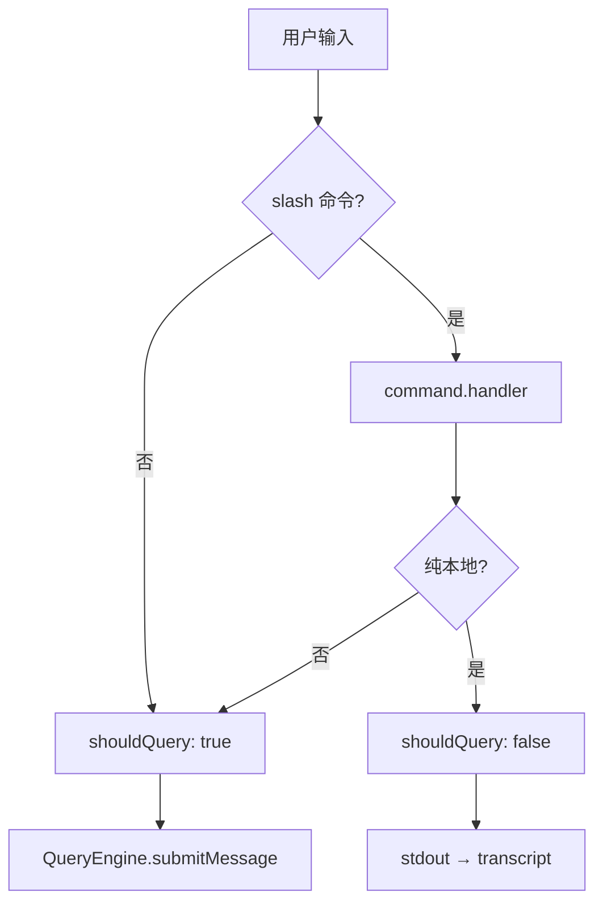

# 12 · 命令与输入预处理

> **锚点：** `commands.ts` · `commands/*` · `utils/processUserInput/` · `utils/handlePromptSubmit.ts`

---

## 1. 两条用户输入路径

| 路径 | 入口 | 产出 |
|------|------|------|
| 直接输入 | REPL `onSubmit` → `handlePromptSubmit` | 可能进 QueryEngine |
| 队列 | `messageQueueManager` dequeue | 同上（FIFO） |

Headless：`StructuredIO` / stdin → 同样 eventually `ask()` [19]。

Bridge IDE 注入走 **attachment 路径**，最终汇入 `processUserInput` [18]。

---

## 2. `processUserInput` 流水线

**文件：** `utils/processUserInput/processUserInput.ts`

```text
raw input
  → parseSlashCommand / findCommand
  → getAttachmentMessages (IDE/图片/@agent)
  → UserPromptSubmit hooks [11]
  → command.handler OR 普通文本
  → shouldQuery: boolean + newMessages
```

### 2.1 核心输出

| 字段 | 含义 |
|------|------|
| `shouldQuery` | **是否** 进入 `QueryEngine.submitMessage` |
| `newMessages` | 已组装的 user/system/attachment 链 |
| `allowedTools` | slash 可收窄 tool 集 |
| `model` / `effort` | slash 可覆盖 [27] |

---

## 3. `shouldQuery` 决策



| `shouldQuery: false` | 示例 |
|---------------------|------|
| 纯本地 | `/doctor` 部分路径、`/cost` 打印、`/help` |
| 配置 mutators | 改 settings 无需 LLM |
| 已 fully handled | handler 自己写完 transcript |

| `shouldQuery: true` | 示例 |
|--------------------|------|
| 普通文本 | 任意非 slash 输入 |
| LLM meta 命令 | 需模型参与的 slash |
| 关键词替换后 | ultraplan 等注入 |

**关键：** QueryEngine **不** 解析 slash — 预处理层必须正确设 `shouldQuery`，否则本地命令误触发 API 调用。

---

## 4. 命令注册（`commands/`）

~189 文件，`commands.ts` 聚合 export。

### 4.1 分类速查

| 类别 | 示例 | 典型 shouldQuery |
|------|------|------------------|
| **Session** | `/compact`、`/clear` | compact: false（调 compact API）；clear: false |
| **Config** | `/model`、`/permissions` | model: 部分 false |
| **MCP** | `/mcp` | false（UI/连接管理） |
| **Memory** | `/remember`、`/memory` | remember 可能 true（需模型）或 false |
| **Dream** | `/dream` | 触发 background [29] |
| **Tasks** | `/tasks` | false（列表 UI） |
| **Cost** | `/cost` | false [24] |
| **Git** | `/commit` | 常 true（skill 式） |
| **Bridge** | `commands/bridge/` | IDE 相关 [18] |

每个 command：

- `name`、`description`、`enabled()`（feature gate）
- `handler(ctx)` — 可 mutate `AppState`、enqueue follow-up、返回 local stdout

### 4.2 `/compact` vs loop autocompact

| | `/compact` slash | loop 内 autocompact |
|---|------------------|---------------------|
| 触发 | 用户 | token 阈值 proactive [10] |
| 内核 | `compactConversation` | 同内核 |
| shouldQuery | false | N/A（loop 内） |

---

## 5. `handlePromptSubmit` → QueryEngine

组装 `ProcessUserInputContext`（扩展 `ToolUseContext`）：

```text
processUserInput(ctx, input)
  → onQuery(newMessages, abortController, shouldQuery, allowedTools, model, ...)
       → if shouldQuery: QueryEngine.submitMessage
       → else: 仅 recordTranscript + UI 更新
```

Permission mode、plan mode 切换可在 slash handler 内完成 [11][17]。

---

## 6. 特殊输入机制

| 机制 | 文件/逻辑 |
|------|-----------|
| 粘贴展开 | `history.ts` `expandPastedTextRefs` |
| 图片 | `imageResizer.ts`、`imageStore.ts` |
| `@` 文件/agent | `parseReferences` |
| Vim 模式 | `vim/`（L3 REPL） |
| 关键词 | ultraplan、team 等 IntentGate |
| 队列 interrupt | `messageQueueManager` 抢占当前 turn |

---

## 7. Attachments 时机

**进 loop 前** 注入 user message（非 system）：

- Bridge selection/diagnostics [18]
- 图片 base64
- Skill 首次发现 blocking fetch [15]

因此 [13 system prompt](./13-system-prompt-and-context.md) 与 attachments **分离** — tools/MCP 变 system，选区变 messages。

---

## 8. Headless 差异

- 无 Ink UI — slash 仍解析，输出走 StructuredIO
- Permission prompt tool 替代 React dialog [19]
- `--print` 可能限制部分 interactive slash

---

## 9. 自测

- [ ] `shouldQuery` 谁决定？错误设 true/false 的后果？
- [ ] `/compact` 与 loop autocompact 触发链差异？
- [ ] 附件在进 loop 前还是后注入？
- [ ] 命令 `enabled()` 与 feature gate 关系？
- [ ] Bridge 输入是否绕过 processUserInput？

**关联：** [05 QueryEngine](./05-query-engine.md) · [13 System prompt](./13-system-prompt-and-context.md) · [11 Hooks](./11-permission-and-hooks.md) · [flow/输入预处理](../flow/README.md)
