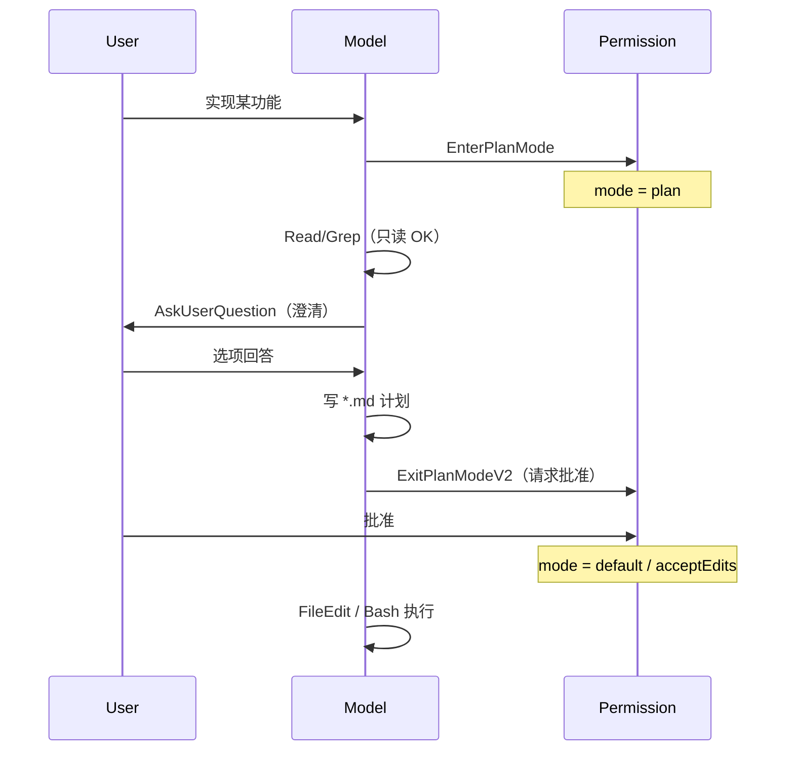

# 17 · Plan Mode 与代码编辑策略

> **锚点：** `EnterPlanModeTool` · `ExitPlanModeTool` · `ExitPlanModeV2Tool` · `AskUserQuestionTool` · `FileEditTool` · `permission mode: plan`

---

## 1. Plan mode 是什么

**Permission mode** 切换到 `plan` 后，产品假设是：**先分析、写计划，少动仓库**；用户批准后再切回执行模式改代码。

不是独立 loop，而是 **`AppState.toolPermissionContext.mode`** 影响 `canUseTool` 与 system prompt attachment。

工具：

- `EnterPlanMode` / `ExitPlanMode`（及 v2 变体）
- `AskUserQuestion` — 澄清需求（**强制**用 tool，禁止纯文本问计划审批）
- `ExitPlanModeV2` — 请求计划批准（替代文本问「这样可以吗？」）

`getRuntimeMainLoopModel` 在 plan mode 且 context >200k 时有特殊 model 路径（[07 §4](./07-api-and-model-stream.md#4-model-选择优先级)）。

---

## 2. 人机交互路径（Plan 典型 turn）

**关键约束**（`constants/prompts.ts` / `utils/messages.ts`）：

- 计划审批 **必须** 走 `ExitPlanModeV2`，**禁止** 用 `AskUserQuestion` 或纯文本问「计划 OK 吗？」
- 澄清需求 **必须** 用 `AskUserQuestion`
- Plan 阶段非 md 编辑常被 deny 或 ask

这是 **L3 人机门控** 的产品化路径，见 [28 §6.3](./28-agent-loop-continuation-and-human-gates.md#63-plan-mode-审批门)。

---

## 3. 与 Permission 联动

| 状态 | Edit/Write 非 plan 文件 | md 计划文件 |
|------|-------------------------|-------------|
| `plan` | 通常 deny / ask | allow |
| `default` | 规则 + 弹窗 | allow |
| `acceptEdits` | 自动 allow 编辑 | allow |

`EnterPlanMode` 会保存 `prePlanMode` 到 `toolPermissionContext`，`ExitPlanMode` 恢复。

Compact 后 **`createPlanModeAttachmentIfNeeded`** 注入 plan 说明，防止摘要后模型「忘记仍在 plan」（`utils/messages.ts` / compact 路径）。

Plan mode 下也可配合 **auto mode**：settings 注释 `planModeUsesAutoModeWhenAvailable` — plan 时若 auto mode 可用，classifier 语义与 default 不同（偏保守）。

---

## 4. 代码编辑策略

| 工具 | 策略 |
|------|------|
| **FileReadTool** | 多模态 read（pdf、图片）；hash 供 Edit 校验 |
| **FileEditTool** | 字符串 replace / patch；stale 检测 |
| **FileWriteTool** | 全文件写 |
| **NotebookEditTool** | Jupyter cell |

`isCodeEditingTool` → permission logging 与 analytics（`permissionLogging.ts`）。

### 4.1 Edit vs Write

- **Edit**：局部 patch，依赖 Read 过的内容 hash
- **Write**：新文件或整文件覆盖
- Plan 阶段：优先 md（计划文档）；执行阶段：按批准计划改源码

### 4.2 Permission mode 与编辑自动化

| mode | 编辑体验 |
|------|----------|
| `default` | 每次编辑可能弹窗 |
| `acceptEdits` | 编辑自动过（「半 yolo」） |
| `bypassPermissions` | 全部自动（全 yolo） |
| `plan` | 仅 plan 允许的路径 |

---

## 5. Worktree 隔离

`EnterWorktreeTool` / `ExitWorktreeTool` — git worktree 隔离编辑，与 plan **正交**：

- Plan：控制 **何时** 改、改什么类型文件
- Worktree：控制 **在哪** 改（隔离目录）

见 [23 §1](./23-worktree-background-and-cron.md#1-git-worktree)。

---

## 6. 与 Agent loop 的关系

Plan mode **不改变** L1 continue 规则（仍有 tool_use → next_turn）。  
vmany tool 调用会在 L3 被 deny，模型会：

1. 改策略（写 md、AskUserQuestion）
2. 或 ExitPlanMode 请求切换 mode

Stop hooks 在 plan turn 末尾同样运行；blocking hook 可逼模型继续改计划。

---

## 7. opusplan 与模型切换

settings/CLI 别名 **`opusplan`**：

- **plan mode** 且 context ≤200k → `getRuntimeMainLoopModel` 切 **Opus**（强模型写计划）[27]
- 退出 plan / execute 阶段 → 回到用户指定的主模型（常为 Sonnet）

意图：计划阶段用最强推理，执行阶段用成本更优模型。

---

## 8. Coordinator 下的 Plan

Coordinator mode [21] 下主 agent **不应亲自 FileEdit** — plan 若产生，应 **delegate 给 worker**。`getCoordinatorSystemPrompt` 明确编排者角色；worker 在 scratchpad/plan md 上协作。

---

## 9. 自测

- [ ] plan mode 如何进入/退出？`prePlanMode` 作用？
- [ ] 为何计划审批必须用 ExitPlanModeV2 而非 AskUserQuestion？
- [ ] compact 后 plan 状态如何延续？
- [ ] Edit vs Write 选用场景？
- [ ] acceptEdits 与 plan mode 同时启用时行为？

**关联：** [11 Permission](./11-permission-and-hooks.md) · [28 人机门控](./28-agent-loop-continuation-and-human-gates.md) · [09 Tools](./09-tools-system.md) · [23 Worktree](./23-worktree-background-and-cron.md)
