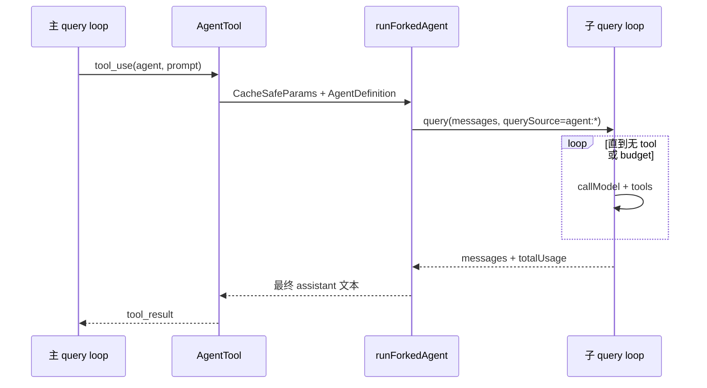

# 20 · Agent 定义与子 Agent

> **锚点：** `tools/AgentTool/` · `tools/AgentTool/loadAgentsDir.ts` · `utils/forkedAgent.ts` · `constants/querySource.ts`

---

## 1. Agent 是什么

**Agent** = 具名 subagent 配置：独立 system prompt、tool 子集、model 覆盖、permission 规则。

来源（优先级由产品合并逻辑决定）：

| 来源 | 路径/机制 |
|------|-----------|
| Built-in | 产品内置 agent 类型 |
| 项目配置 | `.claude/agents/` JSON/markdown |
| CLI | `--agent <name>` |
| Coordinator worker | 动态 delegate，非磁盘定义 [21] |

`AgentTool` 让主模型 **spawn** 子 agent，跑独立 `query()` loop（fork），结果以 tool_result 回传主线程。

---

## 2. AgentDefinition 加载

`loadAgentsDir.ts` 解析 agent 文件 → `AgentDefinition`：

- `agentType` — 标识符
- `getSystemPrompt()` — 子 agent 系统提示
- `tools` — 允许的工具名列表（可窄于主 agent）
- model 覆盖、description 等

**时机：** QueryEngine 启动时加载；resume 时 `restoreAgentFromSession`（`cli/print.ts`）恢复 `--agent` 与会话内 agent 状态。

---

## 3. Fork 机制（`runForkedAgent`）

### 3.1 设计目标

`utils/forkedAgent.ts` 头部注释概括四点：

1. **共享 prompt cache** — fork 与 parent API 请求的 cache-critical 字段一致
2. **完整 usage 统计** — 跨整个子 loop 累加，事件 `tengu_fork_agent_query`
3. **状态隔离** — 不污染主 loop 的可变状态
4. **sidechain 记录** — `recordSidechainTranscript` 可选持久化

### 3.2 CacheSafeParams

Anthropic API cache key 由以下组成（fork 必须对齐）：

```typescript
// forkedAgent.ts — CacheSafeParams
{
  systemPrompt,
  userContext,      //  prepend 到 messages
  systemContext,    // append 到 system
  toolUseContext,   // tools, model, options
  forkContextMessages,
}
```

**全局槽位：** `saveCacheSafeParams` / `getLastCacheSafeParams` — `handleStopHooks` 每 turn 写入，供 **post-turn fork**（extractMemories、promptSuggestion、/btw）复用 cache，无需各调用方 threading。

**禁止：** 子 agent 的 `querySource`（如 `agent:custom`）**不得** 注册 cached microcompact state 到主线程，否则 cache 前缀被 sidechain 污染。

### 3.3 子 loop 入口

子 agent 与主 agent **同一 `query.ts`**，差异在：

- `querySource` — 决定 compact/stop hooks/telemetry 分支
- `CanUseToolFn` — 可继承或收窄
- `skipCacheWrite` / `skipTranscript` — 按场景（如一次性 extract）
- `maxOutputTokens` — 若设置，可能 clamp thinking budget（旧模型）

### 3.4 典型调用方

| 调用方 | 用途 |
|--------|------|
| `AgentTool` | 用户可见 delegate |
| `extractMemories` | turn 结束提取记忆 [29] |
| `PromptSuggestion` / speculation | 续写建议 [30] |
| confidence rating 等 | 内部质量评估 |

---

## 4. AgentTool 执行流



Permission：子 agent 可走独立 rules；denial 由 `createDenialTrackingState` 跟踪，避免 fork 内无限重试。

### 4.1 Agent 定义字段（常见）

| 字段 | 作用 |
|------|------|
| `description` | 主模型选 agent 的依据 |
| `tools` | allowlist；省略则继承主 agent 子集 |
| `model` | 可选 override [27] |
| `permissionMode` | 子 agent 独立 mode |
| `maxTurns` | 子 loop 迭代上限 |

Built-in agent type（Explore、Plan 等）与 `.claude/agents/` 自定义 **同一 AgentTool 路径** spawn。

---

## 5. 与 Team / Coordinator 区别

| 维度 | AgentTool fork | Team/Swarm [21] | Coordinator [21] |
|------|----------------|-----------------|------------------|
| 触发 | 单次 tool | TeamCreate + spawn | mode + delegate |
| 并行 | 可多 fork | 多 member 常驻 | 多 worker |
| 通信 | tool_result | SendMessage mailbox | AgentTool + scratchpad |
| 存储 | sidechain JSONL | team 目录 | session mode |
| 典型寿命 | 任务结束即停 | session 级 | session 级 |

**选型：** 一次性深搜用 AgentTool；长期并行改代码用 Team；纯编排用 Coordinator。

---

## 6. 与 extractMemories / 后台任务

- extractMemories 用 **perfect fork**（共享 parent cache），在 `handleStopHooks` 里 **void 异步** 触发，不 block 主 loop exit
- background agent task（`LocalAgentTask`）是 **另一进程/任务**，不是 fork；见 [21](./21-tasks-team-and-coordinator.md)

---

## 7. 源码带读

1. `tools/AgentTool/usr/AgentTool.ts`（或同级主文件）
2. `utils/forkedAgent.ts` — `runForkedAgent`、`CacheSafeParams`
3. `query/stopHooks.ts` — `saveCacheSafeParams` 调用点
4. `constants/querySource.ts` — 各 source 语义

---

## 8. 自测

- [ ] 子 agent 用哪条 query 入口？与主 loop 文件是否相同？
- [ ] 为何 fork 不能注册 cached MC state 到主线程？
- [ ] CacheSafeParams 的五字段分别影响 API cache 哪一部分？
- [ ] `getLastCacheSafeParams` 谁在何时写入？
- [ ] AgentTool 与 Team spawn 的生命周期差异？

**关联：** [06 Loop](./06-query-agent-loop.md) · [21 Team/Coordinator](./21-tasks-team-and-coordinator.md) · [29 Memory](./29-memory-and-auto-memory.md)
