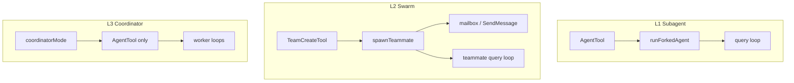

# 21 · Tasks、Team、Swarm 与 Coordinator

> **锚点：** `tasks/` · `tools/Task*Tool` · `tools/Team*Tool` · `tools/SendMessageTool/` · `utils/swarm/` · `coordinator/coordinatorMode.ts` · `utils/agentSwarmsEnabled.ts`

---

## 1. 三层多 Agent 模型

Claude Code 里「多个 agent 一起干活」不是单一机制，而是 **三层叠加**：

| 层级 | 机制 | 典型入口 | 持久化 |
|------|------|----------|--------|
| **L1 Subagent** | `AgentTool` + `runForkedAgent` | 主模型 delegate 一次任务 | sidechain transcript |
| **L2 Agent Teams / Swarm** | `TeamCreate` + teammate spawn + mailbox | 多 member 长期协作 | team 文件 + worktree + tasklist |
| **L3 Coordinator** | `CLAUDE_CODE_COORDINATOR_MODE` | 编排者只 delegate，少动手 | session mode + scratchpad |

三者共用同一 **`query.ts` loop**，靠 `querySource`、tool 子集、permission 策略区分行为。详见 [20 Subagent](./20-agents-and-subagents.md)、[28 Loop 门控](./28-agent-loop-continuation-and-human-gates.md)。



---

## 2. Task 系统（结构化 todo）

### 2.1 Tools 面

模型可见的任务 CRUD：

| Tool | 职责 |
|------|------|
| `TaskCreateTool` | 创建任务项 |
| `TaskUpdateTool` | 更新状态/描述 |
| `TaskListTool` / `TaskGetTool` | 列举/读取 |
| `TaskStopTool` | 停止运行中任务 |
| `TaskOutputTool` | 读取后台任务输出 |

与 **bash 后台** 不同：Task 是 **结构化、可枚举、可进 stop hooks** 的一等公民；bash 是 shell 进程，生命周期由 `LocalShellTask` 管理。

### 2.2 持久化

- 读写辅助：`utils/tasks.ts`（`ensureTasksDir`、`resetTaskList`、`setLeaderTeamName`…）
- Team 模式下 tasklist 与 team 目录绑定；leader 创建 team 时 `TeamCreateTool` 会 `resetTaskList`
- Stop hooks 可读 task 状态，配合 `executeTaskCompletedHooks`（`query/stopHooks.ts`）

### 2.3 与 OpenCode/OmO 对照（后期）

OmO `experimental.task_system` 提供类似 `task_create/get/list/update`；CC 的 Task 更早进入产品主线，且与 Team mailbox 联动。

---

## 3. Task 运行时（`tasks/`）

| 子目录 | 用途 | querySource 特征 |
|--------|------|------------------|
| `LocalAgentTask/` | 本地 agent 后台跑 | `background:agent` 类 |
| `LocalShellTask/` | shell 后台 | bash 输出流 |
| `RemoteAgentTask/` | 远程 agent worker | 与 CCR 联动 [22] |
| `InProcessTeammateTask/` | swarm in-process teammate | teammate id / team name |
| `DreamTask/` | 实验性 background（auto-dream） | feature-gated [29] |

**Shutdown 诊断：** `tasks/print.ts` 在进程退出时 dump `bg_tasks`；headless（`print.ts`）可 **等待 background 完成** 再 exit，避免 CI/SDK 丢结果。

---

## 4. Agent Teams / Swarm

### 4.1 功能开关

单一门控：`isAgentSwarmsEnabled()`（`utils/agentSwarmsEnabled.ts`）

```
Ant 构建 (USER_TYPE=ant)     → 始终开启
外部构建                      → 需 CLAUDE_CODE_EXPERIMENTAL_AGENT_TEAMS=1
                               或 --agent-teams
                               且 GrowthBook tengu_amber_flint 未 killswitch
```

**所有** teammate 相关代码（prompt、UI、tool `isEnabled`）都应走此函数，避免半开状态。

### 4.2 Team Tools

| Tool | 作用 |
|------|------|
| `TeamCreateTool` | 创建 team 文件、注册 session cleanup、设 leader、初始化 tasklist |
| `TeamDeleteTool` | 拆除 team、清理 worktree/pane |
| `SendMessageTool` | member 间 mailbox 消息（含 unread 字节上限） |

`TeamCreateTool` 核心流程（`tools/TeamCreateTool/TeamCreateTool.ts`）：

1. `sanitizeName(team_name)` → 安全目录名
2. `writeTeamFileAsync` → 写 team 元数据（`utils/swarm/teamHelpers.ts`）
3. `setLeaderTeamName` / `resetTaskList`
4. `registerTeamForSessionCleanup` → 会话结束自动清理
5. 返回 `lead_agent_id`（`formatAgentId`）

### 4.3 Swarm 后端（Teammate 跑在哪）

`utils/swarm/backends/registry.ts` 在进程生命周期内 **检测并缓存** 一种 backend：

| Backend | 条件 | 行为 |
|---------|------|------|
| **TmuxBackend** | `tmux` 可用、非 bare | 新 pane 跑 teammate CLI |
| **ITermBackend** | iTerm2 + `it2` CLI | 分屏 spawn |
| **InProcessBackend** | 无 pane 可用或显式 in-process | 同进程 async runner |

检测顺序受 `getPreferTmuxOverIterm2()`、`getTeammateModeFromSnapshot()` 影响。若 pane backend 不可用，设 `inProcessFallbackActive`，UI banner 反映真实模式。

相关模块：

- `spawnUtils.ts` / `spawnInProcess.ts` — 启动 teammate 进程
- `teammateInit.ts` — 注入 `--agent-id`、`--team-name` 等 argv（`main.tsx` 恢复 teammate session）
- `leaderPermissionBridge.ts` / `permissionSync.ts` — leader 与 worker permission 同步
- `reconnection.ts` — pane 断开重连
- `teammateLayoutManager.ts` — 颜色、布局

### 4.4 Teammate 生命周期

```text
Leader: TeamCreate → spawnTeammate(agentType) → worker 独立 REPL/query loop
        ↕ SendMessage (mailbox)
Worker: main.tsx 读 storedTeammateOpts → 跳过 TeamCreate → 直接进 member loop
Shutdown: session cleanup + pane kill + worktree remove
```

Worker 识别：`isSwarmWorker()`（REPL 内）；与 `querySource` guard 联动——background/teammate **不得** 污染主线程 cached microcompact / CacheSafeParams（见 [10](./10-compaction-and-context.md)、[28](./28-agent-loop-continuation-and-human-gates.md)）。

---

## 5. Coordinator 模式

### 5.1 启用

- 编译 feature：`feature('COORDINATOR_MODE')`
- 运行时：`CLAUDE_CODE_COORDINATOR_MODE=1` → `isCoordinatorMode()`
- Resume：`matchSessionMode(sessionMode)` 若 env 与存储 mode 不一致，**自动 flip env** 并打 `tengu_coordinator_mode_switched`

### 5.2 编排者语义

Coordinator **不是** swarm leader 的别名，而是 **只编排、少执行** 的产品模式：

- System prompt：`getCoordinatorSystemPrompt()` — 强调 delegate、汇总、禁止亲自改代码（除非 policy 允许）
- User context：`getCoordinatorUserContext()` — 注入 worker 可用 tool 列表、MCP 服务器名、scratchpad 路径
- Worker tool 集：`ASYNC_AGENT_ALLOWED_TOOLS` 减去 `INTERNAL_WORKER_TOOLS`（TeamCreate/Delete、SendMessage、SyntheticOutput 等 **worker_N leader 持有**）

Scratchpad（`tengu_scratch` gate）：跨 worker 共享目录，filesystem permission 对 scratchpad **免 prompt**。

### 5.3 与 Swarm 关系

| | Swarm Team | Coordinator |
|---|------------|-------------|
| 创建方式 | 模型调 `TeamCreateTool` | 用户/env 进 coordinator mode |
| Member 通信 | SendMessage mailbox | 主要经 AgentTool delegate |
| UI | teams menu、pane 布局 | coordinator 专用 REPL 上下文 |
| 典型用户 | 多 pane 并行开发 | 一人指挥多 worker |

二者可同时存在于代码库，但 session mode 互斥存储（resume 时 `matchSessionMode`）。

---

## 6. querySource 与 guard 矩阵

Team/agent background 改变 `querySource`，影响：

| 行为 | 主线程 | fork / teammate / background |
|------|--------|--------------------------------|
| autocompact 策略 | 正常 | 常更激进或禁用 cached MC |
| CacheSafeParams 保存 | stopHooks 写入 | fork 可读 `getLastCacheSafeParams` |
| extractMemories | 可跑 | 通常跳过或独立 fork [29] |
| stop hooks 子集 | 全量 | 按 source 过滤 |

源码入口：`constants/querySource.ts`、各 task 模块、`forkedAgent.ts` 注释。

---

## 7. 对比速查

| 维度 | AgentTool | Team/Swarm | Coordinator |
|------|-----------|------------|-------------|
| 触发 | 单次 tool call | TeamCreate + spawn | env + session mode |
| 并行 | 可多 fork | 多 pane/process | 多 worker delegate |
| 通信 | 仅 tool_result 回传 | mailbox + tasklist | AgentTool + scratchpad |
| 持久化 | sidechain JSONL | team 目录 | session mode 字段 |
| 开关 | 始终（agent 定义存在） | `isAgentSwarmsEnabled()` | `COORDINATOR_MODE` feature |

---

## 8. 源码带读顺序

1. `utils/agentSwarmsEnabled.ts` — 开关
2. `tools/TeamCreateTool/TeamCreateTool.ts` — team 创建
3. `utils/swarm/backends/registry.ts` — backend 选择
4. `tasks/InProcessTeammateTask/` — in-process 路径
5. `coordinator/coordinatorMode.ts` — coordinator prompt/context
6. `main.tsx` — teammate argv 恢复、`setup()` 内 swarm 初始化
7. `screens/REPL.tsx` — swarm UI、coordinator 分支

---

## 9. 自测

- [ ] Task tools 与 bash 后台的生命周期差异？
- [ ] 外部用户如何开启 Agent Teams？GrowthBook killswitch 叫什么？
- [ ] tmux / iTerm / in-process 三 backend 的检测与 fallback？
- [ ] Coordinator 为何禁止 worker 持有 TeamCreate/SendMessage？
- [ ] teammate 的 `querySource` 如何防止污染主线程 prompt cache？
- [ ] resume 时 coordinator mode 不匹配会发生什么？

**关联：** [20 Agents](./20-agents-and-subagents.md) · [23 Worktree](./23-worktree-background-and-cron.md) · [29 Memory](./29-memory-and-auto-memory.md) · [30 实验特性](./30-advanced-features-and-experiments.md)
