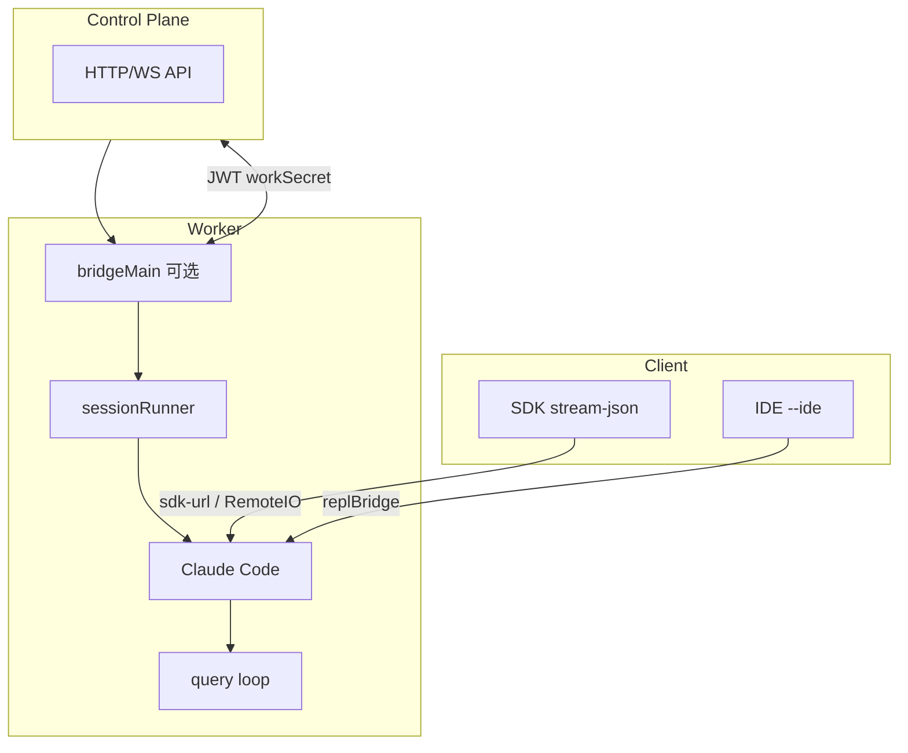

# 22 · Remote 与 Server 模式

> **锚点：** `remote/` · `server/` · `bridge/` · `bootstrap/state.js` · `cli/print.ts`

---

## 1. 三种「非本地 REPL」形态

| 形态 | 进程模型 | 入口 |
|------|----------|------|
| **Remote session (CCR)** | 容器/VM 内 CLI worker | `CLAUDE_CODE_REMOTE`、`--sdk-url` |
| **Bridge worker** | bridgeMain spawn 子 CC | [18] `bridgeMain.ts` |
| **Server mode** | 长期 daemon，多 session | `server/` |

**共性：** 最终都跑 **`query()` loop**；差异在 I/O、权限 transport、持久化路径、超时策略。

---

## 2. Remote session（CCR）

### 2.1 识别

`getIsRemoteMode()`（`bootstrap/state.js`）— env + bootstrap 标志。

### 2.2 行为差异矩阵

| 子系统 | 本地 REPL | Remote worker |
|--------|-----------|---------------|
| Settings | 本地读写 | **download/sync**（print entry） |
| API timeout | 300s 默认 | **120s** [27] |
| Auto-memory | 默认开 | 默认关，需 `REMOTE_MEMORY_DIR` [29] |
| Permission | React / 本地 | `remotePermissionBridge` [§3] |
| Compact | 正常 | + **session activity** keep-alive |
| Transcript | 本地 JSONL | 挂载路径可能不同 [08] |
| Trust dialog | 有 | print 路径常跳过 [03] |

### 2.3 为何 120s API timeout

Control plane 监控 **idle**。API fallback hung → worker 无输出 → 被 kill。短 timeout 使失败快速暴露，走 retry/fallback [27]。

### 2.4 Session activity

长 compact / 长 tool 期间：

```text
sendSessionActivitySignal (bridge/API)
  → control plane: worker still alive
  → 避免误判 idle terminate
```

与 [18 Bridge](./18-bridge-and-ide.md) 共用 transport。

### 2.5 Memory

```text
CCR && !CLAUDE_CODE_REMOTE_MEMORY_DIR → isAutoMemoryEnabled() false
设置 REMOTE_MEMORY_DIR → memdir 写挂载卷 [29]
```

---

## 3. `remote/` 模块

| 文件 | 职责 |
|------|------|
| `remotePermissionBridge.ts` | permission 决策转发 control plane / Web UI |
| `RemoteSessionManager.ts` | remote session 生命周期 |
| `SessionsWebSocket.ts` | WebSocket 与 control plane |
| `sdkMessageAdapter.ts` | 内部 Message ↔ SDK 远程格式 |
| `utils/background/remote/remoteSession.ts` | background remote agent |
| `utils/background/remote/preconditions.ts` | remote 前置检查 |

**语义：** 本地 `useCanUseTool` 接口不变，**实现** 换成跨进程 RPC/WebSocket。

---

## 4. Server 模式（`server/`）

| 维度 | 单次 `-p` | Server daemon |
|------|-----------|---------------|
| 进程寿命 | 命令结束即 exit | 长期运行 |
| Session | 单 session 为主 | 多 session 路由 |
| 客户端 | 脚本 pipe | HTTP/SDK 附着 |
| I/O | StructuredIO | 可能 RemoteIO [19] |

扫 `server/` 入口 export 得路由表；后期对照 [OmO plugin server](../oh-my-openagent/README.md)。

---

## 5. Bootstrap 与 print

`cli/print.ts` remote 路径：

```text
detect remote / sdk-url
  → settings sync from control plane
  → matchSessionMode (coordinator) [21]
  → loadInitialMessages [08]
  → MCP/plugins background install
  → runHeadlessStreaming → ask()
  → wait background tasks [23]
```

`main.tsx`：remote 下可能 **不 launchRepl**，直接 `runHeadless`。

---

## 6. SDK / Bridge / Remote 关系



| 客户端 | 典型路径 |
|--------|----------|
| Python/TS SDK | `--sdk-url` + stream-json [19] |
| IDE 插件 | `--ide` + replBridge [18] |
| CCR Web | bridge worker + OAuth |

---

## 7. 环境变量与 CLI

| 变量 / Flag | 作用 |
|-------------|------|
| `CLAUDE_CODE_REMOTE` | 启用 remote worker 行为 |
| `CLAUDE_CODE_REMOTE_MEMORY_DIR` | 持久 memory 挂载 [29] |
| `CLAUDE_CODE_COORDINATOR_MODE` | coordinator [21] |
| `--sdk-url` | Control plane URL |
| `--no-session-persistence` | 不落盘（print） |
| `--workload <tag>` | 计费 attribution（print） |

---

## 8. Remote background agent

`utils/background/remote/` — 在远端跑 agent task，与 `RemoteAgentTask` [23]、`tasks/` 联动；preconditions 检查 network/auth。

---

## 9. 故障排查

| 现象 | 查 |
|------|-----|
| session 莫名断开 | idle timeout、缺 activity signal |
| memory 不持久 | `REMOTE_MEMORY_DIR` |
| permission 无响应 | `remotePermissionBridge`、网络 |
| cost 异常 | remote 下 fork 仍计 `tengu_fork_agent_query` [24] |
| settings 不生效 | sync 时机、managed settings [04] |

---

## 10. 源码带读

1. `bootstrap/state.js` — `getIsRemoteMode`
2. `cli/print.ts` — remote entry、settings sync
3. `remote/remotePermissionBridge.ts`
4. `remote/SessionsWebSocket.ts`
5. `bridge/workSecret.ts` — worker 注册 [18]
6. `memdir/paths.ts` — remote memory [29]

---

## 11. 自测

- [ ] remote 为何 120s timeout？
- [ ] session activity 何时发送？
- [ ] CCR 默认关 auto-memory 如何开启？
- [ ] `remotePermissionBridge` vs `bridgePermissionCallbacks`？
- [ ] Server vs `-p` 生命周期？
- [ ] SDK `sdk-url` 与 `CLAUDE_CODE_REMOTE` 关系？

**关联：** [19 SDK](./19-sdk-headless-and-print-mode.md) · [18 Bridge](./18-bridge-and-ide.md) · [29 Memory](./29-memory-and-auto-memory.md) · [03 CLI](./03-cli-entry-and-repl.md)
