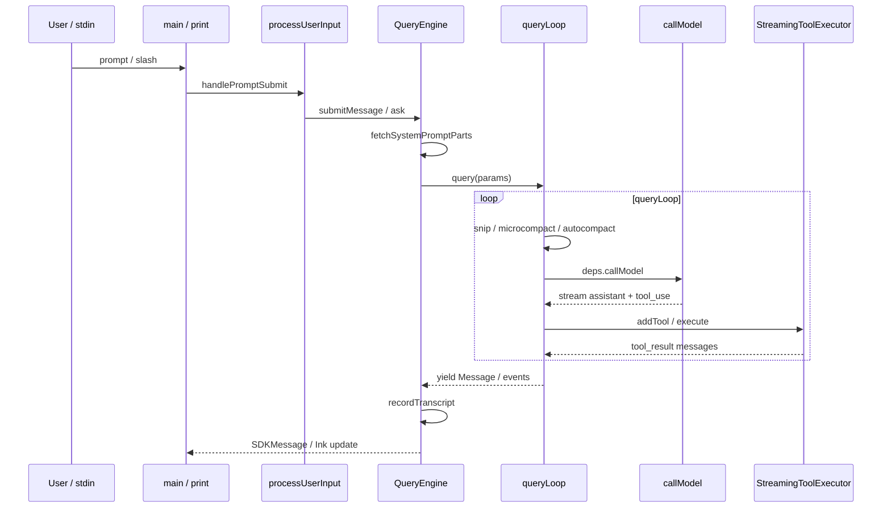

# 26 · 主链路总图（Atlas）

> **用途：** 一张图串起核心文件；读源码时的导航锚点。  
> **基准：** v2.1.88 · pin `936e6c8`


<p align="center"><sub>图内 ASCII/英文标签 · 深读见 <a href="./appendix/A1-user-turn-journey.md">A1 叙事</a></sub></p>

---

## 1. 端到端时序



---

## 2. 文件锚点表

| 阶段 | 文件 | 文档 |
|------|------|------|
| CLI 入口 | `main.tsx` | [03](./03-cli-entry-and-repl.md) |
| Headless | `cli/print.ts` `runHeadless` | [19](./19-sdk-headless-and-print-mode.md) |
| 输入预处理 | `utils/processUserInput/` | [12](./12-commands-and-input-preprocessing.md) |
| 会话引擎 | `QueryEngine.ts` | [05](./05-query-engine.md) |
| Agent loop | `query.ts` | [06](./06-query-agent-loop.md) |
| Loop 依赖 | `query/deps.ts` | [06](./06-query-agent-loop.md) |
| API 流 | `services/api/claude.ts` | [07](./07-api-and-model-stream.md) |
| Tool 执行 | `services/tools/*` | [09](./09-tools-system.md) |
| Tool 注册 | `tools.ts`, `tools/*` | [09](./09-tools-system.md) |
| Compact | `services/compact/*` | [10](./10-compaction-and-context.md) |
| Prompt | `utils/queryContext.ts` | [13](./13-system-prompt-and-context.md) |
| MCP | `services/mcp/*` | [14](./14-mcp-and-external-protocols.md) |
| 持久化 | `utils/sessionStorage.ts` | [08](./08-message-and-session-persistence.md) |
| 权限 | `hooks/useCanUseTool.tsx` | [11](./11-permission-and-hooks.md) |
| Bridge | `bridge/` | [18](./18-bridge-and-ide.md) |
| Remote | `remote/` | [22](./22-remote-and-server-mode.md) |
| Memory | `memdir/`、`extractMemories/` | [29](./29-memory-and-auto-memory.md) |
| Teams | `utils/swarm/`、`coordinator/` | [21](./21-tasks-team-and-coordinator.md) |

---

## 3. 单轮 queryLoop 内顺序

| 顺序 | 步骤 | 见 query.ts |
|------|------|-------------|
| 1 | yield `stream_request_start` | ~337 |
| 2 | tool result budget / snip | ~369–410 |
| 3 | microcompact | ~412–426 |
| 4 | context collapse（feature） | ~440–447 |
| 5 | autocompact | ~453–543 |
| 6 | token blocking check | ~628–647 |
| 7 | `deps.callModel` 流式 | ~652+ |
| 8 | StreamingToolExecutor / runTools | ~560+ |
| 9 | needsFollowUp ? continue : stop hooks / exit | ~1062+ |

---

## 4. 三入口汇合点

```text
REPL:  REPL → handlePromptSubmit → QueryEngine.submitMessage ─┐
print: runHeadless → runHeadlessStreaming → ask() ─────────────┼→ query()
SDK:   ask() 直接 ─────────────────────────────────────────────┘
```

---

## 5. 读完后应能回答

1. Agent loop 的 **唯一 while(true)** 在哪个函数？
2. **compact 与 callModel** 的先后？
3. 流式 tool 执行的核心类名？
4. 会话写入磁盘的主要函数？

→ 验收详见 [25 §4–§5](./25-architecture-review-and-mastery.md)

---

## 关联

- [01 架构总览](./01-architecture-overview.md)
- [learning-paths 路径 A](./learning-paths.md#路径-a第一次学-claude-code--约-46-小时)
- [flow/ 流程索引](./flow/README.md)
