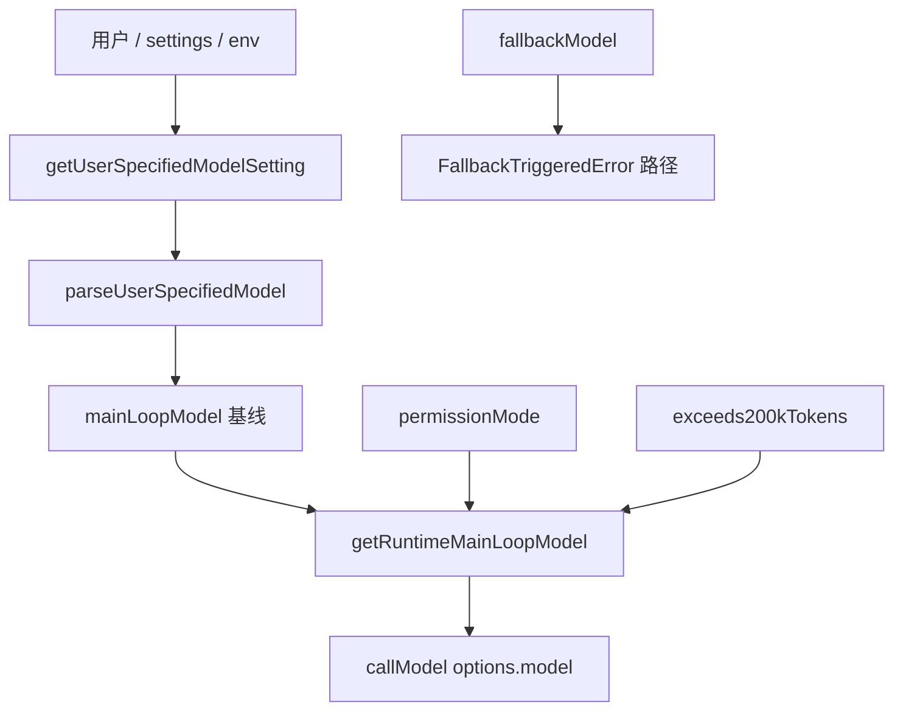

# 27 · 多模型、Thinking 与 Fallback

> **锚点：** `utils/model/model.ts` · `utils/thinking.ts` · `query.ts` · `services/api/withRetry.ts` · `services/api/claude.ts`

---

## 1. 模型选择全景

Claude Code 的「用哪个模型」不是单一全局变量，而是 **多层 resolver** 在 turn 内、loop 内多次求值。



---

## 2. 主循环模型优先级

### 2.1 静态优先级

| 顺序 | 来源 | 函数/机制 |
|------|------|-----------|
| 1 | Session `/model` | `getMainLoopModelOverride()` |
| 2 | CLI `--model` | bootstrap / print argv |
| 3 | settings.json `model` | `getInitialSettings()` |
| 4 | `ANTHROPIC_MODEL` | 环境变量 |
| 5 | 订阅默认 | `getDefaultMainLoopModelSetting()` |

**默认模型（无用户指定）：**

- Max / Team Premium → Opus（可选 `[1m]` 后缀）
- 其它订阅 → Sonnet 4.6
- Ant 内部 → flag config 或 Opus `[1m]`

### 2.2 运行时动态调整

`getRuntimeMainLoopModel({ permissionMode, mainLoopModel, exceeds200kTokens })`：

| 条件 | 结果 |
|------|------|
| `opusplan` + `plan` mode + ≤200k | 切 **Opus**（plan 阶段用强模型） |
| `haiku` setting + `plan` mode | 切 **Sonnet**（注释：sonnetplan by default） |
| 其它 | 保持 `mainLoopModel` |

Loop **每 iteration** 传入 `exceeds200kTokens`（由 context 分析得出），故 **mid-turn 可能换模型**（影响 cache，见 [10](./10-compaction-and-context.md)）。

### 2.3 Model alias

settings/CLI 可写别名：`opus`、`sonnet`、`haiku`、`opusplan` 等 → `parseUserSpecifiedModel` 展开为完整 model id（含 provider 后缀、Bedrock/Vertex 变体）。

---

## 3. Thinking 配置

`ThinkingConfig` 类型：`adaptive` | `disabled` | 显式 `budget_tokens`。

- QueryEngine 初始化默认 **adaptive**（除非 settings/CLI 关闭）
- **Cache key 组成之一** — system + tools + messages prefix + **thinking config**
- Fork 时若设 `maxOutputTokens`，旧模型可能 clamp `budget_tokens` → **cache miss**（`forkedAgent.ts` 注释）

`utils/thinking.ts` — 从 settings/AppState 解析最终传给 API 的结构。

---

## 4. Effort

`AppState.effortValue` → `callModel` `options.effortValue` → API `output_config` / internal effort override。

`promptCacheBreakDetection.ts` 跟踪 effort 变化是否 **break prefix cache**（与 [24](./24-cost-analytics-and-limits.md) analytics 联动）。

---

## 5. Fallback 体系

### 5.1 Streaming → 非流式

`query.ts` ~678：`onStreamingFallback` 回调。

流式连接失败或协议错误时，`withRetry.ts` 可抛 **`FallbackTriggeredError`**，触发非流式 `executeNonStreamingRequest` 重试 **同一模型**。

### 5.2 Model fallback

`query.ts` ~894：

```text
catch FallbackTriggeredError && fallbackModel
  → 丢弃 StreamingToolExecutor 未提交状态
  → 换 fallbackModel 重试整轮 callModel
```

- CLI：`--fallback-model`（print 模式）
- QueryEngine：构造时传入 `fallbackModel`
- **不是** mid-tool 续跑 — 整轮重来（与 [28 L1 continue](./28-agent-loop-continuation-and-human-gates.md) 不同）

### 5.3 529 / 过载

`withRetry.ts` 指数退避；Remote 模式 API timeout **120s**（非 300s），使 hung fallback 更快失败 [22]。

### 5.4 Reactive compact（413）

Prompt too long → 非 fallback 链，走 **reactive compact**（[10](./10-compaction-and-context.md)），可能换摘要模型（compact agent 独立 model 配置）。

---

## 6. Fast mode

Settings `fastMode` + feature gate → API 请求带 fast mode 参数；与 cache tracking、analytics 联动。不影响 loop 形状，只改 latency/cost 档位。

---

## 7. 小模型 / Haiku 侧路

| 函数 | 用途 |
|------|------|
| `getSmallFastModel()` | tool summary、轻量 side query |
| `getDefaultHaikuModel()` | Haiku 4.5 默认 id |
| compact agent | 独立 model（常 Sonnet/Haiku，见 compact 配置） |
| extractMemories fork | 可指定较小模型（见 extractMemories.ts） |

主 loop 与 side query **分离计费**（`tengu_fork_agent_query` 等事件 [24]）。

---

## 8. Betas 与 provider 变体

`utils/betas.ts` `getMergedBetas()` — 合并 SDK betas（task_budget、prompt cache、tool search 等）进 API 请求。

`utils/model/providers.ts` — 区分 first-party / Bedrock / Vertex / Foundry；model id 字符串格式不同，`firstPartyNameToCanonical` 用于 cost 映射 [24]。

---

## 9. 与 permission mode 联动

| mode | 模型影响 |
|------|----------|
| `plan` | `opusplan`/`haiku` 触发 runtime 切换 [17] |
| `bypassPermissions` | 不直接改 model |
| coordinator | worker delegate 用 worker 自己的 model [21] |

---

## 10. 决策速查表

| 现象 | 查哪里 |
|------|--------|
| 默认 Opus vs Sonnet | `getDefaultMainLoopModelSetting` |
| plan 模式突然 Opus | `getRuntimeMainLoopModel` + `opusplan` |
| 流式失败后重试 | `onStreamingFallback` / `withRetry` |
| 换备用模型 | `FallbackTriggeredError` + `fallbackModel` |
| thinking cache miss | fork `maxOutputTokens` + [10 §10.2] |
| 超长 context 换模型 | `exceeds200kTokens` |

---

## 11. 源码带读

1. `utils/model/model.ts` — 默认与 runtime resolver
2. `query.ts` 652–920 — callModel + fallback catch
3. `services/api/withRetry.ts` — `FallbackTriggeredError`
4. `utils/thinking.ts` — thinking 解析
5. `services/api/promptCacheBreakDetection.ts` — effort/model 变化

---

## 12. 自测

- [ ] 模型 override 完整优先级链？
- [ ] `opusplan` 在 execute mode 下还用 Opus 吗？
- [ ] model fallback 时为何 discard streaming executor？
- [ ] thinking 与 cache 冲突的具体案例？
- [ ] streaming fallback vs model fallback vs reactive compact 三者区别？

**关联：** [07 API 流](./07-api-and-model-stream.md) · [10 Cache](./10-compaction-and-context.md) · [17 Plan mode](./17-plan-mode-and-code-editing.md) · [28 Loop 门控](./28-agent-loop-continuation-and-human-gates.md)
