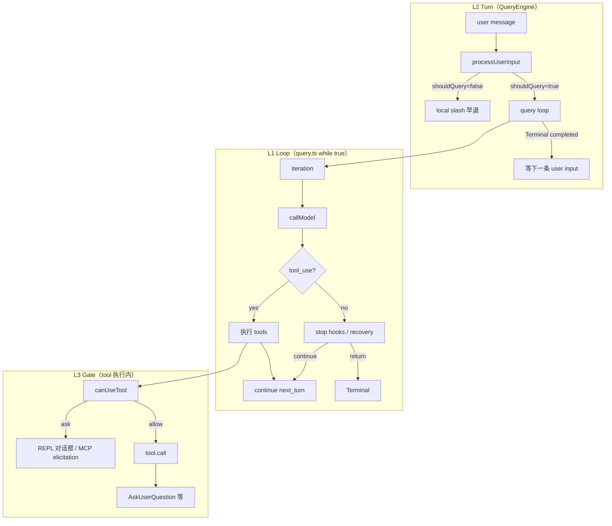

# 28 · Agent Loop 续跑与人机门控

> **锚点：** `query.ts`（needsFollowUp / stop hooks / tool 执行）· `query/stopHooks.ts` · `hooks/useCanUseTool.tsx` · `hooks/toolPermission/PermissionContext.ts`  
> **前置：** [06 query loop](./06-query-agent-loop.md) · component · [11 Permission & Hooks](./11-permission-and-hooks.md) · [A2 transitions](./appendix/A2-query-loop-transitions.md)

---

## 1. 为什么要单独讲

「Agent loop 怎么一直跑下去」在源码里 **不是单一开关**，而是三层叠加：

| 层 | 问题 | 决策者 |
|----|------|--------|
| **L1 Loop** | 同一 user turn 内还要不要再调 API？ | `query.ts`：`needsFollowUp`、stop hooks、recovery、maxTurns |
| **L2 Turn** | 本轮结束后还要不要等用户下一条输入？ | QueryEngine：`shouldQuery`、SDK return、`completed` |
| **L3 Gate** | 某次 tool 执行要不要阻塞等人点选？ | `canUseTool`、`AskUserQuestion`、MCP elicitation |

混淆 L1 与 L3 是读源码时最常见的误区：**loop 可能在 continue，但线程阻塞在 permission 对话框上**。

---

## 2. 三层模型总览



---

## 3. L1：Loop 何时 **continue**（不等用户新 message）

### 3.1 正常 tool follow-up（最常见）

```834:834:/Users/zmz/Github/claude-code/src/query.ts
                needsFollowUp = true
```

流式消费 `callModel` 时，见到 `tool_use` block 即置 `needsFollowUp = true`。**不依赖** `stop_reason === 'tool_use'`。

tool 执行完后：

```1715:1727:/Users/zmz/Github/claude-code/src/query.ts
    const next: State = {
      messages: [...messagesForQuery, ...assistantMessages, ...toolResults],
      ...
      transition: { reason: 'next_turn' },
    }
    state = next
  } // while (true)
```

→ 同一 user turn 进入下一 iteration（先 compact 再 API）。

### 3.2 Stop hook 注入 blocking message → continue

模型 **没有** tool_use，但 stop hook 返回 `blockingErrors`：

```1282:1305:/Users/zmz/Github/claude-code/src/query.ts
      if (stopHookResult.blockingErrors.length > 0) {
        const next: State = {
          messages: [
            ...messagesForQuery,
            ...assistantMessages,
            ...stopHookResult.blockingErrors,
          ],
          ...
          transition: { reason: 'stop_hook_blocking' },
        }
        state = next
        continue
      }
```

**语义：** hook 说「你还不能停」——注入 synthetic user/tool error，**逼模型再跑一轮**。典型：测试未通过、lint 失败。

注意：`hasAttemptedReactiveCompact` **不能**在此 reset，否则 PTL → stop hook → compact 会 infinite loop（源码注释 `query.ts:1292-1296`）。

### 3.3 Token budget 自动续轮（feature `TOKEN_BUDGET`）

无 tool_use、stop hooks 无 blocking 时，仍可能 continue：

```1308:1340:/Users/zmz/Github/claude-code/src/query.ts
      if (feature('TOKEN_BUDGET')) {
        const decision = checkTokenBudget(...)
        if (decision.action === 'continue') {
          state = {
            messages: [..., createUserMessage({ content: decision.nudgeMessage, isMeta: true })],
            transition: { reason: 'token_budget_continuation' },
          }
          continue
        }
      }
```

逻辑见 [07 §10](./07-api-and-model-stream.md#10-token-budget-与-task_budget) 与 `query/tokenBudget.ts`：turn 输出 token 未达 budget 90% 且非 diminishing returns 时注入 meta nudge 让模型继续。

### 3.4 错误 recovery continue

| 场景 | transition | 条件 |
|------|------------|------|
| 413 PTL | `collapse_drain_retry` | context collapse drain 成功 |
| 413 PTL | `reactive_compact_retry` | reactive compact 摘要成功 |
| max_output_tokens | `max_output_tokens_escalate` / `recovery` | 8k→64k 或 meta recovery |

详见 [06 §5](./06-query-agent-loop.md#5-完整-transition-表13-个-reason) 与 [A2](./appendix/A2-query-loop-transitions.md)。

### 3.5 maxTurns 检查时机

在 **continue 之前**检查（`query.ts:1704-1711`）：`nextTurnCount > maxTurns` → `return { reason: 'max_turns' }`。  
即：最后一轮 tool follow-up 仍允许，但下一轮 iteration 开始前被截断。

---

## 4. L1：Loop 何时 **return**（结束本轮 agent 运行）

| reason | 触发 | 是否跑 stop hooks |
|--------|------|-------------------|
| `completed` | 无 follow-up + hooks 通过 + 无 token budget 续 | ✅ 已跑 |
| `stop_hook_prevented` | `preventContinuation: true` | ✅ 已跑 |
| `max_turns` | 超限 | — |
| `aborted_*` | AbortSignal | 部分路径 |
| `prompt_too_long` / `model_error` | recovery 失败 | ❌ **故意跳过** |
| `blocking_limit` | autocompact 关且 token 超 blocking | ❌ |

**PTL 为何不跑 stop hooks：**

```1168:1175:/Users/zmz/Github/claude-code/src/query.ts
        // No recovery — surface the withheld error and exit. Do NOT fall
        // through to stop hooks: the model never produced a valid response,
        // so hooks have nothing meaningful to evaluate.
```

hook 若 inject blocking message 会让 loop continue，在已 PTL 的 context 上形成 **death spiral**。

### 4.1 Tool 执行层的 `preventContinuation`

Stop hook 之外，**PostToolUse hook** 可 yield `hook_stopped_continuation` attachment：

```1388:1393:/Users/zmz/Github/claude-code/src/query.ts
        if (
          update.message.type === 'attachment' &&
          update.message.attachment.type === 'hook_stopped_continuation'
        ) {
          shouldPreventContinuation = true
        }
```

→ 即使后面还有 tool results，也会阻止进入 `next_turn`（与 stop hook 的 `preventContinuation` 不同路径，但效果类似）。

---

## 5. L2：Turn 何时结束并 **等用户**

QueryEngine 层，`query()` return `{ reason: 'completed' }` 后：

1. yield SDK `result` subtype（usage、permission_denials、stop_reason…）
2. REPL：**阻塞在 prompt**，等用户下一条 message
3. SDK headless：`ask()` generator 结束，脚本继续或 exit

**Local slash 早退**（不进 loop）：

```410:428:/Users/zmz/Github/claude-code/src/QueryEngine.ts
const { shouldQuery, resultText, ... } = await processUserInput(...)
// shouldQuery === false → yield local output + result → return
```

`/config`、`/clear` 等 **零 API 调用**，直接结束 turn。

---

## 6. L3：Loop 内部的 **人机门控**（阻塞但不结束 turn）

### 6.1 Permission：`canUseTool` 三路

| behavior | Loop 状态 | 用户体验 |
|----------|-----------|----------|
| `allow` | 继续执行 tool | 无感 |
| `deny` | 继续（合成 error tool_result） | 模型看到拒绝 |
| `ask` | **阻塞**在 permission UI | REPL 弹框；headless 用 MCP elicitation 或 deny |

REPL 路径：`useCanUseTool.tsx` + `PermissionContext.ts` 队列。  
Headless：`print.ts` 的 `createCanUseToolWithPermissionPrompt`。

决策链（简化）：

```text
canUseTool(tool, input, ctx)
  ├─ alwaysAllowRules / alwaysDenyRules 命中?
  ├─ permission mode (plan / acceptEdits / bypassPermissions / dontAsk)?
  ├─ auto mode classifier (yoloClassifier) allow/deny?
  ├─ Bash speculative classifier?
  ├─ PermissionRequest hook?
  └─ ask → 队列 UI → user allow/deny
```

详见 [11 §3–§5](./11-permission-and-hooks.md)。

### 6.2 模型主动问用户：`AskUserQuestion`

专用 tool，**requiresUserInteraction**。Plan mode、skill 模板强制模型用此 tool 而非纯文本提问（`constants/prompts.ts` 多处注释）。

执行时阻塞直到用户选择选项 → tool_result 回 loop → **L1 continue**。

### 6.3 Plan mode 审批门

流程见 [17 §2](./17-plan-mode-and-code-editing.md#2-人机交互路径)：`EnterPlanMode` → 只写 md → `ExitPlanMode` 请求批准 → 用户确认后 `ExitPlanMode` 切回 default 执行。

### 6.4 用户打断：`interruptBehavior`

`Tool.interruptBehavior()`：

- `'block'`（默认多数写操作）：用户新 message **排队**，等 tool 完成
- `'cancel'`：abort 正在跑的 tool

与 `AbortController`（Ctrl+C）不同：后者走 `aborted_tools` Terminal。

### 6.5 Sleep / Background（见 23 篇）

`SleepTool`（feature PROACTIVE/KAIROS）：模型主动休眠，**结束当前 iteration 但不结束 session**——wake 后由 cron/外部事件触发新 turn。Background agent 在独立 querySource 跑 loop，主 thread REPL 仍可交互。

---

## 7. 决策速查表

### 「会不会再调 API？」（L1）

| 情况 | 再调 API？ |
|------|-----------|
| 有 tool_use 且 tool 跑完 | ✅ continue |
| 无 tool_use，stop hook blocking | ✅ continue |
| token budget 未满 90% | ✅ continue |
| 413/reactive 恢复成功 | ✅ continue |
| 无 tool_use，hooks 通过 | ❌ completed |
| preventContinuation | ❌ stop_hook_prevented |
| maxTurns | ❌ max_turns |
| User abort | ❌ aborted_* |

### 「会不会停下来等人？」（L3 / L2）

| 情况 | 等人？ |
|------|--------|
| `canUseTool` → ask | ✅（tool 阻塞） |
| AskUserQuestion | ✅ |
| ExitPlanMode 待批 | ✅ |
| completed → REPL | ✅（下一条 user message） |
| bypassPermissions / auto allow | ❌ |
| background agent | ❌（主 thread 不等子 agent） |

---

## 8. 与「yolo / 自动模式」的关系

社区「yolo」≈ 减少 L3 门控次数，**不改变 L1 continue 逻辑**：

| 配置 | 对 L3 的影响 |
|------|-------------|
| `bypassPermissions` + `--dangerously-skip-permissions` | 跳过全部 canUseTool 弹窗 |
| `acceptEdits` | 自动 allow 文件编辑 |
| `dontAsk` | 不弹窗；未预批则 deny |
| auto mode classifier | AI 判 allow/deny，仍可能 deny |

详见 [11 §4](./11-permission-and-hooks.md#4-auto-mode-与-yolo-语义)。

---

## 9. 读源码推荐顺序

1. `query.ts:558`（needsFollowUp）→ `1062-1357`（无 follow-up 分支）→ `1360-1727`（tool 执行 + continue）
2. `query/stopHooks.ts` `handleStopHooks`
3. `hooks/toolPermission/PermissionContext.ts` `createPermissionContext`
4. `query/tokenBudget.ts` `checkTokenBudget`
5. `tools/AskUserQuestionTool/`、`EnterPlanModeTool/`、`ExitPlanModeTool/`

---

## 10. 自测

- [ ] 画出 L1/L2/L3 三层，各举一个 continue 与一个「等人」例子
- [ ] stop hook blocking 与 preventContinuation 区别？
- [ ] PTL 后为何不跑 stop hooks？
- [ ] token budget continuation 注入的是什么类型的 message？
- [ ] `hook_stopped_continuation` 在哪一层生效？
- [ ] yolo 改的是哪一层？会改变 needsFollowUp 吗？

**关联：** [06](./06-query-agent-loop.md) · [11](./11-permission-and-hooks.md) · [17](./17-plan-mode-and-code-editing.md) · [07 §10](./07-api-and-model-stream.md#10-token-budget-与-task_budget) · [23 §4](./23-worktree-background-and-cron.md#4-sleep-与-proactive-唤醒)
