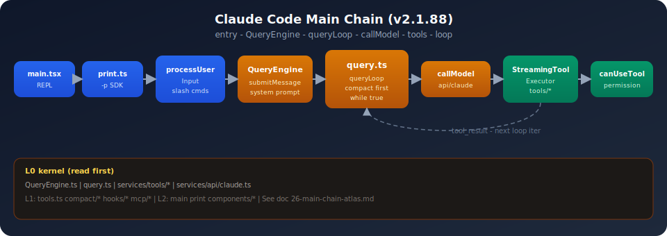

# Claude Code 学习笔记

> **基准：** v2.1.88 TS 快照 · pin [`936e6c8`](https://github.com/zhumengzhu/claude-code/commit/936e6c8e8d7258dd1b2bc127d704f02cc23076d5)  
> **源码 fork：** [zhumengzhu/claude-code](https://github.com/zhumengzhu/claude-code)  
> **官方产品：** [anthropics/claude-code](https://github.com/anthropics/claude-code)



<p align="center"><sub>主链路与 L0 内核 · 深读见 <a href="./26-main-chain-atlas.md">26 总图</a></sub></p>

---

## 从这里开始

| 你是谁 | 第一步 | 完整路径 |
|--------|--------|----------|
| 第一次学 Claude Code | **[26 主链路总图](./26-main-chain-atlas.md)** | [路径 A · 约 4–6h](./learning-paths.md#路径-a第一次学-claude-code--约-46-小时) |
| 内核深读 | [A1 叙事](./appendix/A1-user-turn-journey.md) | [路径 B · 3–5 天](./learning-paths.md#路径-b内核深读--约-35-天) |
| SDK / headless | [19 print/SDK](./19-sdk-headless-and-print-mode.md) | [路径 C](./learning-paths.md#路径-c-sdk--headless--约-1-天) |
| 架构扫读 | [00 理念](./00-philosophy-and-exposure.md) | [路径 D](./learning-paths.md#路径-d架构扫读--约-12-小时) |

**推荐起手：** `00 → 26 → A1 → 06 → 10 → 25 自测`

---

## 文档分层

| 类型 | 文档 | 用途 |
|------|------|------|
| **地图** | [26 总图](./26-main-chain-atlas.md) | 5 分钟建立全局 |
| **架构** | [01 总览](./01-architecture-overview.md) | 四层架构与主次 |
| **叙事** | [A1](./appendix/A1-user-turn-journey.md) | 一条 turn 跟读 |
| **深读** | [A2](./appendix/A2-query-loop-transitions.md) · [10 压缩/cache](./10-compaction-and-context.md) · [28 Loop 门控](./28-agent-loop-continuation-and-human-gates.md) | transition · 压缩 · 续跑/等人 |
| **流程** | [flow/](./flow/README.md) | 横切流程索引 |
| **路径** | [learning-paths](./learning-paths.md) | Checklist 自学（含路径 F 部署集成） |
| **验收** | [25 mastery](./25-architecture-review-and-mastery.md) | 自测 + 架构评价 |
| **速查** | [99 索引](./99-glossary-and-reading-map.md) | 术语 → 章节 |

---

## 概念目录

共 **34 篇正文** + 附录 + 导航。

| 层级 | 编号 | 主题 | 状态 |
|------|------|------|------|
| **A 定位** | [00](./00-philosophy-and-exposure.md) | 理念、暴露背景、阅读边界 | ✅ |
| | [01](./01-architecture-overview.md) | 四层架构与运行时脊柱 | ✅ |
| **B 骨架** | [02](./02-directory-map-and-layers.md) | 目录地图与模块分层 | ✅ |
| | [03](./03-cli-entry-and-repl.md) | CLI 交互入口、main、REPL | ✅ |
| | [04](./04-config-and-settings.md) | schemas、settings、迁移 | ✅ |
| **C 内核** | [05](./05-query-engine.md) | QueryEngine、submitMessage | ✅ |
| | [06](./06-query-agent-loop.md) | query.ts、query/*、transitions | ✅ |
| | [07](./07-api-and-model-stream.md) | API 流、model、fallback | ✅ |
| | [08](./08-message-and-session-persistence.md) | Message、JSONL、resume | ✅ |
| | [09](./09-tools-system.md) | Tool.ts、tools/*、services/tools | ✅ |
| | [10](./10-compaction-and-context.md) | **渐进式压缩与 prompt cache** | ✅ |
| | [11](./11-permission-and-hooks.md) | permission、hooks | ✅ |
| **D 扩展** | [12](./12-commands-and-input-preprocessing.md) | slash、processUserInput | ✅ |
| | [13](./13-system-prompt-and-context.md) | system prompt 组装 | ✅ |
| | [14](./14-mcp-and-external-protocols.md) | MCP 协议与连接 | ✅ |
| | [15](./15-skills-and-plugins.md) | skills、plugins | ✅ |
| | [16](./16-lsp-and-code-intelligence.md) | LSP、代码智能 | ✅ |
| | [17](./17-plan-mode-and-code-editing.md) | plan mode、FileEdit 策略 | ✅ |
| **E 高级** | [18](./18-bridge-and-ide.md) | bridge、IDE 集成 | ✅ |
| | [19](./19-sdk-headless-and-print-mode.md) | print、stream-json、ask | ✅ |
| | [20](./20-agents-and-subagents.md) | AgentTool、agent 定义 | ✅ |
| | [21](./21-tasks-team-and-coordinator.md) | tasks、team、swarm、coordinator | ✅ |
| | [22](./22-remote-and-server-mode.md) | remote、server | ✅ |
| | [23](./23-worktree-background-and-cron.md) | worktree、background、cron | ✅ |
| **F 收束** | [24](./24-cost-analytics-and-limits.md) | cost、quota、analytics | ✅ |
| | [25](./25-architecture-review-and-mastery.md) | 架构评价与验收 | ✅ |
| **Atlas** | [26](./26-main-chain-atlas.md) | **主链路总图** | ✅ |
| **专题** | [27](./27-multi-model-thinking-and-fallback.md) | thinking、effort、fallback | ✅ |
| | [28](./28-agent-loop-continuation-and-human-gates.md) | **Loop 续跑与人机门控** | ✅ |
| | [29](./29-memory-and-auto-memory.md) | **Memory 与 extractMemories** | ✅ |
| | [30](./30-advanced-features-and-experiments.md) | Tool Search、Proactive、实验门控 | ✅ |
| **附录** | [A1](./appendix/A1-user-turn-journey.md) · [A2](./appendix/A2-query-loop-transitions.md) | 叙事 · loop 深读 | ✅ |
| **导航** | [flow/](./flow/README.md) · [learning-paths](./learning-paths.md) · [99](./99-glossary-and-reading-map.md) · [external-resources](./external-resources.md) | 流程 · 路径 · 速查 · 社区 | ✅ |

**进度：** 34/34 正文 + 附录 + 导航 **全部完成**。

---

## 社区资料

见 [external-resources.md](./external-resources.md)（Windy · cablate · qqzhangyanhua 等）。

---

## 关联（后期对照，非首读）

| 系统 | 笔记 |
|------|------|
| OpenCode | [../opencode/README.md](../opencode/README.md) |
| OmO | [../oh-my-openagent/README.md](../oh-my-openagent/README.md) |

---

## 本地源码

```bash
git clone https://github.com/zhumengzhu/claude-code.git
cd claude-code && git checkout 936e6c8e8d7258dd1b2bc127d704f02cc23076d5
```

本地路径 `~/Github/claude-code/src/` 亦可带读（建议与 fork 对齐 git 历史）。
