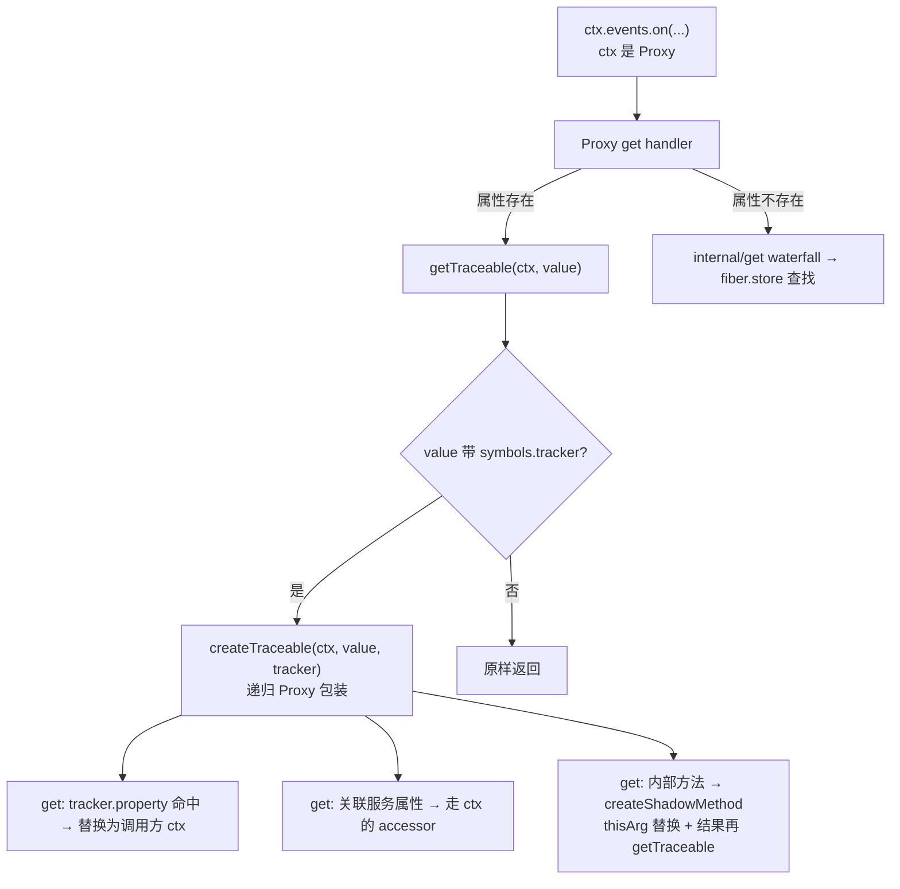
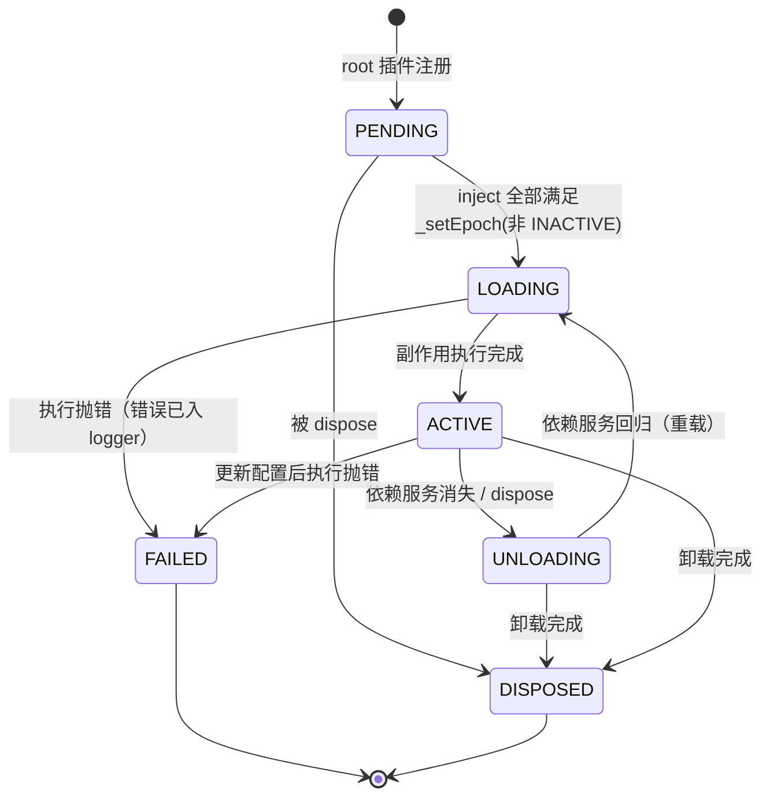
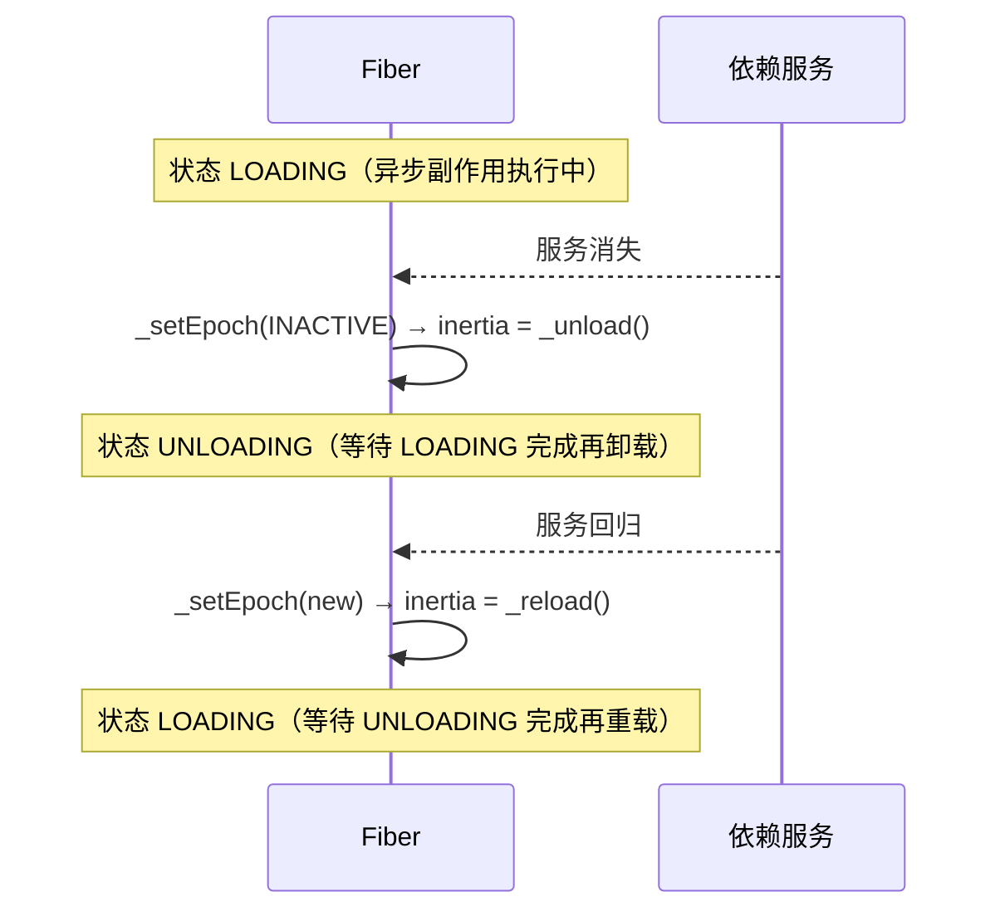
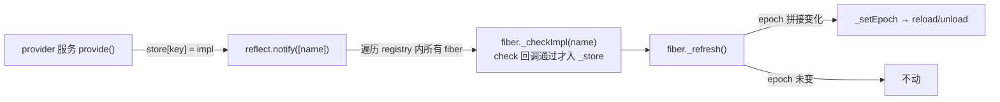

# 01 内核：Context / Fiber / Reflect / Events / Logger

> 证据基线：[`cordis@8cc9e33`](https://github.com/cordiverse/cordis/tree/8cc9e33/packages/core/src)，源码约 2500 行，全部位于 `packages/core/src/`。

## 1. Context：一切皆原型链，一切皆 Proxy

`Context` 实例是一个 **Proxy**（handler 定义在 `ReflectService.handler`），构造函数返回的是包装后的 self：
[context.ts#L36-L52](https://github.com/cordiverse/cordis/blob/8cc9e33/packages/core/src/context.ts#L36-L52)

```mermaid
flowchart LR
    subgraph root["root Context（真实对象）"]
        iso1["isolate: Dict<symbol> 服务身份表"]
        int1["intercept: Dict 配置覆盖表"]
    end
    subgraph child["ctx.extend(meta) 子上下文"]
        iso2["isolate 原型链子表"]
        int2["intercept 原型链子表"]
        meta["meta 附加属性"]
    end
    root -. Object.create .-> child
    iso1 -. Object.create .-> iso2
    int1 -. Object.create .-> int2
```

三个关键设计：

1. **隔离即原型链**：`isolate(name, label)` 在子表上添加 `name → Symbol`，服务身份 = 符号。同名服务在不同 realm 下是不同符号，互不干扰；原型链保证子上下文可见父作用域的服务。
2. **覆盖即原型链**：`intercept(name, config)` 同理，配置覆盖沿原型链向上合并（`Service.resolveConfig` 逐层收集 + `Config.merge`）。
3. **`get/set/has` 全部走 Proxy 拦截**（[reflect.ts#L62-L181](https://github.com/cordiverse/cordis/blob/8cc9e33/packages/core/src/reflect.ts#L62-L181)）：普通属性走 `Reflect.get(target, prop, ctx)` 并做 **getTraceable**；未声明属性触发 `internal/get` waterfall，沿 fiber 链向上查找 `fiber.store[prop]`；找不到则抛出带增强栈的 "cannot get property without inject"。

## 2. 可追踪上下文（getTraceable / createTraceable）

这是整个框架可观测性的基石，也是**最难看懂的 100 行**：
[utils.ts#L110-L222](https://github.com/cordiverse/cordis/blob/8cc9e33/packages/core/src/utils.ts#L110-L222)



- 每个 Service 构造时打上 `tracker = { associate, property: 'ctx' }`（[service.ts#L18-L34](https://github.com/cordiverse/cordis/blob/8cc9e33/packages/core/src/service.ts#L18-L34)）
- 一旦某个服务对象被"从上下文中取出"，就变成追踪 Proxy：读取它的 `.ctx` 返回**取用者的上下文**；调用它的方法时 `this` 也会被替换
- 效果：`ctx.a.someService.getFoo()` 里 `getFoo` 内部 `this.ctx` 就是 `ctx.a`，服务无需关心自己在哪个作用域被使用
- **代价**：所有跨上下文方法调用都被包一层 Proxy，有性能与调试成本；`shadow.spec.ts`（176 行）专门测这套语义

## 3. Fiber：插件生命周期状态机

每个插件实例 = 一个 Fiber，共 6 态（[fiber.ts#L78-L99](https://github.com/cordiverse/cordis/blob/8cc9e33/packages/core/src/fiber.ts#L78-L99)）：



三个核心机制：

### 3.1 effect 系统（副作用收集）
`ctx.effect(execute, label)` 是插件注册一切副作用的唯一入口（[fiber.ts#L278-L346](https://github.com/cordiverse/cordis/blob/8cc9e33/packages/core/src/fiber.ts#L278-L346)）。支持 5 种返回类型：同步函数、Promise、迭代器、异步迭代器、null。所有 disposer 进入 `DisposableList`，卸载时**逆序**执行；dispose 链用 Promise 串联保证顺序。

### 3.2 inertia 锁（加载/卸载互斥）
`_reload` / `_unload` 通过 `this.inertia` 互锁（[fiber.ts#L399-L441](https://github.com/cordiverse/cordis/blob/8cc9e33/packages/core/src/fiber.ts#L399-L441)）：



对应测试 `fiber.spec.ts` 的 "inertia lock 1/2/3"：无论事件如何交错，Fiber 都能收敛到正确终态，且 `await fiber` 会等待全部惯性任务（`await()` 循环 `while (this.inertia)`）。

### 3.3 响应式注入（epoch 对比）
- 插件通过 `inject: ['foo']` 声明依赖（`@Inject()` 装饰器或对象字面量）
- 每次服务变更后 `reflect.notify(names)` 遍历所有 fiber：重算 `_checkImpl(name)` → `_refresh()`
- `_refresh()` 用 `':' + impl.fiber.uid` 拼接 epoch（[fiber.ts#L385-L393](https://github.com/cordiverse/cordis/blob/8cc9e33/packages/core/src/fiber.ts#L385-L393)），**epoch 变了才触发 reload**——这就是"响应式"：依赖的服务实例换了，插件自动重载；没变则不动



## 4. Registry：插件 → Runtime → 多个 Fiber

[registry.ts](https://github.com/cordiverse/cordis/blob/8cc9e33/packages/core/src/registry.ts)：
- 以 **plugin 函数为 key** 存 `Runtime { fibers: DisposableList, callback, Config }`；同一插件多次 `ctx.plugin()` 共享 runtime，但各自独立 Fiber
- `ctx.plugin()` 返回的是**包装过的 Fiber**（`Object.create(fiber)` + 自定义 `then`），可以直接 `await fiber` 等待其进入终态，也可以当对象访问 `fiber.state/config`——测试专门断言"wrapped fiber 不持有自身 state/config 属性"（保证状态始终从基对象读）

## 5. Events：五种派发模式

[events.ts](https://github.com/cordiverse/cordis/blob/8cc9e33/packages/core/src/events.ts#L14)：

| 模式 | 语义 | 用途 |
|------|------|------|
| `emit` | 同步全部执行 | 通知类事件 |
| `parallel` | 并发执行，聚合错误为 AggregateError | 异步通知 |
| `serial` | 顺序执行，首个非空结果短路 | 请求类 |
| `bail` | 同步短路 | 校验/鉴权 |
| `waterfall` | 管道：每个 listener 接 `next` | 可拦截管道（`internal/get`、`internal/update`） |

内部 8 个 `internal/*` 事件（`internal/plugin/status/service/get/set/listener/dispatch/update`）是框架自身的扩展点，loader/include/hmr 全部借它们挂接。

## 6. Logger：可调用服务

- `LoggerService` 实现 `[symbols.invoke]`，因此 `ctx.logger('name')` 返回具名 Logger（[logger.ts#L193-L222](https://github.com/cordiverse/cordis/blob/8cc9e33/packages/core/src/logger.ts#L193-L222)）
- 多 exporter 分发 + 格式器（`%s %o %C` 等）+ 1000 条环形缓冲
- `Logger.color/code` 用名字哈希选色；`%C` 输出彩色名字
- node/browser 双实现：`@cordisjs/plugin-logger-console` 的 exports 按环境分流

## 7. 本模块验收清单

- [ ] 能画出 Context 原型链与 Proxy 拦截路径
- [ ] 能解释 `getTraceable` 为何让服务方法内 `this.ctx` 指向调用方
- [ ] 能画出 Fiber 状态机与 inertia 互斥流程
- [ ] 能说清"为什么注入是响应式的"（epoch 对比）
- [ ] 能说出五种事件派发模式的区别
