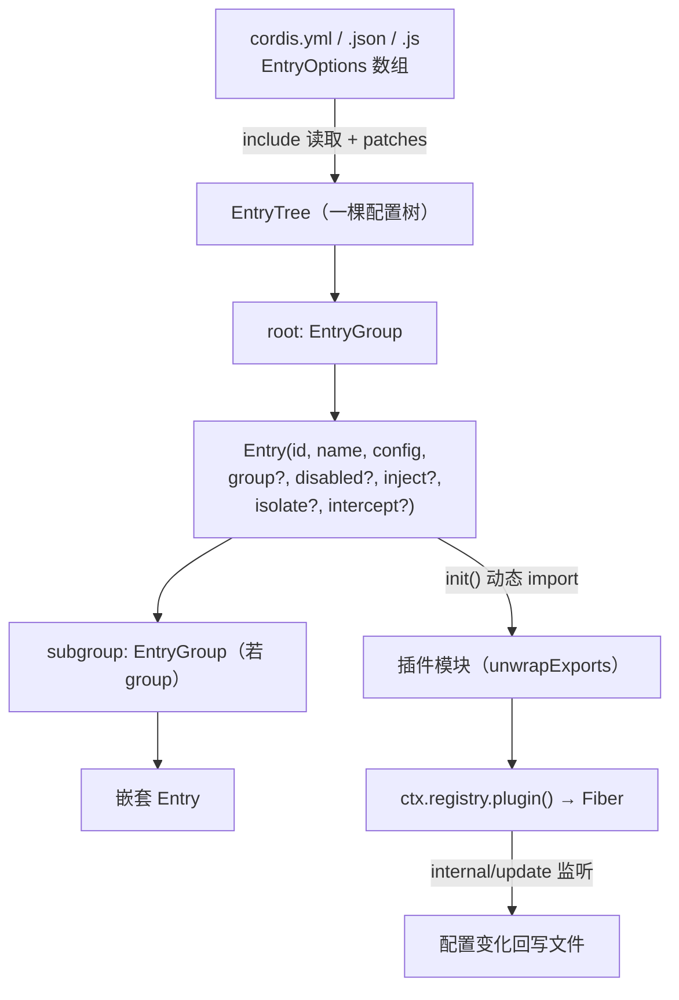
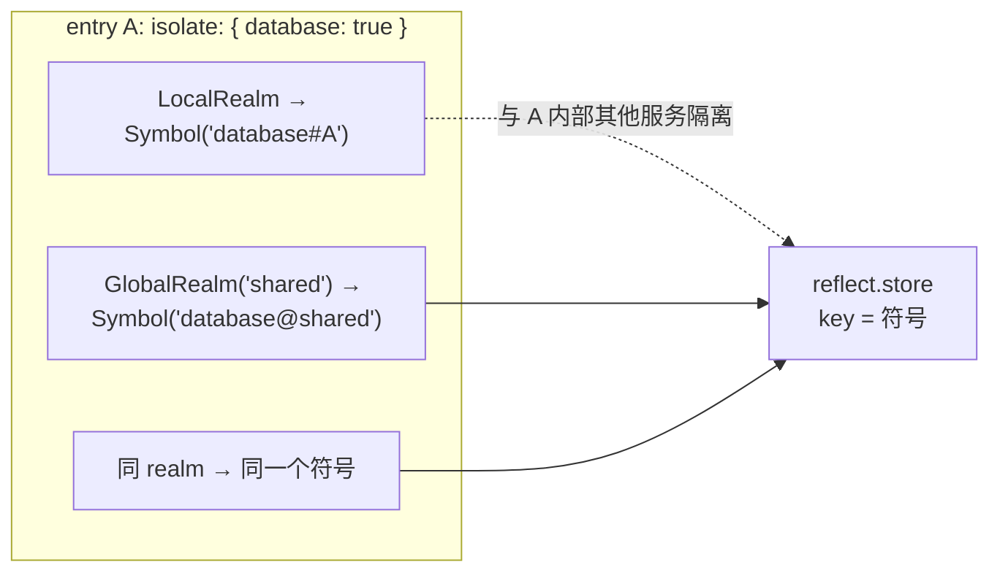
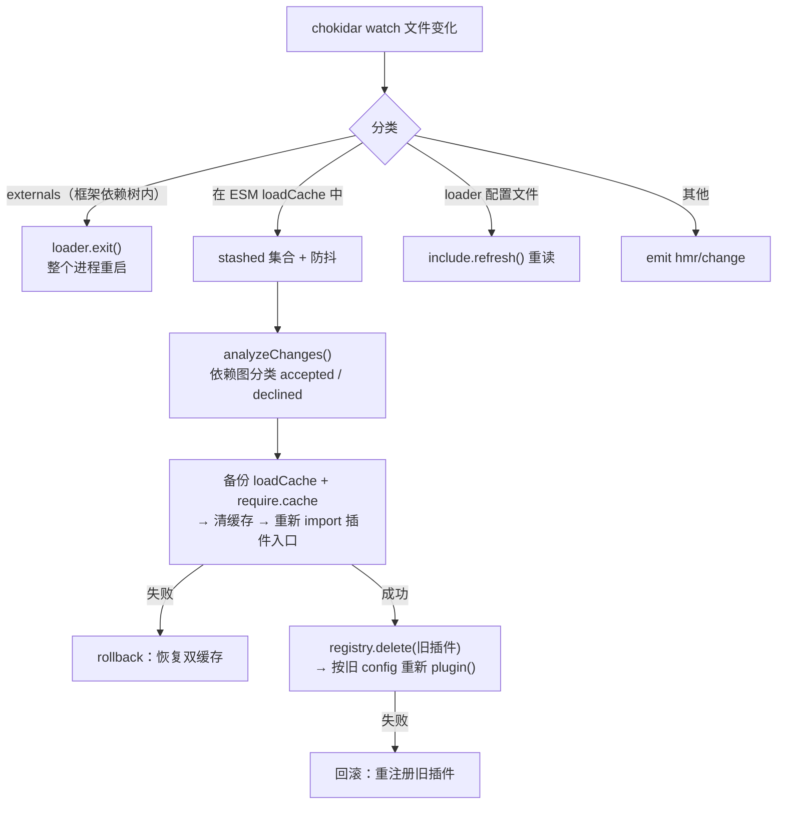

# 02 配置树：loader / include / hmr

> 证据基线：`cordis@8cc9e33`。`packages/loader`（~670 行）是配置树枢纽，`include` 管文件同步，`hmr` 管热重载。

## 1. Entry 配置树：从 YAML 到插件实例

核心类型（[config/entry.ts#L34](https://github.com/cordiverse/cordis/blob/8cc9e33/packages/loader/src/config/entry.ts#L34)、[config/tree.ts#L6](https://github.com/cordiverse/cordis/blob/8cc9e33/packages/loader/src/config/tree.ts#L6)、[config/group.ts#L5](https://github.com/cordiverse/cordis/blob/8cc9e33/packages/loader/src/config/group.ts#L5)）：

- **Entry**：一个配置单元。`id` 支持 `:` 嵌套寻址（`parent.subgroup:child`）；`disabled` 沿父链计算（祖先禁用则自身禁用）；配置支持 `!js` 表达式插值（`new Function + with + eval`，见 [config/utils.ts#L3-L12](https://github.com/cordiverse/cordis/blob/8cc9e33/packages/loader/src/config/utils.ts#L3-L12)）
- **EntryTree**：一棵树的容器，`import()` 走内部 ModuleLoader（获得模块缓存控制权）或回退普通 `import`
- **EntryGroup**：一个分组；`Group` 插件本身就是一个 group（`@cordisjs/plugin-group` 只是 `Group` 的 re-export，[group/src/index.ts](https://github.com/cordiverse/cordis/blob/8cc9e33/packages/group/src/index.ts) 仅 3 行）

**配置双向同步**：`internal/update` 事件被 loader 监听（[loader/src/index.ts#L66-L76](https://github.com/cordiverse/cordis/blob/8cc9e33/packages/loader/src/index.ts#L66-L76)）——插件内 `ctx.fiber.update(config)` 会反向写回 Entry 配置并触发 `tree.write()` 落盘；文件被外部修改则 `include.refresh()` 重新读入并 `root.update()`。

## 2. Realm 隔离：服务的"命名空间"

`isolate` 选项决定一个服务在哪个 realm 里（[config/isolate.ts](https://github.com/cordiverse/cordis/blob/8cc9e33/packages/loader/src/config/isolate.ts)）：

- `isolate: { name: true }` → **LocalRealm**（仅本 entry 内可见）
- `isolate: { name: 'label' }` → **GlobalRealm**（所有声明同 label 的 entry 共享）
- patch-context 时：比较新旧符号 → 生成 diff → 迁移 `reflect.store` 中的 impl → `reflect.notify(diff)` 通知依赖方重载 → 最后做 realm 垃圾回收（无 entry 引用即删除）
- 这套机制让"多数据库实例"、"多会话作用域"成为纯配置声明，插件代码零感知

## 3. include：配置文件 ⇄ 插件树

[include/src/index.ts](https://github.com/cordiverse/cordis/blob/8cc9e33/packages/include/src/index.ts)（219 行）：

- 支持 `.yaml/.yml/.json`（以及作为初始值的 JS/TS 模块）
- 自定义 YAML 类型 `!js`（`tag:yaml.org,2002:js`）→ `{ __jsExpr }` → `interpolate()` 求值
- **patches**：在不改源文件的前提下对 Entry 树做覆盖/插入（`id` 定位 + `name` 校验防错配）
- 写回：`.tmp` 临时文件 + `rename` 原子替换 + `setTimeout` 防抖；只读检测（`access(W_OK)`）
- 支持脱离 loader 单独使用（`support usage outside loader` commit）

## 4. HMR：热模块替换的完整链路

[hmr/src/index.ts](https://github.com/cordiverse/cordis/blob/8cc9e33/packages/hmr/src/index.ts)（405 行，最复杂插件）：

关键点：

1. **accepted/declined 分类**：以 `job.linked` 递归依赖图做不动点迭代——直接变更文件 accepted，其依赖者传播 accepted；所有依赖都被 declined 的文件才 declined
2. **双缓存清空**：ESM `loadCache`（用 `Map.prototype.delete` 绕过 Node 24 的 delete 语义差异）+ CJS `require.cache` 都要清，否则 Node 24 下 CJS 模块会读到旧模块
3. **回滚**：先备份两份缓存，任何一步失败都恢复缓存 + 重注册旧插件
4. `--expose-internals` 是硬要求（构造时抛错），测试通过 vitest `execArgv` 注入

## 5. Node 版本兼容的脆弱面（证据）

| 位置 | 依赖的 Node 内部 API | 风险 |
|------|---------------------|------|
| [internal.ts#L101-L121](https://github.com/cordiverse/cordis/blob/8cc9e33/packages/loader/src/internal.ts#L101-L121) | `internal/modules/esm/loader` 的 `getOrInitializeCascadedLoader` | v1（22/23）/ v2（24+）接口签名不同，代码已分支兼容 |
| [internal.ts#L56-L76](https://github.com/cordiverse/cordis/blob/8cc9e33/packages/loader/src/internal.ts#L56-L76) | `--expose-internals` require + `node-addon-require-builtin` 回退 | addon 为可选 peerDep，两路都失败则返回 undefined |
| [hmr/src/index.ts#L318-L341](https://github.com/cordiverse/cordis/blob/8cc9e33/packages/hmr/src/index.ts#L318-L341) | `loadCache` 的 `Map.prototype.delete` 语义 | Node 24 中 `delete` 只把 type 槽置 undefined，必须绕过 |
| CI [.github/workflows](https://github.com/cordiverse/cordis/blob/8cc9e33/.github/workflows/build.yml) | Node 24 / 26 双矩阵 | 22/23 不测，回退路径无 CI 覆盖 |

## 6. 本模块验收清单

- [ ] 能画出 Entry → EntryTree → EntryGroup → Fiber 的生成链路
- [ ] 能解释 LocalRealm 与 GlobalRealm 的符号差异
- [ ] 能说清"插件 update 配置如何写回文件"（internal/update 链）
- [ ] 能描述 HMR 的 accepted/declined 分类算法
- [ ] 知道 loader/hmr 依赖哪些 Node 内部 API 及其版本差异
