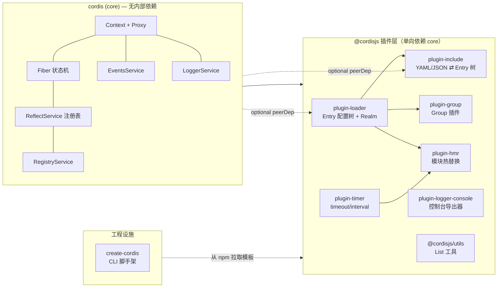

# Cordis 调研笔记

> Cordis — "A Meta-Framework of Spatiotemporal Composability"（时空可组合性的元框架），
> 即 Koishi 的底层框架。本文档基于本地仓库精读 + 全部 163 个测试运行验证。

- **官方仓库**：[cordiverse/cordis](https://github.com/cordiverse/cordis)
- **pin commit**：`8cc9e33`（2026-08-13，chore: update readme #45，working tree clean）
- **调研方式**：逐文件精读全部 9 个包源码（~4000 行）+ 运行 `yarn test`（19 个文件 / 163 用例全绿）+ `yarn lint`（干净）
- **性质**：本文是个人学习记录，非上游官方文档；行号证据均指向 pin commit

## 一句话定位

Cordis 不是"又一个 DI 容器"，而是一套**以 Context 原型链 + Fiber 生命周期状态机为骨架、以隔离符号（realm）为身份、以 Proxy 追踪为可观测性**的插件运行时。核心创新点：

1. **响应式注入**：服务出现/消失会自动触发依赖方插件的卸载与重载（`reflect.notify` → `fiber._refresh`）
2. **可追踪上下文**：`ctx.anyService.method()` 内部拿到的 `this.ctx` 永远是发起调用的那个上下文（Proxy + 符号协议）
3. **配置树驱动**：YAML/JSON 配置文件 ⇄ 运行时插件树双向同步，支持热更新、分组、realm 隔离

## 学习路径

| 编号 | 主题 | 层级 | 核心问题 |
|------|------|------|----------|
| [01](./01-core-runtime.md) | 内核：Context / Fiber / Reflect / Events / Logger | 深度 | 插件生命周期如何运转？依赖注入为何是"响应式"的？ |
| [02](./02-loader-config-tree.md) | 配置树：loader / include / hmr | 深度 | 配置文件如何变成插件树？realm 隔离如何实现？HMR 如何安全重载？ |
| [03](./03-quality-and-risks.md) | 质量评估与风险清单 | 综合 | 强在哪、脆在哪、如果重做先改哪 |

## 系统关系图

## 依赖规则速记

- core 仅依赖 `cosmokit`（工具库）与 `@standard-schema/spec`（配置校验协议），**零框架内部依赖**，可独立运行
- 所有插件单向依赖 core；loader 是"配置树枢纽"，include/hmr/group 都以它为基础
- `create-cordis` 完全独立（从 npm 拉取 `@cordisjs/boilerplate` 模板解压）
- 工具链：yarn 4 workspace + yakumo（esbuild 打包 + tsc 类型）+ vitest（fork 池，`--expose-internals`）

## 一句话结论（详细见各篇）

- **最强机制**：Fiber 的 inertia 锁 + epoch 对比，保证"服务消失→插件卸载→服务回归→重载"的原子性，不会被并发刷新击穿
- **最脆之处**：loader/hmr 直接操作 Node 内部 `ModuleLoader`（v1/v2 接口）与 ESM `loadCache`，随 Node 版本变动极易碎
- **最值得复用**：`composeError` 长栈拼接、realm 符号隔离、可追踪 Proxy 三件套
