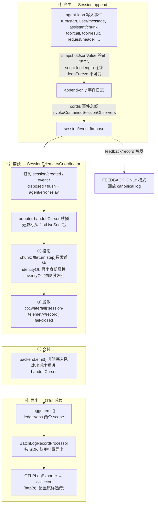
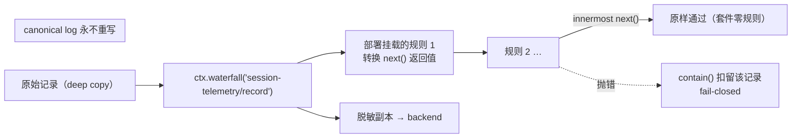
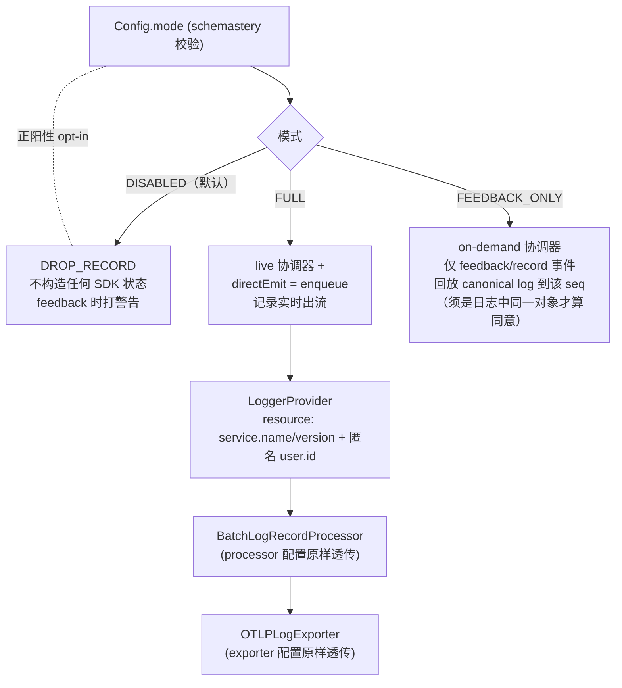

# 01 session-telemetry 捕获 → 脱敏 → OTel 导出全链路

> 证据基线：`deepseek-ai/deepseek-harness@47f943859b`，本地源码精读。
> 涉及包：`packages/core/session`（事件产生）、`packages/session/session-telemetry`（捕获）、
> `packages/session/session-telemetry-otel`（导出）。

## 1. 全链路总览

## 2. ① 产生：Session 事件日志（packages/core/session）

`Session.append(type, data)` 是所有 agent 交互的唯一写入口：
[index.ts#L575-L640](https://github.com/deepseek-ai/deepseek-harness/blob/47f943859bef60e4160492346772ded9b24f765a/packages/core/session/src/index.ts#L575-L640)

三个铁律（贯穿全链路的信任基础）：
1. **JSON 可序列化在源头强制**：`snapshotJsonValue` 一次递归验证+拷贝（BigInt、函数、循环引用、Map/Set/Date 都在 append 处拒绝）——这保证 telemetry 的 `body` 必然是 OTel `AnyValue` 子集，clone/导出永不抛
2. **seq = log.length 连续**：存储可逐字持久化；handoff 游标靠它寻址
3. **deepFreeze 不可变**：事件及其嵌套数据冻结，canonical log 无法被改写（这也是"脱敏只作用于导出副本"的前提）

发布走 cordis 事件总线：`invokeContainedSessionObservers(emitCtx, 'session/event', ...)`（每 listener 错误各自包含，一个坏订阅者不饿死其他订阅者）。

## 3. ② 捕获：SessionTelemetryCoordinator（session-telemetry/coordinator.ts）

[coordinator.ts#L60-L130](https://github.com/deepseek-ai/deepseek-harness/blob/47f943859bef60e4160492346772ded9b24f765a/packages/session/session-telemetry/src/coordinator.ts#L60-L130)

- **live 模式**订阅：`session/created`（adopt）、`session/event`（captureEvent）、`session/disposed`（补 shutdown 标记并退役）、`session/flush`（转发可选 flush 提示）、`agent/error`（relay 为 ops 记录）
- **全部挂在 `ctx.effect()/ctx.on()` 上**——捕获器生命周期即 cordis 插件生命周期；dispose 时给仍存活的 session 补 shutdown 标记，再 `await backend.shutdown()`
- **adopt 续播**：`handoffCursor` 是 **module-scope WeakMap**（[coordinator.ts#L43](https://github.com/deepseek-ai/deepseek-harness/blob/47f943859bef60e4160492346772ded9b24f765a/packages/session/session-telemetry/src/coordinator.ts#L43)）——文档承认这是对"注册即 effect"纪律的窄例外：cordis 没有 HMR 状态交接 API，以 Session 对象为 key 才能让热重载后的 fiber 续播而非重发历史
- 无游标时从 `session.firstLiveSeq` 起，**不是 seq 0**：构造 seed（resume/fork/replay）从未上过 firehose，其内容已在别的进程/父流身份下离开

## 4. ③ 投影与记录构建

[captureEvent](https://github.com/deepseek-ai/deepseek-harness/blob/47f943859bef60e4160492346772ded9b24f765a/packages/session/session-telemetry/src/coordinator.ts#L180-L200)：

- **chunk 投影**：每 `(turn, step)` 只发第一个 `assistant/chunk`（stream-started 信号）；被丢弃的 chunk 不推进游标，重播时确定性重弃。内容字节级完整在 `assistant/message` 里
- **两类记录**（`channel` 字段）：
  - `ledger`：会话日志镜像（有 `event.seq` 身份）
  - `ops`：操作信号（`agent-error`、`shutdown`），故意无 seq——永远不会被误认成日志行
- **身份属性最小化**：`session.id / event.type / event.seq` + 头部有的 `cwd / parent_id / seed_length`；"能从 body 恢复的绝不重复"
- **severity 预映射**：`tool/result` 的 `isError`、`turn/end` 的 `reason.kind === 'error'` → `error`，其余 fall-through `info`（可合并扩展，未知类型不炸）

## 5. ④ 脱敏：cordis waterfall 扩展点

[redact()](https://github.com/deepseek-ai/deepseek-harness/blob/47f943859bef60e4160492346772ded9b24f765a/packages/session/session-telemetry/src/coordinator.ts#L213-L216) 只有一行：`this.ctx.waterfall('session-telemetry/record', record, () => record)`。

关键语义（源码注释原话）：
- **零内建规则**：`SessionTelemetryBackend` 的 Service Definition 明确"this package ships NO rules"——导出数据干净与否 = 部署挂了什么规则
- **fail-closed**：listener 抛错 → `contain()` 捕获并 `logger.warn` → 该记录被扣留，且**绝不进入 agent loop**（cordis `emit` 是 stop-on-throw，必须 contain）
- **live vs on-demand**：live 在 append 时脱敏；on-demand（FEEDBACK_ONLY）在回放 canonical log 时用**当时**挂载的策略脱敏
- 只作用于导出副本，canonical session log 永不重写

## 6. ⑤ 交付：非阻塞 + 游标

[deliver()](https://github.com/deepseek-ai/deepseek-harness/blob/47f943859bef60e4160492346772ded9b24f765a/packages/session/session-telemetry/src/coordinator.ts#L218-L221)：

- `backend.emit(record)` 是同步非阻塞入队（`SessionTelemetrySink` 契约第一条）；在 `session/event` 热路径上调用，慢于队列推入就会拖累 agent loop
- **游标推进 = 已交付，非已导出**（"handed-off, not delivered"）——SDK 的批量/重试/丢包策略完全在交付之后
- backend 抛错被 contain，绝不触碰 loop

## 7. ⑥ OTel 导出：三模式后端（session-telemetry-otel/src/index.ts）

[index.ts#L147-L280](https://github.com/deepseek-ai/deepseek-harness/blob/47f943859bef60e4160492346772ded9b24f765a/packages/session/session-telemetry-otel/src/index.ts#L147-L280)：

- **两个 instrumentation scope**：ledger → `@deepseek-ai/dsh-session-telemetry-otel`，ops → `.../ops`——接收端可以分开告警
- **字段映射**：`time` → timestamp/observedTimestamp；severity → `SeverityNumber`（INFO 9 / WARN 13 / ERROR 17）；`body` → AnyValue（第 2 节的 JSON 铁律保证安全）；attributes 原样
- **resource 身份**：`service.name/version`（来自 dsh-llm 的 `APP_IDENTITY`）+ `user.id`（`$DSH_HOME/.anonymous-user-id`，随机 UUID，首次使用创建、删文件即重置）——每次导出批次携带一次
- **配置校验在加载时 fail-fast**：
  - `url` 必须 http(s)，FULL/FEEDBACK_ONLY 必填
  - `maxExportBatchSize` 必须正整数——SDK 接受非正值但 shutdown 时队列空转**永久挂死**（坑，注释记录了）
  - `shutdownTimeoutMillis` 正有限数（≤ 2^31-1，Node 定时器上限）
- **故意不实现 `flush()`**：SDK 的批量处理器按自己的节奏导出；转发 flush 提示会引入并发 flush，与 shutdown 内部 drain 的交互会**静默丢尾记录**（revival Agent Note 记录的坑）
- **shutdown() 带外 deadline**：`provider.shutdown()` 与 3s 定时器 `Promise.race`；超时后 provider promise 仍被观察（防 unhandled rejection），记录可能丢失但应用正常退出

## 8. cordis 在链路中的具体角色

| 环节 | cordis 能力 |
|------|------------|
| 事件发布 | `session/event` 走 cordis 事件总线（`invokeContainedSessionObservers`） |
| 捕获器生命周期 | `ctx.effect()/ctx.on()`——dispose 时补 shutdown 标记 + backend.shutdown |
| 脱敏扩展点 | `ctx.waterfall('session-telemetry/record')` |
| 服务形态 | `SessionTelemetryBackend extends Service` + 类型化事件声明合并 |
| 错误包含 | `ctx.logger.warn` 兜底 |
| 依赖注入 | `static inject = ['sessions']` |

## 9. 验收清单

- [ ] 能画出 产生→捕获→投影→脱敏→交付→导出 六段链路
- [ ] 能解释"为什么 body 必然是 AnyValue"（append 时 JSON 铁律）
- [ ] 能说清 chunk 投影与 handoffCursor 的作用
- [ ] 能说出脱敏的三条语义（零规则 / fail-closed / 只改导出副本）
- [ ] 能区分 FULL / FEEDBACK_ONLY / DISABLED 三模式的捕获路径
- [ ] 知道 flush() 为什么不能实现、shutdown 超时意味着什么
