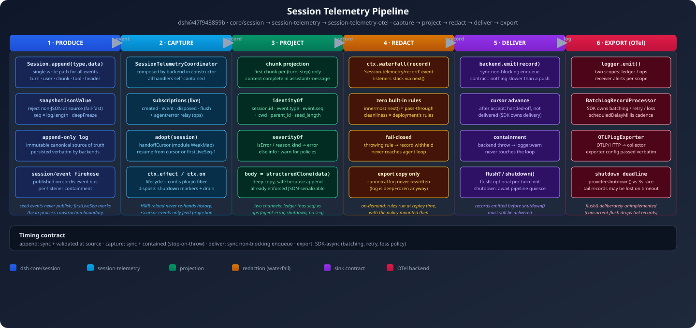
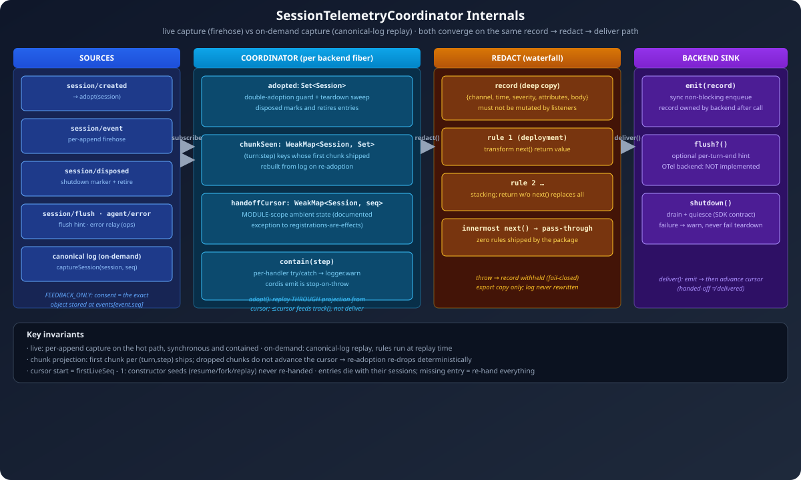
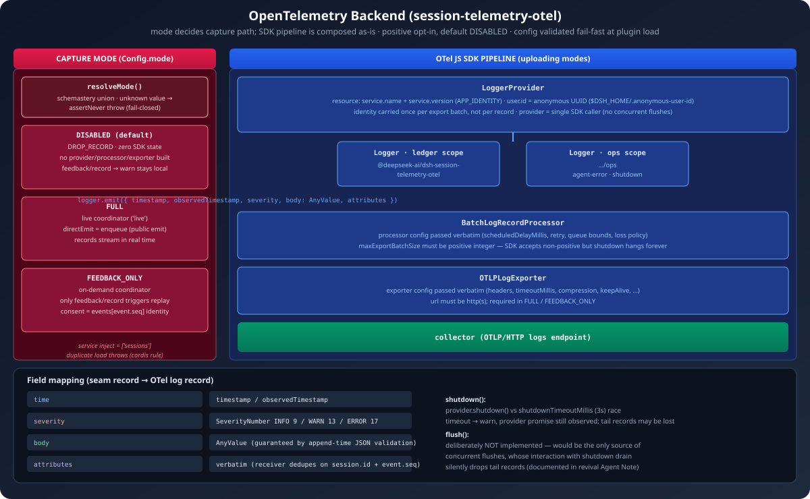
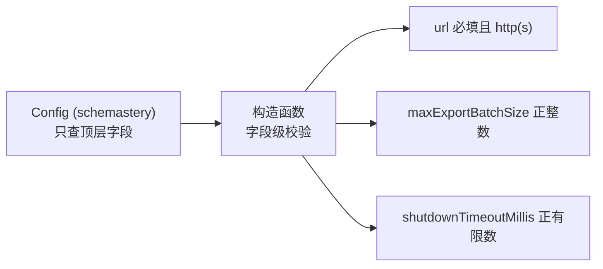

# 02 session-telemetry 机制深挖（SVG 图解版）

> 证据基线：`deepseek-ai/deepseek-harness@47f943859b`。
> 与 [01 全链路概览](./01-session-telemetry-chain.md) 互补：01 用 mermaid 讲"链路怎么走"，
> 本文件用高信息密度 SVG 讲"每个环节内部是什么、为什么这么设计、边界在哪"。
> 图内文字为英文（GitHub SVG 渲染要求），中文说明在本文件正文。

## 0. 阅读导引

| 图 | 回答的问题 |
|----|-----------|
| [telemetry-pipeline.svg](./assets/telemetry-pipeline.svg) | 六段链路的全景：每段的输入、输出、核心机制、契约 |
| [capture-internals.svg](./assets/capture-internals.svg) | 捕获器内部：live/on-demand 双路径、handoff 游标、chunk 投影、脱敏栈、交付 |
| [otel-backend.svg](./assets/otel-backend.svg) | 三模式决策 + OTel SDK 管道 + 字段映射 + fail-fast 校验 |

---

## 1. 全链路六段（泳道图）



*图 1：捕获 → 投影 → 脱敏 → 交付 → 导出。每段独立成"段"，段间只传递不可变记录。*

### 1.1 段与段之间的契约（从上图读出的关键）

- **①→② 传的是"事件"**：`Session.append` 产生的不可变事件对象，走 cordis 事件总线（`invokeContainedSessionObservers`，每监听者错误独立包含）
- **②→③→④ 传的是"记录"**：`{channel, time, severity, attributes, body}`，body 是 `structuredClone(event.data)` 深拷贝，**记录一旦交给 waterfall 就不可变**（监听者禁止修改）
- **⑤→⑥ 传的是"已脱敏记录"**：`backend.emit()` 同步非阻塞入队，SDK 之后的一切（批量、重试、丢包）都不再属于捕获方
- **契约核心**：`capture hot path sync → deliver non-blocking → export SDK-async`——agent loop 的 turn 延迟只被同步入队影响，绝不被网络/重试影响

## 2. 捕获器内部（SVG 图）



*图 2：coordinator 的三个状态容器 + 双捕获路径 + 脱敏栈 + sink 契约。*

### 2.1 三个状态容器的设计意图

| 容器 | 类型 | 生命周期 | 为什么是 WeakMap/Set |
|------|------|---------|---------------------|
| `adopted` | `Set<Session>` | 每 fiber 实例 | 防重复收养 + teardown 扫描未标记 session；session 释放后条目自动消失 |
| `chunkSeen` | `WeakMap<Session, Set<"turn:step">>` | 每 session | 已发首块的 (turn,step) 集合；重新收养时从日志重建 → 确定性重弃 |
| `handoffCursor` | `WeakMap<Session, number>`（**module 级**） | 每 session，随 session 消亡 | 热重载后新 fiber 续播而非重发历史 |

`handoffCursor` 是源码明确标注的**纪律例外**（`registrations-are-effects` 纪律：所有状态应随 effect 注册/撤销）：
> "cordis has no HMR state-handover API, and keying by the Session object ... is the only in-process lifetime that lets a re-adopting fiber resume instead of re-handing history."

这是对 cordis 机制边界的一个诚实承认：**HMR 状态交接是 cordis 没提供、dsh 用模块级弱引用绕过的能力**。

### 2.2 live vs on-demand：两条路径的取舍

| 维度 | live（FULL） | on-demand（FEEDBACK_ONLY） |
|------|-------------|---------------------------|
| 触发 | 每个 append（`session/event` 热路径） | 仅 `feedback/record` 事件 |
| 脱敏时机 | append 时 | **回放时**（用当时挂载的策略） |
| 本地留存 | 无（实时流出） | 无 telemetry 副本，回放 canonical log |
| 丢数据的代价 | 无记录被扣留（除非规则抛错） | 无 feedback 就永远本地化 |
| 同意模型 | 部署配置即同意 | **consent = `events[event.seq] === event`**（已提交的日志记录才算同意，独立广播被忽略） |

注意 `FEEDBACK_ONLY` 的"同意即记录本身"是个巧妙设计：不是"用户点了同意按钮"这类带外信号，而是**canonical log 中已持久化的那条 feedback 记录**——审计上可追溯（同意本身也是日志）。

## 3. OTel 后端（SVG 图）



*图 3：模式决策 + SDK 管道 + 字段映射 + 两个"记录的坑"。*

### 3.1 为什么配置校验要 fail-fast 到字段级



schema 只做顶层校验（`z.any()` 透传 SDK 配置对象），**字段级校验放在构造函数**，理由（源码注释）：

> "SDK options pass through unchanged: the SDK defines and validates their fields. Re-declaring them here would silently drop every field this plugin did not repeat."

两个真实踩过的坑（都有注释记录）：
1. `maxExportBatchSize` 非正整数：SDK 接受，但 shutdown 时 `splice(empty)` 空转队列 → **dispose 永久挂死**
2. `flush()` 若转发给 `forceFlush()`：成为唯一并发 flush 源，与 shutdown 内部 drain 的交互**静默丢尾记录** → 所以故意不实现（`flush?()` 是可选接口，OTel 后端不填）

### 3.2 shutdown 的"带外 deadline"模式

```
await Promise.race([
  provider.shutdown(),        // SDK 自己的完成 promise
  setTimeout(reject, 3000),   // dsh 持有的外部 deadline
])
// 超时后 provider promise 仍被观察 → 不会 unhandled rejection
// 记录可能丢失，但应用 teardown 正常继续
```

SDK 的 `exportTimeoutMillis` 只包住 `exportCompleted`，不包住其前面的 `forceFlush()`（传输层拿不到 socket 时可无限挂起）。dsh 加 3s 外 deadline 保证**应用退出不被观测管道卡死**——这是"可观测性不能反过来成为应用可用性的依赖"的典型工程决策。

## 4. 关键设计决策表

| # | 决策 | 理由（源码证据） | 代价 |
|---|------|----------------|------|
| 1 | append 时强制 JSON 可序列化 + deepFreeze | 事件日志是可持久化的事实源，坏事件在源头拒绝 | 写路径多一次递归校验 |
| 2 | chunk 只投影首块 | 内容字节级完整在 `assistant/message`，流块是 token 级冗余 | 重放丢失流中间状态（接收方从 message 重建） |
| 3 | handoffCursor 用 module 级 WeakMap | cordis 无 HMR 状态交接 API | 违反"注册即 effect"纪律（文档已承认） |
| 4 | 脱敏零内建规则 | 导出数据干净度 = 部署挂的规则 | 默认裸奔（原样导出） |
| 5 | 脱敏 fail-closed | cordis `emit` 是 stop-on-throw | 规则 bug = 丢记录 |
| 6 | `emit()` 非阻塞入队契约 | 捕获在 hot path，慢于 push 就拖累 loop | 后端吞吐受限 |
| 7 | SDK 配置原样透传 | 重建字段会静默丢其他字段 | 配置错误要 SDK 文档兜底 |
| 8 | 不实现 `flush()` | 并发 flush 静默丢尾记录 | 导出节奏完全交给 SDK |
| 9 | shutdown 带外 3s deadline | SDK 传输挂起不能卡死应用退出 | 超时丢尾记录 |
| 10 | 匿名 user.id（随机 UUID 文件） | 匿名遥测 + 进程稳定 | 删文件即重置身份 |

## 5. 失败模式清单（每条都有源码对应的处理）

| 失败 | 处理 | 位置 |
|------|------|------|
| 脱敏规则抛错 | 该记录被扣留（fail-closed），不影响其他记录 | `contain()` + waterfall |
| backend.emit 抛错 | logger.warn，不进 loop | `contain()` |
| backend.shutdown 失败 | warn，不失败应用 teardown | coordinator dispose |
| provider.shutdown 超时 | warn + 观察 promise，丢尾记录 | `Promise.race` |
| 重复加载 backend | cordis Service 注册抛错（标准行为） | Service 构造 |
| 未知 mode | `assertNever` 抛错（fail-closed） | `resolveMode()` |
| 非 canonical feedback | warn `NON_CANONICAL_FEEDBACK_WARNING`，忽略 | FEEDBACK_ONLY 监听器 |

## 6. 与 cordis 的能力边界（本链路内）

**cordis 提供**：事件总线（`session/event` 发布与订阅）、waterfall（脱敏扩展点）、effect/on 生命周期（捕获器注册与 teardown）、Service 基类与类型化事件、logger（错误包含出口）、依赖注入（`inject: ['sessions']`）。

**cordis 不提供、dsh 自建**：session 事件日志与 JSON 铁律、handoff 游标（模块级 WeakMap）、chunk 投影、脱敏规则体系、SDK 管道组合、shutdown deadline。

**一处 cordis 缺口**：HMR 状态交接 API 缺失，dsh 用模块级 WeakMap 绕过——这是本链路里唯一"对抗框架纪律"的代码，且被文档显式记录。

## 7. 验收清单

- [ ] 能画出六段链路的段间契约（事件/记录/已脱敏记录的边界）
- [ ] 能解释三个状态容器的生命周期差异（fiber 级 vs session 级 vs module 级）
- [ ] 能说清 live 与 on-demand 的脱敏时机差异及其后果
- [ ] 能复述两个"SDK 坑"（maxExportBatchSize、flush()）的机制
- [ ] 能解释 shutdown 带外 deadline 为什么必要
- [ ] 能指出 cordis 在本链路中的能力边界与一处已知缺口
