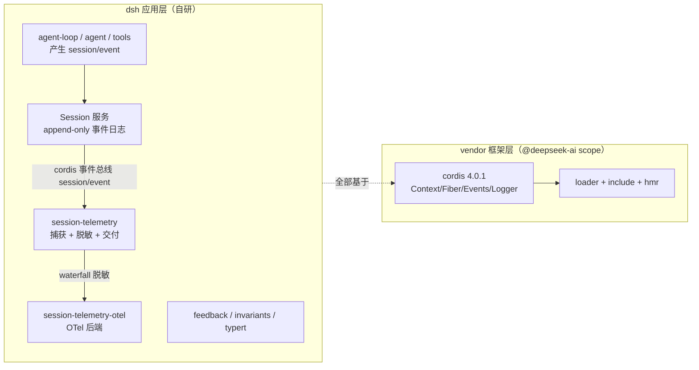

# DeepSeek Harness (dsh) 调研笔记

> DeepSeek Harness（dsh）— DeepSeek 的开源 agent harness，基于 **vendor 的 Cordis 框架**构建。
> 本文档基于本地完整克隆精读（`~/Github/deepseek-harness`）。

- **官方仓库**：[deepseek-ai/deepseek-harness](https://github.com/deepseek-ai/deepseek-harness)
- **pin commit**：`47f943859bef60e4160492346772ded9b24f765a`（2026，Merge PR #2519，v0.1.0-rc.5）
- **与本仓库 cordis 笔记的关系**：dsh 是 cordis 的最大消费者与改造者（vendor + 18 条本地修改），两篇笔记互补
- **代码基线**：`packages/*` 为 dsh 自研包；`vendor/*` 为 cordis 全家桶（`@deepseek-ai` scope，实际版本 cordis 4.0.1）

## 一句话定位

dsh 把 cordis 当作"框架层"整体 vendor 进来并深度改造（fiber 生命周期加固、`internal/config` 懒解析等），
在之上自建了 agent 运行时与**可观测性产品层**（session-telemetry 捕获 → 脱敏 → OTel 导出）。

## 学习路径

| 编号 | 主题 | 层级 | 核心问题 |
|------|------|------|----------|
| [01](./01-session-telemetry-chain.md) | session-telemetry 捕获→脱敏→OTel 导出全链路 | 深度 | 一条 agent 交互如何变成 OTel 日志？脱敏在哪一层做？ |
| [02](./02-session-telemetry-detail.md) | 机制深挖（SVG 图解版） | 深度 | 捕获器内部状态、三模式取舍、SDK 管道与失败模式 |
| 02（规划中） | vendor 与上游 cordis 的差异清单 | 深度 | dsh 对 cordis 改了哪些？为什么？ |

## 系统关系（dsh 内部视角）

## 关键结论速记

- **捕获热路径是同步的**：`backend.emit()` 必须是非阻塞入队，任何慢于队列推入的操作都会拖累 agent loop
- **脱敏是 cordis waterfall 扩展点**：套件零规则，部署挂 listener；fail-closed（规则抛错 → 该记录被扣留）
- **默认不共享**：OTel 导出 `mode` 默认 `DISABLED`，正阳性 opt-in
- **chunk 投影**：每个 (turn, step) 只导出第一个流块（stream-started 信号），内容完整在 `assistant/message`
- **HMR 续播**：handoff 游标是 module-scope WeakMap，热重载不重放历史
