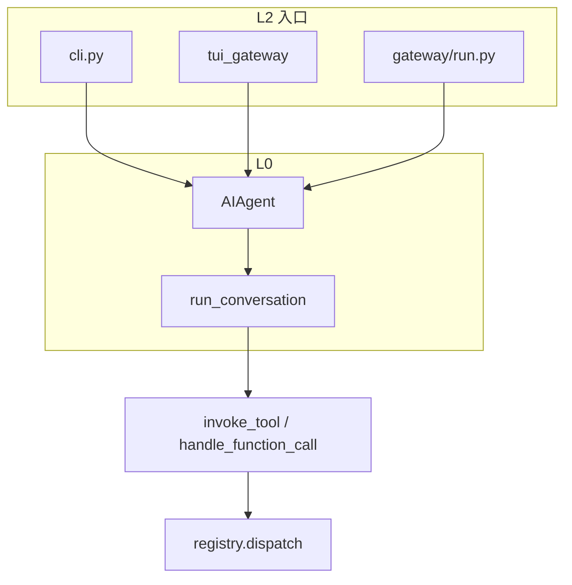

# 01 · 架构总览与模块依赖

> **基准：** pin `889903f` · **权威：** [AGENTS.md Project Structure](https://github.com/NousResearch/hermes-agent/blob/main/AGENTS.md#project-structure)

---

## 1. 一句话脊柱

```text
CLI / Gateway / TUI
  → AIAgent.run_conversation  （conversation_loop.py）
  → LLM API + tools[]
  → invoke_tool / handle_function_call → registry.dispatch
  → SessionDB + MemoryManager + compression
```

内核 **不是** `run_agent.py` 里的大段 while — 而在 `agent/conversation_loop.py`（~4200 行）[05](./05-aiagent-and-conversation-loop.md)。

---

## 2. 四层架构

```text
┌─────────────────────────────────────────────────────────────┐
│ L3  Gateway · Cron · Kanban · ACP · platform adapters        │
├─────────────────────────────────────────────────────────────┤
│ L2  cli.py · hermes_cli/ · ui-tui/ · tui_gateway/           │
├─────────────────────────────────────────────────────────────┤
│ L1  model_tools · tools/* · toolsets · plugins · skills       │
├─────────────────────────────────────────────────────────────┤
│ L0  AIAgent · conversation_loop · providers · memory         │
└─────────────────────────────────────────────────────────────┘
```

| 层 | 代表 | 若改这里… |
|----|------|-----------|
| **L0** | `conversation_loop`, `memory_manager`, `context_compressor` | 影响 **所有** 入口 |
| **L1** | `registry`, `toolsets`, `skills/` | 影响 tool schema 与 dispatch |
| **L2** | `cli.py`, `commands.py`, TUI | 影响交互与 slash |
| **L3** | `gateway/run.py`, `cron/` | 影响消息平台与定时任务 |

---

## 3. 工具依赖链（Invariant）

```text
tools/registry.py          # 无 upstream
       ↑
tools/*.py                 # 顶层 register()
       ↑
model_tools.py             # discover on import
       ↑
run_agent · cli · gateway · cron · delegate 子 agent
```

**插件：** `~/.hermes/plugins/` → `register_tool` — 不改 core 亦可扩展 [06](./06-tools-registry-and-model-tools.md)。

**Generation：** registry 每次 mutate bump `_generation` → tool defs 缓存失效。

---

## 4. L0 内核文件地图

| 模块 | 职责 | 笔记 |
|------|------|------|
| `run_agent.py` | AIAgent façade、forwarder | 05 |
| `conversation_loop.py` | **run_conversation** | 05 |
| `model_tools.py` | schema + handle_function_call | 06 |
| `agent_runtime_helpers.py` | **invoke_tool** | 06 |
| `hermes_state.py` | SessionDB FTS | 08 |
| `memory_manager.py` | Memory 编排 | 08 |
| `system_prompt.py` / `prompt_caching.py` | Prompt + cache | 13 |
| `context_compressor.py` | 压缩 v3 | 14 |
| `conversation_compression.py` | compress_context + session split | 14 |
| `background_review.py` | turn 后 fork | 18 |
| `auxiliary_client.py` | side task 模型链 | 15 |
| `providers/` + plugins | api_mode 解析 | 15 |

---

## 5. 双入口汇合



| 入口 | Agent 实例 | System prompt |
|------|------------|---------------|
| CLI 长会话 | 常复用同一 Agent | 内存 `_cached_system_prompt` |
| Gateway | LRU cache / 每消息新建 | SessionDB **present** 复用 [13](./13-prompt-assembly-and-cache.md) |
| Cron | 每 job 新建 | skip_memory [11](./11-delegation-cron-and-kanban.md) |

---

## 6. 数据流（单 turn）

```text
1. 加载 history + restore system（SessionDB）
2. [可选] preflight compression
3. prefetch memory（一次）→ user fence
4. while: API → tool_calls → dispatch → append tool results
5. [可选] loop 内 compression
6. sync memory providers
7. [可选] background_review 线程
8. flush SessionDB
```

---

## 7. 用户目录

| 路径 | 内容 |
|------|------|
| `~/.hermes/config.yaml` | 非密钥 |
| `~/.hermes/.env` | API keys only |
| `~/.hermes/logs/` | agent / gateway / errors |
| `HERMES_HOME` | Profile 根 [21](./21-profiles-and-credential-pool.md) |
| `~/.hermes/skills/` | 用户/agent skills |
| `~/.hermes/plugins/` | 插件 |

---

## 8. 与 Claude Code 脊柱对照

| 阶段 | Hermes | Claude Code |
|------|--------|-------------|
| 入口 | HermesCLI / GatewayRunner | main / print |
| 预处理 | slash registry | processUserInput |
| 引擎 | `run_conversation` | QueryEngine → query |
| Loop | sync while + dict return | async generator |
| 压缩 | loop + compress_context | compact pipeline |
| 工具 | invoke_tool 双路径 | StreamingToolExecutor |
| 多 agent | delegate 同步 + review fork | subagent / team |

---

## 9. 阅读路线

| 目标 | 路径 |
|------|------|
| 5 分钟 | [26 总图](./26-main-chain-atlas.md) |
| 1 天 | 01 → 05 → 06 → 08 |
| Gateway | 03 → 10 → 05 §Gateway 相关 |
| 插件 | 16 → 06 |

---

## 10. 自测

- [ ] loop 在哪个文件？
- [ ] registry 在依赖链哪一层？
- [ ] Gateway 为何依赖 SessionDB system 行？
- [ ] L3 举三个子系统？
- [ ] invoke_tool 与 handle_function_call 分工？

**关联：** [05 Loop](./05-aiagent-and-conversation-loop.md) · [03 入口](./03-cli-gateway-and-entry.md) · [26 总图](./26-main-chain-atlas.md)
