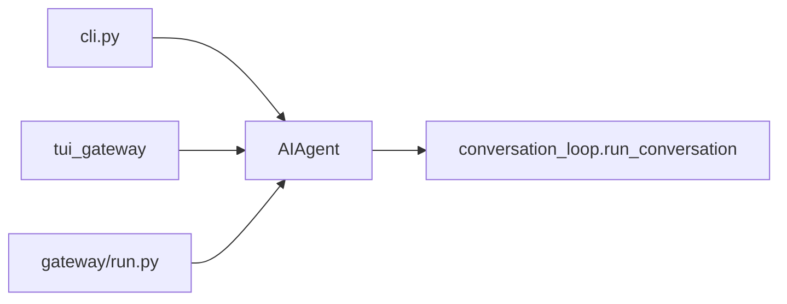

# 03 · CLI、Gateway 与入口

> **锚点：** `hermes_cli/main.py` · `cli.py` · `gateway/run.py` · `tui_gateway/server.py` · `hermes_cli/commands.py`

Hermes **多壳、一核**：所有交互面最终构造 `AIAgent` 并调 `run_conversation` [05](./05-aiagent-and-conversation-loop.md)。差异在 **进程模型、config loader、I/O**。

---

## 1. 入口矩阵

| 命令/模式 | 入口 | Agent 生命周期 |
|-----------|------|----------------|
| `hermes` | `cli.py` → `HermesCLI` | 长会话 **同一 Agent** 可复用 |
| `hermes --tui` | Ink ←stdio→ `tui_gateway` | 每 session RPC；底层仍 AIAgent |
| `hermes gateway start` | `gateway/run.py` | LRU cache 128 / idle 1h [10](./10-gateway-platforms-and-sessions.md) |
| `hermes -p "..."` | `run_agent.main` | 单 turn 或非交互 |
| `hermes dashboard` | `web_server.py` + PTY `--tui` | **不重写** Ink（AGENTS.md） |



---

## 2. `hermes_cli/main.py`

- 子命令路由：setup、model、tools、gateway、cron、kanban、curator、doctor…
- **`_apply_profile_override()`** 最早执行 — `-p profile` → `HERMES_HOME`
- Profile 列表：**`~/.hermes/profiles/`**（非 `HERMES_HOME/profiles/`）[21](./21-profiles-and-credential-pool.md)

---

## 3. 经典 CLI（`cli.py`）

| 组件 | 作用 |
|------|------|
| `HermesCLI` | REPL、banner、response box |
| `process_command()` | slash 分发 |
| `load_cli_config()` | CLI defaults + YAML merge |
| Skin | `display.skin` 主题 |
| Skill slash | 注入 **user message** — 保 system prefix [13](./13-prompt-assembly-and-cache.md) |

### 3.1 Slash 单一 registry

**`hermes_cli/commands.py` — `COMMAND_REGISTRY`**

同一 `CommandDef` 驱动：

- CLI `process_command`
- Gateway `gateway/run.py` handler
- Telegram menu / Slack / 补全

**添加命令 checklist：** registry + CLI handler +（若平台可见）gateway handler — 漏 gateway 是 AGENTS.md Known Pitfall。

### 3.2 与 Gateway 的 guard 分工

1. **Adapter**（`platforms/base.py`）：入站消息 → pending 队列  
2. **Runner**：`/stop`、`/approve`、`/deny` **bypass** 队列直 dispatch  

新 approval 类 slash 必须 **两处** 注册 [10 §6](./10-gateway-platforms-and-sessions.md)。

---

## 4. TUI（`ui-tui` + `tui_gateway`）

```text
Node Ink  ←── NDJSON RPC stdio ──→  Python tui_gateway/server.py
                                      └─ AIAgent + SessionDB
```

| 方向 | 示例 |
|------|------|
| 请求 | `prompt.submit`, `slash.exec`, `session.list` |
| 事件 | `message.delta`, `tool.started`, `approval.request` |

`/help`、`/quit` 在 `app.tsx` **本地**处理；其余 `slash.exec` 走 Python。

TypeScript **仅 UI**；业务逻辑仍在 Python（AGENTS.md）。

---

## 5. Gateway（`gateway/run.py`）

### 5.1 Agent 缓存（1638–1647 行）

```text
_agent_cache: OrderedDict[session_key → (AIAgent, config_signature)]
  → move_to_end on hit
  → _enforce_agent_cache_cap: pop LRU（max 128）
  → _session_expiry_watcher: idle > 1h evict
```

**无 cache 代价：** 每消息 new Agent → rebuild system（含 memory）→ Anthropic prefix **~10×** 成本（注释）。

### 5.2 运行模型

- 入站 `MessageEvent` → normalize → `run_conversation`（常线程池/async）
- `step_callback` / `status_callback` 接平台 UI [05 §3.3](./05-aiagent-and-conversation-loop.md)
- Kanban：`kanban.dispatch_in_gateway` 可选内嵌 dispatcher

### 5.3 三套 Config Loader（陷阱）

| Loader | 消费者 |
|--------|--------|
| `load_cli_config()` | CLI |
| `load_config()` / plugin path | 通用 |
| Gateway raw YAML | `gateway/config.py` |

**改 config.yaml 新键** 须确认三路径是否都读 — AGENTS.md Config loaders。

---

## 6. 工作目录与 context 文件

| 模式 | CWD / 扫描根 |
|------|----------------|
| CLI | 进程 `os.getcwd()` |
| Messaging | `config.yaml` → `terminal.cwd` → `TERMINAL_CWD` env |

Gateway 必须设 `terminal.cwd` 为用户项目 — 否则 AGENTS.md 扫到 **hermes 安装目录** [13](./13-prompt-assembly-and-cache.md)。

---

## 7. 日志与诊断

```bash
hermes logs [--follow] [--level ...] [--session ...]
hermes doctor
hermes gateway doctor
```

日志：`get_hermes_home()/logs/`（agent / errors / gateway）。

---

## 8. 源码带读顺序

1. `main.py` profile override + gateway 子命令入口  
2. `commands.py` COMMAND_REGISTRY 结构  
3. `cli.py` `HermesCLI.run` → `run_conversation`  
4. `gateway/run.py` `GatewayRunner.__init__` cache 字段  
5. `tui_gateway/server.py` RPC 路由 skim  

---

## 9. 自测

- [ ] 四种入口各落到哪两个大文件？
- [ ] 为何 slash 要单一 registry？
- [ ] CLI vs Gateway Agent 生命周期差？
- [ ] cache miss 对费用的影响？
- [ ] 为何 Gateway 不用 `load_cli_config()`？
- [ ] skill slash 为何不进 system？

**关联：** [05 Loop](./05-aiagent-and-conversation-loop.md) · [01 架构](./01-architecture-overview.md) · [10 Gateway 深读](./10-gateway-platforms-and-sessions.md)
