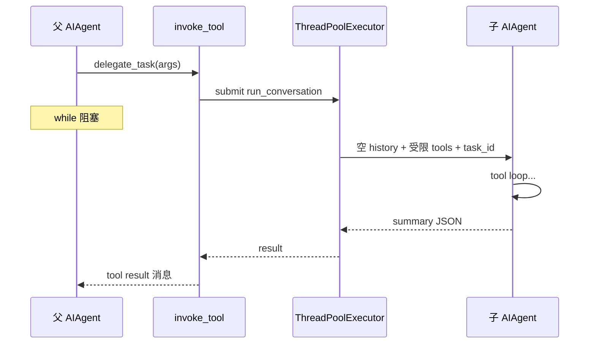

# 11 · Delegation、Cron 与 Kanban

> **锚点：** `tools/delegate_tool.py` · `cron/scheduler.py` · `tools/kanban_tools.py` · AGENTS.md Delegation/Cron/Kanban 节

三类 **子 AIAgent** 路径：同步 delegate、定时 cron、Kanban worker。共同点：spawn `AIAgent`；差异：**是否 block 父 loop**、**memory 策略**、**tool 集**。

---

## 1. 对照总表

| 机制 | 触发 | 父 loop | Memory | session |
|------|------|---------|--------|---------|
| **delegate_task** | 模型 tool | **同步阻塞** | 子 agent **禁** memory | 空 history + 独立 task_id |
| **cron** | `tick()` 60s | 无父（独立 run） | 默认 `skip_memory=True` | 新 session / job 级 |
| **kanban worker** | 任务板 dispatch | 无父 | 按 worker profile | `HERMES_KANBAN_TASK` |

---

## 2. delegate_task

### 2.1 调用链

```text
父 run_conversation while
  → invoke the_tool_calls → invoke_tool("delegate_task")
  → delegate_tool.delegate_task(...)
  → ThreadPoolExecutor(initializer=_set_subagent_approval_cb)
  → 子 AIAgent.run_conversation（空 history）
  → 父阻塞等待 summary JSON
  → 父 messages 仅 +1 条 tool result（无子 intermediate steps）
```

父 loop **不见** 子 agent 中间 tool 消息 — 与 CC background subagent 不同。

### 2.2 DELEGATE_BLOCKED_TOOLS

```45:52:/Users/zmz/Github/hermes-agent/tools/delegate_tool.py
DELEGATE_BLOCKED_TOOLS = frozenset([
    "delegate_task",   # 防递归
    "clarify",         # 子 agent 无 stdin 用户
    "memory",          # 不写共享 MEMORY.md
    "send_message",    # 无跨平台副作用
    "execute_code",    # 强制逐步 tool，非 PTC 脚本
])
```

子 agent toolset = 父 resolved 集 **减** blocked；config `delegation.enabled_toolsets` 可进一步收窄。

### 2.3 并发、深度、budget

| Config（概念） | 作用 |
|----------------|------|
| `delegation.max_concurrent_children` | 同时跑几个子 agent |
| `delegation.max_spawn_depth` | orchestrator 递归层数 |
| `delegation.max_iterations` | 子 agent **独立** IterationBudget（默认 50） |
| `role=orchestrator` | 子 agent 可保留 delegate toolset |

**重要：** 父 `max_iterations`（90）与子 budget **不共享同一计数器** — 总 iteration 可 >90 [02](./02-config-iteration-and-model-routing.md)。

`dynamic_schema_overrides` 把当前限额写进 tool description [06](./06-tools-registry-and-model-tools.md)。

### 2.4 审批 TLS 陷阱（59–72 行注释）

子线程 **不继承** CLI `terminal_tool` 的 `threading.local()` approval callback → 默认 `prompt_dangerous_approval` 会 **deadlock** stdin。

| `delegation.subagent_auto_approve` | 行为 |
|-------------------------------------|------|
| `false`（默认） | `_subagent_auto_deny` — 安全 |
| `true` | `_subagent_auto_approve` — cron/batch YOLO |

Gateway 父 session 走 `tools/approval.py` **session 队列** — 不受 TLS 影响 [10](./10-gateway-platforms-and-sessions.md)。

---

## 3. Cron

### 3.1 调度与锁

```text
Gateway 后台线程 ~60s
  → cron.scheduler.tick()
  → ~/.hermes/cron/.tick.lock（单实例，多 gateway 不重复跑）
  → due jobs → run_job()
```

`scheduler.py` 7 行注释：file lock 保证 **同一时刻只有一个 tick**。

### 3.2 `run_job` 要点（~1585+）

| 项 | 行为 |
|----|------|
| Agent | `AIAgent(platform="cron", skip_memory=True)` |
| Memory | 注释：**Cron system prompts would corrupt user representations** |
| Prompt | 可选 load skill → **assembled-prompt injection scan**（#3968） |
| Toolsets | job `enabled_toolsets` > platform `tools.cron` > 默认 [07](./07-toolsets-and-platform-bundles.md) |
| 时限 | Hard interrupt ~3 min（非交互防 runaway） |
| Delivery | Telegram/Discord/… — `_KNOWN_DELIVERY_PLATFORMS` 校验 |
| 脚本 job | `no_agent` 路径跳过 AIAgent 构造（1162 行注释） |

### 3.3 `cronjob` tool

模型/用户 CRUD job 定义；存储于 profile cron 目录；与 gateway tick **解耦**（job 到期才 run）。

---

## 4. Kanban

### 4.1 Schema 暴露

`kanban_*` 进 API 当：

- 环境 **`HERMES_KANBAN_TASK`**（worker spawn），或  
- profile 显式启用 **kanban toolset**

`get_tool_definitions` 在 `HERMES_KANBAN_TASK` 时强制 append kanban toolset [06](./06-tools-registry-and-model-tools.md)。

### 4.2 工作流

```text
主 agent：kanban_create / update / list（board 协调）
  → SQLite/JSON 任务队列（见 tools/kanban_tools.py）
  → dispatcher  spawn worker AIAgent（独立 session + task env）
  → worker：kanban_complete / block / heartbeat / comment ...
  → 状态回写 board
```

与 OpenCode team-mode **mailbox** 不同 — wait Hermes 内置板 + worker，非多 agent 自由通信 [18](./18-multi-agent-panorama.md)。

细节：[22 §10](./22-integrations-handbook.md#10-kanban-板内部) · Wiki kanban-multi-agent-board。

---

## 5. 时序（delegate）



---

## 6. 与 Claude Code 对照

| | Hermes delegate | CC subagent |
|---|-----------------|-------------|
| 阻塞 | 同步 | 可 background |
| 历史 | 子完全隔离 | fork / sidechain |
| 工具 | DELEGATE_BLOCKED 硬编码 | permission rules |
| Cron | gateway tick 一等公民 | 无同等内置 |

---

## 7. 源码带读

1. `delegate_tool.py` DELEGATE_BLOCKED + ThreadPoolExecutor initializer  
2. `agent_runtime_helpers.invoke_tool` delegate 分支  
3. `cron/scheduler.py` `tick()` + `.tick.lock`  
4. `cron/scheduler.py` `run_job` skip_memory 行  
5. `tools/kanban_tools.py` check_fn + worker env  

---

## 8. 自测

- [ ] 五类 blocked tools 各防什么？
- [ ] 子 agent iteration budget 与父是否同一池？
- [ ] cron 为何 skip_memory？
- [ ] `.tick.lock` 解决什么？
- [ ] worker 如何获得 kanban_* schema？
- [ ] Gateway 上 delegate 审批走哪条路径？

**关联：** [05 Loop §8](./05-aiagent-and-conversation-loop.md#8-delegate_taskloop-内阻塞) · [08 Memory](./08-session-and-memory.md) · [07 Toolsets](./07-toolsets-and-platform-bundles.md) · [10 Gateway](./10-gateway-platforms-and-sessions.md)
