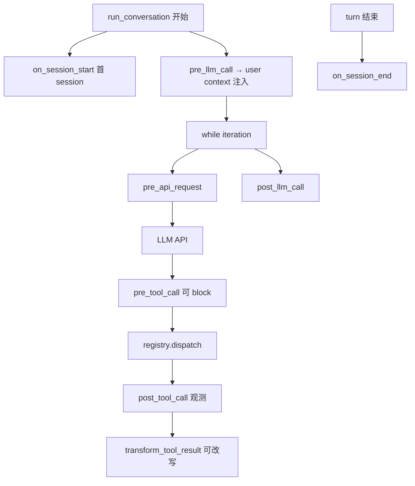

# 16 · Plugins、MCP 与 Hooks

> **锚点：** `hermes_cli/plugins.py`（`VALID_HOOKS` · `invoke_hook` · `get_pre_tool_call_block_message`）· `tools/mcp_tool.py` · [AGENTS.md Plugins](https://github.com/NousResearch/hermes-agent/blob/main/AGENTS.md#plugins)  
> **外部（A）：** [Wiki mcp-and-plugins](https://github.com/cclank/Hermes-Wiki/blob/master/concepts/mcp-and-plugins.md) · [Wiki hook-system](https://github.com/cclank/Hermes-Wiki/blob/master/concepts/hook-system-architecture.md)

插件是 Hermes **首选扩展面**：新 tool、Gateway 行为、memory backend、auxiliary 任务 — 尽量 **不改** `tools/` core [06](./06-tools-registry-and-model-tools.md)。

---

## 1. 三条扩展路径

| 路径 | 注册点 | 改 core？ | 典型用途 |
|------|--------|-----------|----------|
| **Core tool** | `tools/*.py` → `registry.register` + toolset | 是 | 上游贡献 |
| **Plugin** | `PluginContext.register_tool/hook/command` | 否 | 自定义 tool、策略、命令 |
| **MCP** | config + `mcp_tool` 动态挂载 | 否 | 外部工具服务器 |

**政策：** 新 **memory provider** 不再 in-tree → `~/.hermes/plugins/` [08](./08-session-and-memory.md)。

---

## 2. 发现与加载

```text
PluginManager.discover_and_load()
  → ~/.hermes/plugins/ + .hermes/plugins/ + pip entry_points "hermes_agent.plugins"
  → 解析 manifest（name, hooks, tools, commands, kind）
  → plugins.enabled allow-list（opt-in；升级时 migrate  grandfather 已装插件）
  → plugins.disabled 硬拒
```

| 环境 | 用途 |
|------|------|
| `HERMES_PLUGINS_DEBUG=1` | 发现日志 |
| `force=True` on rediscover | 热重载插件（测试/开发） |

**勿** 在 plugin 模块顶层 `import run_agent` — 循环依赖（AGENTS.md）。

---

## 3. `PluginContext` 能力

| 方法 | 效果 |
|------|------|
| `register_tool(...)` | `registry.register` + 跟踪 plugin 名；`override=True` 可替换 built-in |
| `register_hook(name, cb)` | 须在 `VALID_HOOKS` 内 |
| `register_cli_command` | 汇入 slash registry [03](./03-cli-gateway-and-entry.md) |
| `register_auxiliary_task` | 声明 `auxiliary.<key>` 配置块 + model picker [15 §6](./15-provider-and-transport.md#6-auxiliary-侧任务路由) |
| `inject_message` | **仅 CLI** — 空闲排队 / 运行中 interrupt 队列 |

Gateway 模式 `inject_message` 无 CLI ref → warning 返回 false（372–373 行）。

---

## 4. Hook 全表与 fire 顺序（单 turn）

### 4.1 生命周期时间线



**Gateway 入站（更早）：** `pre_gateway_dispatch` — pairing/auth **之前** [20 §5](./20-security-defense-layers.md#5-gateway-授权层-1)。

### 4.2 `VALID_HOOKS`（128–168 行节选）

| Hook | 可改变行为？ | 锚点 |
|------|--------------|------|
| `pre_tool_call` | **可 block** tool | `get_pre_tool_call_block_message` |
| `post_tool_call` | 仅观测（+ duration_ms） | [06](./06-tools-registry-and-model-tools.md) |
| `transform_tool_result` | **可替换** result 字符串 | 第一个 str 赢 |
| `transform_llm_output` | **可替换** 用户可见回复 | 第一个 str 赢 |
| `transform_terminal_output` | 过滤 terminal 输出 | |
| `pre_llm_call` / `post_llm_call` | context 注入 / 观测 | conversation_loop 535+ |
| `pre_api_request` / `post_api_request` | HTTP 层 | 1072+ 行 |
| `on_session_start/end/finalize/reset` | 会话边界 | |
| `pre_gateway_dispatch` | skip / rewrite / allow | Gateway |
| `pre_approval_request` / `post_approval_response` | **仅观测** — 不能替用户点批准 | [20 §2](./20-security-defense-layers.md#2-terminal-审批层-2-深读) |
| `subagent_stop` | 子 agent 结束 | delegate |

---

## 5. `pre_tool_call` block（深读）

```1545:1586:/Users/zmz/Github/hermes-agent/hermes_cli/plugins.py
def get_pre_tool_call_block_message(...):
    """Plugins return {"action": "block", "message": "..."} — first valid block wins."""
    hook_results = invoke_hook("pre_tool_call", ...)
```

**Happy path：**

```text
handle_function_call / invoke_tool
  → get_pre_tool_call_block_message
  → 无 block → ACP edit approval → registry.dispatch
```

**Block path：**

```text
plugin 返回 {"action":"block","message":"..."}
  → 立即 return json.dumps({"error": message})
  → 不进入 approval / dispatch
```

**Single-fire：** `invoke_tool` 已检查 block 时 → `handle_function_call(..., skip_pre_tool_call_hook=True)` [06 §6](./06-tools-registry-and-model-tools.md#6-两条执行路径)。

**与 approval hook 区别：** `pre_tool_call` **阻止 tool 执行**；`pre_approval_request` 只在危险命令 **已进入** approval UI 后观测 — 不能 veto（158–159 行注释）。

**线程 whitelist：** `_thread_tool_whitelist` — 子 agent worker 仅允许指定 tool 名（1563–1566 行）。

---

## 6. Context 注入政策

`invoke_hook("pre_llm_call")` 返回值（1413–1431 行）：

- `{"context": "..."}` 或 plain string  
- **永远** 拼进 **当前 turn user message** — 不进 system  
- **不** 写入 SessionDB（ephemeral）  

与 [13](./13-prompt-assembly-and-cache.md) mid-turn 政策一致。

`conversation_loop` 535–569 行：`pre_llm_call` 在 while **之前** fire 一次。

---

## 7. 专用插件类型（单选）

| kind | 配置 | 接口 |
|------|------|------|
| Memory provider | `memory.provider` | `MemoryProvider` ABC — **一个** external [08](./08-session-and-memory.md) |
| Context engine | `context_engine.*` | `ContextEngine` — 压缩前处理 [14](./14-context-compression.md) |

`get_plugin_context_engine()` — 压缩路径 TypeError fallback（317–320 行 conversation_compression）。

---

## 8. MCP 集成

### 8.1 连接与命名

- 用户/项目 MCP config → `MCPSession` per server  
- Tool 名：`mcp_<server>_<tool>` → 注册进 `registry`，toolset `mcp-<server>`  
- OAuth：`hermes mcp-oauth login`

### 8.2 动态 refresh（`tools/list_changed`）

```1131:1170:/Users/zmz/Github/hermes-agent/tools/mcp_tool.py
async def _refresh_tools(self):
    stale_tool_names = old - new
    for tool_name in stale_tool_names:
        registry.deregister(tool_name)   # bump registry._generation
    self._registered_tool_names = _register_server_tools(...)
```

| 要点 | 说明 |
|------|------|
| `_refresh_lock` | 防 notification 风暴重叠 refresh |
| 只 deregister **消失** 的 tool | 保留仍存在的 handler — 避免 in-flight tool_call 竞态 |
| generation++ | `get_tool_definitions` quiet 缓存失效 [06 §5](./06-tools-registry-and-model-tools.md#5-get_tool_definitions-与-gateway-缓存陷阱) |
| 安全 | added/removed 打 **warning** 日志 — 防恶意 MCP 换工具 |

**仍经 toolsets 过滤：** MCP tool 注册了 ≠ 一定进 API schema — 须在 enabled toolset / resolve 集内。

### 8.3 stdio 子进程 env（与 20 纵深层 4 对齐）

`mcp_tool._build_safe_env`（296–312 行）：

```text
基线：仅 _SAFE_ENV_KEYS + XDG_* 从宿主 os.environ 透传
显式：config 里 server.env 用户声明的键 merge 进去
```

防止 MCP 子进程意外读到宿主 `OPENROUTER_API_KEY` 等 — 与 [20 §1](./20-security-defense-layers.md) MCP 凭证过滤层对应。`${VAR}` 插值在 config 解析阶段展开。

---

## 9. Provider 插件 vs 行为插件

| | `plugins/model-providers/` | 一般 plugin |
|---|---------------------------|-------------|
| API | `register_provider(ProviderProfile)` | `PluginContext.register_*` |
| 加载 | `providers/` lazy scan [15](./15-provider-and-transport.md) | `PluginManager` |
| 用途 | 新 LLM endpoint | tool/hook/command |

---

## 10. Gateway slash 扩展

`register_command` → 须 **同时** 在 `gateway/run.py` 注册 handler，否则 Telegram menu 有命令但 Gateway 不 dispatch [03 §3.1](./03-cli-gateway-and-entry.md#31-slash-单一-registry)。

---

## 11. 源码带读

1. `VALID_HOOKS` 128–168  
2. `get_pre_tool_call_block_message`  
3. `invoke_hook` 异常隔离（plugin 不能 crash loop）  
4. `mcp_tool._refresh_tools`  
5. `PluginContext.register_tool`  

---

## 12. 自测

- [ ] plugin tool 如何 bump registry generation？  
- [ ] pre_tool_call vs pre_approval_request 谁能 block？  
- [ ] pre_llm_call context 为何不进 system？  
- [ ] MCP refresh 为何不全量 nuke registry？  
- [ ] memory provider 为何单选？  
- [ ] plugins.enabled opt-in 默认行为？  

**关联：** [06 Tools](./06-tools-registry-and-model-tools.md) · [15 Provider](./15-provider-and-transport.md) · [10 Gateway](./10-gateway-platforms-and-sessions.md) · [路径 C](./learning-paths.md#路径-c插件与工具--约-1-天)
