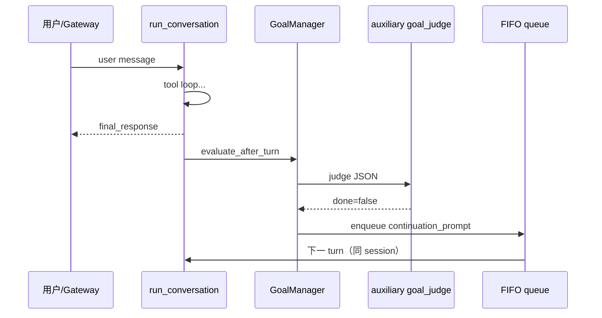

# 19 · Goals 与 Ralph Loop

> **锚点：** `hermes_cli/goals.py` · `gateway/run.py` `_post_turn_goal_continuation`（10711+）· `tui_gateway/server.py`

**外部（A）：** [Wiki goal-and-ralph-loop](https://github.com/cclank/Hermes-Wiki/blob/master/concepts/goal-and-ralph-loop.md) · [官方 Persistent Goals](https://hermes-agent.nousresearch.com/docs/user-guide/features/goals)

**Goal** = 用户 `/goal` 设定的跨 turn 目标。每 turn 结束后 **auxiliary judge** 判是否完成；未完成则注入 **user 角色 continuation**，同一 session 继续 — 社区所称 **Ralph loop**。

---

## 1. 硬 invariant（模块 docstring）

```13:27:/Users/zmz/Github/hermes-agent/hermes_cli/goals.py
- Continuation is a normal user message — no system-prompt mutation, no toolset swap.
- Judge failures are fail-OPEN: continue. Turn budget is the backstop.
- Real user message mid-loop preempts continuation and pauses goal loop for that turn.
- Zero dependency on HermesCLI or gateway runner — both use GoalManager.
```

**不改 system / toolset** → prefix cache 保持 [13](./13-prompt-assembly-and-cache.md)。

---

## 2. GoalManager 与持久化

| 概念 | 实现 |
|------|------|
| 存储 | SessionDB `state_meta`，key `goal:<session_id>` |
| 默认续跑上限 | `DEFAULT_MAX_TURNS = 20` |
| Judge | `get_text_auxiliary_client("goal_judge")` |
| `/subgoal` | 追加验收标准；continuation/judge 模板带 `subgoals_block` |

**Judge token：** `DEFAULT_JUDGE_MAX_TOKENS = 4096`（48–57 行）— reasoning 模型先烧 hidden reasoning；200 token 旧默认会截断 JSON 导致误 pause。

**Parse 失败：** 连续 3 次非 JSON → auto-pause，提示查 `auxiliary.goal_judge`（61–67 行）。**API 错误不计入** parse 计数 — 仍 fail-open continue。

---

## 3. Judge 行为（happy / fail）

### 3.1 Happy path

```text
evaluate_after_turn(final_response)
  → get_text_auxiliary_client("goal_judge")
  → chat.completions (temperature=0, max_tokens=4096)
  → _parse_judge_response → {"done": true|false, "reason": "..."}
  → done=true → clear goal + 用户通知
  → done=false + turns<max → continuation_prompt
```

### 3.2 Fail-open 路径

| 条件 |  verdict |
|------|----------|
| auxiliary 不可用 | `continue`（406–417 行） |
| API 异常 | `continue` + log（451–453 行） |
| 空 final_response | `continue`「empty response」（400–402 行） |
| parse 失败 | `continue`；累计 3 次 → **pause** |

**设计理由：** fail-closed 会在 judge 挂掉时 **永久卡住** 目标；turn budget 是最终保险。

---

## 4. Gateway 续跑（10711–10778 行）

```text
run_conversation 结束 + 回复已产出
  → _post_turn_goal_continuation(session_entry, final_response)
  → GoalManager.evaluate_after_turn(..., user_initiated=True)
  → 若 should_continue:
       构造 MessageEvent(continuation_prompt)
       _enqueue_fifo(session_key, event, adapter)   # 与 /queue 同 FIFO
  → 用户同时在飞的消息自然 preempt（队列语义 [10 §7](./10-gateway-platforms-and-sessions.md#7-queue-fifo-与-burst)）
```

**状态通知顺序：** judge 可能在 adapter 发最终回复 **之前** 跑完 — 「✓ Goal achieved」经 `_defer_goal_status_notice_after_delivery` 排在可见回复 **之后**（10747–10754 行）。

TUI：`tui_gateway` 镜像 gateway 逻辑（注释写明 mirrors）。

---

## 5. Continuation 长什么样

```71:77:/Users/zmz/Github/hermes-agent/hermes_cli/goals.py
CONTINUATION_PROMPT_TEMPLATE = (
    "[Continuing toward your standing goal]\n"
    "Goal: {goal}\n\n"
    "Continue working toward this goal. Take the next concrete step. ..."
)
```

对模型 = **新的 user message**，非 system injection — 降 injection 面 + 不破坏 cache。

---

## 6. 与其它机制边界

| 机制 | 驱动 | 改主 session system？ | 阻塞父 loop？ |
|------|------|----------------------|---------------|
| **Goal loop** | `/goal` + judge | 否 | 否（外层调度多 turn） |
| delegate | model tool | 子 agent 新 system | **是** |
| cron | tick | 独立 agent | — |
| background_review | nudge | 否（fork 写盘） | 否 |

Goal 是 **同一 session_id** 上的外层 while；不是 spawn 子 agent [18](./18-multi-agent-panorama.md)。

---

## 7. 配置

```yaml
goals:
  max_turns: 20
auxiliary:
  goal_judge:
    provider: auto
    model: ...
    max_tokens: 4096
    timeout: 30
```

---

## 8. 时序图



---

## 9. 源码带读

1. `goals.py` docstring + `GoalManager.evaluate_after_turn`（620+）  
2. `_call_goal_judge`（400–463）  
3. `gateway/run.py` `_post_turn_goal_continuation`  
4. CLI `/goal` handler in `commands.py`（skim）  

---

## 10. 自测

- [ ] 为何 judge fail-open？  
- [ ] goal 状态存在哪？  
- [ ] continuation 为何用 user 角色？  
- [ ] Gateway 如何避免「目标完成」提示抢在回复前？  
- [ ] parse 失败 3 次 vs API 失败区别？  
- [ ] 与 delegate 阻塞差异？  

**关联：** [05 §6 Post-turn](./05-aiagent-and-conversation-loop.md#6-post-turn-与-return-dict) · [15 §6 Auxiliary](./15-provider-and-transport.md#6-auxiliary-侧任务路由) · [13 Cache](./13-prompt-assembly-and-cache.md)
