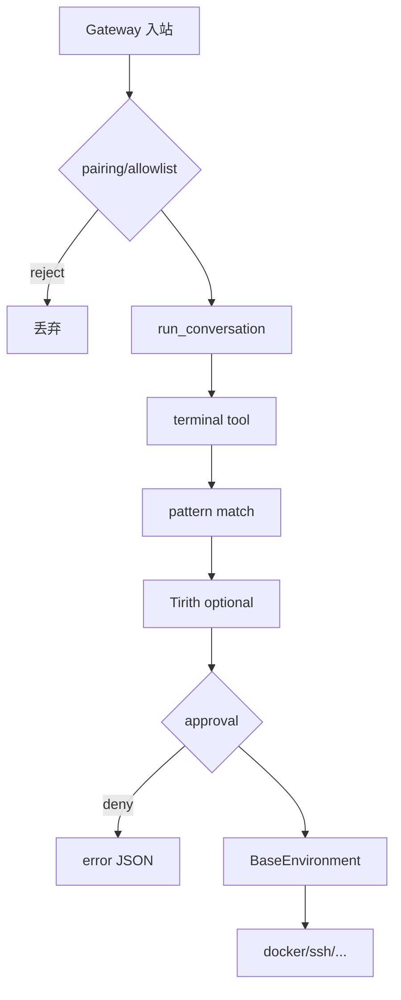

# 20 · 安全与防御纵深

> **锚点：** [官方 Security](https://hermes-agent.nousresearch.com/docs/user-guide/security) · `tools/approval.py` · `agent/prompt_builder.py` · `tools/tirith_security.py` · `gateway/run.py`

Hermes **无** 单一 `SecurityManager`；安全是 **多层独立 guard** 叠加。本篇按 **数据流顺序** 带读，映射官方 seven layers。

---

## 1. 七层 → 源码锚点

| 层 | 作用 | 锚点 |
|----|------|------|
| **1. 用户授权** | 谁能跟 bot 说话 | Gateway DM pairing / allowlist [10](./10-gateway-platforms-and-sessions.md) |
| **2. 危险命令审批** | 破坏性 shell | `tools/approval.py` · `approvals.mode` |
| **3. 容器隔离** | 非本机执行 | [17 Terminal backends](./17-terminal-backends.md) |
| **4. MCP 凭证过滤** | 子进程 env | `mcp_env` allowlist [16](./16-plugins-mcp-and-hooks.md) |
| **5. Context 文件扫描** | 恶意 AGENTS.md | `prompt_builder._scan_context_content` [13](./13-prompt-assembly-and-cache.md) |
| **6. 跨 session 隔离** | cron/path 硬ening | SessionDB · cron path 校验 [11](./11-delegation-cron-and-kanban.md) |
| **7. 输入净化** | cwd/shell 注入 | `terminal_tool` · environments |

**叠加层：** Tirith 语义扫描 · memory/cron/skill hub 写入扫描 · Gateway 入/出站 guard · webhook safe toolset [07](./07-toolsets-and-platform-bundles.md)。

---

## 2. Terminal 审批（层 2 深读）

### 2.1 Happy path（CLI manual）

```text
model → terminal tool
  → pattern 匹配 dangerous command
  → approvals.mode == manual
  → prompt_toolkit TLS callback → 用户 once/deny/always
  → 允许 → BaseEnvironment.run_command
  → JSON 结果回 model
```

### 2.2 Gateway path

```text
同上前半
  → 无 stdin callback
  → tools/approval.py session 队列
  → 用户 /approve 或 /deny [10]
  → 命令继续或返回 error JSON
```

### 2.3 失败 / 降级路径

| 路径 | 结果 |
|------|------|
| Subagent worker | **auto-deny** 默认 — 防 stdin deadlock [11 §2.4](./11-delegation-cron-and-kanban.md) |
| `approvals.mode: off` / `--yolo` | 全放行 — 显式削弱层 2 |
| `smart` | auxiliary 风险评估后再问用户 |
| Tirith deny | 即使 pattern 未命中也可 block [§3](#3-tirith) |

---

## 3. Tirith

集成 [tirith](https://github.com/sheeki03/tirith) 二进制 — **语义型** 命令威胁（补 pattern matching）：

```yaml
security:
  tirith_enabled: true
  tirith_fail_open: true   # 缺二进制仍放行（默认）
```

| tirith_fail_open | 行为 |
|------------------|------|
| `true`（默认） | 无 tirith 二进制 → 仅 pattern 层 |
| `false` | 高安全：无 tirith → **block** |

Verdict 进审批 UI；默认 deny 倾向。

---

## 4. Prompt 注入面

| 入口 | 扫描点 | 失败时 |
|------|--------|--------|
| AGENTS.md / SOUL.md / `.hermes.md` | `prompt_builder` | `[BLOCKED: file]` 占位 [13](./13-prompt-assembly-and-cache.md) |
| Memory 写入 | memory store guard | 拒绝或 strip [08](./08-session-and-memory.md) |
| Cron job + **运行时 skill** | `cron/scheduler` assembled-prompt scan | **拒绝本 tick** 跑 agent（#3968） |
| Skill Hub 安装 | hub scanner | 安装 abort |
| Gateway 入站 | `run.py` + adapter | 丢弃/rewrite |
| Webhook 平台 | 仅 `_HERMES_WEBHOOK_SAFE_TOOLS` | 无 terminal/browser [07 §3](./07-toolsets-and-platform-bundles.md#3-webhook-安全子集) |

**Gateway 不 expand `@file`：** 防路径注入与跨用户文件读 [22 §4](./22-integrations-handbook.md#4-context-引用file--附件)。

---

## 5. Gateway 授权（层 1）

- DM **pairing** — 未知用户需配对码  
- 群组 sender 与 DM pairing **不继承**（官方 Telegram 文档）  
- `pre_gateway_dispatch` hook — skip/rewrite 入站 [16](./16-plugins-mcp-and-hooks.md)  
- 开放 webhook 无 auth → 等价于远程 prompt injection 面 — 生产禁裸奔  

---

## 6. 与学习 loop 的张力

| 机制 | 风险 | 缓解 |
|------|------|------|
| background_review 写 skill/memory | 恶意 turn 污染 | provenance + scanner [18](./18-multi-agent-panorama.md) |
| Frozen memory snapshot [13] | turn 内 system 不跟 disk | 模型仍见 live tool result — 知「写了但未进 prompt」 |
| skill_manage 子 agent | delegate 可 create skill | provenance 标记；curator 只动 agent-created [09](./09-skills-curator-and-learning-loop.md) |
| YOLO / subagent_auto_approve | 削弱层 2 | 仅显式 opt-in |

---

## 7. 纵深数据流（单条 terminal 命令）



---

## 8. 生产建议（浓缩）

1. Gateway：`dmPolicy=pairing`；webhook 必须 auth + safe toolset  
2. `approvals.mode: manual` 或 smart；cron 单独收紧 toolsets [11](./11-delegation-cron-and-kanban.md)  
3. 远程执行优先 docker/ssh + 非 root  
4. `tirith_fail_open: false` 仅当确已安装 tirith  
5. 多租户 → **Profile** 隔离 [21](./21-profiles-and-credential-pool.md)  

---

## 9. 源码带读

1. `tools/approval.py` — Gateway queue vs CLI callback  
2. `prompt_builder._CONTEXT_THREAT_PATTERNS`  
3. `cron/scheduler` assembled-prompt injection 分支  
4. `toolsets._HERMES_WEBHOOK_SAFE_TOOLS`  

---

## 10. 自测

- [ ] CLI vs Gateway 审批路径？  
- [ ] webhook safe toolset 防什么？  
- [ ] cron 为何扫 **运行时** 加载的 skill？  
- [ ] tirith_fail_open false 语义？  
- [ ] context 扫描与 Gateway 入站 guard 分工？  
- [ ] subagent 默认为何 auto-deny？  

**关联：** [10 Gateway](./10-gateway-platforms-and-sessions.md) · [13 Prompt](./13-prompt-assembly-and-cache.md) · [17 Terminal](./17-terminal-backends.md) · [11 Cron](./11-delegation-cron-and-kanban.md)
