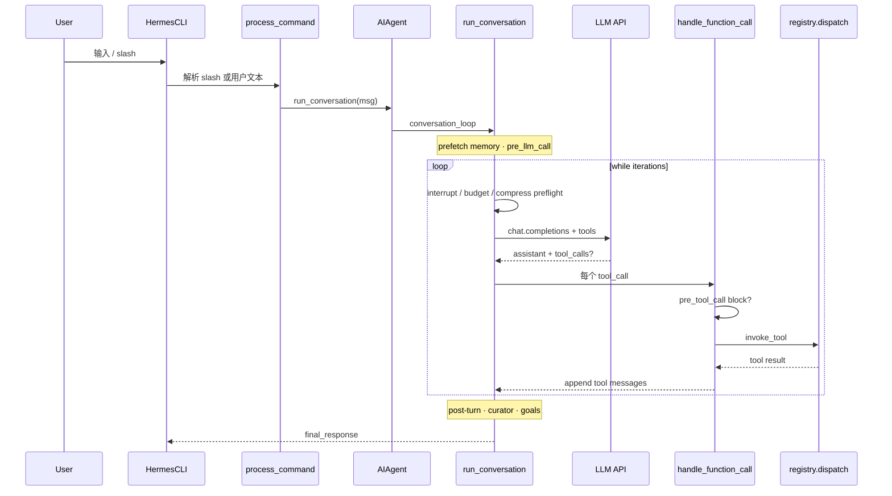

# 26 · 主链路总图（Atlas）

> **用途：** 读 Hermes 源码时的 **导航锚点** — 与加厚脊柱篇对齐  
> **基准：** pin `889903f`

---

## 1. 端到端时序（CLI）



**Gateway：** Platform adapter → `GatewayRunner` → FIFO/pending → 缓存/新建 `AIAgent` → 同上 `run_conversation` [10](./10-gateway-platforms-and-sessions.md)。

---

## 2. 三入口汇合

```text
classic CLI ──→ HermesCLI ──→ AIAgent.run_conversation ─┐
TUI ──→ tui_gateway ──→ AIAgent.run_conversation ──────┼→ conversation_loop.run_conversation
Gateway ──→ GatewayRunner ──→ AIAgent.run_conversation ┘
         ↑ pre_gateway_dispatch (plugins) 在 auth 之前
```

| 入口 | Agent 构造频率 | 文档 |
|------|----------------|------|
| CLI/TUI | 通常长驻一个 Agent | [03](./03-cli-gateway-and-entry.md) |
| Gateway | 常 per-message 新建 + LRU cache | [10 §4](./10-gateway-platforms-and-sessions.md) |

---

## 3. 单 turn 内顺序（与 05 对齐）

| # | 步骤 | 锚点 |
|---|------|------|
| 0 | slash 短路 / session 恢复 | `process_command` [03](./03-cli-gateway-and-entry.md) |
| 1 | system prompt（SessionDB cache） | [13](./13-prompt-assembly-and-cache.md) |
| 2 | memory prefetch（**每 turn 一次**） | conversation_loop ~617–628 |
| 3 | `pre_llm_call` → ephemeral user context | plugins 535+ · [16](./16-plugins-mcp-and-hooks.md) |
| 4 | `while` 迭代开始 | |
| 5 | interrupt / steer / activity | ~705+ · [17](./17-terminal-backends.md) |
| 6 | IterationBudget 检查 | [02](./02-config-iteration-and-model-routing.md) |
| 7 | compression preflight（若需） | [14](./14-context-compression.md) |
| 8 | 组装 messages + `get_tool_definitions` | [06 §5](./06-tools-registry-and-model-tools.md) |
| 9 | `pre_api_request` → API stream | |
| 10 | `handle_function_call` × N | pre_tool_call · approval · dispatch |
| 11 | 无 tool_calls → finalize | |
| 12 | post-turn：SessionDB · curator · goals · background_review | ~4177–4227 · [09](./09-skills-curator-and-learning-loop.md) · [19](./19-goals-and-ralph-loop.md) |

**Mid-turn 禁止：** 换 toolset / 重建 system / reload memory（compression 边界除外）[13](./13-prompt-assembly-and-cache.md)。

---

## 4. 文件锚点表

| 阶段 | 文件 | 专篇 |
|------|------|------|
| CLI 入口 | `hermes_cli/main.py` | [03](./03-cli-gateway-and-entry.md) |
| 配置 | `hermes_cli/config.py` | [02](./02-config-iteration-and-model-routing.md) |
| 交互壳 | `cli.py` | [03](./03-cli-gateway-and-entry.md) |
| TUI | `ui-tui/` · `tui_gateway/` | [03](./03-cli-gateway-and-entry.md) |
| Gateway | `gateway/run.py` | [10](./10-gateway-platforms-and-sessions.md) |
| Agent 类 | `run_agent.py` | [05](./05-aiagent-and-conversation-loop.md) |
| **Loop 本体** | **`agent/conversation_loop.py`** | [05](./05-aiagent-and-conversation-loop.md) |
| 工具编排 | `model_tools.py` | [06](./06-tools-registry-and-model-tools.md) |
| 工具注册 | `tools/registry.py` | [06](./06-tools-registry-and-model-tools.md) |
| Toolsets | `toolsets.py` | [07](./07-toolsets-and-platform-bundles.md) |
| 会话 DB | `hermes_state.py` | [08](./08-session-and-memory.md) |
| Memory | `agent/memory_manager.py` | [08](./08-session-and-memory.md) |
| Skills / Curator | `tools/skills_tool.py` · `agent/curator.py` | [09](./09-skills-curator-and-learning-loop.md) |
| Delegate / Cron / Kanban | `delegate_tool.py` · `cron/` | [11](./11-delegation-cron-and-kanban.md) |
| Prompt | `agent/prompt_builder.py` | [13](./13-prompt-assembly-and-cache.md) |
| Compress | `agent/context_compressor.py` | [14](./14-context-compression.md) |
| Provider / Pool | `runtime_provider.py` · `credential_pool.py` | [15](./15-provider-and-transport.md) · [21](./21-profiles-and-credential-pool.md) |
| Plugins / MCP | `hermes_cli/plugins.py` · `tools/mcp_tool.py` | [16](./16-plugins-mcp-and-hooks.md) |
| Terminal | `tools/terminal_tool.py` · `environments/` | [17](./17-terminal-backends.md) |
| Background review | `agent/background_review.py` | [18](./18-multi-agent-panorama.md) |
| Goals | `hermes_cli/goals.py` | [19](./19-goals-and-ralph-loop.md) |
| Security / Tirith | `tools/approval.py` | [20](./20-security-defense-layers.md) |
| 集成（Browser/PTC/LSP…） | 多模块 | [22 手册](./22-integrations-handbook.md) |
| Slash registry | `hermes_cli/commands.py` | [03](./03-cli-gateway-and-entry.md) |

---

## 5. 横切关注点地图

```text
                    ┌─ Prompt cache [13]
                    ├─ Compression [14]
run_conversation ───┼─ Provider fallback [15] ← Credential pool [21]
                    ├─ Plugin hooks [16]
                    ├─ Toolsets filter [07]
                    └─ Profile HERMES_HOME [21]
```

---

## 6. 关键 API 速查

| 问题 | 答案 |
|------|------|
| Loop 在哪？ | `agent/conversation_loop.py` — `run_conversation` |
| 工具公共入口？ | `handle_function_call`（模型路径）· `invoke_tool`（内部/子 agent） |
| 注册表？ | `tools/registry.py` — `registry.register` / `dispatch` |
| Slash 定义？ | `hermes_cli/commands.py` — `COMMAND_REGISTRY` |
| Gateway 排队？ | `_enqueue_fifo` / pending session [10](./10-gateway-platforms-and-sessions.md) |
| 插件 block tool？ | `get_pre_tool_call_block_message` [16](./16-plugins-mcp-and-hooks.md) |

---

## 7. 读完后应能回答

1. Loop 本体文件 vs `run_agent.py` 分工？  
2. prefetch 与 mid-turn memory reload 政策？  
3. Gateway 与 CLI 创建 Agent 频率差异及原因？  
4. MCP refresh 如何影响 tool schema cache？  
5. Profile 换 vs pool rotate 换的是什么？  

→ 验收：[learning-paths 路径 A](./learning-paths.md#路径-a第一次学-hermes--约-46-小时) · [99 索引](./99-glossary-and-reading-map.md) · [路径 G](./learning-paths.md#路径-g导航与交叉引用--约-30-min)

---

## 关联

- [00 定位](./00-philosophy-and-positioning.md)
- [01 架构总览](./01-architecture-overview.md)
- [05 Conversation Loop](./05-aiagent-and-conversation-loop.md)
- [官方 AGENTS.md](https://github.com/NousResearch/hermes-agent/blob/main/AGENTS.md)
