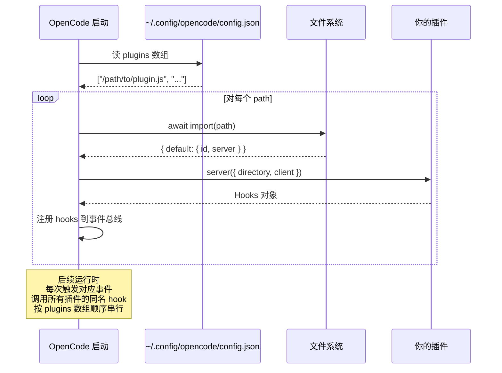

# 01 · OpenCode 插件协议本质

> **核心问题：** 一个 `.js` 文件要长什么样，才能被 OpenCode 加载为插件？

---

## 1. 一句话定义

OpenCode 插件 = **一个 default export 为 `{ id, server }` 的 ESM 模块，其中 `server` 是个返回 `Hooks` 对象的异步函数。**

## 2. 最小可行插件（理论极限）

```typescript
// my-plugin/dist/index.js
export default {
  id: "my-plugin",
  server: async (input) => {
    return {} // 12 个 hook 一个都不实现也合法
  },
}
```

把这个文件路径加到 `~/.config/opencode/config.json` 的 `plugins` 数组，OpenCode 启动时就会 `await import(path)` 并调用 `default.server({ directory, client })`。

> 不挂任何 hook 也合法，但你就啥都干不了。所有"插件能力"都来自实现某个或某些 hook。

## 3. 三个核心类型

来自 `@opencode-ai/plugin@1.4.0`（`peer: zod@^4.0.0`，`@opencode-ai/sdk@1.4.0`），OmO 用 `Parameters<Plugin>[0]` 和 `Awaited<ReturnType<Plugin>>` 把它们重新包装成 `PluginContext` / `PluginInstance`：

```1:16:src/plugin/types.ts
import type { Plugin, ToolDefinition } from "@opencode-ai/plugin"

export type PluginContext = Parameters<Plugin>[0]
export type PluginInstance = Awaited<ReturnType<Plugin>>

type ChatHeadersHook = PluginInstance extends { "chat.headers"?: infer T }
  ? T
  : (input: unknown, output: unknown) => Promise<void>

export type PluginInterface = Omit<
  PluginInstance,
  "experimental.session.compacting" | "chat.headers"
> & {
  "chat.headers"?: ChatHeadersHook
}

export type ToolsRecord = Record<string, ToolDefinition>
```

### 3.1 `Plugin`

```typescript
type Plugin = (
  input: {
    directory: string                 // OpenCode 项目工作目录
    client: OpenCodeSDKClient         // OpenCode 自己的 SDK 客户端，可以反向调用主程序
    // ... 其他启动期信息
  },
  options?: unknown
) => Promise<Hooks>
```

### 3.2 `Hooks` —— 12 个生命周期切面

| Hook 名 | 触发 | input 给你什么 | output 你能改什么 | 典型用途 |
|---------|------|----------------|------------------|----------|
| `config` | 启动加载配置时 | OpenCode 当前配置 | 整个 config（注入 provider、agent、tool 等） | OmO 的 6 阶段配置流水线 |
| `tool` | 启动注册工具时 | — | `Record<string, ToolDefinition>` | 暴露自定义工具给 LLM |
| `chat.message` | 用户发新消息 | `sessionID, parts, message.variant` | `output.message.*`, `output.parts` | think-mode 检测关键词 |
| **`chat.params`** | **每次调 LLM 前** | **agent, model, provider, message.variant** | **temperature / topP / topK / maxOutputTokens / options.\*** | **anthropic-effort、think-mode 切 variant、← 你的 DeepSeek 控制就挂这里** |
| `chat.headers` | HTTP header 注入 | — | `output.headers` | github-copilot 的 `x-initiator` |
| `command.execute.before` | `/command` 执行前 | command + args | 可拦截 | 自定义命令 |
| `event` | 任何 session 事件 | event 对象 | — (只读响应) | runtime-fallback、boulder 触发 |
| `tool.execute.before` | tool 调用前 | tool 名、args | 可拒绝执行 | write-existing-file-guard |
| `tool.execute.after` | tool 调用后 | tool result | 可改写 result | hashline read enhancer、comment-checker |
| `experimental.chat.messages.transform` | message 数组定型前 | 整个 messages 数组 | 修改 messages 数组 | contextInjector、keywordDetector |
| `experimental.chat.system.transform` | system prompt 定型前 | system 字符串/分段 | 修改 system | OmO 用得很少 |
| `experimental.session.compacting` | 上下文压缩时 | session 状态 | 保留哪些 todo/context | compactionTodoPreserver |

> **加上 OmO 内部使用的 `experimental.compaction.autocontinue` 共 13 个**（见 `src/index.ts:122-125`），但 12 个是稳定的。

### 3.3 `PluginModule` —— default export 形状

```typescript
type PluginModule = {
  id: string         // 插件唯一标识
  server: Plugin     // 上面的 Plugin 函数
}

export default pluginModule satisfies PluginModule
```

> OmO 的：

```130:135:src/index.ts
const pluginModule: PluginModule = {
  id: "oh-my-openagent",
  server: serverPlugin,
}

export default pluginModule
```

## 4. OpenCode 是怎么加载插件的？



## 5. 注册插件的两条路

### 5.1 用户视角：npm 安装

```bash
npm i -g oh-my-openagent
# 或交互式安装向导：
bunx oh-my-opencode install
```

这会自动写到 `~/.config/opencode/config.json`：

```jsonc
{
  "plugins": ["oh-my-openagent"]  // npm 包名
}
```

### 5.2 开发视角：本地路径

```jsonc
{
  "plugins": ["/Users/zmz/Github/opencode-thinking-toggle/dist/index.js"]
}
```

→ **你的 `opencode-thinking-toggle` 开发期就这么挂。**

## 6. 一个反复出现的混淆点

**"OpenCode 的 hook" ≠ "OmO 内部的 hook"。**

- OpenCode 暴露的 hook = 12 个生命周期切面，写死在 `@opencode-ai/plugin` 的 `Hooks` 类型里
- OmO 自己的 hook = 54–61 个内部细粒度 hook，分布在这 12 个切面下面（详见 [07 · OmO 5 层 hook](./07-hook-system-overview.md)）

→ **你写自己的插件时，直接面对 OpenCode 的 12 个切面就够了，不需要 OmO 的 5 层抽象。**

---

## 读完后应该能回答

- [ ] OpenCode 插件 default export 必须是什么形状？
- [ ] 12 个生命周期 hook 各自做什么的？
- [ ] 想拦截"工具调用前"的事件，挂哪个 hook？
- [ ] 想"在调用 LLM 之前修改 temperature"，挂哪个 hook？
- [ ] OpenCode 怎么知道要加载我的插件？
- [ ] 多个插件实现了同一个 hook，调用顺序由什么决定？

---

→ **下一篇：** [02 · OmO 插件入口与初始化](./02-plugin-entry-and-lifecycle.md)
