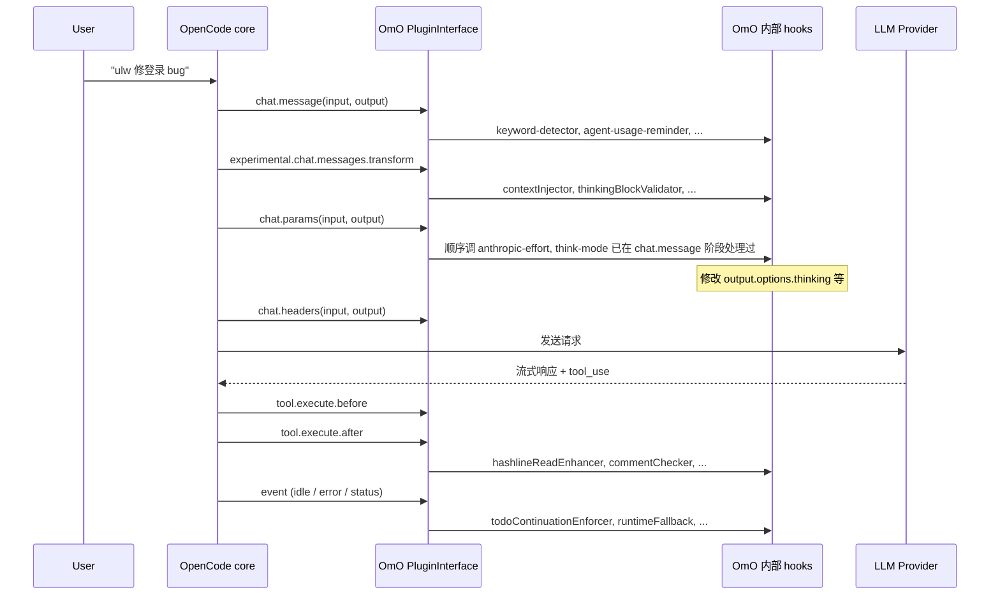

# 02 · OmO 插件入口与初始化

> **核心问题：** OmO 是怎么挂到 OpenCode 上的？`serverPlugin` 这 100 行代码在干什么？

---

## 1. 入口文件结构

```128:135:src/index.ts
const pluginModule: PluginModule = {
  id: "oh-my-openagent",
  server: serverPlugin,
}

export default pluginModule
```

`serverPlugin` 就是 [01](./01-opencode-plugin-protocol.md) 里说的 `Plugin` 函数，OpenCode 启动时被调用一次，返回 12 个生命周期 hook 实现。

## 2. 7 步初始化（按顺序）

```32:128:src/index.ts
const serverPlugin: Plugin = async (input, _options): Promise<Hooks> => {
  installAgentSortShim()                         // [1] 给 Array.sort 打补丁
  initConfigContext("opencode", null)            // [2] 检测配置布局
  // ...
  logLegacyPluginStartupWarning()                // 警告
  // ...
  injectServerAuthIntoClient(input.client)       // [4] 注入 auth header

  const pluginConfig = loadPluginConfig(input.directory, input)  // [5] 多级 JSONC 合并
  setAgentSortOrder(pluginConfig.agent_order)

  if (pluginConfig.openclaw) {
    await initializeOpenClaw(pluginConfig.openclaw)              // [6a] 可选 openclaw
  }
  if (pluginConfig.team_mode?.enabled) {                          // [6b] 可选 team-mode
    // ...
  }
  // ...

  const managers = createManagers({ ... })       // [7a] 4 个 manager
  const toolsResult = await createTools({ ... }) // [7b] 工具注册
  const hooks = createHooks({ ... })             // [7c] 5 层内部 hook
  const pluginInterface = createPluginInterface({ ... }) // [7d] 装配 12 个 OpenCode hook handler

  return pluginHooks   // 这就是 OpenCode 等的 Hooks 对象
}
```

### 7 步详细说明

| 步骤 | 函数 | 在干什么 | 不做会怎样 |
|------|------|----------|-----------|
| 1 | `installAgentSortShim()` | 给 `Array.prototype.{toSorted, sort}` 打补丁，让 4 个核心 agent 总是按 `Sisyphus → Hephaestus → Prometheus → Atlas` 排 | UI Tab 切换顺序乱 |
| 2 | `initConfigContext()` | 检测 `opencode-vs-openagent` 两种配置布局 | 找不到配置文件 |
| 3 | `detectExternalSkillPlugin()` | 警告与其他 skill 插件冲突 | 静默冲突 |
| 4 | `injectServerAuthIntoClient()` | 把 auth header 注入共享 SDK client | 反向调 OpenCode API 失败 |
| 5 | `loadPluginConfig()` | 多级 JSONC 合并（user + walked project）+ Zod 校验 + 迁移 | 配置加载失败，整个插件停摆 |
| 6 | `initializeOpenClaw` + `checkTeamModeDependencies` | 启动可选子系统 | 这些功能不可用 |
| 7 | `createManagers / Tools / Hooks / PluginInterface` | **本质装配** | 12 个 hook 空对象 |

## 3. 装配产物：12 个 OpenCode hook handler

第 7d 步产出的 `pluginInterface` 是真正会被 OpenCode 调用的对象。看 `src/plugin-interface.ts:30-83`：

```33:82:src/plugin-interface.ts
return {
  tool: tools,

  "chat.params": async (input: unknown, output: unknown) => {
    const handler = createChatParamsHandler({
      anthropicEffort: hooks.anthropicEffort,
      client: ctx.client,
    })
    await handler(input, output)
  },

  "chat.headers": createChatHeadersHandler({ ctx }),

  "command.execute.before": createCommandExecuteBeforeHandler({
    hooks,
  }),

  "chat.message": createChatMessageHandler({
    ctx,
    pluginConfig,
    firstMessageVariantGate,
    hooks,
  }),

  "experimental.chat.messages.transform": createMessagesTransformHandler({
    hooks,
  }),

  "experimental.chat.system.transform": createSystemTransformHandler(),

  config: managers.configHandler,

  event: createEventHandler({
    ctx,
    pluginConfig,
    firstMessageVariantGate,
    managers,
    hooks,
  }),

  "tool.execute.before": createToolExecuteBeforeHandler({
    ctx,
    hooks,
  }),

  "tool.execute.after": createToolExecuteAfterHandler({
    ctx,
    hooks,
  }),
}
```

→ **每个 handler 内部都是一个 dispatcher**：拿到 input/output，依次调用注册到该切面的所有内部 hook。

## 4. 关键设计模式

### 4.1 工厂 + 依赖注入

所有 manager / tool / hook 都是 `createXxx(deps)` 工厂。好处：

- 单元测试可以注入 mock
- 启动期一次性装配，运行期零开销
- 配置门控只在装配阶段一次（运行时不用 if-else）

### 4.2 dispatcher + safeHook

```typescript
// 伪代码
async function createChatParamsHandler(deps) {
  return async (input, output) => {
    for (const hook of deps.allHooks) {
      try {
        await hook(input, output)  // 一个 hook 抛错不影响其他
      } catch (err) {
        log("hook failed:", err)
      }
    }
  }
}
```

`safeHook()` 包装器在 `src/shared/safe-create-hook.ts`，把异常隔离住。这就是为什么 OmO 加挂这么多 hook 也不会因为一个出错全挂。

### 4.3 配置门控（gate）只发生在装配阶段

```111:113:src/plugin/hooks/create-session-hooks.ts
const thinkMode = isHookEnabled("think-mode")
  ? safeHook("think-mode", () => createThinkModeHook())
  : null
```

如果 `disabled_hooks` 含 `"think-mode"`，工厂直接返回 `null`，运行时 dispatcher 跳过 `null` 项 —— 零运行时成本。

→ **你写自己的插件也可以学这个：配置开关在 `server()` 一次性决定，运行时不再判断。**

## 5. 一次用户输入的完整时序



## 6. 你写插件时该模仿什么

| OmO 做法 | 你抄不抄 | 备注 |
|----------|---------|------|
| `createXxxHook(deps)` 工厂模式 | **抄** | 单测友好 |
| `safeHook` 包装 | **抄** | 异常隔离 |
| 多级 JSONC 配置 + Zod 校验 | 可选 | 简单插件不需要 |
| 5 层内部 hook 抽象 | **不抄** | OmO 有 60 个 hook 才需要，你的小插件直接 12 切面就够 |
| `Array.prototype.sort` 打补丁 | **绝对不抄** | OmO 是被迫的，能不动全局就别动 |
| dispatcher 模式 | 不抄 | 你的插件只在一个切面挂 1 个 hook，不需要 dispatcher |

→ **最小插件 = 一个 `server()` 函数，里面 return 一个只挂 1 个 hook 的对象。**

---

## 读完后应该能回答

- [ ] OmO 的 7 步初始化每步在干什么？
- [ ] `pluginInterface` 这个对象是怎么产生的？
- [ ] dispatcher 模式解决了什么问题？
- [ ] 配置开关为什么在装配阶段决定而不是运行时？
- [ ] 我写自己的小插件，需要 5 层 hook 抽象吗？

---

→ **下一篇：** [03 · `chat.params` 钩子机制](./03-chat-params-mechanism.md)
