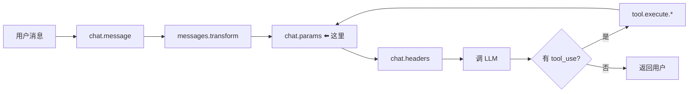
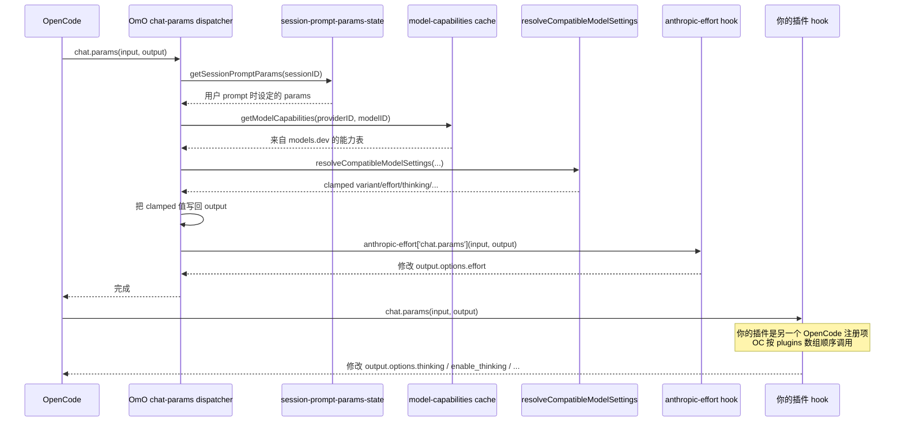

# 03 · `chat.params` 钩子机制

> **核心问题：** 调用 LLM 之前我能改哪些参数？OmO 的 chat-params dispatcher 是怎么组织调用链的？
>
> 这是你的 `opencode-thinking-toggle` **唯一要挂的 hook**。吃透它，插件就完成 80%。

---

## 1. 触发时机

OpenCode 在**每次准备调用 LLM 时**（不只是第一次！包括每一轮 tool-use 之后的续聊）会触发 `chat.params`。



→ **每个 turn 都会被调用一次。** 这意味着同一 session 的多轮对话里，你的 hook 会被反复触发。要么是 stateless 实现，要么用 `sessionID` 维护一个 `Map<sessionID, State>`。

## 2. input / output 形状

```6:24:src/plugin/chat-params.ts
export type ChatParamsInput = {
  sessionID: string
  agent: { name?: string }
  model: { providerID: string; modelID: string }
  provider: { id: string }
  message: { variant?: string }
}

type ChatParamsHookInput = ChatParamsInput & {
  rawMessage?: Record<string, unknown>
}

export type ChatParamsOutput = {
  temperature?: number
  topP?: number
  topK?: number
  maxOutputTokens?: number
  options: Record<string, unknown>
}
```

### Input 字段

| 字段 | 含义 | 你怎么用 |
|------|------|----------|
| `sessionID` | 当前会话 ID | 做 session 级状态、日志 |
| `agent.name` | 当前 agent 名（"sisyphus" / "hephaestus" / ...） | 区分主 agent / subagent；OmO 用 `agent.name in INTERNAL_SKIP_AGENTS` 排除 title/summary/compaction 这些内部 agent |
| `model.providerID` | provider 标识（"anthropic" / "openai" / "deepseek" / "openai-compat" / ...） | **核心：识别是不是你要处理的 provider** |
| `model.modelID` | 模型 ID（"claude-opus-4-7" / "deepseek-r1" / "deepseek-chat" / ...） | **核心：识别具体模型类型** |
| `provider.id` | provider 实例 id（多数情况下 = providerID） | 一般用不到 |
| `message.variant` | 当前请求的"变体"（"high" / "max" / `undefined`） | OmO 用来传递 "扩展思考" 信号 |

### Output 字段

| 字段 | 类型 | 含义 |
|------|------|------|
| `temperature` | number | LLM 温度 |
| `topP` | number | 核采样 |
| `topK` | number | top-k 采样 |
| `maxOutputTokens` | number | 输出 token 上限 |
| **`options`** | `Record<string, unknown>` | **任意 provider 特定字段都塞这里** —— 包括 `reasoningEffort`、`thinking`、`enable_thinking`、`output_config.effort` 等 |

### `output.options` 是金钥匙

OpenAI 的 `reasoning_effort`、Anthropic 的 `thinking: { type: "enabled", budgetTokens: 16000 }`、DeepSeek 的 `enable_thinking: false` —— **全部都通过 `output.options` 传到底层 SDK**。

OpenCode 在调 LLM 前会把 `output.options` 展开传给 provider SDK，所以你塞什么字段进去最终就会到 LLM 请求里。

## 3. OmO 的 `chat-params` dispatcher 主流程

完整代码：[`src/plugin/chat-params.ts:84-195`](https://github.com/code-yeongyu/oh-my-openagent/blob/20d67be496155473f49aef3207bfe9d3737cbfa8/src/plugin/chat-params.ts#L84-L195)。简化版：

```typescript
async (input, output) => {
  // [1] 规范化 input/output
  const normalizedInput = buildChatParamsInput(input)
  if (!normalizedInput) return
  if (!isChatParamsOutput(output)) return

  // [2] 应用 session 级别的 prompt params 覆盖
  const storedPromptParams = getSessionPromptParams(sessionID)
  if (storedPromptParams) {
    // 拷贝 temperature / topP / maxOutputTokens / options
  }

  // [3] 查模型能力（来自 models.dev 缓存）
  const capabilities = getModelCapabilities({ providerID, modelID })

  // [4] 跑兼容性 clamping
  const compatibility = resolveCompatibleModelSettings({
    providerID, modelID,
    desired: {
      variant: input.message.variant,
      reasoningEffort: output.options.reasoningEffort,
      temperature, topP, maxTokens, thinking,
    },
    capabilities,
  })

  // [5] 把 clamping 结果写回 output
  if (compatibility.thinking !== undefined) {
    output.options.thinking = compatibility.thinking
  } else if ("thinking" in compatibility) {
    delete output.options.thinking
  }
  // ...（temperature / topP / maxTokens / reasoningEffort / variant 类似）

  // [6] 最后让 anthropic-effort hook 跑一遍
  await args.anthropicEffort?.["chat.params"]?.(normalizedInput, output)
}
```

### 关键洞察

OmO 把 `chat.params` 切面**串行成一条流水线**：

```
session 覆盖 → models.dev 能力查询 → 自动兼容性 clamping → anthropic-effort
```

**只有 `anthropic-effort` 用了"传统"的 hook 工厂模式**，剩下的步骤 [1]–[5] 直接写在 dispatcher 里 —— 因为这些步骤是**所有 LLM 调用都要做的通用处理**，没必要做成可拔插 hook。

→ **你的插件就只挂在 [6] 这种"传统 hook"位置上**，享受前面 [1]–[5] 已经做好的兼容性 clamping。

## 4. 调用链可视化



> **多个插件都注册 `chat.params` 时**：OpenCode 按 `plugins` 数组的顺序串行调用每个插件的 hook。你的修改可能被后续插件覆盖，也可能覆盖前面插件的修改 —— 留意 plugins 数组顺序。

## 5. 你 DeepSeek 插件应该这么做

```typescript
const serverPlugin: Plugin = async () => ({
  "chat.params": async (input, output) => {
    const { providerID, modelID } = input.model
    if (!isDeepSeekCompatible(providerID, modelID)) return

    if (isReasoningModel(modelID)) {
      // 强制开
      output.options.thinking = { type: "enabled" }
      output.options.reasoningEffort = "high"
    } else {
      // 强制关
      delete output.options.thinking
      delete output.options.reasoningEffort
      output.options.enable_thinking = false  // DeepSeek 特有
    }
  },
})
```

→ **就这么简单。** 进阶可以加配置驱动、加测试、加多 provider 支持。

## 6. 坑表

| 坑 | 解释 |
|----|------|
| `output.options` 可能是 `undefined` | OmO dispatcher 里 `isChatParamsOutput()` 会保证 `options` 是 `{}`，但**你自己写插件不能假设**，要先 `output.options = output.options ?? {}` |
| `agent.name === "title"/"summary"/"compaction"` 时要跳过 | 这些是 OpenCode 内部 agent，不该被业务 hook 影响 |
| `message.variant` 不是用户能直接选的 UI 选项 | OmO 在 chat.message 阶段就改了它（think-mode 把 variant 设为 "high"），到 chat.params 时已经是处理后的值 |
| 多轮对话每轮都触发 | 不要在 hook 里做幂等性差的事（比如累加计数） |
| OAuth provider 字段限制 | 比如 Anthropic OAuth 只接受 `low/medium/high`，不接受 `max` —— 你自己的 provider 也可能有类似限制 |

---

## 读完后应该能回答

- [ ] `chat.params` 在每次用户消息时只触发一次，还是每个 LLM 调用都触发？
- [ ] 想加 DeepSeek 特有的 `enable_thinking: false`，塞 `output` 的哪里？
- [ ] OmO 怎么避免 hook 抛错让整个调用挂掉？
- [ ] `output.options.thinking` 和 `output.options.reasoningEffort` 各自服务哪类 provider？
- [ ] 多个插件都挂 `chat.params` 时调用顺序？

---

→ **下一篇：** [04 · 范本精读 anthropic-effort hook](./04-anthropic-effort-case-study.md)
