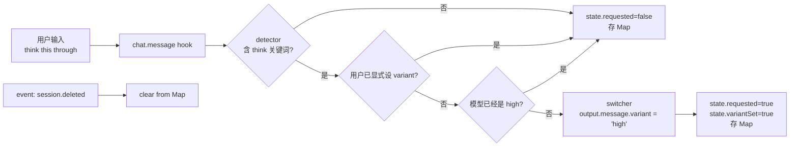

# 05 · 关键词→变体切换：think-mode

> **核心问题：** 用户输入 "think" / "ultrathink" / "思考" / "depen" 时，OmO 怎么把模型自动升级到 high reasoning 变体？
>
> 这是个"用户输入触发 → 跨多轮记忆 → 状态清理"的完整状态机范本。你将来想做"当用户输入 X 时自动切换 LLM 参数"类的插件，这就是模板。

---

## 1. 全局视图



## 2. 4 个文件的分工

```
src/hooks/think-mode/
├── detector.ts    # 关键词正则 + code block 剥离
├── switcher.ts    # modelID → high-variant 映射表
├── types.ts       # ThinkModeState 接口
├── hook.ts        # 装配 detector + switcher + 状态 Map
└── index.ts       # barrel 导出
```

## 3. detector：关键词检测

```1:50:src/hooks/think-mode/detector.ts
const ENGLISH_PATTERNS = [/\bultrathink\b/i, /\bthink\b/i]

const MULTILINGUAL_KEYWORDS = [
  "생각", "검토", "제대로",
  "思考", "考虑", "考慮",
  // ...（涵盖 30+ 种语言）
]

const COMBINED_THINK_PATTERN = new RegExp(
  `\\b(?:ultrathink|think)\\b|${MULTILINGUAL_KEYWORDS.join("|")}`,
  "i"
)

const CODE_BLOCK_PATTERN = /```[\s\S]*?```/g
const INLINE_CODE_PATTERN = /`[^`]+`/g

function removeCodeBlocks(text: string): string {
  return text.replace(CODE_BLOCK_PATTERN, "").replace(INLINE_CODE_PATTERN, "")
}

export function detectThinkKeyword(text: string): boolean {
  const textWithoutCode = removeCodeBlocks(text)
  return COMBINED_THINK_PATTERN.test(textWithoutCode)
}
```

**学习要点：**

| 设计 | 为什么 |
|------|--------|
| **先剥 code block** | 用户在代码片段里写 `think()` 函数不应触发 |
| **30+ 种语言关键词** | OmO 用户全球分布；中文有 "思考"、"考虑"、"考慮" |
| **`\b` 词边界** | 避免 `rethink`、`thinkable` 误触发 |
| **多语言用 `|` 串成大 regex** | 一次扫描，性能好 |

→ **抄过来**：你自己写"基于用户输入触发"的插件时，**永远先剥 code block 再 match**。否则代码片段误触发会很烦人。

## 4. switcher：modelID → high variant 映射

```43:94:src/hooks/think-mode/switcher.ts
const HIGH_VARIANT_MAP: Record<string, string> = {
  // Claude
  "claude-sonnet-4-6": "claude-sonnet-4-6-high",
  "claude-opus-4-7": "claude-opus-4-7-high",
  // Gemini
  "gemini-3-1-pro": "gemini-3-1-pro-high",
  // GPT-5
  "gpt-5": "gpt-5-high",
  // ...
}

const ALREADY_HIGH: Set<string> = new Set(Object.values(HIGH_VARIANT_MAP))

export function getHighVariant(modelID: string): string | null {
  const normalized = normalizeModelID(modelID)
  const { prefix, base } = extractModelPrefix(normalized)

  // Check if already high variant (with or without prefix)
  if (ALREADY_HIGH.has(base) || base.endsWith("-high")) {
    return null
  }

  const highBase = HIGH_VARIANT_MAP[base]
  if (!highBase) return null

  return prefix + highBase
}

export function isAlreadyHighVariant(modelID: string): boolean {
  const normalized = normalizeModelID(modelID)
  const { base } = extractModelPrefix(normalized)
  return ALREADY_HIGH.has(base) || base.endsWith("-high")
}
```

**学习要点：**

- **前缀剥离**：`vertex_ai/claude-sonnet-4-6` 先剥成 `claude-sonnet-4-6` 再查表
- **幂等检测**：`isAlreadyHighVariant()` 避免对已是 high 的模型再 high 一次
- **闭式映射表**：不是模糊匹配，是写死的 lookup table —— 因为 variant 名是 OmO 内部约定，必须精确
- `-high` 后缀**约定优于配置**：任何 `xxx-high` 都被识别为已是 high

## 5. hook：组装 + 状态 Map

```7:77:src/hooks/think-mode/hook.ts
const thinkModeState = new Map<string, ThinkModeState>()

export function clearThinkModeState(sessionID: string): void {
  thinkModeState.delete(sessionID)
}

export function createThinkModeHook() {
  return {
    "chat.message": async (input, output): Promise<void> => {
      const promptText = extractPromptText(output.parts)
      const sessionID = input.sessionID

      const state: ThinkModeState = {
        requested: false,
        modelSwitched: false,
        variantSet: false,
      }

      // [1] 没关键词 → 存空状态返回
      if (!detectThinkKeyword(promptText)) {
        thinkModeState.set(sessionID, state)
        return
      }

      state.requested = true

      // [2] 用户已显式设 variant → 不抢
      if (typeof output.message.variant === "string") {
        thinkModeState.set(sessionID, state)
        return
      }

      const currentModel = input.model
      if (!currentModel) {
        thinkModeState.set(sessionID, state)
        return
      }

      state.providerID = currentModel.providerID
      state.modelID = currentModel.modelID

      // [3] 已是 high → 不重复处理
      if (isAlreadyHighVariant(currentModel.modelID)) {
        thinkModeState.set(sessionID, state)
        return
      }

      // [4] 真正切 variant
      output.message.variant = "high"
      state.modelSwitched = false
      state.variantSet = true
      log("Think mode: variant set to high", { sessionID })

      thinkModeState.set(sessionID, state)
    },

    event: async ({ event }) => {
      if (event.type === "session.deleted") {
        const sessionID = resolveSessionEventID(event.properties)
        if (sessionID) {
          thinkModeState.delete(sessionID)
        }
      }
    },
  }
}
```

**学习要点（按价值排序）：**

1. **同一个 hook 工厂同时挂多个 OpenCode 切面** —— 这里挂了 `chat.message`（主逻辑）和 `event`（清理）。**两个职责强相关，所以放一起**。
2. **模块级 Map 做状态** —— `thinkModeState = new Map<...>` 是模块级变量，整个进程共享。多 session 并发安全因为 Map 操作是同步的。
3. **状态总是被写一次** —— 即使早返，也先写一个空 state。这样下游 `getThinkModeState(sessionID)` 永远不会拿到 `undefined`。
4. **`session.deleted` 一定要清理** —— 不然 Map 会无限增长，等于内存泄漏。
5. **`extractPromptText(output.parts)`** —— `output.parts` 是 multimodal 消息分段，要 filter 出 `type === "text"` 的部分再拼接。

## 6. 类型定义

```1:17:src/hooks/think-mode/types.ts
export interface ThinkModeState {
  requested: boolean
  modelSwitched: boolean
  variantSet: boolean
  providerID?: string
  modelID?: string
}

interface ModelRef {
  providerID: string
  modelID: string
}

interface MessageWithModel {
  model?: ModelRef
}
```

> **`modelSwitched` 这个字段在 hook.ts 里始终是 false** —— 它是给将来"真切换 modelID"功能预留的（现在只切 variant）。Dead code 还是 forward-compat？读 git log 能查。

## 7. 注册点

```111:113:src/plugin/hooks/create-session-hooks.ts
const thinkMode = isHookEnabled("think-mode")
  ? safeHook("think-mode", () => createThinkModeHook())
  : null
```

注意它**不**像 anthropic-effort 那样被串到 chat-params dispatcher 里 —— 因为它挂的是 `chat.message` 和 `event` 切面，OmO 自己的 chat-message handler 和 event handler 会找到它。

详见 [`src/plugin/chat-message.ts`](https://github.com/code-yeongyu/oh-my-openagent/blob/20d67be496155473f49aef3207bfe9d3737cbfa8/src/plugin/chat-message.ts) 和 [`src/plugin/event.ts`](https://github.com/code-yeongyu/oh-my-openagent/blob/20d67be496155473f49aef3207bfe9d3737cbfa8/src/plugin/event.ts) 里怎么调用 `hooks.thinkMode["chat.message"]` 和 `hooks.thinkMode.event`。

## 8. 你写自己的 stateful 插件时

如果你做"用户输入 keep-thinking 自动开 thinking，用户输入 stop-thinking 自动关"这类有状态的 toggle，模板就是这样：

```typescript
const overrideState = new Map<string, "force-on" | "force-off" | undefined>()

const serverPlugin: Plugin = async () => ({
  "chat.message": async (input, output) => {
    const text = extractPromptText(output.parts).toLowerCase()
    if (text.includes("keep-thinking")) overrideState.set(input.sessionID, "force-on")
    if (text.includes("stop-thinking")) overrideState.set(input.sessionID, "force-off")
  },

  "chat.params": async (input, output) => {
    const override = overrideState.get(input.sessionID)
    if (!override) return
    output.options = output.options ?? {}
    if (override === "force-on") {
      output.options.thinking = { type: "enabled" }
    } else {
      delete output.options.thinking
      output.options.enable_thinking = false
    }
  },

  event: async ({ event }) => {
    if (event.type === "session.deleted") {
      overrideState.delete(event.properties.sessionID)
    }
  },
})
```

**这是 think-mode 模式的直接套用。**

---

## 读完后应该能回答

- [ ] 为什么 detector 要先剥 code block？
- [ ] HIGH_VARIANT_MAP 为什么不用模糊匹配？
- [ ] 模块级 Map 做状态，并发安全吗？
- [ ] 为什么不能省略 session.deleted 的清理？
- [ ] 一个 hook 工厂同时挂多个切面，OmO 怎么调它们？

---

→ **后续：** [06 · 模型能力 + 兼容性 clamping](./06-model-capabilities-and-compat.md)（按需展开）

→ **核心 5 篇读完，你已经可以开始动手了：** 切到 `~/Github/opencode-thinking-toggle` 开干。
