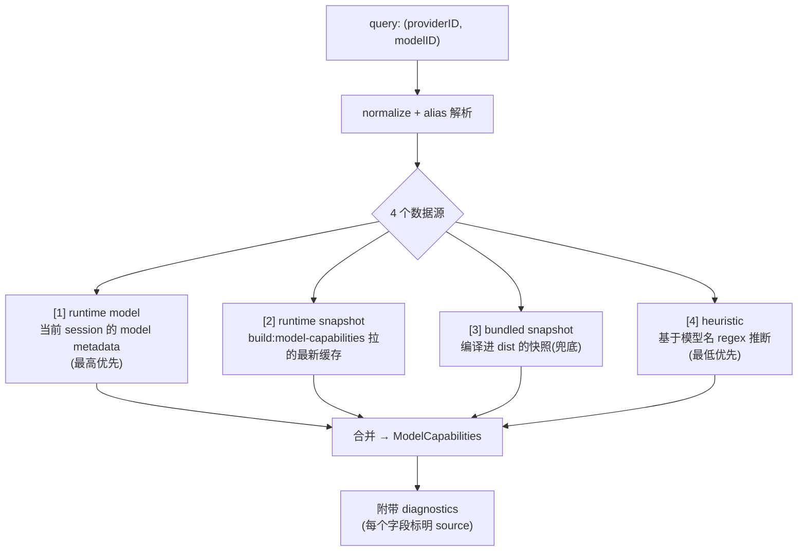
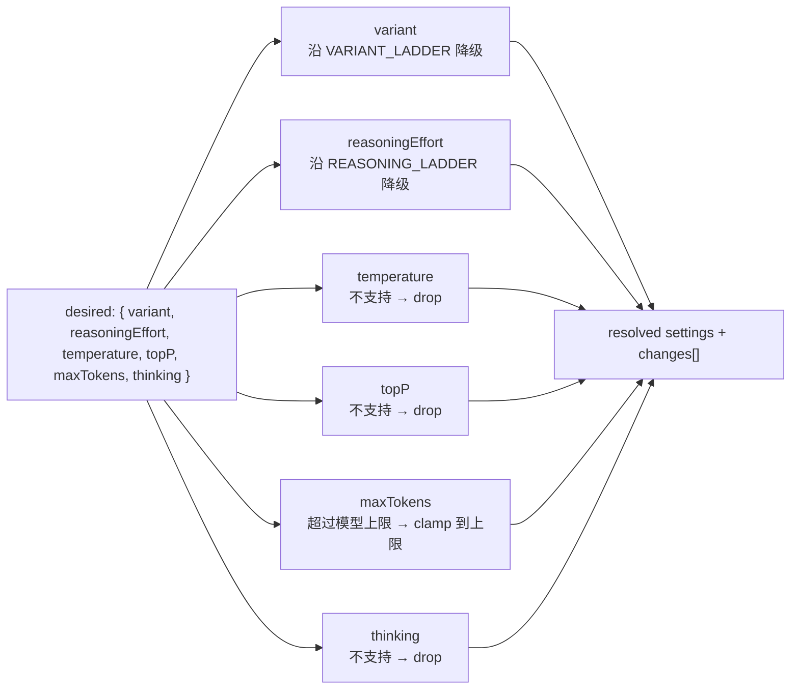

# 06 · 模型能力 + 兼容性 clamping

> **核心问题：** OmO 怎么知道"哪些模型支持 thinking、哪些 variant 不被某 provider 接受"？当你设了 `variant: "max"` 但模型不支持时，怎么 graceful degradation？
>
> 你将来想做"自动 clamp 不支持的功能"或者复用 OmO 的模型能力数据库时，要看这篇。

---

## 1. 一句话定义

OmO 维护一份**多源融合的模型能力表**（runtime + snapshot + bundled + heuristic），并提供一个**阶梯式 clamping 算法**：用户/agent 想要 `max` 但模型只支持到 `high`，自动降到 `high` 而不是失败。

## 2. 两个核心 API

| API | 文件 | 干什么 |
|-----|------|--------|
| `getModelCapabilities({ providerID, modelID })` | [`packages/model-core/.../get-model-capabilities.ts`](https://github.com/code-yeongyu/oh-my-openagent/blob/20d67be496155473f49aef3207bfe9d3737cbfa8/packages/model-core/src/model-capabilities/get-model-capabilities.ts) | 查询模型支持什么 |
| `resolveCompatibleModelSettings({ providerID, modelID, desired, capabilities })` | [`src/shared/model-settings-compatibility.ts`](https://github.com/code-yeongyu/oh-my-openagent/blob/20d67be496155473f49aef3207bfe9d3737cbfa8/src/shared/model-settings-compatibility.ts) | 把"想要的设置"clamp 到模型实际支持的范围 |

两者都在 [`src/plugin/chat-params.ts`](https://github.com/code-yeongyu/oh-my-openagent/blob/20d67be496155473f49aef3207bfe9d3737cbfa8/src/plugin/chat-params.ts) 的 dispatcher 里串成流水线（见 [03](./03-chat-params-mechanism.md) §3）。

## 3. `getModelCapabilities` — 4 源融合



### 返回类型（精简）

```typescript
interface ModelCapabilities {
  requestedModelID: string
  canonicalModelID: string
  family?: string                   // "claude" / "gpt-5" / ...
  variants?: string[]               // ["low","medium","high","max"]
  reasoningEfforts?: string[]       // ["none","low","medium","high"]
  reasoning?: boolean               // 是否是推理模型
  supportsThinking?: boolean        // 能不能用 thinking 模式
  supportsTemperature?: boolean
  supportsTopP?: boolean
  maxOutputTokens?: number
  toolCall?: boolean
  modalities?: { input?: string[]; output?: string[] }
  diagnostics: {
    resolutionMode: "snapshot-backed" | "alias-backed" | "heuristic-backed" | "unknown"
    /* 每个字段都标明 source: "runtime" | "snapshot" | "heuristic" | "override" | "none" */
  }
}
```

### 4 个数据源的优先级（字段级别）

每个字段独立挑数据源，不是整体覆盖。看 [`get-model-capabilities.ts:108-120`](https://github.com/code-yeongyu/oh-my-openagent/blob/20d67be496155473f49aef3207bfe9d3737cbfa8/packages/model-core/src/model-capabilities/get-model-capabilities.ts#L108-L120)：

```typescript
return {
  // ...
  family: snapshotEntry?.family ?? heuristicFamily?.family,
  variants: runtimeVariants ?? override?.variants ?? heuristicFamily?.variants,
  reasoningEfforts: override?.reasoningEfforts ?? heuristicFamily?.reasoningEfforts,
  reasoning: runtimeReasoning ?? snapshotEntry?.reasoning,
  supportsThinking: override?.supportsThinking
    ?? heuristicFamily?.supportsThinking
    ?? runtimeThinking
    ?? snapshotEntry?.reasoning,
  // ...
}
```

→ **每个字段都有自己的 fallback chain**。这种"分字段融合"比"整体替换"更精细，但也更复杂。

### `diagnostics` 字段

每次返回都带 diagnostics，告诉你"这个值是从哪个源来的"。`bunx oh-my-opencode doctor` 跑模型解析检查时就用它。

**你写自己的插件时**：可以照抄"分字段融合 + diagnostics"模式，但**初版往往不需要** —— 你的 DeepSeek 控制只查 `family` 一个字段，简单 `if (family === "deepseek-r1") force-on` 就完事。

## 4. `resolveCompatibleModelSettings` — 阶梯 clamping

### 4.1 两个 ladder

```51:52:src/shared/model-settings-compatibility.ts
const VARIANT_LADDER = ["low", "medium", "high", "xhigh", "max"]
const REASONING_LADDER = ["none", "minimal", "low", "medium", "high", "xhigh", "max"]
```

→ **从低到高的能力序列**。用户想要 `max`、模型只支持 `["low","medium","high"]` 时，从 `max` 在 ladder 里的位置（index 4）向左走，找第一个 `allowed.includes()` 的项 —— `high` (index 2) 就是答案。

```54:65:src/shared/model-settings-compatibility.ts
function downgradeWithinLadder(value: string, allowed: string[], ladder: string[]): string | undefined {
  const requestedIndex = ladder.indexOf(value)
  if (requestedIndex === -1) return undefined

  for (let index = requestedIndex; index >= 0; index -= 1) {
    if (allowed.includes(ladder[index])) {
      return ladder[index]
    }
  }

  return undefined
}
```

### 4.2 6 个字段的处理流程



### 4.3 `changes` 数组

每个被修改的字段都会进 `changes` 数组：

```typescript
type ModelSettingsCompatibilityChange = {
  field: "variant" | "reasoningEffort" | "temperature" | "topP" | "maxTokens" | "thinking"
  from: string
  to?: string
  reason: "unsupported-by-model-family"
    | "unknown-model-family"
    | "unsupported-by-model-metadata"
    | "max-output-limit"
}
```

→ **dispatcher 拿到 changes 后可以记日志、发 toast 警告用户**。但当前主流程没做这件事，多数情况下静默 clamp。

### 4.4 三种 fallback 来源

```typescript
function resolveField(normalized, familyCaps, ladder, familyKnown, metadataOverride, familyAliases) {
  // [1] 别名映射优先：family 里有这个值的别名 → 用别名
  if (aliased && (metadataOverride?.includes(aliased) || familyCaps?.includes(aliased))) {
    return { value: aliased, reason: "unsupported-by-model-family" }
  }

  // [2] metadata override（来自 models.dev 的真实模型支持列表）
  if (metadataOverride) {
    if (metadataOverride.includes(normalized)) return { value: normalized }
    return { value: downgradeWithinLadder(...), reason: "unsupported-by-model-metadata" }
  }

  // [3] family heuristic（基于模型族的硬编码 capability）
  if (familyCaps) {
    if (familyCaps.includes(normalized)) return { value: normalized }
    return { value: downgradeWithinLadder(...), reason: "unsupported-by-model-family" }
  }

  // [4] family 已知但没列出 caps → 不支持
  if (familyKnown) return { value: undefined, reason: "unsupported-by-model-family" }

  // [5] 完全未知 family → 保留原值（pass-through）
  return { value: undefined, reason: "unknown-model-family" }
}
```

→ **核心思想：知道得越多，处理得越保守。** 完全未知的 family 不动它，让 LLM 自己报错；已知 family 就严格按支持列表 clamp。

## 5. heuristic family 怎么定义的

heuristic 在 [`packages/model-core/src/model-capability-heuristics.ts`](https://github.com/code-yeongyu/oh-my-openagent/blob/20d67be496155473f49aef3207bfe9d3737cbfa8/packages/model-core/src/model-capability-heuristics.ts)。本质是个写死的 regex 表：

```typescript
// 伪代码示意
const FAMILIES = [
  {
    family: "claude-opus",
    pattern: /claude-.*opus/i,
    variants: ["low", "medium", "high", "max"],
    reasoningEfforts: ["low", "medium", "high"],
    supportsThinking: true,
  },
  {
    family: "claude-haiku",
    pattern: /claude-.*haiku/i,
    variants: [],
    supportsThinking: false,
  },
  // gpt-5, gemini-3-1-pro, deepseek-r1, ...
]
```

→ **你将来加 DeepSeek 完整支持时**，可以仿照在 OmO 的 heuristic 表里加一条，然后通过 `getModelCapabilities()` 就能在所有 OmO hook 里复用 —— 但这等于给 OmO 提 PR，不是你独立插件的事。

## 6. 你独立插件能复用什么

| OmO 能力 | 你的独立插件能用吗？ |
|----------|---------------------|
| `getModelCapabilities()` | ❌ 不能，是 OmO 内部 API，不导出 |
| `resolveCompatibleModelSettings()` | ❌ 同上 |
| variant/reasoning ladder | ✅ **思想可抄** —— 把你的"DeepSeek thinking 支持列表"建成一个表，自己写 clamp |
| 4 源融合策略 | ✅ **思想可抄** —— 但初版别上，先 heuristic regex 一把梭 |

→ **你的 `opencode-thinking-toggle` 当前已经做了 heuristic 一层（`builtin-rules.ts`）**。这就是 OmO 4 层里的最底层，已经够 v0.1 用。

## 7. 实战：给你的插件加一个"自动 clamp"

假设 DeepSeek-R1 支持 `reasoningEffort: low|medium|high`，用户/agent 设了 `xhigh`。你可以加一段：

```typescript
const DEEPSEEK_R1_REASONING = ["low", "medium", "high"]
const LADDER = ["none", "minimal", "low", "medium", "high", "xhigh", "max"]

function clampReasoningEffort(desired: string, allowed: string[]): string | undefined {
  const idx = LADDER.indexOf(desired.toLowerCase())
  if (idx === -1) return undefined
  for (let i = idx; i >= 0; i -= 1) {
    if (allowed.includes(LADDER[i])) return LADDER[i]
  }
  return undefined
}

// 在 chat.params hook 里：
if (isDeepSeekR1(modelID) && typeof output.options.reasoningEffort === "string") {
  const clamped = clampReasoningEffort(output.options.reasoningEffort, DEEPSEEK_R1_REASONING)
  if (clamped) output.options.reasoningEffort = clamped
  else delete output.options.reasoningEffort
}
```

→ **20 行代码搞定**。比 OmO 的 4 源融合简单 95%，但对你的场景足够。

---

## 读完后应该能回答

- [ ] `getModelCapabilities` 的 4 个数据源是什么？谁优先？
- [ ] `VARIANT_LADDER` 是怎么帮 `max → high` 降级的？
- [ ] `unsupported-by-model-family` 和 `unsupported-by-model-metadata` 有什么区别？
- [ ] `unknown-model-family` 时为什么 pass-through 而不 drop？
- [ ] 我的独立插件能直接调 `getModelCapabilities()` 吗？为什么？

---

→ **下一篇：** [07 · OmO 5 层 hook 与 12 切面的映射](./07-hook-system-overview.md)
