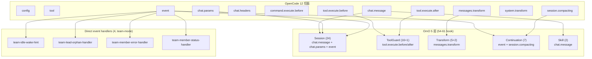

# 07 · OmO 5 层 hook 与 12 切面的映射

> **核心问题：** OmO 自己抽象了 5 层内部 hook，跟 OpenCode 暴露的 12 个生命周期切面是什么关系？为什么要这么分？
>
> 想给 OmO 自己加 hook（fork 或 PR）时必读；写独立插件时**不需要**这一层抽象。

---

## 1. 为什么要 5 层抽象

OmO 现在挂了 54-61 个内部细粒度 hook，都散落在 OpenCode 的 12 个切面里。如果直接写成 12 个大 dispatcher：

```typescript
// 想象一下没有 5 层抽象时
"chat.params": async (input, output) => {
  await thinkMode(input, output)
  await modelFallback(input, output)
  await anthropicEffort(input, output)
  await ...  // 24 个 session 类的 hook 都堆这里
}

"tool.execute.before": async (input, output) => {
  await commentChecker(input, output)
  await writeExistingFileGuard(input, output)
  // 16 个 tool guard hook 堆这里
}
```

→ **会变成巨型 god-handler**，没法做配置门控、没法做异常隔离、没法做依赖共享。

5 层抽象解决的问题：

| 痛点 | 解决方案 |
|------|----------|
| god-handler | 每层一个 `createXxxHooks()` 工厂，每个 hook 一个文件 |
| 配置门控散落 | `isHookEnabled("hook-name")` 集中决定开关 |
| 异常隔离 | `safeCreateHook` 包装，单 hook 抛错不影响其他 |
| 共享依赖（ctx / config / backgroundManager） | 工厂参数注入，运行时不再传 |
| 装配顺序 | 5 层之间有依赖（continuation 依赖 sessionRecovery），层内按注册顺序 |

## 2. 总览图



> **OpenCode 切面 vs OmO 层数** 是**多对多**的关系：
> - 一个切面（如 `chat.message`）可能被多层用（Session + Skill）
> - 一层（如 Session）可能跨多个切面（chat.message / chat.params / event）

## 3. 5 层各自负责什么

### 3.1 Session 层（24 个）

**职责：** 会话生命周期相关的 hook。

**典型成员：**
- `thinkMode` — 关键词→variant 切换（详见 [05](./05-think-mode-mechanism.md)）
- `modelFallback` — 主动模型 fallback（chat.params）
- `anthropicEffort` — Claude effort 注入（详见 [04](./04-anthropic-effort-case-study.md)）
- `ralphLoop` — 自参照 dev loop
- `runtimeFallback` — 反应式 provider fallback

**装配位置：** [`src/plugin/hooks/create-session-hooks.ts`](https://github.com/code-yeongyu/oh-my-openagent/blob/20d67be496155473f49aef3207bfe9d3737cbfa8/src/plugin/hooks/create-session-hooks.ts)

**OpenCode 切面：** `chat.message` / `chat.params` / `event` —— 同一个 hook 工厂的不同方法挂到不同切面。

### 3.2 Tool Guard 层（16 + 1 个）

**职责：** 包围 tool 调用前后的守卫和增强。

**典型成员：**
- `writeExistingFileGuard` — 写已存在文件前必须先 Read
- `hashlineReadEnhancer` — 给 Read 输出加 `LINE#ID` 哈希（hashline edit 配套）
- `commentChecker` — 拦截 AI slop 注释
- `bashFileReadGuard` — 防 bash 偷读文件

**装配位置：** [`src/plugin/hooks/create-tool-guard-hooks.ts`](https://github.com/code-yeongyu/oh-my-openagent/blob/20d67be496155473f49aef3207bfe9d3737cbfa8/src/plugin/hooks/create-tool-guard-hooks.ts)

**OpenCode 切面：** `tool.execute.before` / `tool.execute.after`

### 3.3 Transform 层（5 + 2 个）

**职责：** message 数组定型前的全局变换。

**典型成员：**
- `contextInjectorMessagesTransform` — 注入 AGENTS.md / README.md
- `keywordDetector` — IntentGate，识别 ultrawork/search/analyze 关键词
- `thinkingBlockValidator` — 校验 thinking block 结构
- `toolPairValidator` — 校验 tool_use / tool_result 配对

**装配位置：** [`src/plugin/hooks/create-transform-hooks.ts`](https://github.com/code-yeongyu/oh-my-openagent/blob/20d67be496155473f49aef3207bfe9d3737cbfa8/src/plugin/hooks/create-transform-hooks.ts)

**OpenCode 切面：** `experimental.chat.messages.transform`

### 3.4 Continuation 层（7 个）

**职责：** 跨会话 / 跨压缩的状态保持。

**典型成员：**
- `todoContinuationEnforcer` — Boulder，逼 agent 不停推石头
- `compactionTodoPreserver` — 压缩时保留 todo
- `atlasHook` — Atlas 编排会话总控
- `backgroundNotificationHook` — 后台任务完成通知

**装配位置：** [`src/plugin/hooks/create-continuation-hooks.ts`](https://github.com/code-yeongyu/oh-my-openagent/blob/20d67be496155473f49aef3207bfe9d3737cbfa8/src/plugin/hooks/create-continuation-hooks.ts)

**OpenCode 切面：** `event` (session.idle/compacted) / `experimental.session.compacting`

**特殊点：** Continuation 层依赖 Session 层的 `sessionRecovery`（用 callback 注入避免双向依赖）：

```80:101:src/plugin/hooks/create-continuation-hooks.ts
if (sessionRecovery) {
  const onAbortCallbacks: Array<(sessionID: string) => void> = []
  // ...
  if (todoContinuationEnforcer) {
    onAbortCallbacks.push(todoContinuationEnforcer.markRecovering)
    onRecoveryCompleteCallbacks.push(todoContinuationEnforcer.markRecoveryComplete)
  }

  if (onAbortCallbacks.length > 0) {
    sessionRecovery.setOnAbortCallback((sessionID: string) => {
      for (const callback of onAbortCallbacks) callback(sessionID)
    })
  }
}
```

→ **跨层依赖用 callback 注入**，避免直接 import 形成循环。

### 3.5 Skill 层（2 个）

**职责：** Skill 系统相关的提示和 slash command 路由。

**典型成员：**
- `categorySkillReminder` — 提示 LLM "调 category 之前要加载对应 skill"
- `autoSlashCommand` — 用户输入纯 `/command` 时自动执行

**装配位置：** [`src/plugin/hooks/create-skill-hooks.ts`](https://github.com/code-yeongyu/oh-my-openagent/blob/20d67be496155473f49aef3207bfe9d3737cbfa8/src/plugin/hooks/create-skill-hooks.ts)

**OpenCode 切面：** `chat.message`

## 4. 装配总入口

```32:99:src/create-hooks.ts
export function createHooks(args: {
  ctx: PluginContext
  pluginConfig: OhMyOpenCodeConfig
  // ...
}) {
  const core = createCoreHooks({ ... })
  // core 包含 Session + ToolGuard + Transform

  const continuation = createContinuationHooks({
    ctx, pluginConfig, ...
    sessionRecovery: core.sessionRecovery,  // 关键：跨层依赖
  })

  const skill = createSkillHooks({ ... })

  const hooks = { ...core, ...continuation, ...skill }

  return {
    ...hooks,
    disposeHooks: (): void => {
      disposeCreatedHooks(hooks)  // 优雅关闭
    },
  }
}
```

## 5. `safeCreateHook` 是关键防御

```7:24:src/shared/safe-create-hook.ts
export function safeCreateHook<T>(
  name: string,
  factory: () => T,
  options?: SafeCreateHookOptions,
): T | null {
  const enabled = options?.enabled ?? true

  if (!enabled) {
    return factory() ?? null
  }

  try {
    return factory() ?? null
  } catch (error) {
    log(`[safe-create-hook] Hook creation failed: ${name}`, { error })
    return null
  }
}
```

→ **装配阶段一个 hook 抛错就返回 null**，运行时 dispatcher 跳过 null。**OmO 60 个 hook 哪怕只有 1 个炸了，整个插件依然能跑。**

`safeHookEnabled` 配置：`experimental.safe_hook_creation` 默认 true，关掉可以让错误直接冒泡（调试用）。

## 6. Disposable hooks

某些 hook 持有外部资源（设了 `setInterval`、订阅了 OS 事件、起了子进程）。`disposeCreatedHooks` 优雅关闭：

```16:33:src/create-hooks.ts
type DisposableHook = { dispose?: () => void } | null | undefined

export type DisposableCreatedHooks = {
  claudeCodeHooks?: DisposableHook
  commentChecker?: DisposableHook
  runtimeFallback?: DisposableHook
  todoContinuationEnforcer?: DisposableHook
  autoSlashCommand?: DisposableHook
  anthropicContextWindowLimitRecovery?: DisposableHook
}

export function disposeCreatedHooks(hooks: DisposableCreatedHooks): void {
  hooks.claudeCodeHooks?.dispose?.()
  // ...
}
```

→ **OpenCode 重新加载插件配置时**，新一轮 `serverPlugin()` 之前会调 `disposeHooks()`，避免句柄泄漏。

## 7. 你给 OmO 自己加 hook 的标准流程

如果你 fork 改 OmO 给它加新 hook（不是写独立插件）：

```
[1] mkdir src/hooks/{name}/
[2] index.ts 导出 createXxxHook(deps) 工厂
[3] 工厂返回的对象，根据要挂的切面，导出 "chat.message" / "chat.params" / ... 等方法
[4] 决定挂哪一层：
    - Session：会话生命周期？→ create-session-hooks.ts
    - ToolGuard：pre/post tool？→ create-tool-guard-hooks.ts
    - Transform：message 变换？→ create-transform-hooks.ts
    - Continuation：idle/compacted？→ create-continuation-hooks.ts
    - Skill：skill 相关？→ create-skill-hooks.ts
[5] 在对应的 create-*-hooks.ts 里加：
      const myHook = isHookEnabled("my-hook")
        ? safeHook("my-hook", () => createMyHook(deps))
        : null
[6] 把 myHook 写到该层 return type
[7] 在 src/config/schema/hooks.ts 的 HookNameSchema 加 "my-hook"
[8] 在 src/plugin/{切面}.ts handler 里把 myHook 拉进 dispatcher
[9] 写 *.test.ts，给/when/then
```

详细步骤见 [`src/hooks/AGENTS.md`](https://github.com/code-yeongyu/oh-my-openagent/blob/20d67be496155473f49aef3207bfe9d3737cbfa8/src/hooks/AGENTS.md) 末尾的 "ADDING A NEW HOOK"。

## 8. 你的独立插件用不到这套

**重申一遍：写独立插件时直接在 12 切面上挂 1-3 个 hook 就够**，不需要 5 层抽象。你可以照搬：

- **factory + 闭包**（每个 hook 一个 `createXxx()` 工厂）
- **`safeHook` 思想**（try/catch 包一下 hook 创建）
- **配置门控装配阶段决策**（运行时 0 if-else）

但**不要照搬**：
- 5 层目录结构（你只有 1-3 个 hook，硬塞 5 层是过度工程）
- `HookNameSchema` 那套（你不需要给用户开 60 个开关）

## 9. 一图速记

```
OpenCode  ──── 12 个生命周期切面 ──── 写死在 SDK，不能改
            │
            ▼
OmO      ──── 5 层 hook 组合 ──── 54-61 个细粒度 hook
            │
            ▼
你的插件 ──── 直接挂在 12 切面 ──── 1-3 个 hook 即可
```

---

## 读完后应该能回答

- [ ] OmO 为什么把 hook 分 5 层而不是 12 层？
- [ ] Session 层和 ToolGuard 层在 OpenCode 切面上有重合吗？
- [ ] Continuation 层怎么依赖 Session 层的 `sessionRecovery`？
- [ ] `safeCreateHook` 解决了什么具体问题？
- [ ] Disposable hooks 什么时候被 dispose？
- [ ] 我写独立插件需要 5 层抽象吗？

---

→ **下一篇：** [08 · 工具注册与门控](./08-tool-registry.md)
