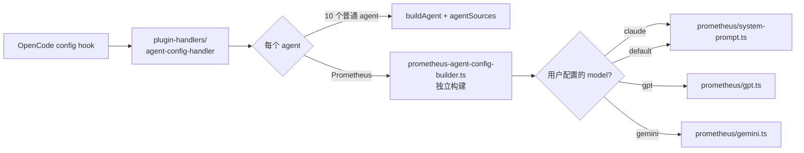

# 09 · Agent 系统

> **核心问题：** 11 个 agent 是怎么注册到 OpenCode 的？dynamic prompt 是怎么编织的？primary / subagent 两种模式的实际差异？
>
> 想给 OmO 自己加新 agent 时必读；写独立插件如果只关心"调 LLM 改参数"用不到这层。

---

## 1. OpenCode 的 agent 抽象

来自 `@opencode-ai/sdk` 的 `AgentConfig`：

```typescript
// 简化版
type AgentConfig = {
  description?: string          // 给 UI 显示
  prompt?: string               // system prompt
  model?: string                // 默认模型 "anthropic/claude-opus-4-7"
  temperature?: number
  maxTokens?: number
  tools?: Record<string, boolean>     // 该 agent 能不能用某 tool（true/false）
  permission?: { ... }                // 权限设置
  mode?: "primary" | "subagent" | "all"
  // ... 还有更多字段
}
```

→ **OpenCode 把 agent 当成"预设的 LLM 配置 + 工具白名单"**。用户 Tab 切换 agent 就是切换这个 AgentConfig。

OmO 通过 `config` hook 注入这些 AgentConfig（详见 [02](./02-plugin-entry-and-lifecycle.md) §3.4 提到的 6 阶段配置流水线 Phase 3）。

## 2. OmO 的 11 个 agent

详细表见 [`src/agents/AGENTS.md`](https://github.com/code-yeongyu/oh-my-openagent/blob/20d67be496155473f49aef3207bfe9d3737cbfa8/src/agents/AGENTS.md)。骨架：

| Agent | Mode | 用途 |
|-------|------|------|
| Sisyphus | primary | 主编排者 |
| Hephaestus | primary | GPT-native autonomous worker |
| Prometheus | primary | 战略规划者（interview mode） |
| Atlas | primary | Todo 编排执行者 |
| Oracle | subagent | 只读架构咨询 |
| Librarian | subagent | OSS 代码 / 文档检索 |
| Explore | subagent | 快速 codebase grep |
| Multimodal-Looker | subagent | 图片 / PDF 分析 |
| Metis | subagent | 规划前 gap 分析 |
| Momus | subagent | 规划 review |
| Sisyphus-Junior | subagent | category-spawned 执行者 |

## 3. AgentFactory 工厂模式

```13:17:src/agents/types.ts
export type AgentFactory = ((model: string) => AgentConfig) & {
  mode: AgentMode;
};
```

→ **AgentFactory = 函数 + 静态 mode 属性**。

```typescript
// 例：oracle.ts (简化)
export const createOracleAgent: AgentFactory = (model: string) => ({
  description: "Read-only consultant for architecture review",
  prompt: ORACLE_PROMPT,
  model,
  temperature: 0.1,
  // ...
})
createOracleAgent.mode = "subagent"   // 静态属性，未实例化也能读
```

为什么 mode 是静态属性？—— 因为**在调工厂之前**就需要知道 mode 来决定怎么解析 model（primary 看 UI 选的、subagent 走 fallback chain）。

## 4. agentSources 注册表

```32:45:src/agents/builtin-agents.ts
const agentSources: Record<BuiltinAgentName, AgentSource> = {
  sisyphus: createSisyphusAgent,
  hephaestus: createHephaestusAgent,
  oracle: createOracleAgent,
  librarian: createLibrarianAgent,
  explore: createExploreAgent,
  "multimodal-looker": createMultimodalLookerAgent,
  metis: createMetisAgent,
  momus: createMomusAgent,
  // Note: Atlas is handled specially in createBuiltinAgents()
  // because it needs OrchestratorContext, not just a model string
  atlas: createAtlasAgent as AgentFactory,
  "sisyphus-junior": createSisyphusJuniorAgentWithOverrides as AgentFactory,
}
```

→ **10 个 agent 注册到 agentSources，第 11 个（Prometheus）单独处理**。Prometheus 不是工厂函数能装下的，它有动态 interview 模式、md-only 写限制、不同模型的多套 prompt 变体，所以走 [`src/plugin-handlers/prometheus-agent-config-builder.ts`](https://github.com/code-yeongyu/oh-my-openagent/blob/20d67be496155473f49aef3207bfe9d3737cbfa8/src/plugin-handlers/prometheus-agent-config-builder.ts) 单独构建。

## 5. `buildAgent` — Category 合并

```12:41:src/agents/agent-builder.ts
export function buildAgent(
  source: AgentSource,
  model: string,
  categories?: CategoriesConfig
): AgentConfig {
  const base = isFactory(source) ? source(model) : { ...source }
  const categoryConfigs: Record<string, CategoryConfig> = mergeCategories(categories)

  const agentWithCategory = base as AgentConfig & { category?: string; ... }
  if (agentWithCategory.category) {
    const categoryConfig = categoryConfigs[agentWithCategory.category]
    if (categoryConfig) {
      if (!base.model) base.model = categoryConfig.model
      if (base.temperature === undefined && categoryConfig.temperature !== undefined) {
        base.temperature = categoryConfig.temperature
      }
      if (base.variant === undefined && categoryConfig.variant !== undefined) {
        base.variant = categoryConfig.variant
      }
    }
  }

  if (isFactory(source) && (base as AgentConfig & { mode?: string }).mode === undefined) {
    ;(base as AgentConfig & { mode?: string }).mode = source.mode
  }

  return base
}
```

→ **Agent 可以声明自己属于某 category**，buildAgent 从 category 配置补全 model / temperature / variant 等。这是 [03](./03-chat-params-mechanism.md) 提到的 Category 系统的 agent 入口。

## 6. `dynamic-agent-prompt-builder` — Sisyphus 怎么知道有哪些 agent 可用

这是 OmO 一个精妙之处。**Sisyphus 的 prompt 不是写死的**，它是运行时根据当前 OmO 启用的 agents、categories、skills 拼出来的。

入口：`src/agents/dynamic-agent-prompt-builder.ts`（你没读过，但思路如下）。它会拼：

1. **Core sections**：identity、mode、restrictions（不变的部分）
2. **Policy sections**：citation、verification、anti-patterns
3. **Agent inventory**：当前可用的 agent 列表 + 各自的 `triggers` / `useWhen` / `avoidWhen`
4. **Tool selection table**：哪些 tool 用哪个 agent 调
5. **Category + Skills guide**：哪个 category 应该 load 哪些 skill

`AgentPromptMetadata`（在 [`src/agents/types.ts:47-71`](https://github.com/code-yeongyu/oh-my-openagent/blob/20d67be496155473f49aef3207bfe9d3737cbfa8/src/agents/types.ts#L47-L71)）就是给 prompt builder 看的元数据：

```typescript
export interface AgentPromptMetadata {
  category: "exploration" | "specialist" | "advisor" | "utility"
  cost: "FREE" | "CHEAP" | "EXPENSIVE"
  triggers: DelegationTrigger[]      // 用 oracle 的场景
  useWhen?: string[]
  avoidWhen?: string[]
  dedicatedSection?: string          // 给 oracle 这种特殊 agent 的 markdown 段落
  promptAlias?: string               // "Oracle" vs "oracle"
  keyTrigger?: string                // Phase 0 提示词
}
```

每个 agent 文件（oracle.ts、librarian.ts、…）都导出自己的 metadata。

→ **效果**：你 fork 加一个新 agent，写好工厂 + metadata 注册到 agentSources，**不用改 Sisyphus prompt**，它自动出现在 delegation table 里。

## 7. Tool 限制：per-agent allowed/denied

在 `src/shared/agent-tool-restrictions.ts`（之前 §08 提过）。OmO 在 `config` hook 阶段把每个 agent 的 `tools: { ... }` 设好：

```typescript
// 大致逻辑
agentConfig.tools = {
  read: true,
  grep: true,
  write: false,        // 禁用
  edit: false,
  task: false,
  call_omo_agent: false,
}
```

OpenCode 看到 `tools.xxx === false` 时不会把该 tool 暴露给这个 agent 的 LLM。

→ **Oracle 因此真的是 read-only**：它的 LLM 看不到 write/edit 工具的定义，根本无法生成对应的 tool_use 块。

## 8. AgentMode 的实际差异

| Mode | UI 表现 | model 解析 |
|------|---------|-----------|
| `primary` | Tab 列表里出现，可手选 | 优先用 UI 选的 model；没选则用 agent 默认 |
| `subagent` | Tab 列表不出现，只能通过 `task(subagent_type=...)` 调 | 总是用 agent 自己的 fallback chain（见 [`src/shared/model-requirements.ts`](https://github.com/code-yeongyu/oh-my-openagent/blob/20d67be496155473f49aef3207bfe9d3737cbfa8/src/shared/model-requirements.ts)） |
| `all` | 都出现（OpenCode 兼容） | 当前 OmO 没用 |

→ **关键差异**：subagent 不受用户 UI 选择影响，**保证 oracle / librarian 这些专用模型不会被换成乱七八糟的模型**。

## 9. Prometheus 的特殊性



`src/agents/prometheus/` 子目录：

| 文件 | 用途 |
|------|------|
| `system-prompt.ts` | Claude 默认 prompt（最完整版本） |
| `identity-constraints.ts` | "只能改 .sisyphus/*.md" 等硬约束 |
| `interview-mode.ts` | 渐进式提问的 state machine |
| `plan-template.ts` | 生成的 plan markdown 模板 |
| `gpt.ts` / `gemini.ts` | 不同模型的 prompt 变体 |

`prometheus-agent-config-builder.ts` 根据当前用户配置的模型选 prompt 变体，最终拼出 AgentConfig 返回。**不进 agentSources 注册表**。

## 10. 给 OmO 自己加新 agent 的标准流程

1. `src/agents/{name}.ts` —— 写工厂 + metadata
2. 在 [`src/agents/builtin-agents.ts`](https://github.com/code-yeongyu/oh-my-openagent/blob/20d67be496155473f49aef3207bfe9d3737cbfa8/src/agents/builtin-agents.ts) 的 `agentSources` 加一条
3. 在 [`src/agents/builtin-agents.ts`](https://github.com/code-yeongyu/oh-my-openagent/blob/20d67be496155473f49aef3207bfe9d3737cbfa8/src/agents/builtin-agents.ts) 的 `agentMetadata` 加 prompt metadata（让 Sisyphus 知道你）
4. 在 [`src/config/schema/agent-names.ts`](https://github.com/code-yeongyu/oh-my-openagent/blob/20d67be496155473f49aef3207bfe9d3737cbfa8/src/config/schema/agent-names.ts) 的 `BuiltinAgentNameSchema` 加名字
5. 在 [`src/shared/model-requirements.ts`](https://github.com/code-yeongyu/oh-my-openagent/blob/20d67be496155473f49aef3207bfe9d3737cbfa8/src/shared/model-requirements.ts) 加 fallback chain
6. （可选）在 [`src/shared/agent-tool-restrictions.ts`](https://github.com/code-yeongyu/oh-my-openagent/blob/20d67be496155473f49aef3207bfe9d3737cbfa8/src/shared/agent-tool-restrictions.ts) 设 tool 限制
7. 跑 `bun test src/agents/builtin-agents.test.ts` 验证注册成功

详见 [`src/agents/AGENTS.md`](https://github.com/code-yeongyu/oh-my-openagent/blob/20d67be496155473f49aef3207bfe9d3737cbfa8/src/agents/AGENTS.md) 末尾。

## 11. 你独立插件能加 agent 吗？

**理论上能**：`config` hook 给你了，你可以注入新的 agent。但**实操有几个坑**：

| 坑 | 解释 |
|----|------|
| 没有 dynamic prompt 集成 | 你新加的 agent 不会自动出现在 Sisyphus 的 delegation table 里 |
| 没有 OmO 的 fallback chain | 用户的模型不支持时，你的 agent 直接挂 |
| 没有 tool restriction 集成 | 你的 agent 默认能用所有 tool，自己写白名单 |
| 配置门控 | 用户的 `disabled_agents` 不会自动认识你新加的 agent |

→ **结论**：写独立插件加 agent 比加 hook / 加 tool 难得多。**通常没必要 —— 加 tool 已经足够暴露能力**。如果真要加 agent，建议 fork OmO 而不是写独立插件。

---

## 读完后应该能回答

- [ ] `AgentFactory` 类型的 `mode` 为什么是静态属性而不是 instance 字段？
- [ ] 为什么 Prometheus 不在 agentSources 注册表里？
- [ ] primary 和 subagent mode 在 model 解析上的区别？
- [ ] Sisyphus 的 delegation table 怎么自动包含新 agent 的？
- [ ] Oracle 是怎么做到"真的 read-only"的？

---

→ **下一篇：** [99 · 术语词典 + 未来插件清单](./99-glossary-and-future-plugins.md)
