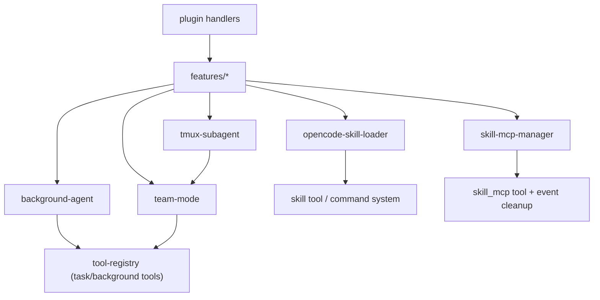

# 11 · Feature 模块总览（20 个子系统）

> 目标：从“插件入口视角”切换到“功能模块视角”，知道每个 feature 的边界、复杂度和改动风险。

---

## 1) 高复杂度模块（优先掌握）

来自 `src/features/AGENTS.md`：

- `background-agent`：任务生命周期、并发、轮询与熔断
- `team-mode`：并行多 agent 协作（mailbox/tasklist/worktree）
- `opencode-skill-loader`：多作用域技能发现与合并
- `tmux-subagent`：tmux 会话编排
- `mcp-oauth`：OAuth2 + PKCE + DCR
- `skill-mcp-manager`：第 3 层 MCP 客户端生命周期

这些模块决定了 OmO 的“工程上限”。

---

## 2) 中低复杂度模块（做体系拼接）

- `context-injector`：上下文注入
- `claude-code-*` loaders：兼容 Claude Code 生态
- `boulder-state` / `run-continuation-state`：状态持久化
- `task-toast-manager` / `tool-metadata-store`：运行时辅助能力

---

## 3) 子系统依赖关系（简图）

---

## 4) 架构评价（这一层）

优点：

- **模块化明显**：`src/features/*` 基本做到“按能力拆包”
- **边界友好**：多数模块对外只暴露 manager/factory
- **测试友好**：模块内聚，适合按目录测

不足：

- 部分模块非常大（例如 background-agent / team-mode），二次理解成本高
- “跨模块状态”较多，排障常需跨多个目录跳转

---

## 5) 必须掌握的检查点

- [ ] 能说出 6 个高复杂度模块各自职责
- [ ] 看到一个 bug，能先判断属于哪个 feature 边界
- [ ] 知道改 feature 时应先看该目录下 `AGENTS.md`

