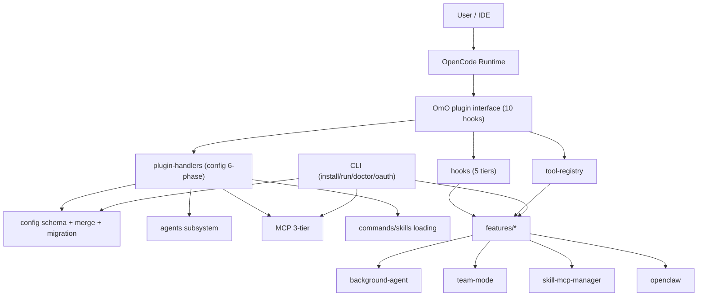

# 15 · 系统关系图 + 架构层面的好与坏

> 目标：不只“知道怎么用”，还要能评价设计质量，判断哪里值得复用、哪里要谨慎改。

---

## 1) 全局系统关系（OmO 视角）

---

## 2) OmO 与 OpenCode 的边界

- OpenCode 提供：插件协议、生命周期、底层会话与模型调用框架
- OmO 提供：更强的编排层（agent、hook 体系、tool 门控、MCP 分层、team-mode、可运维 CLI）

一句话：**OpenCode 是内核，OmO 是“高度工程化的插件操作系统”**。

---

## 3) 架构优点（值得学习/复用）

- **分层清晰**：OpenCode 12 切面之上再抽象 5-tier hooks
- **工厂与装配统一**：`createXxx` 模式降低耦合
- **配置驱动强**：几乎所有行为可 gate
- **防御性好**：`safeCreateHook`、兼容性 clamping、诊断工具完整
- **可运营性强**：CLI + doctor + run + OAuth 工具链齐全
- **可扩展性高**：feature 化拆分 + 三层 MCP

---

## 4) 架构不足（需要警惕）

- **复杂度偏高**：概念层级多（hooks/features/tools/agents/mcp/team）
- **全局心智负担大**：排障往往跨 3-5 个目录
- **全局 patch 风险**：agent sort shim 改 `Array.prototype.sort/toSorted`，虽有 guard，仍是高风险点
- **环境依赖重**：tmux/git/外部 API 在不少路径是硬依赖
- **文档与实现同步压力大**：配置面广，回归验证成本高

---

## 5) “初步掌握”判定标准（你要达到）

- [ ] 能画出上面的系统关系图并解释每条主边
- [ ] 能指出 OmO 与 OpenCode 的职责边界
- [ ] 能说出 5 个设计优点和 3 个主要技术债
- [ ] 能为“新增一个能力”选对落点（hook/tool/feature/cli/config）

---

## 6) 改造策略建议（实践导向）

- 小需求优先：从 `chat.params`/`tool` hook 入手，不要先改 feature 内核
- 中等需求：新增独立 feature + tool gate
- 大需求：先补诊断与回归测试，再动 team-mode/background-agent
- 任何跨系统改动：先在文档里写“边界与不变量”，再改代码

