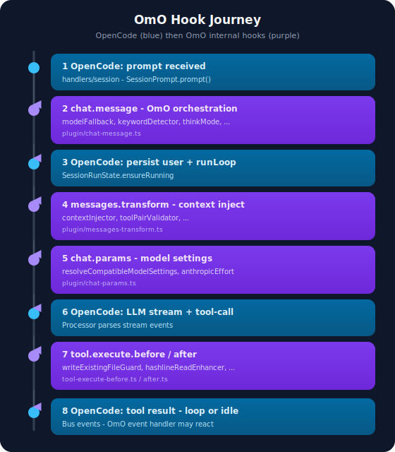

# 17 · 一条消息的 OmO Hook 链（叙事）

> **读法：** 先读 OpenCode 内核 [A1 叙事](../opencode/appendix/A1-full-trace-narrative.md)，再用本文看 **OmO 在每一站加了什么**。  
> **OpenCode 基准：** [`7fe7b9f2`](https://github.com/anomalyco/opencode/commit/7fe7b9f258e36ad9f9acded20c5a9df201da19d5)  
> **OmO 基准：** [`20d67be4`](https://github.com/code-yeongyu/oh-my-openagent/commit/20d67be496155473f49aef3207bfe9d3737cbfa8)



**场景：** 你在 TUI 里用 **Sisyphus** agent，输入：

> 给 `src/auth/` 加一个 JWT 登录接口，先读现有结构再实现。

Sisyphus 判断这是编码任务，调用 **`task`** 工具委托给下游执行链。下面按**时间顺序**跟 hook，区分 **OpenCode 内核站**（蓝）与 **OmO 插件站**（紫）。

---

## 术语：两层 Hook

| 层 | 谁定义 | 例子 |
|----|--------|------|
| **OpenCode 切面** | SDK [`packages/plugin`](https://github.com/anomalyco/opencode/blob/7fe7b9f258e36ad9f9acded20c5a9df201da19d5/packages/plugin/src/index.ts) | `chat.message`、`chat.params`、`tool.execute.before` |
| **OmO 内部 hook** | [`src/hooks/*`](https://github.com/code-yeongyu/oh-my-openagent/tree/20d67be496155473f49aef3207bfe9d3737cbfa8/src/hooks) | `keyword-detector`、`anthropic-effort`、`write-existing-file-guard` |

OmO 的 [`createPluginInterface`](https://github.com/code-yeongyu/oh-my-openagent/blob/20d67be496155473f49aef3207bfe9d3737cbfa8/src/plugin-interface.ts) 把内部 hook **编排**进 OpenCode 的 10 个 handler。本文写的是**编排顺序**，不是 54+ 个 hook 全表（全表见 [07](./07-hook-system-overview.md)）。

---

## 第一站 · OpenCode 收到 prompt

1. HTTP / TUI 把消息交给 [`handlers/session`](https://github.com/anomalyco/opencode/blob/7fe7b9f258e36ad9f9acded20c5a9df201da19d5/packages/opencode/src/server/routes/instance/httpapi/handlers/session.ts)。
2. [`InstanceStore`](https://github.com/anomalyco/opencode/blob/7fe7b9f258e36ad9f9acded20c5a9df201da19d5/packages/opencode/src/project/instance-store.ts) 按 directory 取实例；必要时 [`bootstrap`](https://github.com/anomalyco/opencode/blob/7fe7b9f258e36ad9f9acded20c5a9df201da19d5/packages/opencode/src/project/bootstrap.ts)（含 `plugin.init` → 各插件 `config` hook）。
3. 进入 **`SessionPrompt.prompt()`**。

**OmO 此时尚未介入本轮 user 消息**（init 阶段的 `config` 已在启动时注入 agents/tools）。

---

## 第二站 · `chat.message`（OmO 第一站）

OpenCode 在 user 消息**入库前**调用 [`Plugin.trigger("chat.message")`](https://github.com/anomalyco/opencode/blob/7fe7b9f258e36ad9f9acded20c5a9df201da19d5/packages/opencode/src/session/prompt.ts)。OmO 入口：[`createChatMessageHandler`](https://github.com/code-yeongyu/oh-my-openagent/blob/20d67be496155473f49aef3207bfe9d3737cbfa8/src/plugin/chat-message.ts)。

**对本场景可能执行的内部 hook（按源码顺序，多数可跳过）：**

```
setSessionAgent / 首条 variant gate / 恢复 session model
  → modelFallback（chat.message，若 runtime_fallback 未接管）
  → stopContinuationGuard
  → backgroundNotificationHook
  → runtimeFallback（chat.message）
  → keywordDetector        ← 若消息含 ultrawork/search 等关键词
  → thinkMode              ← 若触发思考变体
  → claudeCodeHooks
  → autoSlashCommand
  → noSisyphusGpt / noHephaestusNonGpt
  → startWork（/start-work 模板时）
  → ralphLoop / ultrawork model override
```

**本例是普通编码请求：** 无关键词、无 slash 命令 → **`keywordDetector` / `thinkMode` 通常跳过**；消息主体不变，agent 仍为 Sisyphus。

---

## 第三站 · OpenCode：落库 + runLoop

4. OpenCode 写入 **MessageV2 + Part**（见 [opencode 08](../opencode/08-session-message-and-storage.md)）。
5. **`SessionRunState.ensureRunning`** 启动 [`SessionPrompt.run`](https://github.com/anomalyco/opencode/blob/7fe7b9f258e36ad9f9acded20c5a9df201da19d5/packages/opencode/src/session/prompt.ts) 的 `while true` loop。

**边界：** runLoop 控制流 **100% 属于 OpenCode**；OmO 不能替换 loop，只能在 hook 切面上改输入/输出。

---

## 第四站 · `experimental.chat.messages.transform`（OmO）

每轮 LLM 前，OpenCode 组装 history 后触发 transform。OmO：[`createMessagesTransformHandler`](https://github.com/code-yeongyu/oh-my-openagent/blob/20d67be496155473f49aef3207bfe9d3737cbfa8/src/plugin/messages-transform.ts)。

```
contextInjectorMessagesTransform   ← 注入项目/会话上下文
  → teamModeStatusInjector       ← team_mode 开启时
  → teamMailboxInjector
  → thinkingBlockValidator
  → toolPairValidator            ← 防止 tool_use / tool_result 不配对待 API
  → ensureUserTurnAfterAssistantTail（内置恢复逻辑）
```

**本例未开 Team Mode：** 中间两个 injector 跳过；**`toolPairValidator` 仍可能运行**（压缩后 history 修复）。

---

## 第五站 · `chat.params`（OmO · 每 LLM step）

OpenCode 在 [`session/llm/request.ts`](https://github.com/anomalyco/opencode/blob/7fe7b9f258e36ad9f9acded20c5a9df201da19d5/packages/opencode/src/session/llm/request.ts) 调用 LLM 前触发。OmO：[`createChatParamsHandler`](https://github.com/code-yeongyu/oh-my-openagent/blob/20d67be496155473f49aef3207bfe9d3737cbfa8/src/plugin/chat-params.ts)。

```
getSessionPromptParams（session 级暂存参数）
  → getModelCapabilities
  → resolveCompatibleModelSettings   ← variant / thinking / temperature clamp
  → anthropicEffort["chat.params"]   ← reasoningEffort 等
```

**要点：** `chat.params` **每个 LLM step 都会触发**（含 subtask 子会话）。改 thinking/effort 的插件应挂这里，见 [03](./03-chat-params-mechanism.md)、[04](./04-anthropic-effort-case-study.md)。

---

## 第六站 · OpenCode：LLM 返回 tool-call

7. [`SessionProcessor`](https://github.com/anomalyco/opencode/blob/7fe7b9f258e36ad9f9acded20c5a9df201da19d5/packages/opencode/src/session/processor.ts) 解析 stream。
8. 模型决定调用 **`task`**（OmO 注册的 delegate 工具，见 [08 tool registry](./08-tool-registry.md)）。

---

## 第七站 · `tool.execute.before` / `after`（OmO）

**Before** — [`createToolExecuteBeforeHandler`](https://github.com/code-yeongyu/oh-my-openagent/blob/20d67be496155473f49aef3207bfe9d3737cbfa8/src/plugin/tool-execute-before.ts)（节选）：

```
writeExistingFileGuard
  → questionLabelTruncator
  → rulesInjector / directoryAgentsInjector / …
  → prometheusMdOnly          ← 仅 Prometheus agent 时生效
  → teamToolGating            ← team_mode 时
  → …
```

**本例 Sisyphus 调 `task`：** `prometheusMdOnly` 跳过；guard 检查通过 → **`task` 执行**（创建子会话 / 委托 category）。

**After** — [`createToolExecuteAfterHandler`](https://github.com/code-yeongyu/oh-my-openagent/blob/20d67be496155473f49aef3207bfe9d3737cbfa8/src/plugin/tool-execute-after.ts) 在每次工具返回后链式运行：`toolOutputTruncator`、`hashlineReadEnhancer`、`editErrorRecovery` 等。

---

## 第八站 · 子会话与 event（OmO 旁路）

9. `task` 在 OpenCode 里创建 **子 session**；下游 agent（如经 category 路由的执行链）在**新 session** 里继续 runLoop。
10. 主 session 的 **`event`** handler（[`createEventHandler`](https://github.com/code-yeongyu/oh-my-openagent/blob/20d67be496155473f49aef3207bfe9d3737cbfa8/src/plugin/event.ts)）响应 `session.idle` / `session.error` 等：
    - `runtimeFallback` 在 error 时换模型重试
    - `modelFallback` 与 pending fallback 协同
    - OpenClaw 出站通知（若配置）

**边界：** 子 session 的 loop 仍是 OpenCode；OmO 通过 **event + 内部 hook** 做恢复与通知，不持有子 session DB。

---

## 第九站 · OpenCode：loop 结束

11. Tool 结果写回 Part → runLoop 下一轮或 **`SessionStatus` idle**。
12. Bus 发布事件 → 客户端 SSE 更新。

---

## 与 qqzhangyanhua oh-flow 的对照

| | [qqzhangyanhua oh-flow](https://github.com/qqzhangyanhua/learn-opencode-agent/blob/main/docs/oh-flow/index.md) | 本文 |
|--|--|--|
| 证据 | 部分 `blob/dev/` | pin SHA |
| 视角 | 产品叙事 + Hephaestus 写文件细节 | **hook 编排顺序** + 边界 |
| 前置 | 书内 1–16 章 | OpenCode **A1** + [边界](../../comparisons/opencode-vs-omo-boundary.md) |

建议：**A1（内核）→ 本文（OmO）→ 07（hook 全表）**。

---

## 读完后应能回答

- [ ] OpenCode 切面 hook 与 OmO 内部 hook 的区别？
- [ ] `chat.message` 和 `chat.params` 各在哪一层、触发几次？
- [ ] 为什么 OmO 不改 `SessionPrompt.run` 却能改变 agent 行为？
- [ ] 写独立插件（如 thinking-toggle）应挂在 OpenCode 哪几个切面、避免碰 OmO 哪一层？
- [ ] `task` 执行前后，哪些 guard 最常影响结果？

→ **内核叙事：** [opencode A1](../opencode/appendix/A1-full-trace-narrative.md)  
→ **边界对照：** [OpenCode ↔ OmO](../../comparisons/opencode-vs-omo-boundary.md)  
→ **Hook 全表：** [07 hook 体系概览](./07-hook-system-overview.md)
