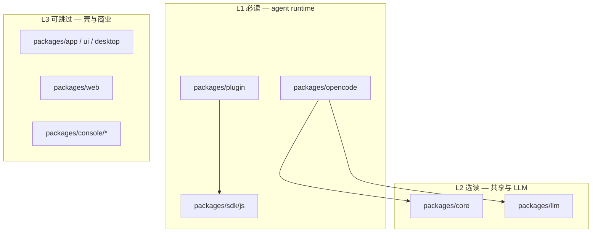

# 01 · Monorepo 与包分层

> **核心问题：** 代码量巨大的 monorepo 里，学 agent 构造该读哪些包？

---

## 1. 仓库形态

- **包管理：** Bun workspaces + Turborepo（根 [`package.json`](https://github.com/anomalyco/opencode/blob/7fe7b9f258e36ad9f9acded20c5a9df201da19d5/package.json)）
- **运行时：** Bun 1.3.x；类型检查用 `tsgo`，lint 用 `oxlint`
- **架构风格：** Effect v4 beta 贯穿 `packages/opencode` 服务层

根级说明见仓库 [`AGENTS.md`](https://github.com/anomalyco/opencode/blob/7fe7b9f258e36ad9f9acded20c5a9df201da19d5/AGENTS.md)（若与 baseline 有差异，以 pin commit 为准）。

---

## 2. 三层阅读模型



| 层级 | 包 | 何时读 |
|------|-----|--------|
| **L1** | `opencode`, `plugin`, `sdk/js` | 理解构造、写插件 |
| **L2** | `core`, `llm` | 追 model schema、Provider 路由细节 |
| **L3** | `app`, `ui`, `desktop`, `web`, `console` | 只做 UI/产品调研时 |

---

## 3. L1 包职责详解

### 3.1 `packages/opencode`

| 子树 | 规模感 | 职责 |
|------|--------|------|
| `src/session/` | 最大 | 主循环、LLM、消息、压缩 |
| `src/cli/` | 大 | 命令行、TUI（OpenTUI + Solid） |
| `src/server/` | 中 | HTTP API、实例路由 |
| `src/tool/` | 中 | 20+ 内置工具 |
| `src/config/` | 中 | 配置 merge |
| 其余 30+ 目录 | 分散 | 见 [99 模块地图](./99-glossary-and-reading-map.md) |

入口：[`src/index.ts`](https://github.com/anomalyco/opencode/blob/7fe7b9f258e36ad9f9acded20c5a9df201da19d5/packages/opencode/src/index.ts)（yargs CLI）。

### 3.2 `packages/plugin`

对外 **唯一** 插件契约：[`src/index.ts`](https://github.com/anomalyco/opencode/blob/7fe7b9f258e36ad9f9acded20c5a9df201da19d5/packages/plugin/src/index.ts) 导出 `Hooks`、`ToolDefinition`、`PluginInput`。

独立插件只依赖此包 + SDK client，**不**依赖 `opencode` 内部路径。

### 3.3 `packages/sdk/js`

- 生成 OpenAPI 类型 + `createOpencodeClient`
- 插件 `input.client` 用于读写 session、调 API
- 内核测试与 `cli/cmd/run.ts` 也走 SDK

---

## 4. L2 包：与 opencode 的分工

| 关注点 | core | opencode |
|--------|------|----------|
| Model / Provider **类型** | ✓ | 使用 |
| **运行时** wiring、trigger、DB | | ✓ |
| Session **事件 schema** | 部分 | 持久化与发布 |
| Filesystem、Flag、Install | ✓ | 使用 |

避免重复读：改 hook 行为不必先读完 `core`；追「某 model 字段从哪来」再进 `packages/core/src/model/`。

### `packages/llm`

- Schema-first 的 LLM 请求/响应
- [`session/llm/request.ts`](https://github.com/anomalyco/opencode/blob/7fe7b9f258e36ad9f9acded20c5a9df201da19d5/packages/opencode/src/session/llm/request.ts) 把 Session 状态转成 LLM 调用

---

## 5. 依赖方向（不变量）

```
plugin SDK  ←──  npm / 本地插件
     ↑
opencode runtime ──→ sdk (client)
     ↓
core, llm (库)
```

**插件不能 import `packages/opencode/src/*` 私有路径**（非公开 API）。

---

## 读完后应能回答

- [ ] 写插件最少要读哪 3 个包？
- [ ] `session/prompt.ts` 在哪个包里？
- [ ] 为什么 TUI 代码可以后读？

→ **下一篇：** [02 · Effect、实例与 Bootstrap](./02-effect-instance-and-bootstrap.md)
