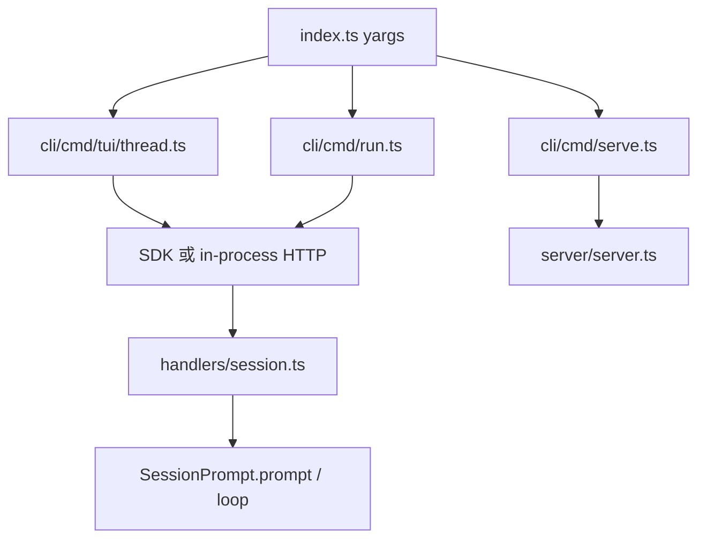

# 03 · CLI、Server 与请求入口

> **核心问题：** 用户按回车发消息后，请求从哪条路径进入 `SessionPrompt`？

---

## 1. 三种运行形态

| 形态 | 命令 / 入口 | 典型场景 |
|------|-------------|----------|
| **TUI** | 默认 `opencode [project]` | 本地交互开发 |
| **Server** | `opencode serve` | Web/Desktop/远程连 HTTP |
| **Run** | `opencode run` | CI、脚本、非交互 |



---

## 2. CLI 入口

[`packages/opencode/src/index.ts`](https://github.com/anomalyco/opencode/blob/7fe7b9f258e36ad9f9acded20c5a9df201da19d5/packages/opencode/src/index.ts)

- yargs 注册子命令模块：`cli/cmd/*.ts`
- **默认命令** 进入 TUI thread（带 project 路径参数）
- 命令实现分散，**不**在 index 堆业务逻辑

常用命令目录：

| 路径 | 用途 |
|------|------|
| `cli/cmd/tui/` | 终端 UI（Solid + OpenTUI） |
| `cli/cmd/serve.ts` | 启动 HTTP |
| `cli/cmd/run.ts` | 单次/持续 run |
| `cli/cmd/mcp.ts` | MCP 管理 |
| `cli/cmd/auth.ts` | Provider 登录 |

**学 agent 构造：** TUI 可整目录后读；只需知道它最终调 session API。

---

## 3. HTTP Server

[`server/server.ts`](https://github.com/anomalyco/opencode/blob/7fe7b9f258e36ad9f9acded20c5a9df201da19d5/packages/opencode/src/server/server.ts) 监听端口；路由组装在：

[`server/routes/instance/httpapi/server.ts`](https://github.com/anomalyco/opencode/blob/7fe7b9f258e36ad9f9acded20c5a9df201da19d5/packages/opencode/src/server/routes/instance/httpapi/server.ts)

### Session 相关 handler（核心）

[`handlers/session.ts`](https://github.com/anomalyco/opencode/blob/7fe7b9f258e36ad9f9acded20c5a9df201da19d5/packages/opencode/src/server/routes/instance/httpapi/handlers/session.ts)：

| API 概念 | 调用的 SessionPrompt 方法 |
|----------|---------------------------|
| 发送 prompt | `prompt()` |
| 继续 loop | `loop()` |
| shell 输入 | `shell()` |
| 初始化命令 | `command({ command: INIT })` |

每个请求先 **解析实例**（directory → `InstanceStore` → 可能触发 `bootstrap`）。

---

## 4. 实例解析链路

```
HTTP x-opencode-directory
  → InstanceStore.getOrCreate(directory)
  → bootstrap.run（若未初始化）
  → 进入 SessionPrompt
```

[`project/instance-store.ts`](https://github.com/anomalyco/opencode/blob/7fe7b9f258e36ad9f9acded20c5a9df201da19d5/packages/opencode/src/project/instance-store.ts) 是 **多 client 共享同一内核进程** 的关键。

---

## 5. `SessionPrompt` 对外接口

[`session/prompt.ts`](https://github.com/anomalyco/opencode/blob/7fe7b9f258e36ad9f9acded20c5a9df201da19d5/packages/opencode/src/session/prompt.ts) 导出（Interface 摘要）：

| 方法 | 用途 |
|------|------|
| `prompt` | 新用户消息 + 启动/加入 runLoop |
| `loop` | 在无新用户消息时继续跑（例如 tool 后继续） |
| `shell` | 终端 shell 专用路径 |
| `command` | Slash command |
| `cancel` | 中止当前 run |
| `resolvePromptParts` | 解析 @file 等 part |

**心脏文件：** `runLoop` 为内部 `Effect.fn("SessionPrompt.run")`，由 `SessionRunState.ensureRunning` 保证同 session 不并发两圈 loop。

---

## 6. 插件作者需要知道的入口

- 插件 **不** 注册 HTTP 路由（除非另写独立服务）
- 插件通过 **hook** 介入已有 `prompt → runLoop` 链
- 调试时可用 `opencode run` + 日志，或 attach 到 serve 的实例

---

## 读完后应能回答

- [ ] TUI 与 serve 最终是否走同一 SessionPrompt？
- [ ] `prompt()` 与 `loop()` 区别？
- [ ] 多项目如何靠 header 区分实例？

→ **下一篇：** [04 · 配置系统](./04-config-system.md)
