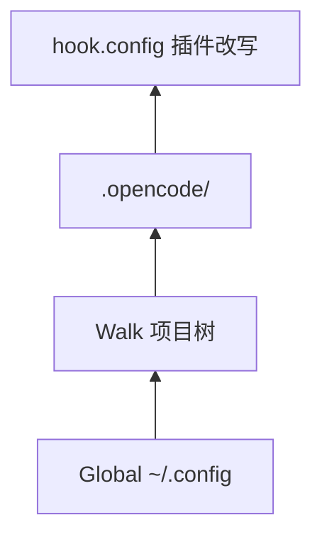

# 04 · 配置系统

> **核心问题：** `opencode.jsonc` 从哪来、怎么合并、哪些键控制 agent / 插件 / MCP？

---

## 1. 一句话

配置 = **多级 JSONC 文件** + 可选远程 well-known + **`hook.config` 运行时改写**；由 [`config/config.ts`](https://github.com/anomalyco/opencode/blob/7fe7b9f258e36ad9f9acded20c5a9df201da19d5/packages/opencode/src/config/config.ts) 加载并 deep merge。

---

## 2. 配置源顺序（后覆盖前）

[`config/config.ts`](https://github.com/anomalyco/opencode/blob/7fe7b9f258e36ad9f9acded20c5a9df201da19d5/packages/opencode/src/config/config.ts) 中 `loadInstanceState` 逻辑（概念顺序）：

1. Auth **well-known** 远程配置（若 provider 声明）
2. **Global：** `~/.config/opencode/opencode.json(c)`
3. 环境变量 **`OPENCODE_CONFIG`** 指向的单文件
4. 从项目 **directory 向上 walk** 到 worktree 根的 `opencode.json(c)`
5. **`.opencode/`** 目录内同名文件（`ConfigPaths.directories()`）
6. **`plugin.init` → `hook.config`** 对每个插件再改一遍内存中的 config

路径辅助：[`config/paths.ts`](https://github.com/anomalyco/opencode/blob/7fe7b9f258e36ad9f9acded20c5a9df201da19d5/packages/opencode/src/config/paths.ts)

---

## 3. 合并规则（常见）

| 字段类型 | 行为 |
|----------|------|
| 普通对象键 | deep merge |
| 数组如 `instructions` | concat + dedupe |
| `plugin` 列表 | 合并来源（global + project + npm） |

第三方插件若自有 config 文件，是在 **`server()` 或 `hook.config` 内** 读取，不属于 OpenCode 内核 merge 规则。

---

## 4. 子模块拆分

`config/` 目录按域拆文件（self-export 模式）：

| 模块文件 | 控制对象 |
|----------|----------|
| [`config/agent.ts`](https://github.com/anomalyco/opencode/blob/7fe7b9f258e36ad9f9acded20c5a9df201da19d5/packages/opencode/src/config/agent.ts) | 自定义 agent |
| [`config/plugin.ts`](https://github.com/anomalyco/opencode/blob/7fe7b9f258e36ad9f9acded20c5a9df201da19d5/packages/opencode/src/config/plugin.ts) | npm / 本地插件路径 |
| [`config/mcp.ts`](https://github.com/anomalyco/opencode/blob/7fe7b9f258e36ad9f9acded20c5a9df201da19d5/packages/opencode/src/config/mcp.ts) | MCP server 声明 |
| [`config/lsp.ts`](https://github.com/anomalyco/opencode/blob/7fe7b9f258e36ad9f9acded20c5a9df201da19d5/packages/opencode/src/config/lsp.ts) | Language server |
| [`config/command.ts`](https://github.com/anomalyco/opencode/blob/7fe7b9f258e36ad9f9acded20c5a9df201da19d5/packages/opencode/src/config/command.ts) | Slash commands |
| [`config/skills.ts`](https://github.com/anomalyco/opencode/blob/7fe7b9f258e36ad9f9acded20c5a9df201da19d5/packages/opencode/src/config/skills.ts) | Skill 搜索路径 |
| [`config/permission.ts`](https://github.com/anomalyco/opencode/blob/7fe7b9f258e36ad9f9acded20c5a9df201da19d5/packages/opencode/src/config/permission.ts) | 默认权限规则 |
| [`config/provider.ts`](https://github.com/anomalyco/opencode/blob/7fe7b9f258e36ad9f9acded20c5a9df201da19d5/packages/opencode/src/config/provider.ts) | Provider / model 覆盖 |

用户文档：[config](https://github.com/anomalyco/opencode/blob/7fe7b9f258e36ad9f9acded20c5a9df201da19d5/packages/web/src/content/docs/config.mdx)、[plugins](https://github.com/anomalyco/opencode/blob/7fe7b9f258e36ad9f9acded20c5a9df201da19d5/packages/web/src/content/docs/plugins.mdx)

---

## 5. 插件加载配置

[`config/plugin.ts`](https://github.com/anomalyco/opencode/blob/7fe7b9f258e36ad9f9acded20c5a9df201da19d5/packages/opencode/src/config/plugin.ts) + [`plugin/loader.ts`](https://github.com/anomalyco/opencode/blob/7fe7b9f258e36ad9f9acded20c5a9df201da19d5/packages/opencode/src/plugin/loader.ts)

典型来源（文档 + 代码一致）：

1. config 里的 `plugin` 字段（npm 包名或路径）
2. `~/.config/opencode/plugins/`
3. 项目 `.opencode/plugins/`

**顺序影响 `Plugin.trigger` 串行行为** —— 先加载的插件先执行 hook。

---

## 6. 关键 config 域与运行时

| 键 | 运行时消费者 |
|----|----------------|
| `agent` | `Agent.Service` |
| `model` / `provider` | `Provider.Service` |
| `mcp` | `Mcp.Service` → 动态 tools |
| `permission` | Agent ruleset 基底 |
| `compaction` | `session/compaction.ts` |
| `tool_output` | 工具输出截断策略 |

---

## 7. 边界

- **内核 invariant：** merge 算法、config 文件发现路径
- **可扩展：** 任意 config 键若被 `hook.config` 注入，下游服务可见

---

## 读完后应能回答

- [ ] 项目级 config 与 global 谁覆盖谁？
- [ ] 插件注入的 agent 从哪个阶段进入 config？
- [ ] 改插件列表要改哪个文件、要不要重启？

→ **下一篇：** [05 · 插件协议与加载](./05-plugin-protocol-and-loader.md)
