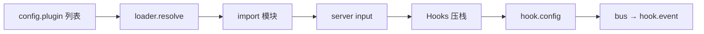

# 05 · 插件协议与加载

> **核心问题：** 一个 npm 包怎样变成 OpenCode 里的 Hooks？加载失败会怎样？

---

## 1. 最小插件形状

[`packages/plugin/src/index.ts`](https://github.com/anomalyco/opencode/blob/7fe7b9f258e36ad9f9acded20c5a9df201da19d5/packages/plugin/src/index.ts)：

```typescript
export type PluginModule = {
  id?: string
  server: Plugin   // (input: PluginInput) => Promise<Hooks>
}
```

`PluginInput` 含：`directory`、`client`（SDK）、`project`、`$`（内部工具）等。

**default export** 必须是 `PluginModule`；`server` 返回的对象可只实现 **部分** `Hooks` 键。

---

## 2. Hooks 两大族

| 族 | 机制 | 代表 |
|----|------|------|
| **注册型** | init 时读一次 | `config`, `tool`, `auth`, `provider` |
| **触发型** | `Plugin.trigger(name, input, output)` | `chat.params`, `tool.execute.before` |

另：**`event`** 通过 Bus 订阅，不走 trigger 表。

完整列表见 [06 · Hook 参考](./06-hook-system-reference.md)。

---

## 3. 加载流水线



| 阶段 | 文件 |
|------|------|
| 收集列表 | [`config/plugin.ts`](https://github.com/anomalyco/opencode/blob/7fe7b9f258e36ad9f9acded20c5a9df201da19d5/packages/opencode/src/config/plugin.ts) |
| resolve / install | [`plugin/loader.ts`](https://github.com/anomalyco/opencode/blob/7fe7b9f258e36ad9f9acded20c5a9df201da19d5/packages/opencode/src/plugin/loader.ts) |
| init + trigger | [`plugin/index.ts`](https://github.com/anomalyco/opencode/blob/7fe7b9f258e36ad9f9acded20c5a9df201da19d5/packages/opencode/src/plugin/index.ts) |

**内置插件：** 同文件 `INTERNAL_PLUGINS`（Codex、Copilot、GitLab auth 等）与外部 npm 插件 **同一套 Hooks**。

---

## 4. `Plugin.trigger` 语义

```typescript
for (const hook of s.hooks) {
  const fn = hook[name]
  if (!fn) continue
  await fn(input, output)
}
return output
```

| 性质 | 说明 |
|------|------|
| 顺序 | 按 hooks 数组顺序 **串行** |
| 共享 output | 后一个插件看到前一个的修改 |
| 错误 | 抛错中断当前 trigger |
| 空 hook | 跳过 |

**多插件同 hook：** 顺序由 config 里 `plugin` 数组决定；后执行的插件看到前一个改过的 `output`。

---

## 5. `tool` 注册合并

[`tool/registry.ts`](https://github.com/anomalyco/opencode/blob/7fe7b9f258e36ad9f9acded20c5a9df201da19d5/packages/opencode/src/tool/registry.ts) 在 `tools()` 时：

1. 内置工具（read、write、bash…）
2. config 自定义
3. **`Plugin.list()` 各插件的 `hook.tool` 字典**

同名工具：**后注册覆盖**（需看具体 merge 实现；插件应避免与内置冲突）。

---

## 6. 常见失败模式

| 现象 | 原因 |
|------|------|
| hook 不生效 | 插件未进 config / 未重启实例 |
| 多插件 hook 冲突 | 同一 hook 顺序覆盖 |
| import 失败 | loader timeout（Claude Code 类插件默认 10s 量级） |
| 类型对不上 | 应用 `@opencode-ai/plugin` 版本与 OpenCode 版本不匹配 |

---

## 读完后应能回答

- [ ] `server()` 与 `hook.config` 谁先谁后？
- [ ] trigger 与 event 订阅区别？
- [ ] 独立插件最少 export 什么？

→ **下一篇：** [06 · Hook 系统完整参考](./06-hook-system-reference.md)
