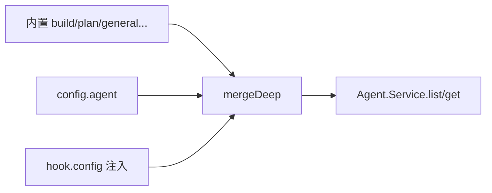
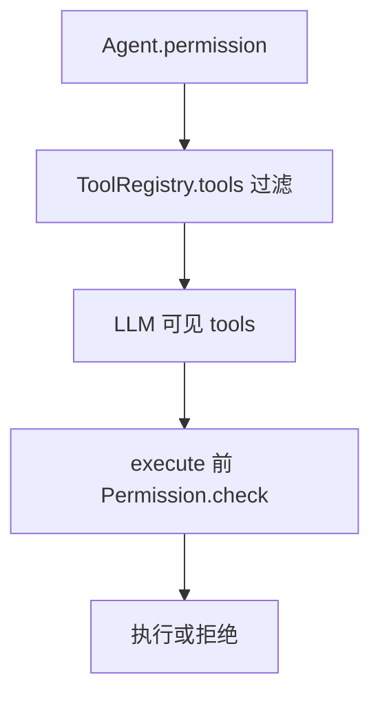

# 07 · Agent 与 Permission

> **核心问题：** Agent 配置如何决定模型、system、可用工具？Permission 在哪一层过滤？

---

## 1. Agent 数据结构

[`agent/agent.ts`](https://github.com/anomalyco/opencode/blob/7fe7b9f258e36ad9f9acded20c5a9df201da19d5/packages/opencode/src/agent/agent.ts) `Info`：

| 字段 | 含义 |
|------|------|
| `name` | 标识符（build、plan、自定义） |
| `mode` | `primary` / `subagent` / `all` |
| `permission` | [`Permission.Ruleset`](https://github.com/anomalyco/opencode/blob/7fe7b9f258e36ad9f9acded20c5a9df201da19d5/packages/opencode/src/permission/index.ts) |
| `model` | 可选固定 provider+model |
| `prompt` | 追加 system 片段 |
| `options` | provider-specific 默认 |
| `steps` | 最大步数限制 |

---

## 2. Agent 来源与合并

- 内置定义在同文件 layer 初始化
- config + `hook.config` 可 **追加或覆盖** 字段

**mode 约束：**

| mode | UI / Task |
|------|-----------|
| primary | 用户主会话可选 |
| subagent | Task tool、子会话 |
| all | 两者 |

---

## 3. Agent.generate（元能力）

同文件 `generate()`：用 LLM 根据用户描述 **生成新 agent 定义**（identifier、whenToUse、systemPrompt），供 UI「创建 agent」流程。

涉及 `experimental.chat.system.transform` 与 Provider 调用 —— 与主会话 loop **独立** 的短链路。

---

## 4. Permission 模型

[`permission/index.ts`](https://github.com/anomalyco/opencode/blob/7fe7b9f258e36ad9f9acded20c5a9df201da19d5/packages/opencode/src/permission/index.ts)

Ruleset = 工具名 / 路径模式 → `allow` | `deny` | `ask`

**求值时机：**

1. **ToolRegistry.tools(model, agent)** — 决定哪些 tool **进入 LLM 列表**
2. **tool 执行前** — 再次检查（含 ask 流程）

**plan agent** 典型 ruleset：读允许、写 deny —— 内核内置，非插件 magic。

---

## 5. config.permission

[`config/permission.ts`](https://github.com/anomalyco/opencode/blob/7fe7b9f258e36ad9f9acded20c5a9df201da19d5/packages/opencode/src/config/permission.ts) 提供 **全局默认**；与 agent 级 ruleset merge。

插件还可在 **`tool.execute.before`** 做第二道写路径校验（内核 Permission 仍是第一道）。

---

## 读完后应能回答

- [ ] primary 与 subagent 在 Task 中的区别？
- [ ] Permission 在哪两步生效？
- [ ] 自定义 agent 从哪个 hook 进入系统？

→ **下一篇：** [08 · Session、Message 与存储](./08-session-message-and-storage.md)
