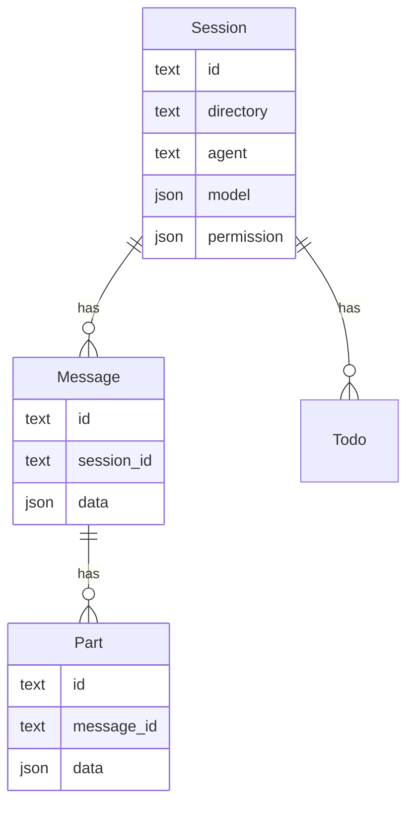

# 08 · Session、Message 与存储

> **核心问题：** 对话如何持久化？Message / Part 与 SQLite 表如何对应？

---

## 1. 三层数据模型

| 层 | 运行时类型 | 持久化 |
|----|------------|--------|
| Session | [`Session.Info`](https://github.com/anomalyco/opencode/blob/7fe7b9f258e36ad9f9acded20c5a9df201da19d5/packages/opencode/src/session/session.ts) | `session` 表 |
| Message | [`MessageV2.Info`](https://github.com/anomalyco/opencode/blob/7fe7b9f258e36ad9f9acded20c5a9df201da19d5/packages/opencode/src/session/message-v2.ts) | `message.data` JSON |
| Part | `MessageV2.Part` 联合类型 | `part.data` JSON |

**设计要点：** 一条 UI「气泡」= 一条 Message；assistant 的一次回复里可有多个 Part（reasoning + text + tool-call）。

---

## 2. Session 表（关键列）

Schema：[`session/session.sql.ts`](https://github.com/anomalyco/opencode/blob/7fe7b9f258e36ad9f9acded20c5a9df201da19d5/packages/opencode/src/session/session.sql.ts#L16-L59)

| 列 | 含义 |
|----|------|
| `id` | sessionID（ULID） |
| `project_id` | 所属项目 |
| `parent_id` | 子 session（Task 委派时） |
| `directory` | workspace 路径 |
| `title` | 会话标题（可异步生成） |
| `agent` / `model` | 默认 agent 与模型 |
| `permission` | session 级权限 ruleset |
| `tokens_*` / `cost` | 累计用量 |
| `revert` | 回滚检查点 |
| `time_compacting` | 压缩进行中标记 |

子 session：`parent_id` 非空表示由 Task tool 等创建的 **独立会话树节点**，主循环通过 `parentSessionID` 传给 LLM 层（见 [11 §4](./11-tool-registry-and-execution.md)）。

---

## 3. Message 角色

| role | 典型 content |
|------|----------------|
| **user** | text、file、agent、**subtask**、compaction 等 part |
| **assistant** | text、reasoning、**tool** part；带 `finish`、`tokens`、`modelID` |

User part 类型（[`message-v2.ts`](https://github.com/anomalyco/opencode/blob/7fe7b9f258e36ad9f9acded20c5a9df201da19d5/packages/opencode/src/session/message-v2.ts)）：

| type | 用途 |
|------|------|
| `text` | 用户输入 |
| `file` | 附件 |
| `agent` | 指定 agent |
| `subtask` | 待执行的子 agent 任务（进 runLoop 分支） |
| `compaction` | 压缩任务标记 |

Assistant part：

| type | 用途 |
|------|------|
| `text` / `reasoning` | 模型输出 |
| `tool` | tool-call 状态机：pending → running → completed / error |

---

## 4. 读写调用链

| 操作 | 调用者 |
|------|--------|
| 创建 session | API / CLI → `Session.create` |
| 写 user message | `SessionPrompt.createUserMessage` → **`chat.message` hook** |
| 流式写 assistant | `SessionProcessor` → `sessions.updatePart` |
| 读 history | `runLoop` → `MessageV2.filterCompactedEffect` |
| 转 LLM 格式 | `MessageV2.toModelMessagesEffect`（在 [09](./09-session-prompt-runloop.md) transform 之后） |

Compaction 会替换/摘要部分 message，见 [12](./12-compaction-and-context-management.md)。

---

## 5. 存储栈

| 组件 | 路径 |
|------|------|
| SQLite | [`storage/db.ts`](https://github.com/anomalyco/opencode/blob/7fe7b9f258e36ad9f9acded20c5a9df201da19d5/packages/opencode/src/storage/db.ts) |
| 默认 DB | `~/.config/opencode/opencode.db`（channel 可变） |
| 迁移 | `migration/`，生成命令见 [`packages/opencode/AGENTS.md`](https://github.com/anomalyco/opencode/blob/7fe7b9f258e36ad9f9acded20c5a9df201da19d5/packages/opencode/AGENTS.md) |
| JSON → SQLite | [`storage/json-migration.ts`](https://github.com/anomalyco/opencode/blob/7fe7b9f258e36ad9f9acded20c5a9df201da19d5/packages/opencode/src/storage/json-migration.ts) 一次性导入 |

**插件边界：** 只应通过 SDK `client` 读写 session；不要直接打开 SQLite 文件。

---

## 6. 相关 session 子模块

| 文件 | 职责 |
|------|------|
| [`session/processor.ts`](https://github.com/anomalyco/opencode/blob/7fe7b9f258e36ad9f9acded20c5a9df201da19d5/packages/opencode/src/session/processor.ts) | 流式 append part |
| [`session/tools.ts`](https://github.com/anomalyco/opencode/blob/7fe7b9f258e36ad9f9acded20c5a9df201da19d5/packages/opencode/src/session/tools.ts) | tool 执行与 part 更新 |
| [`session/todo.ts`](https://github.com/anomalyco/opencode/blob/7fe7b9f258e36ad9f9acded20c5a9df201da19d5/packages/opencode/src/session/todo.ts) | `todo` 表 |
| [`session/instruction.ts`](https://github.com/anomalyco/opencode/blob/7fe7b9f258e36ad9f9acded20c5a9df201da19d5/packages/opencode/src/session/instruction.ts) | 项目 instructions |

---

## 读完后应能回答

- [ ] Message 与 Part 的一对多关系？
- [ ] `subtask` part 存在哪张表、由谁消费？
- [ ] 插件能否绕过 SDK 写 DB？

→ **下一篇：** [09 · SessionPrompt 主循环](./09-session-prompt-runloop.md)
