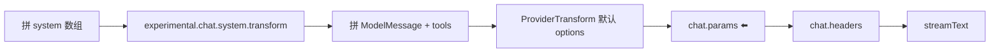

# 10 · LLM 流与 Provider

> **核心问题：** 发给模型的参数在哪组装？`chat.params` 的 input/output 是什么？每轮都会触发吗？

---

## 1. 调用链（baseline）

```
SessionProcessor.process
  → LLM.stream (session/llm.ts)
  → llm/request.ts（组装 messages + trigger hooks）
  → streamText / @opencode-ai/llm
  → Provider API
```

| 文件 | 职责 |
|------|------|
| [`session/llm.ts`](https://github.com/anomalyco/opencode/blob/7fe7b9f258e36ad9f9acded20c5a9df201da19d5/packages/opencode/src/session/llm.ts) | `LLM.stream` 入口、Effect Stream |
| [`session/llm/request.ts`](https://github.com/anomalyco/opencode/blob/7fe7b9f258e36ad9f9acded20c5a9df201da19d5/packages/opencode/src/session/llm/request.ts) | system 合并、**chat.params / chat.headers**、调 API |
| [`provider/transform.ts`](https://github.com/anomalyco/opencode/blob/7fe7b9f258e36ad9f9acded20c5a9df201da19d5/packages/opencode/src/provider/transform.ts) | 厂商差异、默认 temperature 等 |
| [`packages/llm/`](https://github.com/anomalyco/opencode/tree/7fe7b9f258e36ad9f9acded20c5a9df201da19d5/packages/llm) | 路由与 LLM 协议 |

---

## 2. request 内组装顺序



**重要：** `runLoop` 每轮 LLM 调用都会走一遍 request → **每个 turn 都会 trigger `chat.params`**（含 tool 结果送回模型后的续聊）。插件应 stateless，或用 `sessionID` 维护 Map。

---

## 3. `chat.params` 契约（SDK）

定义：[`packages/plugin/src/index.ts`](https://github.com/anomalyco/opencode/blob/7fe7b9f258e36ad9f9acded20c5a9df201da19d5/packages/plugin/src/index.ts#L246-L255)

### Input

| 字段 | 含义 |
|------|------|
| `sessionID` | 当前会话 |
| `agent` | agent 名字符串（如 `build`、`general`） |
| `model` | Provider 解析后的 model 对象（含 `providerID`、`id`、`capabilities`） |
| `provider` | provider 配置项 |
| `message` | 当前 **UserMessage**（含 `model.variant` 等） |

### Output（mutate 此对象）

| 字段 | 含义 |
|------|------|
| `temperature` | 温度 |
| `topP` / `topK` | 采样 |
| `maxOutputTokens` | 输出上限 |
| **`options`** | **Provider 特定字段的统一入口**（effort、thinking、DeepSeek `enable_thinking` 等） |

内核默认值在 trigger **之前**填入（baseline [`request.ts` #L106–123](https://github.com/anomalyco/opencode/blob/7fe7b9f258e36ad9f9acded20c5a9df201da19d5/packages/opencode/src/session/llm/request.ts#L106-L123)）：

```typescript
const params = yield* input.plugin.trigger("chat.params", { sessionID, agent, model, provider, message }, {
  temperature: /* model.capabilities + agent.temperature */,
  topP: /* agent.topP ?? ProviderTransform.topP */,
  topK: ProviderTransform.topK(model),
  maxOutputTokens: ProviderTransform.maxOutputTokens(model, ...),
  options,  // 已 merge agent.options、variant、provider options
})
```

插件典型写法：只改 `output.options` 里与自身 provider 相关的键，避免覆盖其它插件已写的字段（用 spread 合并）。

---

## 4. `chat.headers`

紧接 `chat.params` 之后（[`#L126`](https://github.com/anomalyco/opencode/blob/7fe7b9f258e36ad9f9acded20c5a9df201da19d5/packages/opencode/src/session/llm/request.ts#L126)），mutate `{ headers: Record<string, string> }`。用于 Copilot 等需要额外 HTTP 头的场景。

---

## 5. system 与 messages 的分工

| 机制 | 改什么 |
|------|--------|
| `experimental.chat.system.transform` | **system 字符串数组**（在 chat.params 之前） |
| `experimental.chat.messages.transform` | **runLoop 内** 的 `MessageV2.WithParts[]`（在转 ModelMessage 之前） |
| `chat.params` | 温度、token 上限、**options** |

写 thinking-toggle 类插件：**只需 `chat.params`**，不必 hook messages.transform。

---

## 6. Provider 层

[`provider/provider.ts`](https://github.com/anomalyco/opencode/blob/7fe7b9f258e36ad9f9acded20c5a9df201da19d5/packages/opencode/src/provider/provider.ts)：

- config + models.dev（core）→ model 列表
- `plugin.provider` hook 可注册额外 Provider
- Auth：[`auth/`](https://github.com/anomalyco/opencode/tree/7fe7b9f258e36ad9f9acded20c5a9df201da19d5/packages/opencode/src/auth)

[`provider/transform.ts`](https://github.com/anomalyco/opencode/blob/7fe7b9f258e36ad9f9acded20c5a9df201da19d5/packages/opencode/src/provider/transform.ts) 处理 reasoning block、tool schema 裁剪、多模态等 **厂商差异** —— 插件一般不改这里。

---

## 7. 流 → Processor

LLM 流事件由 processor 消费（text-delta、reasoning、tool-call、finish）。详见 [09 §6](./09-session-prompt-runloop.md)。

---

## 8. 插件边界

| 内核 invariant | 插件可改 |
|----------------|----------|
| streamText 调用、Provider 驱动 | params、headers、system transform |
| model 不存在 | 无法通过 hook 凭空注册 model（需 `config` / `provider` hook） |

---

## 9. 多模型（必读专题）

同一 session 可先后使用不同 Provider/model；主循环跟 **lastUser.model**；还有 **small_model**、**variant**、**subagent 独立 model**。

→ 完整规则：[19 · 多模型与 Provider 体系](./19-multi-model-and-provider-system.md)

---

## 读完后应能回答

- [ ] 每个 tool 轮次后 chat.params 会不会再触发？
- [ ] provider-specific 参数应写在 output 哪个字段？
- [ ] system.transform 与 chat.params 的区别？

→ **下一篇：** [11 · ToolRegistry 与执行](./11-tool-registry-and-execution.md)
