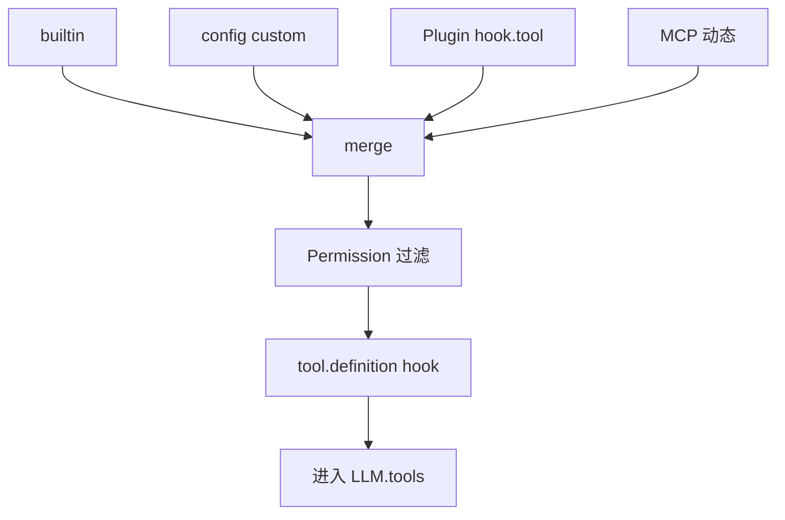
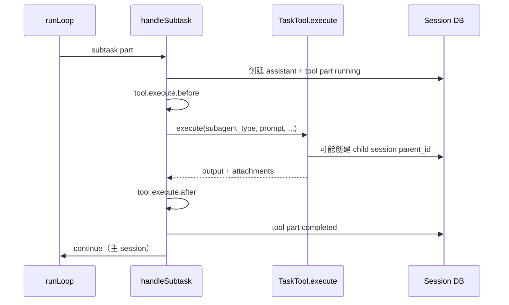

# 11 · ToolRegistry 与执行

> **核心问题：** 工具从哪来？tool-call 如何变成 part？Task/subagent 如何工作？

---

## 1. 工具来源与合并

[`tool/registry.ts`](https://github.com/anomalyco/opencode/blob/7fe7b9f258e36ad9f9acded20c5a9df201da19d5/packages/opencode/src/tool/registry.ts) + [`SessionPrompt.resolveTools`](https://github.com/anomalyco/opencode/blob/7fe7b9f258e36ad9f9acded20c5a9df201da19d5/packages/opencode/src/session/prompt.ts)（baseline 搜索 `resolveTools`）



---

## 2. 内置工具（代表）

| 工具 | 用途 |
|------|------|
| read / write / edit / apply_patch | 文件 |
| bash / shell | 命令（`shell.env` hook） |
| grep / glob | 搜索 |
| **task** | **子 agent 委派**（§4） |
| todo | 任务列表 |
| skill | 加载 SKILL.md |
| lsp | LSP 操作 |
| webfetch / websearch | 网络 |

完整目录：[`tool/`](https://github.com/anomalyco/opencode/tree/7fe7b9f258e36ad9f9acded20c5a9df201da19d5/packages/opencode/src/tool)

---

## 3. 标准 tool 执行路径

[`session/tools.ts`](https://github.com/anomalyco/opencode/blob/7fe7b9f258e36ad9f9acded20c5a9df201da19d5/packages/opencode/src/session/tools.ts) + processor 回调：

```
LLM 发出 tool-call
  → tool.execute.before（可改 args）
  → Permission.ask / check
  → ToolDef.execute(args, ctx)
  → tool.execute.after（可改 output / title / metadata）
  → 更新 ToolPart → completed | error
  → runLoop continue（见 09 退出条件）
```

**ToolContext**（SDK `ToolDefinition`）：`sessionID`、`callID`、`abort`、`messageID`、`ask`（权限 UI）等。

---

## 4. Task 与 subtask 流（重点）

两种相关机制：

### 4.1 User 上的 `subtask` part

- 用户消息或 command 可带 [`type: "subtask"`](https://github.com/anomalyco/opencode/blob/7fe7b9f258e36ad9f9acded20c5a9df201da19d5/packages/opencode/src/session/message-v2.ts) part（指定 `agent`、`prompt`）
- runLoop 扫描未完成任务 → **`handleSubtask`**（baseline [`#L298`](https://github.com/anomalyco/opencode/blob/7fe7b9f258e36ad9f9acded20c5a9df201da19d5/packages/opencode/src/session/prompt.ts#L298)）优先于正常 LLM 轮次

### 4.2 `handleSubtask` 步骤



要点：

- 对外仍是一次 **Task tool call**（part 类型 `tool`，`tool: "task"`）
- `taskTool.execute` 内启动 **subagent**（`mode: subagent` 的 agent），常在新 session 或使用 `promptOps` 嵌套 prompt
- 权限：`Permission.merge(taskAgent.permission, session.permission)`
- 完成后主 session history 里留下 tool-result，**下一轮 runLoop** 再调 LLM

### 4.3 LLM 发起的 task

模型在 stream 里直接 tool-call `task` 时，由 processor → `session/tools.ts` 走同一 `TaskTool.execute`，不经过 `handleSubtask` 前置分支，但执行体相同。

---

## 5. MCP 工具

[`mcp/index.ts`](https://github.com/anomalyco/opencode/blob/7fe7b9f258e36ad9f9acded20c5a9df201da19d5/packages/opencode/src/mcp/index.ts) 连接 config 声明的服务器；`resolveTools` 将 MCP 工具与内置工具 **同级** 注入 LLM。详见 [14](./14-mcp-lsp-skill-and-command.md)。

---

## 6. 其它机制

| 机制 | 说明 |
|------|------|
| `tool.definition` | 暴露给 LLM 前改 schema / description |
| [`tool/truncate.ts`](https://github.com/anomalyco/opencode/blob/7fe7b9f258e36ad9f9acded20c5a9df201da19d5/packages/opencode/src/tool/truncate.ts) + config `tool_output` | 输出大小限制 |
| [`tool/invalid.ts`](https://github.com/anomalyco/opencode/blob/7fe7b9f258e36ad9f9acded20c5a9df201da19d5/packages/opencode/src/tool/invalid.ts) | 幻觉工具名兜底 |
| providerExecuted | Provider 内执行的 tool，不再本地 execute |

---

## 读完后应能回答

- [ ] 四类工具来源？
- [ ] `subtask` part 与 LLM 调用 `task` 工具的区别？
- [ ] tool 完成后 runLoop 如何继续？

→ **下一篇：** [12 · Compaction 与上下文管理](./12-compaction-and-context-management.md)
